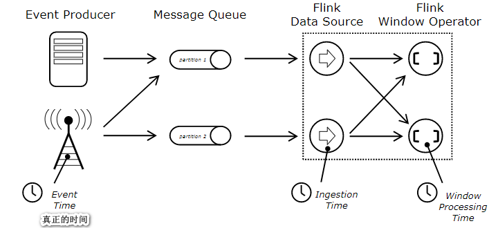

# Apache Flink

## 概述

Flink是构建在Data Stream之上一款有状态计算框架。由于该款框架出现的较晚2014.12月发布，通常被人们认为是第3代流计算框架。

`第一代`：MapReduce 2006年  批 磁盘 M->R 矢量 | 2014.9 Storm诞生 流  延迟低/吞吐小

`第二代`：Spark RDD 2014.2 批 内存 DAG （若干Stage） | 使用micro-batch 模拟 流处理 DStream 延迟高/吞吐大

`第三代`Flink Datastream 2014.12 流计算 内存 Datafollow Graph（若干个Task） |  Flink Dataset在流计算构建批处理

流处理应用领域：风险控制/智能交通/疾病预测/互联网金融/...

## Flink 架构

*宏观战略*


**Flink VS Spark**

Spark计算核心是构建在RDD的批处理之上，通过批模拟流计算。而Flink构建流处理之上，通过流模拟批。

**Flink计算架构**


 **JobManagers**-  所谓Master ，负责协调分布式任务执行。 负责调度任务，协调checkpoint，协调故障恢复等。

> There is always at least one Job Manager. A high-availability setup will have multiple JobManagers, one of which one is always the *leader*, and the others are *standby*.

**TaskManagers**- 所谓slaves（工作节点/Worker）,负责真正任务执行，执行一些Task（等价Spark Stage）下的subtask。负责流计算当中数据缓存或者数据shuffle.计算机节点连接JobManager汇报自身状态信息，并且告知主节点自己分配到任务的计算状态。

> There must always be at least one TaskManager.

**client** - 主要是在任务计算之前将任务翻译成Dataflow Graph，将该Dataflow Graph提交给JobManagers。

**Task** - Flink会将任务通过Operator Chain的方式将一个任务划分为若干个Task，每个Task都有自己的并行度，根据设置并行度创建相应的subtask（线程）。通过Operator Chain可以减少线程-线程间通信成本和系统开销。


**Task Slots ** -  每个Task Slot代表TaskManager 计算资源子集。Task Slot可以均分TaskManager 的内存。比如说一个TaskManager 有3个Task Slot.则每个Task slot就代表1/3的内存空间。不同job的subtask之间可以通过Task Slot进行隔离。同一个Job的不同task的subtask可以共享Task slots。默认所有的subtask因为共享的是同一个资源组`default`,因此一个Job所需的Task Slots的数量就等于该Job下Task的最大并行度。

**Flink环境搭建**

- 设置CentOS进程数和文件数(重启生效) -可选

```shell
[root@Spark ~]# vi /etc/security/limits.conf

* soft nofile 204800
* hard nofile 204800
* soft nproc 204800
* hard nproc 204800
```

- 配置主机名(重启生效)

```shell
[root@Spark ~]# cat /etc/hostname
Spark
```

- 设置IP映射

```shell
[root@Spark ~]# cat /etc/hosts
127.0.0.1   localhost localhost.localdomain localhost4 localhost4.localdomain4
::1         localhost localhost.localdomain localhost6 localhost6.localdomain6
192.168.11.100  Spark
```

- 防火墙服务

```shell
[root@Spark ~]# systemctl stop firewalld
[root@Spark ~]# systemctl disable firewalld
[root@Spark ~]# firewall-cmd --state
not running
```

- 安装JDK1.8+

```shell
[root@Spark ~]# rpm -ivh jdk-8u171-linux-x64.rpm 
[root@Spark ~]# ls -l /usr/java/
total 4
lrwxrwxrwx. 1 root root   16 Mar 26 00:56 default -> /usr/java/latest
drwxr-xr-x. 9 root root 4096 Mar 26 00:56 jdk1.8.0_171-amd64
lrwxrwxrwx. 1 root root   28 Mar 26 00:56 latest -> /usr/java/jdk1.8.0_171-amd64
[root@Spark ~]# vi .bashrc 
JAVA_HOME=/usr/java/latest
PATH=$PATH:$JAVA_HOME/bin
CLASSPATH=.
export JAVA_HOME
export PATH
export CLASSPATH
[root@Spark ~]# source ~/.bashrc
```

- SSH配置免密

```shell
[root@Spark ~]# ssh-keygen -t rsa
Generating public/private rsa key pair.
Enter file in which to save the key (/root/.ssh/id_rsa): 
Created directory '/root/.ssh'.
Enter passphrase (empty for no passphrase): 
Enter same passphrase again: 
Your identification has been saved in /root/.ssh/id_rsa.
Your public key has been saved in /root/.ssh/id_rsa.pub.
The key fingerprint is:
4b:29:93:1c:7f:06:93:67:fc:c5:ed:27:9b:83:26:c0 root@CentOS
The key's randomart image is:
+--[ RSA 2048]----+
|                 |
|         o   . . |
|      . + +   o .|
|     . = * . . . |
|      = E o . . o|
|       + =   . +.|
|        . . o +  |
|           o   . |
|                 |
+-----------------+
[root@Spark ~]# ssh-copy-id CentOS
The authenticity of host 'centos (192.168.40.128)' can't be established.
RSA key fingerprint is 3f:86:41:46:f2:05:33:31:5d:b6:11:45:9c:64:12:8e.
Are you sure you want to continue connecting (yes/no)? yes
Warning: Permanently added 'centos,192.168.40.128' (RSA) to the list of known hosts.
root@centos's password: 
Now try logging into the machine, with "ssh 'CentOS'", and check in:

  .ssh/authorized_keys

to make sure we haven't added extra keys that you weren't expecting.
[root@Spark ~]# ssh root@CentOS
Last login: Tue Mar 26 01:03:52 2019 from 192.168.40.1
[root@Spark ~]# exit
logout
Connection to CentOS closed.
```

- 安装配置Flink

```shell
[root@Spark ~]# tar -zxf flink-1.8.1-bin-scala_2.11.tgz -C /usr/
[root@Spark ~]# cd /usr/flink-1.8.1/
[root@Spark ~]# vi conf/flink-conf.yaml
jobmanager.rpc.address: Spark
taskmanager.numberOfTaskSlots: 3

[root@Spark ~]#  vi conf/slaves
Spark
[root@Spark ~]# ./bin/start-cluster.sh

```

## Quick Start

- 引入依赖

```xml
<!-- https://mvnrepository.com/artifact/org.apache.flink/flink-scala -->
<dependency>
    <groupId>org.apache.flink</groupId>
    <artifactId>flink-scala_2.11</artifactId>
    <version>1.8.1</version>
</dependency>
<dependency>
    <groupId>org.apache.flink</groupId>
    <artifactId>flink-streaming-scala_2.11</artifactId>
    <version>1.8.1</version>
</dependency>
```

- Quick start

```scala
//1.创建StreamExecutionEnvironment
val fsEnv = StreamExecutionEnvironment.getExecutionEnvironment

//2.创建DataStream -细化
val dataStream: DataStream[String] = fsEnv.socketTextStream("Spark",9999)

//3.对数据做转换 - operator
dataStream.flatMap(_.split("\\s+"))
.map((_,1))
.keyBy(0)
.sum(1)
.print()

//执行计算
fsEnv.execute("FlinkWordCountsQuickStart")
```

> 将程序打包 ，通过UI页面或者./bin/flink run执行

```shell
[root@Spark flink-1.8.1]# ./bin/flink run 
							-c com.baizhi.quickstart.FlinkWordCountsQuickStart 
							-p 3 
							/root/flink-1.0-SNAPSHOT-jar-with-dependencies.jar
```

```shell
[root@Spark flink-1.8.1]# ./bin/flink list -m Spark:8081
Waiting for response...
------------------ Running/Restarting Jobs -------------------
13.11.2019 16:49:36 : 36e8f1ec3173ccc2c5e1296d1564da87 : FlinkWordCountsQuickStart (RUNNING)
--------------------------------------------------------------
No scheduled jobs.
[root@Spark flink-1.8.1]# ./bin/flink cancel -m Spark:8081 36e8f1ec3173ccc2c5e1296d1564da87
Cancelling job 36e8f1ec3173ccc2c5e1296d1564da87.
Cancelled job 36e8f1ec3173ccc2c5e1296d1564da87.
```

## DataSource

DataSource指定了流计算的输入，用户可以通过`StreamExecutionEnvironment.addSource(sourceFunction)`,Flink已经预先实现了一些DataSource的实现，如果用户需要自定义自己的实现可以通过实现`SourceFunction`接口（非并行Source）或者`ParallelSourceFunction` 接口（实现并行Source）或者继承`RichParallelSourceFunction` .

### File Based(了解)

`readTextFile(path)` - 读取文本文件，底层通过`TextInputFormat` 一行行读取文件数据，返回是一个DataStream[String] - 仅仅处理一次

```scala
//1.创建StreamExecutionEnvironment
val fsEnv = StreamExecutionEnvironment.getExecutionEnvironment

//2.创建DataStream -细化
val filePath="file:///D:\\data"
val dataStream: DataStream[String] = fsEnv.readTextFile(filePath)
//3.对数据做转换
dataStream.flatMap(_.split("\\s+"))
.map((_,1))
.keyBy(0)
.sum(1)
.print()

fsEnv.execute("FlinkWordCountsQuickStart")
```

`readFile(fileInputFormat, path)` - 读取文本文件，底层通过指定输入格式 - 仅仅处理一次

```scala
//1.创建StreamExecutionEnvironment
val fsEnv = StreamExecutionEnvironment.getExecutionEnvironment

//2.创建DataStream -细化
val filePath="file:///D:\\data"
val inputFormat = new TextInputFormat(null)
val dataStream: DataStream[String] = fsEnv.readFile(inputFormat,filePath)
//3.对数据做转换
dataStream.flatMap(_.split("\\s+"))
.map((_,1))
.keyBy(0)
.sum(1)
.print()

fsEnv.execute("FlinkWordCountsQuickStart")
```

`readFile(fileInputFormat, path, watchType, interval, pathFilter)` - 以上两个方法底层调用都是该方法。

```scala
 //1.创建StreamExecutionEnvironment
    val fsEnv = StreamExecutionEnvironment.getExecutionEnvironment

    //2.创建DataStream -细化
    val filePath="file:///D:\\data"
    val inputFormat = new TextInputFormat(null)

    inputFormat.setFilesFilter(new FilePathFilter {
      override def filterPath(path: Path): Boolean = {
        if(path.getName().startsWith("1")){ //过滤不符合的文件
          return true
        }
        false
      }
    })
    val dataStream: DataStream[String] = fsEnv.readFile(inputFormat,filePath,
      FileProcessingMode.PROCESS_CONTINUOUSLY,1000)
    //3.对数据做转换
    dataStream.flatMap(_.split("\\s+"))
      .map((_,1))
      .keyBy(0)
      .sum(1)
      .print()

    fsEnv.execute("FlinkWordCountsQuickStart")

```

> 定期的扫描文件，如果文件内容被修改了，该文件会被完整的重新读取。因此可能会产生重复计算。

### Collection(测试)

```scala
//1.创建StreamExecutionEnvironment
val fsEnv = StreamExecutionEnvironment.getExecutionEnvironment

//2.创建DataStream -细化
val dataStream: DataStream[String] = fsEnv.fromCollection(List("this is a demo","hello world"))
//3.对数据做转换
dataStream.flatMap(_.split("\\s+"))
.map((_,1))
.keyBy(0)
.sum(1)
.print()

fsEnv.execute("FlinkWordCountsQuickStart")
```

### 自定义SourceFunction（掌握）

```scala
class UserDefineParallelSourceFunction extends ParallelSourceFunction[String]{

  val lines=Array("this is a demo","hello world","hello flink")
  @volatile
  var isRunning=true
  //运行
  override def run(sourceContext: SourceFunction.SourceContext[String]): Unit = {
    while (isRunning){
      Thread.sleep(1000)
      sourceContext.collect(lines(new Random().nextInt(lines.length)))
    }
  }
  //取消
  override def cancel(): Unit = {
    isRunning=false
  }
}         
```

```scala
//1.创建StreamExecutionEnvironment
val fsEnv = StreamExecutionEnvironment.getExecutionEnvironment

//2.创建DataStream -细化
val dataStream: DataStream[String] = fsEnv.addSource(new UserDefineParallelSourceFunction)
dataStream.setParallelism(10)
//3.对数据做转换
dataStream.flatMap(_.split("\\s+"))
.map((_,1))
.keyBy(0)
.sum(1)
.print()

fsEnv.execute("FlinkWordCountsQuickStart")
```

### Flink和Kafka Source（重点）

```xml
<dependency>
    <groupId>org.apache.flink</groupId>
    <artifactId>flink-connector-kafka_2.11</artifactId>
    <version>1.8.1</version>
</dependency>
```

```scala
//1.创建StreamExecutionEnvironment
val fsEnv = StreamExecutionEnvironment.getExecutionEnvironment

//2.创建DataStream -细化
val props = new Properties()
props.setProperty(ConsumerConfig.BOOTSTRAP_SERVERS_CONFIG,
                  "Spark:9092")
props.setProperty(ConsumerConfig.GROUP_ID_CONFIG, "g1")

val flinkKafkaConsumer = new FlinkKafkaConsumer[String]("topic01",
                                                        new SimpleStringSchema(),props)

val dataStream: DataStream[String] = fsEnv.addSource(flinkKafkaConsumer)
dataStream.setParallelism(10)
//3.对数据做转换
dataStream.flatMap(_.split("\\s+"))
.map((_,1))
.keyBy(0)
.sum(1)
.print()

fsEnv.execute("FlinkWordCountsQuickStart")
```

> 只能获取value信息，如果用户需要获取key/offset/partition信息用户需要定制`KafkaDeserializationSchema` 

获取Record元数据信息

```scala
class UserDefineKafkaDeserializationSchema
extends KafkaDeserializationSchema[(Int,Long,String,String,String)]{
    override def isEndOfStream(t: (Int, Long, String, String, String)): Boolean = {
        return false;
    }

    override def deserialize(r: ConsumerRecord[Array[Byte], Array[Byte]]): (Int, Long, String, String, String) = {
        if(r.key()==null){
            (r.partition(),r.offset(),r.topic(),"",new String(r.value()))
        }else{
            (r.partition(),r.offset(),r.topic(),StringUtils.arrayToString(r.key()),new String(r.value()))
        }
    }
    //告知返回值类型
    override def getProducedType: TypeInformation[(Int, Long, String, String, String)] = {
        createTypeInformation[(Int, Long, String, String, String)]
    }
}

```

```scala
//1.创建StreamExecutionEnvironment
val fsEnv = StreamExecutionEnvironment.getExecutionEnvironment

//2.创建DataStream -细化
val props = new Properties()
props.setProperty(ConsumerConfig.BOOTSTRAP_SERVERS_CONFIG,
                  "Spark:9092")
props.setProperty(ConsumerConfig.GROUP_ID_CONFIG, "g1")

val flinkKafkaConsumer = new FlinkKafkaConsumer[(Int,Long,String,String,String)]("topic01",
                                                                                 new UserDefineKafkaDeserializationSchema(),props)

val dataStream: DataStream[(Int,Long,String,String,String)] = fsEnv.addSource(flinkKafkaConsumer)

dataStream.print()

fsEnv.execute("FlinkWordCountsQuickStart")
```

## Data Sink 

Data sinks负责消费Data Stream的数据，将数据写出到外围系统，例如：文件/网络/NoSQL/RDBMS/Message Queue等。Flink底层也预定义了一些常用的Sinks，同时用户也可以根据实际需求定制Data Sink通过集成SinkFunction或者RichSinkFunction。

### File Based（测试）

- writeAsText()|writeAsCsv(...)|writeUsingOutputFormat() `at-least-once`

```scala
//1.创建StreamExecutionEnvironment
val fsEnv = StreamExecutionEnvironment.getExecutionEnvironment

val output = new CsvOutputFormat[Tuple2[String, Int]](new Path("file:///D:/fink-results"))
//2.创建DataStream -细化
val dataStream: DataStream[String] = fsEnv.socketTextStream("Spark",9999)
//3.对数据做转换
dataStream.flatMap(_.split("\\s+"))
    .map((_,1))
    .keyBy(0)
    .sum(1)
    .map(t=> new Tuple2(t._1,t._2))
    .writeUsingOutputFormat(output)

fsEnv.execute("FlinkWordCountsQuickStart")
```

- Bucketing File Sink (exactly-once)

```xml
<dependency>
    <groupId>org.apache.flink</groupId>
    <artifactId>flink-connector-filesystem_2.11</artifactId>
    <version>1.8.1</version>
</dependency>

<dependency>
    <groupId>org.apache.hadoop</groupId>
    <artifactId>hadoop-common</artifactId>
    <version>2.9.2</version>
</dependency>
<dependency>
    <groupId>org.apache.hadoop</groupId>
    <artifactId>hadoop-hdfs</artifactId>
    <version>2.9.2</version>
</dependency>
```

```scala
//1.创建StreamExecutionEnvironment
val fsEnv = StreamExecutionEnvironment.getExecutionEnvironment

val bucketSink = new BucketingSink[String]("hdfs://Spark:9000/bucketSink")
bucketSink.setBucketer(new DateTimeBucketer("yyyy-MM-dd-HH", ZoneId.of("Asia/Shanghai")))

//2.创建DataStream -细化
val dataStream: DataStream[String] = fsEnv.socketTextStream("Spark",9999)
//3.对数据做转换
dataStream.flatMap(_.split("\\s+"))
.map((_,1))
.keyBy(0)
.sum(1)
.map(t=>t._1+"\t"+t._2)
.addSink(bucketSink)

fsEnv.execute("FlinkWordCountsQuickStart")
```

### print()/ printToErr()

```scala
//1.创建StreamExecutionEnvironment
val fsEnv = StreamExecutionEnvironment.getExecutionEnvironment

//2.创建DataStream -细化
val dataStream: DataStream[String] = fsEnv.socketTextStream("Spark",9999)
//3.对数据做转换
dataStream.flatMap(_.split("\\s+"))
.map((_,1))
.keyBy(0)
.sum(1)
.print("error")

fsEnv.execute("FlinkWordCountsQuickStart")
```

### 自定义Sink（熟练）

```scala
class UserDefineRichSinkFunction extends RichSinkFunction[(String,Int)]{
    override def open(parameters: Configuration): Unit = {
        println("open")
    }
    override def invoke(value: (String, Int)): Unit = {
        println("insert into xxx "+value)
    }

    override def close(): Unit = {
        println("close")
    }
}
```

```scala
//1.创建StreamExecutionEnvironment
val fsEnv = StreamExecutionEnvironment.getExecutionEnvironment

//2.创建DataStream -细化
val dataStream: DataStream[String] = fsEnv.socketTextStream("Spark",7788)
//3.对数据做转换
dataStream.flatMap(_.split("\\s+"))
.map((_,1))
.keyBy(0)
.sum(1)
.addSink(new UserDefineRichSinkFunction)

fsEnv.execute("FlinkWordCountsQuickStart")
```

### Redis Sink(掌握)

参考：<https://bahir.apache.org/docs/flink/current/flink-streaming-redis/>

```xml
<dependency>
    <groupId>org.apache.bahir</groupId>
    <artifactId>flink-connector-redis_2.11</artifactId>
    <version>1.0</version>
</dependency>
```

```scala
val fsEnv = StreamExecutionEnvironment.getExecutionEnvironment


val conf = new FlinkJedisPoolConfig.Builder()
.setHost("Spark")
.setPort(6379).build()

//2.创建DataStream -细化
val dataStream: DataStream[String] = fsEnv.socketTextStream("Spark",7788)
//3.对数据做转换
dataStream.flatMap(_.split("\\s+"))
.map((_,1))
.keyBy(0)
.sum(1)
.addSink(new RedisSink(conf,new UserDefineRedisMapper))

fsEnv.execute("FlinkWordCountsQuickStart")
```

```scala
class UserDefineRedisMapper extends RedisMapper[(String,Int)]{
  override def getCommandDescription: RedisCommandDescription = {
    new RedisCommandDescription(RedisCommand.HSET,"word-count")
  }

  override def getKeyFromData(t: (String, Int)): String = {
    t._1
  }

  override def getValueFromData(t: (String, Int)): String = {
    t._2.toString
  }
}
```

> 在安装Redis如果访问不到，需要关闭Redis `protect-model：no`

### Kafka Sink(掌握)

```xml
<dependency>
    <groupId>org.apache.flink</groupId>
    <artifactId>flink-connector-kafka_2.11</artifactId>
    <version>1.8.1</version>
</dependency>
```

```scala
//1.创建StreamExecutionEnvironment
val fsEnv = StreamExecutionEnvironment.getExecutionEnvironment

val props = new Properties()
props.setProperty(ProducerConfig.BOOTSTRAP_SERVERS_CONFIG,"Spark:9092")
//不建议覆盖
props.put(ProducerConfig.KEY_SERIALIZER_CLASS_CONFIG,classOf[ByteArraySerializer])
props.put(ProducerConfig.VALUE_SERIALIZER_CLASS_CONFIG,classOf[ByteArraySerializer])


props.put(ProducerConfig.RETRIES_CONFIG,"3")
props.put(ProducerConfig.ACKS_CONFIG,"-1")
props.put(ProducerConfig.ENABLE_IDEMPOTENCE_CONFIG,"true")
props.put(ProducerConfig.BATCH_SIZE_CONFIG,"100")
props.put(ProducerConfig.LINGER_MS_CONFIG,"500")


//2.创建DataStream -细化
val dataStream: DataStream[String] = fsEnv.socketTextStream("Spark",7788)
//3.对数据做转换
dataStream.flatMap(_.split("\\s+"))
.map((_,1))
.keyBy(0)
.sum(1)
.addSink(new FlinkKafkaProducer[(String, Int)]("topicxx",
                                               new UserDefineKeyedSerializationSchema,
                                               props))

fsEnv.execute("FlinkWordCountsQuickStart")
```

```scala
class UserDefineKeyedSerializationSchema extends KeyedSerializationSchema[(String,Int)]{
  override def serializeKey(t: (String, Int)): Array[Byte] = {
    t._1.getBytes()
  }

  override def serializeValue(t: (String, Int)): Array[Byte] = {
    t._2.toString.getBytes()
  }

  override def getTargetTopic(t: (String, Int)): String = "topic01"
}

```

## Operator（会用）

### DataStream Transformations 

#### `Datastream -> Datasteam`

##### **Map**

Takes one element and produces one element. A map function that doubles the values of the input stream:

```scala
dataStream.map { x => x * 2 }
```

##### **FlatMap**

Takes one element and produces zero, one, or more elements. A flatmap function that splits sentences to words:

```scala
dataStream.flatMap { str => str.split(" ") }
```

##### **Filter**

Evaluates a boolean function for each element and retains those for which the function returns true. A filter that filters out zero values:

```scala
dataStream.filter { _ != 0 }
```

##### **Union**

Union of two or more data streams creating a new stream containing all the elements from all the streams. Note: If you union a data stream with itself you will get each element twice in the resulting stream.

```scala
dataStream.union(otherStream1, otherStream2,  ...)
```

#### DataStream,DataStream → ConnectedStreams

##### **Connect**

"Connects" two data streams retaining their types, allowing for shared state between the two streams.

```scala
someStream : DataStream[Int] = ...
otherStream : DataStream[String] = ...

val connectedStreams = someStream.connect(otherStream)
```

##### **CoMap, CoFlatMap**

Similar to map and flatMap on a connected data stream

```scala
connectedStreams.map(
    (_ : Int) => true,
    (_ : String) => false
)
connectedStreams.flatMap(
    (_ : Int) => true,
    (_ : String) => false
)
```

案例小节

```scala
val fsEnv = StreamExecutionEnvironment.getExecutionEnvironment

val s1 = fsEnv.socketTextStream("Spark",9999)
val s2 = fsEnv.socketTextStream("Spark",8888)
s1.connect(s2).flatMap(
    (line:String)=>line.split("\\s+"),//s1流转换逻辑
    (line:String)=>line.split("\\s+")//s2流转换逻辑
)
.map((_,1))
.keyBy(0)
.sum(1)
.print()

fsEnv.execute("ConnectedStream")
```

#### DataStream → SplitStream

##### **Split**

Split the stream into two or more streams according to some criterion.

```scala
val split = someDataStream.split(
  (num: Int) =>
    (num % 2) match {
      case 0 => List("even")
      case 1 => List("odd")
    }
)
```

##### **Select**

Select one or more streams from a split stream.

```scala
val even = split select "even"
val odd = split select "odd"
val all = split.select("even","odd")
```

案例小节(过期了)

```scala
val fsEnv = StreamExecutionEnvironment.getExecutionEnvironment

val logStream = fsEnv.socketTextStream("Spark",9999)

val splitStream: SplitStream[String] = logStream.split(new OutputSelector[String] {
    override def select(out: String): lang.Iterable[String] = {
        if (out.startsWith("INFO")) {
            val array = new util.ArrayList[String]()
            array.add("info")
            return array
        } else  {
            val array = new util.ArrayList[String]()
            array.add("error")
            return array
        }
    }
})

splitStream.select("info").print("info")
splitStream.select("error").printToErr("error")

fsEnv.execute("ConnectedStream")
```

用法二（优先）

```scala
val fsEnv = StreamExecutionEnvironment.getExecutionEnvironment

val logStream = fsEnv.socketTextStream("Spark",9999)


val errorTag = new OutputTag[String]("error")

val dataStream = logStream.process(new ProcessFunction[String, String] {
    override def processElement(line: String,
                                context: ProcessFunction[String, String]#Context,
                                collector: Collector[String]): Unit = {
        if (line.startsWith("INFO")) {
            collector.collect(line)
        }else{
            context.output(errorTag,line)//分支输出
        }
    }
})

dataStream.print("正常信息")
dataStream.getSideOutput(errorTag).print("错误信息")

fsEnv.execute("ConnectedStream")
```

#### DataStream → KeyedStream	

##### **KeyBy**

Logically partitions a stream into disjoint partitions, each partition containing elements of the same key. Internally, this is implemented with hash partitioning. 

```scala
dataStream.keyBy("someKey") // Key by field "someKey"
dataStream.keyBy(0) // Key by the first element of a Tuple
```

##### **Reduce**

A "rolling" reduce on a keyed data stream. Combines the current element with the last reduced value and emits the new value.

```scala
keyedStream.reduce { _ + _ }
```

##### **Fold**

A "rolling" fold on a keyed data stream with an initial value. Combines the current element with the last folded value and emits the new value.

```scala
val result: DataStream[String] =
keyedStream.fold("start")((str, i) => { str + "-" + i })
```

##### **Aggregations**

Rolling aggregations on a keyed data stream. The difference between min and minBy is that min returns the minimum value, whereas minBy returns the element that has the minimum value in this field (same for max and maxBy).

```scala
keyedStream.sum(0)
keyedStream.sum("key")
keyedStream.min(0)
keyedStream.min("key")
keyedStream.max(0)
keyedStream.max("key")
keyedStream.minBy(0)
keyedStream.minBy("key")
keyedStream.maxBy(0)
keyedStream.maxBy("key")
```

### Physical partitioning

Flink提供了一些分区方案，可供用户选择，分区目的是为了任务之间数据的能够均衡分布。

| 分区方案                                   | 说明                                                         |
| ------------------------------------------ | ------------------------------------------------------------ |
| **Custom partitioning**                    | 需要用户实现分区策略<br/>dataStream.partitionCustom(partitioner, "someKey") |
| **Random partitioning**                    | 将当前的数据随机分配给下游任务<br/>dataStream.shuffle()      |
| **Rebalancing (Round-robin partitioning)** | 轮询将上游的数据均分下游任务<br/>dataStream.rebalance()      |
| **Rescaling**                              | 缩放分区数据，例如上游2个并行度/下游4个 ，上游会将1个分区的数据发送给下游前两个分区，后1个分区，会发送下游后两个。<br/>dataStream.rescale() |
| **Broadcasting**                           | 上游会将分区所有数据，广播给下游的所有任务分区。<br/>dataStream.broadcast() |

### Task chaining and resource groups(了解)

连接两个Operator 转换，尝试将两个Operator 转换放置到一个线程当中，可以减少线程消耗，避免不必要的线程通信。用户可以通过 `StreamExecutionEnvironment.disableOperatorChaining()`禁用chain操作。

```java
val dataStream: DataStream[String] = fsEnv.socketTextStream("Spark",9999)

    //3.对数据做转换
    dataStream.filter(line => line.startsWith("INFO"))
    .flatMap(_.split("\\s+"))
    .map((_,1))
    .map(t=>WordPair(t._1,t._2))
    .print()
```


为了方便，Flink提供一下算子用于修改chain的行为

| 算子                   | 操作                                                     | 说明                                                 |
| ---------------------- | -------------------------------------------------------- | ---------------------------------------------------- |
| Start new chain        | someStream.filter(...).map(...).startNewChain().map(...) | 开启新chain，将当前算子和filter断开                  |
| Disable chaining       | someStream.map(...).disableChaining()                    | 当前算子和前后都要断开chain操作                      |
| Set slot sharing group | someStream.filter(...).slotSharingGroup("name")          | 设置操作任务所属资源Group，影响任务对TaskSlots占用。 |

```scala
val fsEnv = StreamExecutionEnvironment.getExecutionEnvironment
//2.创建DataStream -细化
val dataStream: DataStream[String] = fsEnv.socketTextStream("Spark",9999)

//3.对数据做转换
dataStream.filter(line => line.startsWith("INFO"))
.flatMap(_.split("\\s+"))
.startNewChain()
.slotSharingGroup("g1")
.map((_,1))
.map(t=>WordPair(t._1,t._2))
.print()

fsEnv.execute("FlinkWordCountsQuickStart")
```

## State & Fault Tolerance（重点）

Flink将流计算的状态分为两类：`Keyed Sate` \ `Opertator State`.其中Keyed Sate状态是操作符中key绑定的，而 Operator State只可以和操作符绑定。无论是Keyed state还是Operator State Flink对状态的管理分为两种形式 Managed State 和 Raw Sate。

 Managed State  -  由于状态处于被管理，因此状态结构和信息都是被Flink预制好的，因此使用Managed State  Flink可以更好的对存储做优化。

Raw Sate - 该状态是原生的数据，只有在用户自定义Operator实现的时候，才开会用到，并且Flink在存储原生状态的时候，仅仅存储了字节数组，因此Flink无法获取有关注状态任何信息，因此在实际的开发中基本不用。

> All datastream functions can use managed state, but the raw state interfaces can only be used when implementing operators. Using managed state (rather than raw state) is recommended, since with managed state Flink is able to automatically redistribute state when the parallelism is changed, and also do better memory management.

### Managed Keyed State

针对于Keyed Sate状态flink提供了丰富的状态变量，一遍用户完成状态存储。目前有以下几种状态：

| 类型                      | 说明                                                         | 方法                                                         |
| ------------------------- | ------------------------------------------------------------ | ------------------------------------------------------------ |
| ValueState<T>             | 这个状态主要存储一个可以用作更新的值                         | update(T)<br/>T value()<br/>clear()                          |
| ListState<T>              | 这将存储List集合元素                                         | add(T) <br/>addAll(List<T>)<br/>Iterable<T> <br/>get()<br/>update(List<T>)<br/>clear() |
| ReducingState<T>          | 这将保留一个值，该值表示添加到状态的所有值的汇总<br/>需要用户提供ReduceFunction | add(T)<br/> T get()<br/>clear()                              |
| AggregatingState<IN, OUT> | 这将保留一个值，该值表示添加到状态的所有值的汇总<br/>需要用户提供AggregateFunction | add(IN)<br/>T get()<br/>clear()                              |
| FoldingState<T, ACC>      | 这将保留一个值，该值表示添加到状态的所有值的汇总<br/>需要用户提供FoldFunction | add(IN)<br/>T get()<br/>clear()                              |
| MapState<UK, UV>          | 这个状态会保留一个Map集合元素                                | put(UK, UV)<br/>putAll(Map<UK, UV>)<br/>entries()<br/>keys()<br/>values()<br/>clear() |

如果想拿到一个State的引用，必须创建相应SateDescriptor,Flink提供了以下的以下SateDescriptor

> `ValueStateDescriptor`,  `ListStateDescriptor`, `ReducingStateDescriptor`,  `FoldingStateDescriptor` `MapStateDescriptor`,`AggregatingStateDescriptor`

创建完SateDescriptor用户需要在Rich Function获取RuntimeConext对象，然后调用该对象的相应方法获取Sate对象

> - `ValueState<T> getState(ValueStateDescriptor<T>)`
> - `ReducingState<T> getReducingState(ReducingStateDescriptor<T>)`
> - `ListState<T> getListState(ListStateDescriptor<T>)`
> - `AggregatingState<IN, OUT> getAggregatingState(AggregatingStateDescriptor<IN, ACC, OUT>)`
> - `FoldingState<T, ACC> getFoldingState(FoldingStateDescriptor<T, ACC>)`
> - `MapState<UK, UV> getMapState(MapStateDescriptor<UK, UV>)`

#### **ValueState**

```scala
val fsEnv = StreamExecutionEnvironment.getExecutionEnvironment
fsEnv.disableOperatorChaining()//
//2.创建DataStream -细化
val dataStream: DataStream[String] = fsEnv.socketTextStream("Spark",9999)
//3.对数据做转换
dataStream.flatMap(_.split("\\s+"))
.map((_,1))
.keyBy(0)
.map(new RichMapFunction[(String,Int),(String,Int)] {
    var valueState:ValueState[Int]=_

    override def open(parameters: Configuration): Unit = {
        val vsd = new ValueStateDescriptor[Int]("wordcount",createTypeInformation[Int])
        valueState= getRuntimeContext.getState(vsd)
    }

    override def map(value: (String, Int)): (String, Int) = {
        var historyValue = valueState.value()
        if(historyValue==null){
            historyValue=0
        }
        //更新历史
        valueState.update(historyValue+value._2)
        (value._1,valueState.value())
    }
})
.print()

fsEnv.execute("FlinkWordCountsQuickStart")
```

#### **ReduceState**

```scala
//1.创建StreamExecutionEnvironment
val fsEnv = StreamExecutionEnvironment.getExecutionEnvironment
fsEnv.disableOperatorChaining()//
//2.创建DataStream -细化
val dataStream: DataStream[String] = fsEnv.socketTextStream("Spark",9999)
//3.对数据做转换
dataStream.flatMap(_.split("\\s+"))
.map((_,1))
.keyBy(0)
.map(new RichMapFunction[(String,Int),(String,Int)] {
    var reduceState:ReducingState[Int]=_

    override def open(parameters: Configuration): Unit = {
        val rsd = new ReducingStateDescriptor[Int]("wordcount",new ReduceFunction[Int] {
            override def reduce(value1: Int, value2: Int): Int = value1+value2
        },createTypeInformation[Int])
        reduceState= getRuntimeContext.getReducingState(rsd)
    }

    override def map(value: (String, Int)): (String, Int) = {
        reduceState.add(value._2)
        (value._1,reduceState.get())
    }
})
.print()

fsEnv.execute("FlinkWordCountsQuickStart")
```

#### **AggregatingState**

```scala
 //1.创建StreamExecutionEnvironment
    val fsEnv = StreamExecutionEnvironment.getExecutionEnvironment
    fsEnv.disableOperatorChaining()//
    //2.创建DataStream -细化
    val dataStream: DataStream[String] = fsEnv.socketTextStream("Spark",9999)
    //3.对数据做转换 1 zhangsan 销售部 10000
    dataStream.map(_.split("\\s+"))
      .map(ts=>Employee(ts(0),ts(1),ts(2),ts(3).toDouble))
      .keyBy("dept")
      .map(new RichMapFunction[Employee,(String,Double)] {
        var aggregatingState:AggregatingState[Double,Double]= _

        override def open(parameters: Configuration): Unit = {
          val asd=new AggregatingStateDescriptor[Double,(Double,Int),Double]("agggstate",
            new AggregateFunction[Double,(Double,Int),Double] {
              override def createAccumulator(): (Double, Int) = (0.0,0)

              override def add(value: Double, accumulator: (Double, Int)): (Double, Int) = {
                var total=accumulator._1
                var count=accumulator._2
                (total+value,count+1)
              }
              override def merge(a: (Double, Int), b: (Double, Int)): (Double, Int) = {
                (a._1+b._1,a._2+b._2)
              }
              override def getResult(accumulator: (Double, Int)): Double = {
                accumulator._1/accumulator._2
              }

            }
            ,createTypeInformation[(Double,Int)])

          aggregatingState=getRuntimeContext.getAggregatingState(asd)
        }

        override def map(value: Employee): (String, Double) = {
          aggregatingState.add(value.salary)
          (value.dept,aggregatingState.get())
        }
      })
      .print()
    
    fsEnv.execute("FlinkWordCountsQuickStart")
```

#### List State

```scala
//1.创建StreamExecutionEnvironment
val fsEnv = StreamExecutionEnvironment.getExecutionEnvironment
//2.创建DataStream -细化
val dataStream: DataStream[String] = fsEnv.socketTextStream("Spark",9999)
//3.对数据做转换 zhangsan 123456
dataStream.map(_.split("\\s+"))
.map(ts=>(ts(0),ts(1)))
.keyBy(0)
.map(new RichMapFunction[(String,String),String] {
    var historyPasswords:ListState[String]=_

    override def open(parameters: Configuration): Unit = {
        val lsd = new ListStateDescriptor[String]("pwdstate",createTypeInformation[String])
        historyPasswords=getRuntimeContext.getListState(lsd)
    }
    override def map(value: (String, String)): String = {
        var list = historyPasswords.get().asScala.toList
        list= list.::(value._2)
        list = list.distinct //去重
        historyPasswords.update(list.asJava)

        value._1+"\t"+list.mkString(",")
    }
})
.print()
fsEnv.execute("FlinkWordCountsQuickStart")
}
```

### Managed Operator State

如果用户想去使用Operator State，用户可以实现一个通用接口`CheckpointedFunction` 或者实现` ListCheckpointed<T extends Serializable>`

#### CheckpointFunction

目前CheckpointFunction仅仅支持List风格状态，每个Operator实例维护者一个SubList，真个系统会将所有的Operator实例sublist进行逻辑拼接。在系统恢复的时候，系统可以在多个Operator实例中进行分发状态，在状态分发时，遵循两种策略：Even-Split(均分)/Union(联合|广播)

```scala
public interface CheckpointedFunction {
    void snapshotState(FunctionSnapshotContext var1) throws Exception;
    void initializeState(FunctionInitializationContext var1) throws Exception;
}
```

```scala
class UserDefineBufferSink(threshold: Int = 0) extends SinkFunction[String] with CheckpointedFunction {
    @transient
    private var checkpointedState: ListState[String] = _
    private val bufferedElements = ListBuffer[String]()

    override def invoke(value: String): Unit = {
        bufferedElements += value
        println(bufferedElements.size+ " " + (bufferedElements.size >= threshold))
        if(bufferedElements.size == threshold){
            bufferedElements.foreach(item => println(item))
            bufferedElements.clear()
        }
    }
    //将数据保存起来
    override def snapshotState(functionSnapshotContext: FunctionSnapshotContext): Unit = {
        checkpointedState.clear()
        for(i <- bufferedElements){
            checkpointedState.add(i)
        }
    }

    override def initializeState(context: FunctionInitializationContext): Unit = {
        val descriptor = new ListStateDescriptor[String]("buffered-elements",createTypeInformation[String])
        checkpointedState = context.getOperatorStateStore.getListState(descriptor)
        if(context.isRestored){
            for(element <- checkpointedState.get().asScala) {
                bufferedElements += element
            }
        }
    }
}
```

#### ListCheckpointed

该接口是CheckpointFunction一个变体，仅仅`支持List style风格状态的Even-Split方案`。

```scala
public interface ListCheckpointed<T extends Serializable> {
    //返回值即是需要存储的状态
    List<T> snapshotState(long var1, long var3) throws Exception;
    //状态初始化|恢复逻辑
    void restoreState(List<T> var1) throws Exception;
}
```

```scala
class UserDefineCounterSource extends RichParallelSourceFunction[Long] with ListCheckpointed[JLong]{

    @volatile
    private var isRunning = true
    private var offset = 0L

    override def snapshotState(checkpointId: Long, timestamp: Long): util.List[JLong] = {
        println("存储:"+offset)
        Collections.singletonList(offset)//存储的是 offset
    }

    override def restoreState(list: util.List[JLong]): Unit = {
        for (i <- list.asScala){
            println("状态恢复："+i)
            offset=i
        }
    }

    override def run(ctx: SourceFunction.SourceContext[Long]): Unit = {
        val lock = ctx.getCheckpointLock

        while (isRunning) {
            Thread.sleep(1000)
            lock.synchronized({
                ctx.collect(offset) //向下游输出offset
                offset += 1
            })

        }
    }
    override def cancel(): Unit =  isRunning=false
}
```

```scala
//1.创建StreamExecutionEnvironment
val fsEnv = StreamExecutionEnvironment.getExecutionEnvironment

//2.创建DataStream -细化
val dataStream: DataStream[Long] = fsEnv.addSource(new UserDefineCounterSource)

dataStream.map(counter => "offset: "+counter)
.print()
fsEnv.execute("FlinkWordCountsQuickStart")
```

### State Time-To-Live（TTL）

keyed state任意类型都可以指定TTL存活时间（配置状态时效性），如果状态配置TTL，并且该状态已经失效了，Flink将尽最大努力清楚过期的状态。TTL除了支持单一值的TTL时效，针对集合类型例如 MapState|ListState中的元素，每一个元素都有自己的TTL失效时间。

#### 基本使用

```scala
val vsd = new ValueStateDescriptor[Int]("wordcount",createTypeInformation[Int])

val ttlConfig = StateTtlConfig
.newBuilder(Time.seconds(5))//状态存活时间
.setUpdateType(StateTtlConfig.UpdateType.OnCreateAndWrite)//更新时机 默认
.setStateVisibility(StateTtlConfig.StateVisibility.NeverReturnExpired)//永不反回过期数据 默认
.build
//开启TTL特性
vsd.enableTimeToLive(ttlConfig)
```

#### Cleanup of Expired State

过期的数据当且仅当用户在读取State数据时候，系统才会将过期的数据删除。

> This means that by default if expired state is not read, it won’t be removed, possibly leading to ever growing state.

- ##### Cleanup in full snapshot

系统在重启的时候，会去读取磁盘中的备份的状态数据，这个时候可以过滤掉过期的数据，但是在计算过程中依然无法剔除过期的数据，因此需要用户定期的重启流计算服务，以释放内存空间。

```scala
 val ttlConfig = StateTtlConfig
    .newBuilder(Time.seconds(5))//状态存活时间
    .setUpdateType(StateTtlConfig.UpdateType.OnCreateAndWrite)//更新时机
    .setStateVisibility(StateTtlConfig.StateVisibility.NeverReturnExpired)//永不反回过期数据
    .cleanupFullSnapshot()
    .build
```

- #### Cleanup in background

除了在启动的时候在做full snapshot的时候清除过期数据，还可以在运行时，后台清理过期数据，可以使用`.cleanupInBackground()`开启该特性，但是具体的清理策略，取决于用户state backend后端的实现。

```scala
 val ttlConfig = StateTtlConfig
    .newBuilder(Time.seconds(5))//状态存活时间
    .setUpdateType(StateTtlConfig.UpdateType.OnCreateAndWrite)//更新时机
    .setStateVisibility(StateTtlConfig.StateVisibility.NeverReturnExpired)//永不反回过期数据
    .cleanupFullSnapshot()
    .cleanupInBackground()//根据State backend实现，选择默认清除策略
    .build
```

当然用户如果知道自己的statebackend实现，可以自己定制后端清除策略，目前基于内存实现只支持`Incremental cleanup`和基于RocksDB的  `compaction filter`的清理策略.

**Incremental cleanup**

```scala
val ttlConfig = StateTtlConfig
    .newBuilder(Time.seconds(5))//状态存活时间
    .setUpdateType(StateTtlConfig.UpdateType.OnCreateAndWrite)//更新时机
    .setStateVisibility(StateTtlConfig.StateVisibility.NeverReturnExpired)//永不反回过期数据
    .cleanupFullSnapshot()
    // .cleanupInBackground()
    //一次增量处理10条 ，每一次有Record过来就清理，默认值 5，false
    .cleanupIncrementally(10,true)
    .build
    //开启TTL特性
vsd.enableTimeToLive(ttlConfig)
```

#### Cleanup during RocksDB compaction

如果使用RocksDB状态后端，则另一种清除策略是激活Flink特定的压缩过滤器。 RocksDB定期运行异步压缩以合并状态更新并减少存储。Flink压缩过滤器使用TTL检查状态条目的到期时间戳记，并排除到期值。默认情况compaction特性禁用此功能。 首先必须通过设置Flink配置选项state.backend.rocksdb.ttl.compaction.filter.enabled或调用RocksDBStateBackend :: enableTtlCompactionFilter为RocksDB后端激活


```scala
val ttlConfig = StateTtlConfig
    .newBuilder(Time.seconds(5))//状态存活时间
    .setUpdateType(StateTtlConfig.UpdateType.OnCreateAndWrite)//更新时机
    .setStateVisibility(StateTtlConfig.StateVisibility.NeverReturnExpired)//永不反回过期数据
    .cleanupFullSnapshot()
    // .cleanupInBackground()
    //  .cleanupIncrementally(10,true)
    //当RocksDB 累计合并1000条记录的时候，查询一次过期的记录，并且将过期的记录清理掉
    .cleanupInRocksdbCompactFilter(1000)
    .build
//开启TTL特性
vsd.enableTimeToLive(ttlConfig)
```

### Broadcast State（状态广播）

在Flink中除了Operator Sate或者Keyed Sate，还存在第三种状态，称为广播状态，该广播状态可以将A流中的计算结果，广播给B流。B流只可以通过只读的方式读取A流状态。A流状态可以在A流实时更新。

- **non-keyed** ：DataStream 连接 BroadcastStream

- **keyed**：KeydStream 连接 BroadcastStream

### Checkpoint & Savepoint

Chackpoint是一种机制，`Flink会定期`存储流计算的状态信息，该检查点的协调任务由JobManager负责协调。JobManager会定期给下游的任务发送barrier（栅栏）信号给下游的节点，下游的任务收到barrier信号之后会预先提交自己的状态，并且将该barrier继续传递下游，下游接受信号后也会预先提交自己的状态，并且会通知JobManager状态持久化情况，只有当所有下游的状态提交都是ok状态时候，JobManager才会标记当前一次checkpoint是成功的。(自动触发过程，无需人工干预)

 Savepoint一种手动触发的checkpoint机制。需要人工干预。`flink cancel --wirthSavepoint`  

> 默认checkpoint没有开启的，需要用户去配置对应的job作业。

```scala
val fsEnv = StreamExecutionEnvironment.getExecutionEnvironment

// checkpoint 频率 12次/分钟
fsEnv.enableCheckpointing(5000,CheckpointingMode.EXACTLY_ONCE)
// 每次Checkpoint时长不得超过4s
fsEnv.getCheckpointConfig.setCheckpointTimeout(4000)
// 此次chk距离上一次chk时间不得少于2s，同一时刻只能有一个chk
fsEnv.getCheckpointConfig.setMinPauseBetweenCheckpoints(2000);
// 如果用取消任务，但是没有添加--withSavepoint，系统保留checkpoint数据
fsEnv.getCheckpointConfig.enableExternalizedCheckpoints(ExternalizedCheckpointCleanup.RETAIN_ON_CANCELLATION);
// 如果检查点恢复失败，放弃任务执行
fsEnv.getCheckpointConfig.setFailOnCheckpointingErrors(true);

val dataStream: DataStream[String] = fsEnv.socketTextStream("Spark",9999)
//3.对数据做转换
dataStream.flatMap(_.split("\\s+"))
.map((_,1))
.keyBy(0)
.map(new RichMapFunction[(String,Int),(String,Int)] {
    var valueState:ValueState[Int]=_

    override def open(parameters: Configuration): Unit = {
        val vsd = new ValueStateDescriptor[Int]("wordcount",createTypeInformation[Int])
        valueState= getRuntimeContext.getState(vsd)
    }

    override def map(value: (String, Int)): (String, Int) = {
        var historyValue = valueState.value()
        if(historyValue==null){
            historyValue=0
        }
        //更新历史
        valueState.update(historyValue+value._2)
        (value._1,valueState.value())
    }
})
.print()

fsEnv.execute("FlinkWordCountsQuickStart")
```

### State backend（状态后端）

参考：<https://ci.apache.org/projects/flink/flink-docs-release-1.9/ops/state/state_backends.html>

*MemoryStateBackend*-  将快照数据存储在JobManager的内存中，每个State大小，默认不得超过5MB，总的State大小不得大于JobManager的内存。一般用于开发测试阶段，状态数据比较小。

*FsStateBackend*-  将程序计算的状态数据存储在TaskManager的内存中，当系统做checkpoint的时候，系统会将数据异步写进文件系统。JobManager在内存中存储少许的元数据信息。一般用在生产环境，大state需要存储。

*RocksDBStateBackend*-  将程序计算的状态数据存储在TaskManager运行所在RocksDB的数据库文件中，系统会以增量方式将完成检查点。在chk的时候，TaskManager会将本地的RocksDB的数据库数据信息异步写入到 远程文件系统。JobManager在内存中存储少许的元数据信息。一般用在生产环境，超大state需要存储。（key,value 不可以大于 2^31 bytes）

> FsStateBackend VS RocksDBStateBackend：FsStateBackend 受限于TaskManager内存，效率高。**RocksDBStateBackend**仅仅受限于TaskManager本地磁盘，同时由于数据是存储在磁盘中可能序列化和反序列化，因此性能可能有所下降。

## Window(窗口计算)

窗口计算是流计算的核心，通过使用窗口对无限的流数据划分成固定大小的 buckets，然后基于落入同一个bucket（窗口）中的元素执行计算。Flink将窗口计算分为两大类。

一类基于keyed-stream窗口计算。

```tex
stream
       .keyBy(...)               <-  分组
       .window(...)              <-  必须: "assigner" 窗口分配器
      [.trigger(...)]            <-  可选: "trigger" 每一种类型的窗口系统都有默认触发器
      [.evictor(...)]            <-  可选: "evictor" 可以剔除窗口中元素
      [.allowedLateness(...)]    <-  可选: "lateness" 可以处理迟到数据
      [.sideOutputLateData(...)] <-  可选: "output tag" 可以Side Out获取迟到的元素
       .reduce/aggregate/fold/apply()      <-  必须: "function"
      [.getSideOutput(...)]      <-  可选: 获取Sideout数据 例如迟到数据
```

直接对non-keyed Stream窗口计算

```tex
stream
       .windowAll(...)           <-  required: "assigner"
      [.trigger(...)]            <-  optional: "trigger" (else default trigger)
      [.evictor(...)]            <-  optional: "evictor" (else no evictor)
      [.allowedLateness(...)]    <-  optional: "lateness" (else zero)
      [.sideOutputLateData(...)] <-  optional: "output tag" (else no side output for late data)
       .reduce/aggregate/fold/apply()      <-  required: "function"
      [.getSideOutput(...)]      <-  optional: "output tag"
```

### Window Lifecycle

简而言之，一旦应属于该窗口的第一个元素到达，就会创建一个窗口，并且当时间|WaterMarker（Event Tme或Process Time）超过其Window End  时间加上用户指定的允许延迟时，该窗口将被完全删除。窗口触发计算前提 水位线 没过窗口的End Time这个时候窗口处于Ready状态，这个时候Flink才会对窗口做真正的输出计算。

Trigger：负责监控窗口，只有满足触发器的条件，窗口才会触发。（例如 水位线计算）

evictor： 在窗口触发之后在应用聚合函数之前或之后剔除窗口中的元素。

### Window Assigners

Window Assigners定义了如何将元素分配给窗口。在定义完窗口之后，用户可以使用reduce/aggregate/folder/apply等算子实现对窗口的聚合计算。

- Tumbling Windows ：滚动，窗口长度和滑动间隔相等，窗口之间没有重叠。（时间）

```scala
dataStream.flatMap(_.split("\\s+"))
    .map((_,1))
    .keyBy(0)
    .window(TumblingProcessingTimeWindows.of(Time.seconds(5)))
    .reduce((v1,v2)=>(v1._1,v1._2+v2._2))
    .print()
```

- Sliding Windows：滑动，窗口长度 大于 滑动间隔，窗口之间存在数据重叠。（时间）

```scala
dataStream.flatMap(_.split("\\s+"))
    .map((_,1))
    .keyBy(0)
    .window(SlidingProcessingTimeWindows.of(Time.seconds(4),Time.seconds(2)))
    .fold(("",0))((z,v)=>(v._1,z._2+v._2))
    .print()
```

- Session Windows: 会话窗口，窗口没有固定大小，每个元素都会形成一个新窗口，如果窗口的间隔小于指定时间，这些窗口会进行合并。（时间）

```scala
dataStream.flatMap(_.split("\\s+"))
.map((_,1))
.keyBy(0)
.window(ProcessingTimeSessionWindows.withGap(Time.seconds(5)))
.aggregate(new AggregateFunction[(String,Int),(String,Int),(String,Int)] {
    override def createAccumulator(): (String, Int) = {
        ("",0)
    }

    override def add(value: (String, Int), accumulator: (String, Int)): (String, Int) = {
        (value._1,value._2+accumulator._2)
    }

    override def getResult(accumulator: (String, Int)): (String, Int) = {
        accumulator
    }

    override def merge(a: (String, Int), b: (String, Int)): (String, Int) = {
        (a._1,a._2+b._2)
    }
})
.print()
```

- Global Windows：全局窗口，窗口并不是基于时间划分窗口，因此不存在窗口长度和时间概念。需要用户定制触发策略，窗口才会触发。

```scala
dataStream.flatMap(_.split("\\s+"))
.map((_,1))
.keyBy(_._1)
.window(GlobalWindows.create())
.trigger(CountTrigger.of(4))
.apply(new WindowFunction[(String,Int),(String,Int),String, GlobalWindow] {
    override def apply(key: String, window: GlobalWindow, inputs: Iterable[(String, Int)],
                       out: Collector[(String, Int)]): Unit = {
        println("key:"+key+" w:"+window)
        inputs.foreach(t=>println(t))
        out.collect((key,inputs.map(_._2).sum))
    }
})
.print()
```

### Window Function

定义Window Assigners后，我们需要指定要在每个窗口上执行的计算。 这是Window Function的职责，一旦系统确定某个窗口已准备好进行处理，该Window Function将用于处理每个窗口的元素。Flink提供了以下Window Function处理函数：

- ReduceFunction

```scala
new ReduceFunction[(String, Int)] {
    override def reduce(v1: (String, Int), v2: (String, Int)): (String, Int) = {
        (v1._1,v1._2+v2._2)
    }
}
```

- AggregateFunction

```scala
new AggregateFunction[(String,Int),(String,Int),(String,Int)] {
    override def createAccumulator(): (String, Int) = {
        ("",0)
    }
    override def add(value: (String, Int), accumulator: (String, Int)): (String, Int) = {
        (value._1,value._2+accumulator._2)
    }
    override def getResult(accumulator: (String, Int)): (String, Int) = {
        accumulator
    }
    override def merge(a: (String, Int), b: (String, Int)): (String, Int) = {
        (a._1,a._2+b._2)
    }
}
```

- FoldFunction(废弃)

```scala
new FoldFunction[(String,Int),(String,Int)] {
    override def fold(accumulator: (String, Int), value: (String, Int)): (String, Int) = {
        (value._1,accumulator._2+value._2)
    }
}
```

> 不能用在Merger window中，不可用在SessionWindows中。

- apply/WindowFunction（旧版-一般不推荐）

可以获取窗口的中的所有元素，并且可以拿到一些元数据信息，无法操作窗口状态。

```scala
new WindowFunction[(String,Int),(String,Int),String, GlobalWindow] {
    override def apply(key: String, window: GlobalWindow, inputs: Iterable[(String, Int)],
                       out: Collector[(String, Int)]): Unit = {
        println("key:"+key+" w:"+window)
        inputs.foreach(t=>println(t))
        out.collect((key,inputs.map(_._2).sum))
    }
}
```

> 在keyBy的时候，不能使用下标，只能使用`keyBy(_._1)`

- ProcessWindowFunction(重点掌握)

可以获取窗口的中的所有元素，并且拿到一些元数据信息。是WindowFunction的替代方案，因为该接口可以直接操作窗口的State|全局State

**获取窗口状态**

```scala
val fsEnv = StreamExecutionEnvironment.getExecutionEnvironment
//2.创建DataStream -细化
val dataStream: DataStream[String] = fsEnv.socketTextStream("Spark",9999)

//3.对数据做转换
dataStream.flatMap(_.split("\\s+"))
.map((_,1))
.keyBy(_._1)
.window(TumblingProcessingTimeWindows.of(Time.seconds(5)))
.process(new ProcessWindowFunction[(String,Int),(String,Int),String,TimeWindow] {

    override def process(key: String,
                         context: Context,
                         elements: Iterable[(String, Int)],
                         out: Collector[(String, Int)]): Unit = {

        val w = context.window
        val sdf = new SimpleDateFormat("HH:mm:ss")

        println(sdf.format(w.getStart)+" ~ "+ sdf.format(w.getEnd))

        val total = elements.map(_._2).sum
        out.collect((key,total))
    }
})
.print()

fsEnv.execute("FlinkWordCountsQuickStart")
```

**配合Reduce|Aggregate|FoldFunction**

```scala
val fsEnv = StreamExecutionEnvironment.getExecutionEnvironment
//2.创建DataStream -细化
val dataStream: DataStream[String] = fsEnv.socketTextStream("Spark",9999)

//3.对数据做转换
dataStream.flatMap(_.split("\\s+"))
.map((_,1))
.keyBy(_._1)
.window(TumblingProcessingTimeWindows.of(Time.seconds(5)))
.reduce((v1:(String,Int),v2:(String,Int))=>(v1._1,v1._2+v2._2),
        new ProcessWindowFunction[(String,Int),(String,Int),String,TimeWindow] {

    override def process(key: String,
                         context: Context,
                         elements: Iterable[(String, Int)],
                         out: Collector[(String, Int)]): Unit = {

        val w = context.window
        val sdf = new SimpleDateFormat("HH:mm:ss")

        println(sdf.format(w.getStart)+" ~ "+ sdf.format(w.getEnd))

        val total = elements.map(_._2).sum
        out.collect((key,total))
    }
})
.print()

fsEnv.execute("FlinkWordCountsQuickStart")

```

**操作WindowState|GlobalState**

```scala
val fsEnv = StreamExecutionEnvironment.getExecutionEnvironment
//2.创建DataStream -细化
val dataStream: DataStream[String] = fsEnv.socketTextStream("Spark",9999)

//3.对数据做转换
dataStream.flatMap(_.split("\\s+"))
.map((_,1))
.keyBy(_._1)
.window(TumblingProcessingTimeWindows.of(Time.seconds(5)))
.reduce((v1:(String,Int),v2:(String,Int))=>(v1._1,v1._2+v2._2),
        new ProcessWindowFunction[(String,Int),String,String,TimeWindow] {
            var windowStateDescriptor:ReducingStateDescriptor[Int]=_
            var globalStateDescriptor:ReducingStateDescriptor[Int]=_

            override def open(parameters: Configuration): Unit = {
                windowStateDescriptor = new ReducingStateDescriptor[Int]("wcs",new ReduceFunction[Int] {
                    override def reduce(value1: Int, value2: Int): Int = value1+value2
                },createTypeInformation[Int])
                globalStateDescriptor = new ReducingStateDescriptor[Int]("gcs",new ReduceFunction[Int] {
                    override def reduce(value1: Int, value2: Int): Int = value1+value2
                },createTypeInformation[Int])
            }

            override def process(key: String,
                                 context: Context,
                                 elements: Iterable[(String, Int)],
                                 out: Collector[String]): Unit = {

                val w = context.window
                val sdf = new SimpleDateFormat("HH:mm:ss")

                val windowState = context.windowState.getReducingState(windowStateDescriptor)
                val globalState = context.globalState.getReducingState(globalStateDescriptor)

                elements.foreach(t=>{
                    windowState.add(t._2)
                    globalState.add(t._2)
                })
                out.collect(key+"\t"+windowState.get()+"\t"+globalState.get())
            }
        })
.print()

fsEnv.execute("FlinkWordCountsQuickStart")
```

### Trigger (触发器)

Trigger确定窗口（由Window Assigner形成）何时准备好由Window Function处理。 每个Window Assigner都带有一个默认Trigger。 如果默认Trigger不适合您的需求，则可以使用trigger（...）指定自定义触发器。

| 窗口类型                                           | 触发器                | 触发时机                                        |
| -------------------------------------------------- | --------------------- | ----------------------------------------------- |
| event-time window（Tumbling/Sliding/Session）      | EventTimeTrigger      | 一旦watermarker没过窗口的末端，该触发器便会触发 |
| processing-time window（Tumbling/Sliding/Session） | ProcessingTimeTrigger | 一旦系统时间没过窗口末端，该触发器便会触发      |
| GlobalWindow 并不是基于时间的窗口                  | NeverTrigger          | 永远不会触发。                                  |

```scala
public class UserDefineDeltaTrigger<T, W extends Window> extends Trigger<T, W> {

    private final DeltaFunction<T> deltaFunction;
    private final double threshold;
    private final ValueStateDescriptor<T> stateDesc;

    private UserDefineDeltaTrigger(double threshold, DeltaFunction<T> deltaFunction, TypeSerializer<T> stateSerializer) {
        this.deltaFunction = deltaFunction;
        this.threshold = threshold;
        this.stateDesc = new ValueStateDescriptor("last-element", stateSerializer);
    }

    public TriggerResult onElement(T element, long timestamp, W window, TriggerContext ctx) throws Exception {
        ValueState<T> lastElementState = (ValueState)ctx.getPartitionedState(this.stateDesc);
        if (lastElementState.value() == null) {
            lastElementState.update(element);
            return TriggerResult.CONTINUE;
        } else if (this.deltaFunction.getDelta(lastElementState.value(), element) > this.threshold) {
            lastElementState.update(element);
            return TriggerResult.FIRE_AND_PURGE;
        } else {
            return TriggerResult.CONTINUE;
        }
    }

    public TriggerResult onEventTime(long time, W window, TriggerContext ctx) {
        return TriggerResult.CONTINUE;
    }

    public TriggerResult onProcessingTime(long time, W window, TriggerContext ctx) throws Exception {
        return TriggerResult.CONTINUE;
    }

    public void clear(W window, TriggerContext ctx) throws Exception {
        ((ValueState)ctx.getPartitionedState(this.stateDesc)).clear();
    }

    public String toString() {
        return "DeltaTrigger(" + this.deltaFunction + ", " + this.threshold + ")";
    }

    public static <T, W extends Window> UserDefineDeltaTrigger<T, W> of(double threshold, DeltaFunction<T> deltaFunction, TypeSerializer<T> stateSerializer) {
        return new UserDefineDeltaTrigger(threshold, deltaFunction, stateSerializer);
    }
}

```

```scala
val fsEnv = StreamExecutionEnvironment.getExecutionEnvironment
//2.创建DataStream -细化
val dataStream: DataStream[String] = fsEnv.socketTextStream("Spark",9999)

var deltaTrigger=UserDefineDeltaTrigger.of[(String,Double),GlobalWindow](10.0,new DeltaFunction[(String, Double)] {
    override def getDelta(lastData: (String, Double), newData: (String, Double)): Double = {
        newData._2-lastData._2
    }
},createTypeInformation[(String,Double)].createSerializer(fsEnv.getConfig))

//3.对数据做转换  10
// a  100.0
dataStream.map(_.split("\\s+"))
.map(ts=>(ts(0),ts(1).toDouble))
.keyBy(_._1)
.window(GlobalWindows.create())
.trigger(deltaTrigger)
.apply(new WindowFunction[(String,Double),(String,Int),String, GlobalWindow] {
    override def apply(key: String, window: GlobalWindow, inputs: Iterable[(String, Double)],
                       out: Collector[(String, Int)]): Unit = {
        println("key:"+key+" w:"+window)
        inputs.foreach(t=>println(t))
    }
})
.print()

fsEnv.execute("FlinkWordCountsQuickStart")
```

### Evictors（剔除器）

Evictors可以在触发器触发后，应用Window Function之前 和/或 之后从窗口中删除元素。 为此，Evictor界面有两种方法：

```scala
public interface Evictor<T, W extends Window> extends Serializable {

	/**
	 * Optionally evicts elements. Called before windowing function.
	 *
	 * @param elements The elements currently in the pane.
	 * @param size The current number of elements in the pane.
	 * @param window The {@link Window}
	 * @param evictorContext The context for the Evictor
     */
	void evictBefore(Iterable<TimestampedValue<T>> elements, int size, W window, EvictorContext evictorContext);

	/**
	 * Optionally evicts elements. Called after windowing function.
	 *
	 * @param elements The elements currently in the pane.
	 * @param size The current number of elements in the pane.
	 * @param window The {@link Window}
	 * @param evictorContext The context for the Evictor
	 */
	void evictAfter(Iterable<TimestampedValue<T>> elements, int size, W window, EvictorContext evictorContext);
	}
}
```

```scala
public class UserDefineErrorEvictor<W extends  Window> implements Evictor<String, W> {
    private  boolean isEvictorBefore;
    private  String  content;

    public UserDefineErrorEvictor(boolean isEvictorBefore, String content) {
        this.isEvictorBefore = isEvictorBefore;
        this.content=content;
    }

    public void evictBefore(Iterable<TimestampedValue<String>> elements, int size, W window, EvictorContext evictorContext) {
        if(isEvictorBefore){
            evict(elements,  size,  window,  evictorContext);
        }
    }

    public void evictAfter(Iterable<TimestampedValue<String>> elements, int size, W window, EvictorContext evictorContext) {
        if(!isEvictorBefore){
            evict(elements,  size,  window,  evictorContext);
        }
    }
    private  void evict(Iterable<TimestampedValue<String>> elements, int size, W window, EvictorContext evictorContext) {
        Iterator<TimestampedValue<String>> iterator = elements.iterator();
        while(iterator.hasNext()){
            TimestampedValue<String> next = iterator.next();
            String value = next.getValue();
            if(value.contains(content)){
                iterator.remove();
            }
        }
    }
}
```

## EventTime Window

Flink在流式传输程序中支持不同的时间概念。包含：Processing Time/Event Time/Ingestion Time



> 如果用户不指定Flink处理时间属性，默认使用的是ProcessingTime.其中Ingestion和Processing Time都是系统产生的，不同的是Ingestion Time是Source Function产生，而Processing Time由计算节点产生，无需用户指定时间抽取策略。

Flink中用于衡量事件时间进度的机制是水印。 水印作为数据流的一部分流动，并带有时间戳t。 Watermark（t）声明事件时间已在该流中达到时间t，这意味着该流中不应再有时间戳t'<= t的元素。

```tex
watermarker(T)= max Event time seen by Process Node  - maxOrderness 时间  
```

*水位线计算*

```scala
 .assignTimestampsAndWatermarks(AssignerWithPeriodicWatermarks|AssignerWithPunctuatedWatermarks)
```

- AssignerWithPeriodicWatermarks:会定期的计算watermarker的值

```scala
//设置水位线计算频率 1s
fsEnv.getConfig.setAutoWatermarkInterval(1000)
```

```scala
class UserDefineAssignerWithPeriodicWatermarks extends AssignerWithPeriodicWatermarks[(String,Long)] {

    var  maxOrderness=2000L
    var  maxSeenTime=0L
    var sdf=new SimpleDateFormat("HH:mm:ss")
    override def getCurrentWatermark: Watermark = {
        // println("watermarker:"+sdf.format(maxSeenTime-maxOrderness))
        new Watermark(maxSeenTime-maxOrderness)
    }

    override def extractTimestamp(element: (String, Long), previousElementTimestamp: Long): Long = {
        maxSeenTime=Math.max(element._2,maxSeenTime)
        element._2
    }
}
```

- AssignerWithPunctuatedWatermarks：系统每接收一个元素，就会触发水位线的计算

```scala
class UserDefineAssignerWithPunctuatedWatermarks extends AssignerWithPunctuatedWatermarks[(String,Int)]{
    var  maxOrderness=2000L // 最大的event time与水位线的差值
    var  maxSeenTime=0L
    override def checkAndGetNextWatermark(lastElement: (String, Int), extractedTimestamp: Long): Watermark = {
        new Watermark(maxSeenTime-maxOrderness)
    }

    override def extractTimestamp(element: (String, Int), previousElementTimestamp: Long): Long = {
        maxSeenTime=Math.max(element._2,maxSeenTime)
        element._2
    }
}
```

### 基本案例

```scala
val fsEnv = StreamExecutionEnvironment.getExecutionEnvironment
fsEnv.setParallelism(1)
//设置时间特性
fsEnv.setStreamTimeCharacteristic(TimeCharacteristic.EventTime)
//设置水位线计算频率 1s
fsEnv.getConfig.setAutoWatermarkInterval(1000)
//2.创建DataStream -细化
val dataStream: DataStream[String] = fsEnv.socketTextStream("Spark",9999)
//3.对数据做转换
//a 时间戳
dataStream.map(_.split("\\s+"))
.map(ts=>(ts(0),ts(1).toLong))
.assignTimestampsAndWatermarks(new UserDefineAssignerWithPeriodicWatermarks)
.windowAll(TumblingEventTimeWindows.of(Time.seconds(5)))
.apply(new AllWindowFunction[(String,Long),String,TimeWindow] {
    var sdf=new SimpleDateFormat("HH:mm:ss")

    override def apply(window: TimeWindow,
                       input: Iterable[(String, Long)],
                       out: Collector[String]): Unit = {
        println(sdf.format(window.getStart)+" ~ "+ sdf.format(window.getEnd))
        out.collect(input.map(t=>t._1+"->" +sdf.format(t._2)).reduce((v1,v2)=>v1+" | "+v2))
    }
})
.print()

fsEnv.execute("FlinkWordCountsQuickStart")
```

### 迟到数据处理

```scala
val fsEnv = StreamExecutionEnvironment.getExecutionEnvironment
fsEnv.setParallelism(1)
//设置时间特性
fsEnv.setStreamTimeCharacteristic(TimeCharacteristic.EventTime)
//设置水位线计算频率 1s
fsEnv.getConfig.setAutoWatermarkInterval(1000)

//2.创建DataStream -细化
val dataStream: DataStream[String] = fsEnv.socketTextStream("Spark",9999)

//3.对数据做转换
//a 时间戳
dataStream.map(_.split("\\s+"))
.map(ts=>(ts(0),ts(1).toLong))
.assignTimestampsAndWatermarks(new UserDefineAssignerWithPeriodicWatermarks)
.windowAll(TumblingEventTimeWindows.of(Time.seconds(5)))
.allowedLateness(Time.seconds(2)) // w - window End < 2 数据还可以参与计算
.apply(new AllWindowFunction[(String,Long),String,TimeWindow] {
    var sdf=new SimpleDateFormat("HH:mm:ss")

    override def apply(window: TimeWindow,
                       input: Iterable[(String, Long)],
                       out: Collector[String]): Unit = {
        println(sdf.format(window.getStart)+" ~ "+ sdf.format(window.getEnd))
        out.collect(input.map(t=>t._1+"->" +sdf.format(t._2)).reduce((v1,v2)=>v1+" | "+v2))
    }
})
.print()

fsEnv.execute("FlinkWordCountsQuickStart")
```

> 当 窗口end时间 <watermarkwer  < 窗口End时间 + 迟到之间，有数据落入到该触发过的窗口，系统会将这些数据定义为迟到的数据，并且可以加入到窗口的计算。

### 太迟的数据

如果当前水位线的时间T - 窗口的End时间 >= 最大迟到的时间，此时如果有数据落入到窗口中，该数据默认Flink是丢弃的，如果需要获取这些没有参与计算的数据用户可以通过sideout手段获取，这些太迟的数据。

```scala
val fsEnv = StreamExecutionEnvironment.getExecutionEnvironment
fsEnv.setParallelism(1)
//设置时间特性
fsEnv.setStreamTimeCharacteristic(TimeCharacteristic.EventTime)
//设置水位线计算频率 1s
fsEnv.getConfig.setAutoWatermarkInterval(1000)

//2.创建DataStream -细化
val dataStream: DataStream[String] = fsEnv.socketTextStream("Spark",9999)
val lateTag = new OutputTag[(String,Long)]("late")
//3.对数据做转换
//a 时间戳
val stream = dataStream.map(_.split("\\s+"))
.map(ts => (ts(0), ts(1).toLong))
.assignTimestampsAndWatermarks(new UserDefineAssignerWithPeriodicWatermarks)
.windowAll(TumblingEventTimeWindows.of(Time.seconds(5)))
.allowedLateness(Time.seconds(2)) // w - window end time < 2 数据还可以参与计算
.sideOutputLateData(lateTag) //将太迟的数据，输出到
.apply(new AllWindowFunction[(String, Long), String, TimeWindow] {
    var sdf = new SimpleDateFormat("HH:mm:ss")

    override def apply(window: TimeWindow,
                       input: Iterable[(String, Long)],
                       out: Collector[String]): Unit = {
        println(sdf.format(window.getStart) + " ~ " + sdf.format(window.getEnd))
        out.collect(input.map(t => t._1 + "->" + sdf.format(t._2)).reduce((v1, v2) => v1 + " | " + v2))
    }
})
stream.print("窗口")
stream.getSideOutput(lateTag).print("迟到数据：")

fsEnv.execute("FlinkWordCountsQuickStart")
```

### Watermarks in Parallel Streams

watermarker 在Source Function 之后直接生成。 Source Function 的每个并行子任务通常独立生成其watermarker 。随着watermarker 在流程序中的流动，它们会增加计算节点的EventTime。 每当Operator更新了事件时间，该事件事件都会为其后Operator在下游生成新的watermarker。当下游操作符接收到多个watermarker的值得时候，系统会选择最小的watermarker。


## Join(连接)

### Window Join

```tex
stream.join(otherStream)
    .where(<KeySelector>)
    .equalTo(<KeySelector>)
    .window(<WindowAssigner>)
    .apply(<JoinFunction>)
```

### Tumbling Window Join

When performing a tumbling window join, all elements with a common key and a common tumbling window are joined as pairwise combinations and passed on to a `JoinFunction` or `FlatJoinFunction`. Because this behaves like an inner join, elements of one stream that do not have elements from another stream in their tumbling window are not emitted!


```SCALA
val fsEnv = StreamExecutionEnvironment.getExecutionEnvironment
fsEnv.setParallelism(1)
//设置时间特性
fsEnv.setStreamTimeCharacteristic(TimeCharacteristic.EventTime)
//设置水位线计算频率 1s
fsEnv.getConfig.setAutoWatermarkInterval(1000)

// 001 zhangsan 时间戳
val userStrem: DataStream[(String,String,Long)] = fsEnv.socketTextStream("Spark",9999)
.map(_.split("\\s+"))
.map(ts=>(ts(0),ts(1),ts(2).toLong))
.assignTimestampsAndWatermarks(new UserAssignerWithPunctuatedWatermarks)
// 001 100.0 时间戳
val orderStream: DataStream[(String,Double,Long)] = fsEnv.socketTextStream("Spark",8888)
.map(_.split("\\s+"))
.map(ts=>(ts(0),ts(1).toDouble,ts(2).toLong))
.assignTimestampsAndWatermarks(new OrderAssignerWithPunctuatedWatermarks)

userStrem.join(orderStream)
.where(_._1)
.equalTo(_._1)
.window(TumblingEventTimeWindows.of(Time.seconds(2)))
.apply((v1,v2,out:Collector[String])=>{
    out.collect(v1._1+"\t"+v1._2+"\t"+v2._2)
})
.print()

fsEnv.execute("FlinkWordCountsQuickStart")
```

### Sliding Window Join

When performing a sliding window join, all elements with a common key and common sliding window are joined as pairwise combinations and passed on to the `JoinFunction` or `FlatJoinFunction`. Elements of one stream that do not have elements from the other stream in the current sliding window are not emitted! 


```scala
val fsEnv = StreamExecutionEnvironment.getExecutionEnvironment
fsEnv.setParallelism(1)
//设置时间特性
fsEnv.setStreamTimeCharacteristic(TimeCharacteristic.EventTime)
//设置水位线计算频率 1s
fsEnv.getConfig.setAutoWatermarkInterval(1000)

// 001 zhangsan 时间戳
val userStrem: DataStream[(String,String,Long)] = fsEnv.socketTextStream("Spark",9999)
.map(_.split("\\s+"))
.map(ts=>(ts(0),ts(1),ts(2).toLong))
.assignTimestampsAndWatermarks(new UserAssignerWithPunctuatedWatermarks)
// 001 100.0 时间戳
val orderStream: DataStream[(String,Double,Long)] = fsEnv.socketTextStream("Spark",8888)
.map(_.split("\\s+"))
.map(ts=>(ts(0),ts(1).toDouble,ts(2).toLong))
.assignTimestampsAndWatermarks(new OrderAssignerWithPunctuatedWatermarks)

userStrem.join(orderStream)
.where(_._1)
.equalTo(_._1)
.window(SlidingEventTimeWindows.of(Time.seconds(2),Time.seconds(1)))
.apply((v1,v2,out:Collector[String])=>{
    out.collect(v1._1+"\t"+v1._2+"\t"+v2._2)
})
.print()

fsEnv.execute("FlinkWordCountsQuickStart")
```

### Session Window Join

When performing a session window join, all elements with the same key that when *“combined”* fulfill the session criteria are joined in pairwise combinations and passed on to the `JoinFunction` or `FlatJoinFunction`. Again this performs an inner join, so if there is a session window that only contains elements from one stream, no output will be emitted!


```scala
val fsEnv = StreamExecutionEnvironment.getExecutionEnvironment
fsEnv.setParallelism(1)
//设置时间特性
fsEnv.setStreamTimeCharacteristic(TimeCharacteristic.EventTime)
//设置水位线计算频率 1s
fsEnv.getConfig.setAutoWatermarkInterval(1000)

// 001 zhangsan 时间戳
val userStrem: DataStream[(String,String,Long)] = fsEnv.socketTextStream("Spark",9999)
.map(_.split("\\s+"))
.map(ts=>(ts(0),ts(1),ts(2).toLong))
.assignTimestampsAndWatermarks(new UserAssignerWithPunctuatedWatermarks)
// 001 100.0 时间戳
val orderStream: DataStream[(String,Double,Long)] = fsEnv.socketTextStream("Spark",8888)
.map(_.split("\\s+"))
.map(ts=>(ts(0),ts(1).toDouble,ts(2).toLong))
.assignTimestampsAndWatermarks(new OrderAssignerWithPunctuatedWatermarks)

userStrem.join(orderStream)
.where(_._1)
.equalTo(_._1)
.window(EventTimeSessionWindows.withGap(Time.seconds(2)))
.apply((v1,v2,out:Collector[String])=>{
    out.collect(v1._1+"\t"+v1._2+"\t"+v2._2)
})
.print()

fsEnv.execute("FlinkWordCountsQuickStart")
```

### Interval Join

The interval join joins elements of two streams (we’ll call them A & B for now) with a common key and where elements of stream B have timestamps that lie in a relative time interval to timestamps of elements in stream A.

This can also be expressed more formally as `b.timestamp ∈ [a.timestamp + lowerBound; a.timestamp + upperBound]` or `a.timestamp + lowerBound <= b.timestamp <= a.timestamp + upperBound`

where a and b are elements of A and B that share a common key. Both the lower and upper bound can be either negative or positive as long as as the lower bound is always smaller or equal to the upper bound. The interval join currently only performs inner joins.

When a pair of elements are passed to the `ProcessJoinFunction`, they will be assigned with the larger timestamp (which can be accessed via the `ProcessJoinFunction.Context`) of the two elements.

```scala
val fsEnv = StreamExecutionEnvironment.getExecutionEnvironment
fsEnv.setParallelism(1)
//设置时间特性
fsEnv.setStreamTimeCharacteristic(TimeCharacteristic.EventTime)
//设置水位线计算频率 1s
fsEnv.getConfig.setAutoWatermarkInterval(1000)

// 001 zhangsan 时间戳
val userkeyedStrem: KeyedStream[(String,String,Long),String] = fsEnv.socketTextStream("Spark",9999)
.map(_.split("\\s+"))
.map(ts=>(ts(0),ts(1),ts(2).toLong))
.assignTimestampsAndWatermarks(new UserAssignerWithPunctuatedWatermarks)
.keyBy(t=>t._1)
// 001 100.0 时间戳
val orderStream: KeyedStream[(String,Double,Long),String] = fsEnv.socketTextStream("Spark",8888)
.map(_.split("\\s+"))
.map(ts=>(ts(0),ts(1).toDouble,ts(2).toLong))
.assignTimestampsAndWatermarks(new OrderAssignerWithPunctuatedWatermarks)
.keyBy(t=>t._1)

userkeyedStrem.intervalJoin(orderStream)
.between(Time.seconds(-2),Time.seconds(2))
.process(new ProcessJoinFunction[(String,String,Long),(String,Double,Long),String] {
    override def processElement(left: (String, String, Long),
                                right: (String, Double, Long),
                                ctx: ProcessJoinFunction[(String, String, Long), (String, Double, Long), String]#Context,
                                out: Collector[String]): Unit = {
        val leftTimestamp = ctx.getLeftTimestamp
        val rightTimestamp = ctx.getRightTimestamp
        val timestamp = ctx.getTimestamp
        println(s"left:${leftTimestamp},right:${rightTimestamp},timestamp:${timestamp}")
        out.collect(left._1+"\t"+left._2+"\t"+right._2)
    }
})
.print()

fsEnv.execute("FlinkWordCountsQuickStart")
```

## Flink HA搭建

The general idea of JobManager high availability for standalone clusters is that there is a single leading JobManager at any time and multiple standby JobManagers to take over leadership in case the leader fails. This guarantees that there is no single point of failure and programs can make progress as soon as a standby JobManager has taken leadership. There is no explicit distinction between standby and master JobManager instances. Each JobManager can take the role of master or standby.


### 准备工作

- 时钟同步
- IP和主机映射
- SSH免密登陆
- 关闭防火墙
- 安装JDK8
- 安装zookeeeper
- 安装HDFS -HA
- 搭建Flink -HA 