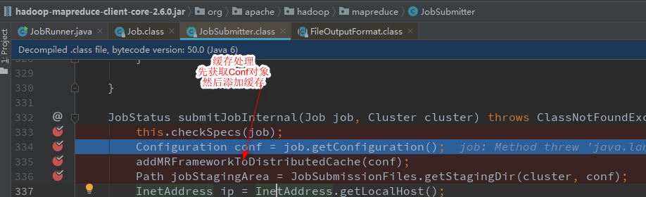

# 一、概述

## 1.1 大数据概念

大数据是需要新处理模式才能具有更强的决策力、洞察发现力和流程优化能力来适应海量、高增长率和多样化的信息资产。

## 1.2 大数据面临的问题

`存储`：单机存储有限，需要使用集群（多台机器）存储数据；硬件上必须有足够的存储容量，软件上有对应的容灾机制。

`分析`：单机算力有限，也需要使用集群进行计算（需要在合理的时间内将数据变废为宝）

## 1.3 大数据的特点

> 4V Volume 数据量大  Velocity 时效性   Variety 多样性 Value 价值大

### 1）数据量大

B-KB-MB-GB-TB-PB-EB-ZB....

各种个人云存储解决方案：百度网盘、腾讯微云、115、lanzou、诚通、OneDriver、GoogleDriver 等

大数据产生于21世纪的互联网时代，日益进步的科技和日益增长的物质文化需求，导致了数据的大爆炸；

淘宝、支付宝、微信、QQ、抖音这些App是目前国内顶尖的流量，使用人数及其的庞大，每天可以产生极多的数据量。

### 2）数据时效性

双十一、618

大数据是在短时间内迅速产生（产生的时效性非常高），分析的时效性就必须因场景而异，需要在合理的时间内分析出有价值的数据。

### 3）数据多样性

#### （1）数据存储类型多样性

结构化的数据：表格、文本、SQL等

非结构化数据：视频、音频、图片

#### （2）数据分析类型多样性

地理位置：来自北京、中国、上海

设备信息：来自PC、手机、平板、手表、手环、眼镜

个人喜好：美女、面膜、ctrl、 数码、篮球、足球

社交网络：A可能认识B 、C ，B就可能认识C

电话号码：110,10086

网络身份证：设备MAC+电话+IP+地区

### 4）数据价值

警察叔叔：只关注的是否哪里违规

AI研究：犯罪预测、下棋、无人驾驶

所以在海量数据中有用的数据最为关键、这是分析数据的第一步，也就是对数据进行降噪处理（数据清洗|数据预处理）


## 1.4 应用场景

### 1）个人推荐

根据用户喜好，推荐相关资源

千人一面、千人千面、一人千面

### 2）风控

大数据实时流处理，根据用户行为模型进行支撑，判断该行为是否正常 

### 3）成本预测


### 4）气候预测


### 5）人工智能


## 1.5 工作方向

~~~
1 业务
电商推荐、智能广告系统、专家系统、智能交通、智能医疗
2 工作方向
 大数据开发工程师（实时计算、批处理、ETL、数据挖掘）、大数据运维工程师
~~~

## 1.6分布式

为了解决大数据存储和计算的问题，需要使用一定数量的机器，硬件设施必须足够，那软件解决方案怎么办？

如何使用软件去解决存储和分析的问题？

# 二、Hadoop


Hadoop由 Apache Software Foundation 公司于 2005 年秋天作为[Lucene](https://baike.baidu.com/item/Lucene)的子项目[Nutch](https://baike.baidu.com/item/Nutch)的一部分正式引入。它受到最先由 Google Lab 开发的 Map/Reduce 和 Google File System([GFS](https://baike.baidu.com/item/GFS)) 的启发。

2006 年 3 月份，Map/Reduce 和 Nutch Distributed File System (NDFS) 分别被纳入称为 Hadoop 的项目中。

Hadoop 是最受欢迎的在 Internet 上对搜索[关键字](https://baike.baidu.com/item/关键字)进行内容分类的工具，但它也可以解决许多要求极大伸缩性的问题。例如，如果您要 grep 一个 10TB 的巨型文件，会出现什么情况？在传统的系统上，这将需要很长的时间。但是 Hadoop 在设计时就考虑到这些问题，采用[并行执行](https://baike.baidu.com/item/并行执行)机制，因此能大大提高效率。


`HDFS`：Hadoop Distributed File System  作为Hadoop 生态体系中数据的存储的软件解决方案

`MapReduce`：Hadoop中分布式计算框架（只需要实现少量的代码，就可以开发一个分布式的应用程序），对海量数据并行分析和计算


## 2.1 Hadoop生态系统

`HDFS`：Hadoop Distributed File System  作为Hadoop 生态体系中数据的存储的软件解决方案

`MapReduce`：Hadoop中分布式计算框架（只需要实现少量的代码，就可以开发一个分布式的应用程序），对海量数据并行分析和计算

`HBase`: 基于HDFS 的列式存储的NoSql

`Hive`:是一款SQL解释引擎，能够将SQL语句翻译成MR代码

`Flume`:分布式的日志收集系统，用于收集海量日志数据，并将其存储在hdfS中

`kafka`:消息队列，实现对分布式应用程序间的解耦和数据缓冲

`Zookeeper`：分布式协调服务，用户注册中心、配置中心、集群选举、状态检测、分布式锁

## 2.2 大数据分析方案

`MapReduce`:大数据离线批处理（代表基于磁盘，延迟30分钟+）

`Spark`：大数据离线批处理（代表基于内存，速度相对于MR来说快的多）

`Strom/Spark Streaming/Kafka Streaming/Flink`:实时流处理框架，达到对记录级别消息的毫秒级处理


# 三、HDFS


## 3.1 安装（伪集群）

### 1）准备虚拟机

~~~
更改IP  vi /etc/sysconfig/network-scripts/ifcfg-eth0 
删除MAC地址  rm -rf  /etc/udev/rules.d/70-persistent-net.rules
更改主机名     vi /etc/sysconfig/network
~~~

### 2）安装JDK 8

~~~
略
~~~

### 3）配置Java环境变量

~~~properties
export JAVA_HOME=/home/java/jdk1.8.0_181
export PATH=$PATH:$JAVA_HOME/bin
~~~

### 4）配置主机名与IP的映射关系

~~~shell
[root@HadoopNode00 ~]#  vi /etc/sysconfig/network
NETWORKING=yes
HOSTNAME=HadoopNode00

[root@HadoopNode00 ~]# vi /etc/hosts
127.0.0.1   localhost localhost.localdomain localhost4 localhost4.localdomain4
::1         localhost localhost.localdomain localhost6 localhost6.localdomain6

192.168.11.20 HadoopNode00
~~~

### 5）关闭防火墙

~~~shell
[root@HadoopNode00 ~]# service iptables stop   #  关闭防火墙
[root@HadoopNode00 ~]# chkconfig iptables off  # 关闭防火墙开机自动启动 
~~~

### 6）ssh免密登陆

SSH是Secure Shell 的缩写，SSH为建立在应用层山的安全协议，专为远程登陆会话和其他网络服务提供安全协议支持。

`基于口令的安全验证`：基于用户名和密码  root | 123456

基于密钥的安全验证：需要依靠密钥


~~~shell
[root@HadoopNode00 ~]# ssh-keygen -t rsa   # 生成密钥
[root@HadoopNode00 ~]# ssh-copy-id HadoopNOde00
~~~

### 7）解压Hadoop

~~~shell
解压Hadoop到指定目录
[root@HadoopNode00 ~]# mkdir /home/hadoop/
[root@HadoopNode00 ~]# tar -zxvf /home/hadoop/hadoop-2.6.0.tar.gz  -C /home/hadoop
~~~

### 8）配置Hadoop环境变量

~~~shell
export HADOOP_HOME=/home/hadoop/hadoop-2.6.0
export PATH=$PATH:$HADOOP_HOME/bin:$HADOOP_HOME/sbin
~~~

> `HADOOP_HOME`环境变量被第三方依赖，hbase hive flume在集成HADOOP的时候，是通过HADOOP_HOME找到hadoop的位置

### 9）配置 etc/hadoop/core-site.xml

~~~xml
<property>
<name>fs.defaultFS</name>
<value>hdfs://HadoopNode00:9000</value>
</property>

<property>
<name>hadoop.tmp.dir</name>
<value>/home/hadoop/hadoop-2.6.0/hadoop-${user.name}</value>
</property>

~~~

### 10）配置 etc/hadoop/hdfs-site.xml

~~~xml
<property>
<name>dfs.replication</name>
<value>1</value>
</property>
~~~

### 11）格式化namenode

> 第一次启动hdfs的时候，需要格式化namenode

~~~shell
[root@HadoopNode00 ~]# hdfs namenode -format
[root@HadoopNode00 ~]# tree /home/hadoop/hadoop-2.6.0/hadoop-root
/home/hadoop/hadoop-2.6.0/hadoop-root
└── dfs
    └── name
        └── current
            ├── fsimage_0000000000000000000
            ├── fsimage_0000000000000000000.md5
            ├── seen_txid
            └── VERSION

3 directories, 4 files
~~~

### 12）启动hdfs

~~~shell
start-dfs.sh   # 开启HDFS 
stop-dfs.sh    # 关闭hdfs 
~~~

进入web界面

~~~
http://主机名:50070   


~~~

> windows下 配置域名与ip的映射：C:\Windows\System32\drivers\etc \hosts


## 3.2 HDFS Shell 相关操作


### 1）hdfs shell

~~~shell
[root@HadoopNode00 ~]# hadoop fs
Usage: hadoop fs [generic options]
        [-appendToFile <localsrc> ... <dst>]
        [-cat [-ignoreCrc] <src> ...]
        [-checksum <src> ...]
        [-chgrp [-R] GROUP PATH...]
        [-chmod [-R] <MODE[,MODE]... | OCTALMODE> PATH...]
        [-chown [-R] [OWNER][:[GROUP]] PATH...]
        [-copyFromLocal [-f] [-p] [-l] <localsrc> ... <dst>]
        [-copyToLocal [-p] [-ignoreCrc] [-crc] <src> ... <localdst>]
        [-count [-q] [-h] <path> ...]
        [-cp [-f] [-p | -p[topax]] <src> ... <dst>]
        [-createSnapshot <snapshotDir> [<snapshotName>]]
        [-deleteSnapshot <snapshotDir> <snapshotName>]
        [-df [-h] [<path> ...]]
        [-du [-s] [-h] <path> ...]
        [-expunge]
        [-get [-p] [-ignoreCrc] [-crc] <src> ... <localdst>]
        [-getfacl [-R] <path>]
        [-getfattr [-R] {-n name | -d} [-e en] <path>]
        [-getmerge [-nl] <src> <localdst>]
        [-help [cmd ...]]
        [ ..]
        [-usage [cmd ...]]

Generic options supported are
-conf <configuration file>     specify an application configuration file
-D <property=value>            use value for given property
-fs <local|namenode:port>      specify a namenode
-jt <local|resourcemanager:port>    specify a ResourceManager
-files <comma separated list of files>    specify comma separated files to be copied to the map reduce cluster
-libjars <comma separated list of jars>    specify comma separated jar files to include in the classpath.
-archives <comma separated list of archives>    specify comma separated archives to be unarchived on the compute machines.

The general command line syntax is
bin/hadoop command [genericOptions] [commandOptions]


~~~


### 2）上传文件

~~~shell
# 上传 root目录下的install.log  到hdfs 根目录下
[root@HadoopNode00 ~]# hadoop fs -put  /root/install.log  /1.txt

~~~

### 3 ） ls文件

~~~shell
# 找到到了刚才上传为文件命名为1.txt
[root@HadoopNode00 ~]# hadoop fs -ls /
Found 1 items
-rw-r--r--   1 root supergroup       8901 2019-09-17 23:28 /1.txt
~~~

### 4）下载文件

~~~shell
[root@HadoopNode00 ~]# hadoop fs -get  /1.txt /root/baizhi.txt
~~~

### 5）删除文件

~~~shell
[root@HadoopNode00 ~]# hadoop fs -rm /2.txt
19/09/17 23:36:05 INFO fs.TrashPolicyDefault: Namenode trash configuration: Deletion interval = 0 minutes, Emptier interval = 0 minutes.
Deleted /2.txt
~~~

### 6）查看文件

~~~shell
[root@HadoopNode00 ~]# hadoop fs -cat /1.txt
Installing libgcc-4.4.7-23.el6.x86_64
warning: libgcc-4.4.7-23.el6.x86_64: Header V3 RSA/SHA1 Signature, key ID c105b9de: NOKEY
Installing setup-2.8.14-23.el6.noarch

~~~

### 7）创建文件夹

~~~shell
[root@HadoopNode00 ~]# hadoop fs -mkdir /baizhi
[root@HadoopNode00 ~]# hadoop fs -ls /
Found 2 items
-rw-r--r--   1 root supergroup       8901 2019-09-17 23:28 /1.txt
drwxr-xr-x   - root supergroup          0 2019-09-17 23:37 /baizhi

~~~

### 8）复制文件

~~~~shell
[root@HadoopNode00 ~]# hadoop fs -cp /1.txt /baizhi/
[root@HadoopNode00 ~]# hadoop fs -ls /
Found 2 items
-rw-r--r--   1 root supergroup       8901 2019-09-17 23:28 /1.txt
drwxr-xr-x   - root supergroup          0 2019-09-17 23:38 /baizhi
[root@HadoopNode00 ~]# hadoop fs -ls /baizhi
Found 1 items
-rw-r--r--   1 root supergroup       8901 2019-09-17 23:38 /baizhi/1.txt
~~~~


### 9）开启回收站机制

core-site.xml

~~~xml
<property>
<name>fs.trash.interval</name>
<value>1</value>
</property>
~~~

> 设置一分钟延迟


## 3.3  Java API 操作HDFS 

### （1） 依赖

~~~xml
<!-- https://mvnrepository.com/artifact/org.apache.hadoop/hadoop-common -->
<dependency>
    <groupId>org.apache.hadoop</groupId>
    <artifactId>hadoop-common</artifactId>
    <version>2.6.0</version>
</dependency>

<!-- https://mvnrepository.com/artifact/org.apache.hadoop/hadoop-hdfs -->
<dependency>
    <groupId>org.apache.hadoop</groupId>
    <artifactId>hadoop-hdfs</artifactId>
    <version>2.6.0</version>
</dependency>

~~~

### （2）Windows 配置Hadoop环境

+ 解压hadoop到指定的目录
+ 拷贝hadoop.dll和winutils.exe到hadoop/bin 目录下
+ 配置Hadoop环境变量
+ 配置主机名和IP的映射关系

### （3）权限不足解决方案

~~~~java
org.apache.hadoop.security.AccessControlException: Permission denied: user=Administrator, access=WRITE, inode="/baizhi":root:supergroup:drwxr-xr-x
~~~~


#### 1）配置 hdfs-site.xml

> 将权限检查关闭

~~~xml
<property>
<name>dfs.permissions.enabled</name>
<value>false</value>
</property>
~~~

#### 2）方案2

~~~
-DHADOOP_USER_NAME=root
~~~

#### 3）方案3

~~~java
System.setProperty("HADOOP_USER_NAME", "root");
~~~

### （3）相关操作

~~~java
package com.baizhi.hdfs;

import org.apache.hadoop.conf.Configuration;
import org.apache.hadoop.fs.*;
import org.apache.hadoop.io.IOUtils;
import org.junit.Before;
import org.junit.Test;
import org.junit.experimental.theories.suppliers.TestedOn;
import sun.awt.geom.AreaOp;

import java.io.FileInputStream;
import java.io.FileOutputStream;
import java.io.IOException;

public class App {

    private Configuration configuration;
    private FileSystem fileSystem;

    @Before
    public void getClient() throws Exception {

        System.setProperty("HADOOP_USER_NAME", "root");
        /*
         * 准备配置对象
         * */
        configuration = new Configuration();
        /*
         * 添加相应的配置文件*/
        configuration.addResource("core-site.xml");
        configuration.addResource("hdfs-site.xml");

        /*
         * 通过FileSystem.newInstance 获得客户端对象*/
        fileSystem = FileSystem.newInstance(configuration);
    }

    @Test
    public void testUpload01() throws Exception {

        /*
         *
         * 源文件  |   目标文件
         * Path 对象
         * */
        fileSystem.copyFromLocalFile(new Path("G:\\A.docx"), new Path("/baizhi/2.docx"));

    }

    @Test
    public void testUpload02() throws Exception {

        /*
         * 准备 本地输入流
         * */
        FileInputStream inputStream = new FileInputStream("G:\\A.docx");


        /*
         * 准备 hdfs 输出流
         * */
        FSDataOutputStream outputStream = fileSystem.create(new Path("/baizhi/3.docx"));


        /*
         * 使用工具类进行拷贝
         * */
        IOUtils.copyBytes(inputStream, outputStream, 1024, true);
    }

    @Test
    public void testDownload01() throws Exception {

        fileSystem.copyToLocalFile(false, new Path("/1.txt"), new Path("G:\\3.txt"), true);

    }

    @Test
    public void testDownload02() throws Exception {

        FileOutputStream outputStream = new FileOutputStream("G:\\4.txt");

        FSDataInputStream inputStream = fileSystem.open(new Path("/1.txt"));
        IOUtils.copyBytes(inputStream, outputStream, 1024, true);

    }

    @Test
    public void test011() throws IOException {


        RemoteIterator<LocatedFileStatus> list = fileSystem.listFiles(new Path("/"), true);


        while (list.hasNext()) {

            LocatedFileStatus locatedFileStatus = list.next();
            Path path = locatedFileStatus.getPath();
            System.out.println(path.toString());

        }


    }

    @Test
    public void test02() throws Exception{

        fileSystem.delete(new Path("/baizhi"),false);
    }
    @Test
    public void test03() throws Exception{

        boolean exists = fileSystem.exists(new Path("/1.txt"));
        if (exists){
            System.out.println("文件存在");
        }else {

            System.out.println("文件不存在");
        }
    }

    @Test
    public void testy04() throws Exception{

        fileSystem.mkdirs(new Path("/baizhi1243"));
    }
}

~~~


## 3.4 HDFS Architecture

HDFS为主从架构，HDFS中有一个主的NameNode，管理系统命名空间和管理客户端对文件的访问，其中还有DataNode负责和NameNode进行协调工作，DataNode负责数据的存储，在存储数据（文件）的过程中一个文件会被分成一个块或者多个块，在NameNode中存储了一些数据（存储的数据是块到DataNode的映射关系），datanode还根据NameNode的指令创建删除复制块。


`namenode`:存储元数据（用户描述数据的数据），负责管理DataNode

`datanode`：用于存储数据块的节点，负责响应客户端的对块的读写请求，向NameNode汇报自己的块信息

`block块`：数据块，hdfs中对文件拆分的最小单元，切分尺度默认为128MB，每个块在默认情况下有三个副本

`rack`：机架，使用机架配置文件对存储节点进行物理编排，用于优化存储和计算

### 1）什么是Block块

~~~xml
<property>
  <name>dfs.blocksize</name>
  <value>134217728</value>
  <description>
      The default block size for new files, in bytes.
      You can use the following suffix (case insensitive):
      k(kilo), m(mega), g(giga), t(tera), p(peta), e(exa) to specify the size (such as 128k, 512m, 1g, etc.),
      Or provide complete size in bytes (such as 134217728 for 128 MB).
  </description>
</property>
~~~


### （1）为什么块的大小为128MB？

在Hadoop1.x 块大小默认为64MB，在Hadoop2.x 默认为128MB

工业限制：一般来说机械硬盘的读取速度100MB左右

软件优化：通常认为最佳状态为寻址时间为传输时间的100分之一

### （2）Block块的大小能否随意设置？

不能，如果BlockSize过大，可能导致多余存储空间浪费，导致存取时间过长 如果BlockSize过小，会导致寻址时间过长，同样造成效率低下。

### （3）HDFS为什么不适合存储小文件

| 文件         | namenode内存占用       | datanode磁盘占用 |
| ------------ | ---------------------- | ---------------- |
| 128MB 单文件 | 1个Blcok元数据的大小   | 128MB            |
| 128*1MB      | 128个Block元数据的大小 | 128MB            |
|              |                        |                  |

namenode内存会过于紧张

### 2）Rack Awareness  机架感知

~~~
对于常见情况，当复制因子为3时，HDFS的放置策略是将一个副本放在本地机架中的一个节点上，另一个放在本地机架中的另一个节点上，将最后一个放在另一个机架中的另一个节点上。此策略可以减少机架间写入流量，从而提高写入性能。机架故障的可能性远小于节点故障的可能性;此策略不会影响数据可靠性和可用性保证。但是，它确实减少了读取数据时使用的聚合网络带宽，因为块只放在两个唯一的机架而不是三个。使用此策略时，文件的副本不会均匀分布在机架上。三分之一的副本位于一个节点上，三分之二的副本位于一个机架上，另外三个副本均匀分布在剩余的机架上。此策略可提高写入性能，而不会影响数据可靠性或读取性能。
~~~


查看默认机架

~~~shell
[root@HadoopNode00 ~]# hdfs  dfsadmin  -printTopology
Rack: /default-rack
   192.168.11.20:50010 (HadoopNode00)
~~~


### 3）NameNode 和 SecondaryNameNode 的 关系 （重点）

fsimage文件：元数据信息的备份，会被加载到内存中

edits文件：Edits文件帮助记录增加和更新操作，提高效率

namenode在启动时会加载fsimage和edits的文件，所以在第一次启动的时候需要格式化namenode

当用户上传文件的时候或者进行其他操作的时候，操作记录会写入edits文件中，这样edits和fsimage文件加起来的元数据永远是最新的。

如果此时用户一直进行操作的话，edits文件会越来越大，这就导致了在下次启动的时候启动速度过慢。

为了解决这个问题，出现了SecondaryNameNode ，将当前的NameNode的edits和fsimage文件拷贝到自己的节点上，进行合并操作，在合并完成后，将新的fsimage文件传输到原来的namenode中，此时namanode再去加载最新的fsimage。

新的问题：在SecondaryNameNode 进行拷贝操作的时候，如果有客户端读写请求过来，势必要追加相应的操作记录到edits文件中，但是此时正在进行拷贝操作，改变则代表会造成数据紊乱，怎么办？解办法是：会有一个新的叫做edits-inprogress的文件被创建，新的操作将写入此文件中，等待SecondaryNameNode合并完成，将edits-inprogress文件改名成为当前的edits文件。


### 4）检查点

~~~
namenode使用fsimage和edits文件保存元数据，2nn会定期的下载主的（Active）namenode的fsimage文件和edits 文件，并在本地进行合并。
合并的时机就称之为检查点
检查点有两种触发机制：
（1） 默认一个小时进行合并
（2） 操作数量达到100W次进行合并
~~~

~~~xml
<property>
  <name>dfs.namenode.checkpoint.period</name>
  <value>3600s</value>
  <description>
    The number of seconds between two periodic checkpoints.
    Support multiple time unit suffix(case insensitive), as described
    in dfs.heartbeat.interval.
  </description>
</property>
~~~

~~~xml
<property>
  <name>dfs.namenode.checkpoint.txns</name>
  <value>1000000</value>
  <description>The Secondary NameNode or CheckpointNode will create a checkpoint
  of the namespace every 'dfs.namenode.checkpoint.txns' transactions, regardless
  of whether 'dfs.namenode.checkpoint.period' has expired.
  </description>
</property>
~~~

### 5）Safemode

~~~
在启动时候加载fsimage和edits文件，等待其他的DataNode报告块信息，直至大部分块可用。在次期间，集群处于SafeMode，NameNode的安全模式本质上是HDFS集群的只读模式，它不允许对文件系统或块进行任何修改。
通常，在DataNode报告大多数文件系统块可用之后，NameNode会自动离开Safemode。
可以手动的进入或者退出SafeMode
~~~

~~~shell
[root@HadoopNode00 ~]# hdfs dfsadmin -safemode  enter
Safe mode is ON
[root@HadoopNode00 ~]# hadoop fs -put /root/1.txt  /
put: Cannot create file/1.txt._COPYING_. Name node is in safe mode.
[root@HadoopNode00 ~]# hdfs dfsadmin -safemode  leave
Safe mode is OFF
[root@HadoopNode00 ~]# hadoop fs -put /root/1.txt  /
~~~

### 6）DataNode工作机制


~~~
启动的时候会注册DataNode
周期向NameNode上报块信息，并且对其信息状态进行反馈，DataNode进行相应的操作
心跳不能出现10分钟以上的断连，必须重启DataNode才能重现上线
~~~

# 四、MapReduce

##  4.1 概述

MapReduce是一种编程模型，用于大规模数据集（大于1TB）的并行运算。概念"Map（映射）"和"Reduce（归约）"，是它们的主要思想，都是从函数式编程语言里借来的，还有从矢量编程语言里借来的特性。它极大地方便了编程人员在不会分布式并行编程的情况下，将自己的程序运行在[分布式系统](https://baike.baidu.com/item/分布式系统/4905336)上。 当前的软件实现是指定一个Map（映射）函数，用来把一组键值对映射成一组新的键值对，指定并发的Reduce（归约）函数，用来保证所有映射的键值对中的每一个共享相同的键组。

`MapReduce`是Hadoop框架的一个`并行计算框架`,将一个计算任务拆分成两个阶段：Map和Reduce

MapReduce计算框架充分利用了 存储节点（DataNode）所在物理主机的计算资源进行并行计算

默认情况下NodeManager会将本进程运行 的节点的计算资源抽像成8个计算单元，每个单元称之为一个`Contioner`，所有的NodeManager都由ResourceManager调度，ResourceManager负责计算资源的统筹分配。

> 一是软件框架   二是并行处理   三 可靠容错  四 大规模计算   五 处理海量数据


MapReduce擅长做大数据处理，MapReduce的思想就是`分而治之`

+ Map负责**”分“**，即把庞大且复杂的任务分解成若干个”简单的任务“来处理，简单的任务包含三层

  + 是对数据或者计算模型相对于原任务要大大缩小
  + 就近计算原则，就是任务会被分配到存放所需数据的节点上进行计算
  + 这些小任务不止一个且并行计算，而且彼此间没有依赖关系

  

+ Reducer负责对Map的计算结果**进行汇总**

  


## 4.2 为什么使用MR？

~~~java
package com.baizhi.hdfs;

import java.io.BufferedReader;
import java.io.File;
import java.io.FileReader;
import java.io.FileWriter;

public class CleanApp {

    public static void main(String[] args) throws Exception {

        File file = new File("G:\\Note\\Day02-Hadoop\\数据文件\\access.tmp2019-05-19-10-28.log");

        BufferedReader bufferedReader = new BufferedReader(new FileReader(file));

        FileWriter fileWriter = new FileWriter("G:\\Note\\Day02-Hadoop\\数据文件\\clean.log");


        while (true) {

            String line = bufferedReader.readLine();

            if (line == null) {
                bufferedReader.close();
                fileWriter.close();
                return;
            }

            boolean contains = line.contains("thisisshortvideoproject'slog");
            if (contains) {

                String s = line.split("thisisshortvideoproject'slog")[0];
                fileWriter.write(s.trim() + "\n");
                fileWriter.flush();

            }

        }

    }
}

~~~

上述代码是对日志进行简单的清晰，在数据量少的时候一点问题都没有，但是数据量一旦增加，就可能无法胜任需求，因为无法在合理的时间内完成计算，此时单机性能已经成为计算的瓶颈，但是手写分布式应用程序难度太大，有现成的框架可以使用，那就是MR!

## 4.3 YARN  环境搭建

### （1）什么是 YARN ？

~~~
Yarn作为一个资源调度平台,有一个全局的管理者叫做ResourceManager，ResourceManager负责对集群的整体计算及资源做统筹规划，有各个节点的管理者叫做NodeManager，负责向ResourceManager报告其计算资源的使用情况，在NodeManger中有一个MRAppMaster管理这里当前运行的MRApp，其任务是协调来自ResourceManager的资源，并与NodeManager一起执行和监视任务。
~~~

`ResourceManager`：负责对集群的整体计算及资源做统筹规划

`NodeManager`：管理主机上的计算组员，负责向RM 汇报自身的状态信息

`MRAppMaster`：计算任务的Master，负责申请计算资源，协调计算任务

`YARN Child`：负责做实际计算任务

`Container：`计算资源的抽象单元


### （2）配置YARN 

`etc/hadoop/yarn-site.xml`

~~~xml
 <property>
    <name>yarn.nodemanager.aux-services</name>
    <value>mapreduce_shuffle</value>
  </property>
 <property>
    <description>The hostname of the RM.</description>
    <name>yarn.resourcemanager.hostname</name>
    <value>HadoopNode00</value>
  </property> 
~~~

`etc/hadoop/mapred-site.xml`

>  etc/hadoop/  下其实是没有这个文件 的但是有yitmp结尾的文件，将其改名即可

~~~xml
<property>
  <name>mapreduce.framework.name</name>
  <value>yarn</value>
</property>
~~~

### （3）启动YARN

~~~shell
[root@HadoopNode00 ~]# start-yarn.sh
starting yarn daemons
starting resourcemanager, logging to /home/hadoop/hadoop-2.6.0/logs/yarn-root-resourcemanager-HadoopNode00.out
localhost: starting nodemanager, logging to /home/hadoop/hadoop-2.6.0/logs/yarn-root-nodemanager-HadoopNode00.out
[root@HadoopNode00 ~]# jps
60192 Jps
60046 ResourceManager
60142 NodeManager
~~~

> web 界面： hostname:8088


## 4.4 MR 入门程序

~~~
需求：
wangkai gjf zkf suns gzy
wangkai zkf suns gzy
zkf suns gzy hxz leijun

wangkai 2
gjf 1
zkf 3 
suns 3
gzy 3
hxz 1
leijun 1
~~~

### （1）依赖

~~~xml
  
        <dependency>
            <groupId>org.apache.hadoop</groupId>
            <artifactId>hadoop-common</artifactId>
            <version>2.6.0</version>
        </dependency>

        <dependency>
            <groupId>org.apache.hadoop</groupId>
            <artifactId>hadoop-hdfs</artifactId>
            <version>2.6.0</version>
        </dependency>
        
   
		<dependency>
   	 	<groupId>org.apache.hadoop</groupId>
    	<artifactId>hadoop-mapreduce-client-jobclient</artifactId>
    	<version>2.6.0</version>
 
		</dependency>

		 <dependency>
            <groupId>org.apache.hadoop</groupId>
            <artifactId>hadoop-mapreduce-client-core</artifactId>
            <version>2.6.0</version>
        </dependency>
~~~


### （2）Mapper 逻辑

~~~java
package com.baizhi.mr.test01;

import org.apache.hadoop.io.IntWritable;
import org.apache.hadoop.io.LongWritable;
import org.apache.hadoop.io.Text;
import org.apache.hadoop.mapreduce.Mapper;

import java.io.IOException;

/*
* keyIn  LongWritable (Long) 输入文本字节偏移量
* valueIn Text (String)      输入文本行
*  keyOut Text(String)
*  valueOut IntWritable(Int)
* */

public class WCMapper  extends Mapper<LongWritable, Text,Text, IntWritable> {

    @Override
    protected void map(LongWritable key, Text value, Context context) throws IOException, InterruptedException {

        String[] names = value.toString().split(" ");

        for (String name : names) {
            context.write(new Text(name),new IntWritable(1));
        }


    }
}

~~~


### （3）Reduce 逻辑

~~~java
package com.baizhi.mr.test01;

import org.apache.hadoop.io.IntWritable;
import org.apache.hadoop.io.Text;
import org.apache.hadoop.mapreduce.Reducer;

import java.io.IOException;


/*
 *keyIn Text 与mapper的keyOut的数据类型相对应
 *valeuIn IntWritable   与mapper的ValueOut的数据类型相对应
 * KeyOut
 * valueOut
 * */
public class WCReducer extends Reducer<Text, IntWritable, Text, IntWritable> {
    @Override
    protected void reduce(Text key, Iterable<IntWritable> values, Context context) throws IOException, InterruptedException {

        int sum = 0;
        for (IntWritable value : values) {
            sum += value.get();
        }
        context.write(key, new IntWritable(sum));
    }
}

~~~


### （4）Job封装

~~~java
package com.baizhi.mr.test01;

import org.apache.hadoop.conf.Configuration;
import org.apache.hadoop.fs.Path;
import org.apache.hadoop.io.IntWritable;
import org.apache.hadoop.io.Text;
import org.apache.hadoop.mapreduce.Job;
import org.apache.hadoop.mapreduce.lib.input.TextInputFormat;
import org.apache.hadoop.mapreduce.lib.output.TextOutputFormat;

public class JobRunner {
    public static void main(String[] args) throws Exception {

        /*
         * 获取配置对象
         * */

        Configuration conf = new Configuration();

        /*
         * 获取Job对象
         * */
        Job job = Job.getInstance(conf);


        /*
         * 设置数据输入输出组件
         * */
        job.setInputFormatClass(TextInputFormat.class);
        job.setOutputFormatClass(TextOutputFormat.class);


        /*
         *设置数据输入输出路径
         * */

        TextInputFormat.setInputPaths(job, new Path("/wordcount.txt"));
        /*
         * 注意： 此输出路径不能存在
         * */
        TextOutputFormat.setOutputPath(job, new Path("/baizhi/out1"));


        /*
         * 设置MAP 和 REDUCE 处理逻辑
         * */
        job.setMapperClass(WCMapper.class);
        job.setReducerClass(WCReducer.class);

        /*
         * 设置 map任务和reduce任务的输出泛型
         * */
        job.setMapOutputKeyClass(Text.class);
        job.setMapOutputValueClass(IntWritable.class);

        job.setOutputKeyClass(Text.class);
        job.setOutputValueClass(IntWritable.class);


        //  提交

        //job.submit();

        job.waitForCompletion(true);
    }
}
~~~


## 4.5 部署运行

### （1）远程Jar 包部署

~~~
 // 设置jar 类加载器 否则MapReduce框架找不到Map和Reuce
 job.setJarByClass(JobRunner.class);
~~~

+ 打包
+ 运行 hadoop jar 包的名字  主类名

~~~shell
[root@HadoopNode00 ~]# hadoop jar Hadoop_Test-1.0-SNAPSHOT.jar com.baizhi.mr.test01.JobRunner
~~~

### （2）本地仿真

#### 填坑


~~~xml
 <dependency>
            <groupId>log4j</groupId>
            <artifactId>log4j</artifactId>
            <version>1.2.17</version>
        </dependency>
~~~

> log4j.properties

~~~properties

### 配置根 ###
log4j.rootLogger = info,console

### 配置输出到控制台 ###
log4j.appender.console = org.apache.log4j.ConsoleAppender
log4j.appender.console.Target = System.out
log4j.appender.console.layout = org.apache.log4j.PatternLayout
log4j.appender.console.layout.ConversionPattern =  %p %d{yyyy-MM-dd HH:mm:ss} %c %m%n
~~~


### （3）跨平台提交

+ 需要拷贝相关配置文件到resource目录
  + core-site.xml
  + hdfs-site.xml
  + yarn-site.xml
  + mapred-site.xml

代码

~~~java
		 System.setProperty("HADOOP_USER_NAME", "root");

        conf.addResource("conf2/core-site.xml");
        conf.addResource("conf2/hdfs-site.xml");
        conf.addResource("conf2/mapred-site.xml");
        conf.addResource("conf2/yarn-site.xml");
        conf.set(MRJobConfig.JAR, "G:\\IDEA_WorkSpace\\BigData\\Hadoop_Test\\target\\Hadoop_Test-1.0-SNAPSHOT.jar");


~~~

配置跨平台提交

+ 配置mapred-site.xml

~~~xml
 <property>
    <name>mapreduce.app-submission.cross-platform</name>
    <value>true</value>
  </property>
~~~

+ 代码的方式

~~~java
  conf.set("mapreduce.app-submission.cross-platform", "true");
~~~


## 4.6  自定义Bean对象

### （1）什么是自定义Bean对象

~~~
开发不是一成不变的，Hadoop中提供了集中数据类型的序列化，但是在实际的开发中往往是不够用的，需要自定义序列化对象
在Java中使用的序列化技术是内置的Serializable
但是Hadoop并没有采取这种序列化方式，使用了自己实现的一套序列化机制，叫做Writable

需要进行序列化后才能在网络中进行传输
编码（序列化）----解码（反序列化）
~~~

### （2）需求

~~~
18611781163 700000 10000
18611781161 123 123123  
18611781163 700000 10000
18236529965 123 1223123
18236529964 123123 123
18236529965 546 45645
18611781163 300000 70000
18236529965 123 234523
18236529965 31243 436543
~~~

这是一组运营商的流量信息

~~~
电话         上行    下行   总流量
18611781163 700000 10000   ？
~~~

### （3）定义Bean对象

~~~java
package com.baizhi.mr.test02;

import org.apache.hadoop.io.Writable;
import sun.rmi.runtime.Log;

import java.io.DataInput;
import java.io.DataOutput;
import java.io.IOException;
import java.io.Serializable;

public class FlowBean implements Writable {

    private String phone;
    private Long upFlow;
    private Long downFlow;
    private Long sumFlow;

    public FlowBean() {
    }

    public FlowBean(String phone, Long upFlow, Long downFlow, Long sumFlow) {
        this.phone = phone;
        this.upFlow = upFlow;
        this.downFlow = downFlow;
        this.sumFlow = sumFlow;
    }


    public String getPhone() {
        return phone;
    }

    public void setPhone(String phone) {
        this.phone = phone;
    }

    public Long getUpFlow() {
        return upFlow;
    }

    public void setUpFlow(Long upFlow) {
        this.upFlow = upFlow;
    }

    public Long getDownFlow() {
        return downFlow;
    }

    public void setDownFlow(Long downFlow) {
        this.downFlow = downFlow;
    }

    public Long getSumFlow() {
        return sumFlow;
    }

    public void setSumFlow(Long sumFlow) {
        this.sumFlow = sumFlow;
    }


    @Override
    public String toString() {
        return "" +
                "phone='" + phone + '\'' +
                " upFlow=" + upFlow +
                " downFlow=" + downFlow +
                " sumFlow=" + sumFlow ;
    }

    /*
     * 序列化 编码
     * */
    public void write(DataOutput dataOutput) throws IOException {
        dataOutput.writeUTF(this.phone);
        dataOutput.writeLong(this.upFlow);
        dataOutput.writeLong(this.downFlow);
        dataOutput.writeLong(this.sumFlow);
    }


    /*
     * 反序列化  解码
     * */
    public void readFields(DataInput dataInput) throws IOException {

        this.phone = dataInput.readUTF();
        this.upFlow = dataInput.readLong();
        this.downFlow = dataInput.readLong();
        this.sumFlow = dataInput.readLong();

    }
}

~~~

~~~java
package com.baizhi.mr.test02;

import org.apache.hadoop.io.LongWritable;
import org.apache.hadoop.io.Text;
import org.apache.hadoop.mapreduce.Mapper;

import java.io.IOException;

public class FlowMapper extends Mapper<LongWritable, Text, Text, FlowBean> {

    /*
     * 18611781163 700000 10000
     * 18611781163 700000 10000
     * 18611781163 700000 10000
     * */

    @Override
    protected void map(LongWritable key, Text value, Context context) throws IOException, InterruptedException {

        String line = value.toString();

        String[] data = line.split(" ");

        /*
         *  phone
         * */
        context.write(new Text(data[0]), new FlowBean(data[0], Long.valueOf(data[1]), Long.valueOf(data[2]), (Long.valueOf(data[1]) + Long.valueOf(data[2]))));


    }
}

~~~

~~~java
package com.baizhi.mr.test02;

import org.apache.hadoop.io.NullWritable;
import org.apache.hadoop.io.Text;
import org.apache.hadoop.mapreduce.Reducer;

import java.io.IOException;

/*
 * 18611781163  FlowBean[]
 *
 * */
public class FlowReducer extends Reducer<Text, FlowBean, NullWritable, FlowBean> {

    @Override
    protected void reduce(Text key, Iterable<FlowBean> values, Context context) throws IOException, InterruptedException {

        Long up = 0L;
        Long down = 0L;
        Long sum = 0L;


        for (FlowBean flowBean : values) {

            up += flowBean.getUpFlow();
            down += flowBean.getDownFlow();
            sum += flowBean.getSumFlow();

        }

        context.write(NullWritable.get(), new FlowBean(key.toString(), up, down, sum));

    }
}

~~~

~~~java
package com.baizhi.mr.test02;

import org.apache.hadoop.conf.Configuration;
import org.apache.hadoop.fs.Path;
import org.apache.hadoop.io.NullWritable;
import org.apache.hadoop.io.Text;
import org.apache.hadoop.mapreduce.Job;
import org.apache.hadoop.mapreduce.MRJobConfig;
import org.apache.hadoop.mapreduce.lib.input.TextInputFormat;
import org.apache.hadoop.mapreduce.lib.output.TextOutputFormat;

public class FlowRunner {
    public static void main(String[] args) throws Exception {
        System.setProperty("HADOOP_USER_NAME", "root");

        Configuration conf = new Configuration();
        conf.addResource("conf2/core-site.xml");
        conf.addResource("conf2/hdfs-site.xml");
        conf.addResource("conf2/mapred-site.xml");
        conf.addResource("conf2/yarn-site.xml");
        conf.set(MRJobConfig.JAR, "G:\\IDEA_WorkSpace\\BigData\\Hadoop_Test\\target\\Hadoop_Test-1.0-SNAPSHOT.jar");
        conf.set("mapreduce.app-submission.cross-platform", "true");

        Job job = Job.getInstance(conf);


        job.setJarByClass(FlowRunner.class);

        job.setInputFormatClass(TextInputFormat.class);
        job.setOutputFormatClass(TextOutputFormat.class);


        TextInputFormat.setInputPaths(job, new Path("/flow.dat"));

        TextOutputFormat.setOutputPath(job, new Path("/baizhi/out333"));
        job.setMapperClass(FlowMapper.class);
        job.setReducerClass(FlowReducer.class);

        job.setMapOutputKeyClass(Text.class);
        job.setMapOutputValueClass(FlowBean.class);


        job.setOutputKeyClass(NullWritable.class);
        job.setOutputValueClass(FlowBean.class);


        job.waitForCompletion(true);

    }
}

~~~


## 4.7 MapReduce 计算流程（重点）


1  首先是通过程序员所编写的MR程序通过命令行本地提交或者IDE远程提交

2	一个MR程序就是一个Job，Job信息会给ResourceManger，向ResourceManger注册信息

3  在注册通过后，Job会拷贝相关的资源信息（从HDFS中）

4 紧接着会向ResourceManger提交完整的Job信息（包括资源信息）

5a  ResourceManger 会通过提交的Job信息，计算出Job所需的资源，为Job分配Container资源

5b 计算资源会分发给对应的NodeManger，NodeManager会创建一个MRAppMaster

6  MRAppMaster初始化Job

7 **获取输入切片信息**

8 MRAppMaster向ResourceManager 请求资源

9a 启动计算资源（连接到对应的资源所在NodeManager）

9b 启动YARN Child

10 从文件系统中获取完整的Job信息

11 启动对应的Maptask或者ReduceTask 进程，执行计算。


## 4.8 Job 提交流程（重点）


### （1）建立连接

判断是在本地运行还是集群运行，分别会创建不同的运行对象  YARN | Local

### （2）提交Job

#### 1）校验空间 checkSpecs()


#### 2）缓存处理



#### 3）创建资源路径 Staging路径


#### 4）获取Job ID ，在Staging路径下创建Job路径


#### 5）拷贝相关资源到jobID路径

~~~
files
libjars
archives
jobJar
~~~


#### 6）计算切片 生成切片规划文件

> 切片是一个逻辑上的概念，不会文件进行实际物理拆分，默认切分为128MB（本地为32MB）


#### 7）向Staging路径写XML 配置文件


## 4 .9 MapReduce 组件解析

### （1）概述

通过WC案例的编写，不难发现，其实我们是按照一定的规则进行程序的输入和输出，将作业放在本地运行或者提交到Hadoop集群中运行。

Hadoop是将数据切分成了若干个输入切片（Input Split），并将每个切片交由一个MapTask的进程处理，MapTask不断从对应的Split中解析出来一个一个的 key、value，并交由map()函数进行处理。处理完成之后根据ReduceTask的个数将结果集分成若干个分片（partition）写到磁盘中。

然后，每个ReduceTask会从MapTask所在的节点上的磁盘读取属于的那个分区（partition），然后使用基于排序方法将key 相同的数据聚合在一起，调用Reduce函数，处理完成后输出到磁盘。


从上面的描述中，可以看出，还有一些组件是没有在（目前的）编程中没有体现到：

（1）指定文本格式。将输入数据切分成若干个切片，且将每个Split（切片）解析成满足map函数要求的key，value对。

（2）确定map（）函数产生的key，value对象发送给那个Reduce 函数处理

（3）指定输出文件格式，即每个key，value已何种形式保存成输出文件。


所以在MR中，这三个组件分别是InputFormat 、Partitioner、OutputFormat ，他们均需要用户根据自己的需求进行配置，但是对于WC 来说，都是默认的。


但是最终。Hadoop还是提供五个可以编程的组件：分别 Mapper Reducer InputFormat   Partitioner OutputFormat。

按照顺序来：InputFormat     Mapper  Partitioner  Reducer  OutputFormat。

还有不是必备的组件：Combiner  ，通常是用于优化MR程序的性能，但是不能随意添加。


### （2）InputFormat组件

InputFormat主要用于描述输入数据的格式，它提供了如下的两个功能：

+ 数据切分：按照某个策略将输入数据切分成若干输入切片，确认MapTask个数和对应的Split

+ 为Mapper提供输入数据：给定某个InputSplit，将其解析成一个一个的key、value

#### 1）什么是切片，如何分割？


`切片`：逻辑上对数据文件进行划分

~~~
package org.apache.hadoop.mapreduce.lib.input;
-|FileInputFormat
	-|getSplits
~~~


~~~java
public List<InputSplit> getSplits(JobContext job) throws IOException {
    	// 秒表 不用关注
        Stopwatch sw = (new Stopwatch()).start();
    
    
    	// 获取最小大小
        long minSize = Math.max(this.getFormatMinSplitSize(), getMinSplitSize(job));
    	// 获取最大大小
        long maxSize = getMaxSplitSize(job);
    
   		 // 准备存放InputSplit 的集合
        List<InputSplit> splits = new ArrayList();
    	 // 准备存放FileStatus 的集合
        List<FileStatus> files = this.listStatus(job);
        Iterator i$ = files.iterator();

        while(true) {
            while(true) {
                while(i$.hasNext()) {
                    FileStatus file = (FileStatus)i$.next();
                    //获得当前文件路径
                    Path path = file.getPath();
                    // 获取到当前的长度
                    long length = file.getLen();
                    if (length != 0L) {
                        BlockLocation[] blkLocations;
                        // 判断是否是本地文件还是hdfs文件
                        if (file instanceof LocatedFileStatus) {
                            blkLocations = ((LocatedFileStatus)file).getBlockLocations();
                        } else {
                            FileSystem fs = path.getFileSystem(job.getConfiguration());
                            blkLocations = fs.getFileBlockLocations(file, 0L, length);
                        }

                        // 判断是否可以进行切分
                        // hadoop默认数据都可以进行切割
                        if (this.isSplitable(job, path)) {
                            // 多的块的大小
                            long blockSize = file.getBlockSize();
                            // 计算切片大小
                            long splitSize = this.computeSplitSize(blockSize, minSize, maxSize);
							// 准备描述剩余数据的字段
                            long bytesRemaining;
                            int blkIndex;
                            for(bytesRemaining = length; (double)bytesRemaining / (double)splitSize > 1.1D; bytesRemaining -= splitSize) {
                                blkIndex = this.getBlockIndex(blkLocations, length - bytesRemaining);
                                splits.add(this.makeSplit(path, length - bytesRemaining, splitSize, blkLocations[blkIndex].getHosts(), blkLocations[blkIndex].getCachedHosts()));
                            }

                            if (bytesRemaining != 0L) {
                                blkIndex = this.getBlockIndex(blkLocations, length - bytesRemaining);
                                splits.add(this.makeSplit(path, length - bytesRemaining, bytesRemaining, blkLocations[blkIndex].getHosts(), blkLocations[blkIndex].getCachedHosts()));
                            }
                        } else {
                            splits.add(this.makeSplit(path, 0L, length, blkLocations[0].getHosts(), blkLocations[0].getCachedHosts()));
                        }
                    } else {
                        splits.add(this.makeSplit(path, 0L, length, new String[0]));
                    }
                }

                job.getConfiguration().setLong("mapreduce.input.fileinputformat.numinputfiles", (long)files.size());
                sw.stop();
                if (LOG.isDebugEnabled()) {
                    LOG.debug("Total # of splits generated by getSplits: " + splits.size() + ", TimeTaken: " + sw.elapsedMillis());
                }

                return splits;
            }
        }
    }
~~~


#### 2）如何为Mapper提供数据？

TextInpuFormat使用的是org.apache.hadoop.mapreduce.lib.input.LineRecordReader . 这个类中，首先是initialize（）方法，该方法主要是获取切片信息初始化位置和结束位置，以及输入流；

 Mapper的key、value是通过nextKeyValue（）判断是否还有下一个，在这个方法中可以被设置成了文件的偏移量，value通过LineReader.readLine()方法将每一行的值拿到

~~~java
public void initialize(InputSplit genericSplit, TaskAttemptContext context) throws IOException {
        FileSplit split = (FileSplit)genericSplit;
        Configuration job = context.getConfiguration();
        this.maxLineLength = job.getInt("mapreduce.input.linerecordreader.line.maxlength", 2147483647);
        this.start = split.getStart();
        this.end = this.start + split.getLength();
        Path file = split.getPath();
        FileSystem fs = file.getFileSystem(job);
        this.fileIn = fs.open(file);
        CompressionCodec codec = (new CompressionCodecFactory(job)).getCodec(file);
        if (null != codec) {
            this.isCompressedInput = true;
            this.decompressor = CodecPool.getDecompressor(codec);
            if (codec instanceof SplittableCompressionCodec) {
                SplitCompressionInputStream cIn = ((SplittableCompressionCodec)codec).createInputStream(this.fileIn, this.decompressor, this.start, this.end, READ_MODE.BYBLOCK);
                this.in = new CompressedSplitLineReader(cIn, job, this.recordDelimiterBytes);
                this.start = cIn.getAdjustedStart();
                this.end = cIn.getAdjustedEnd();
                this.filePosition = cIn;
            } else {
                this.in = new SplitLineReader(codec.createInputStream(this.fileIn, this.decompressor), job, this.recordDelimiterBytes);
                this.filePosition = this.fileIn;
            }
        } else {
            this.fileIn.seek(this.start);
            this.in = new SplitLineReader(this.fileIn, job, this.recordDelimiterBytes);
            this.filePosition = this.fileIn;
        }

        if (this.start != 0L) {
            this.start += (long)this.in.readLine(new Text(), 0, this.maxBytesToConsume(this.start));
        }

        this.pos = this.start;
    }
~~~


~~~java
 public boolean nextKeyValue() throws IOException {
        if (this.key == null) {
            this.key = new LongWritable();
        }

        this.key.set(this.pos);
        if (this.value == null) {
            this.value = new Text();
        }

        int newSize = 0;

        while(this.getFilePosition() <= this.end || this.in.needAdditionalRecordAfterSplit()) {
            if (this.pos == 0L) {
                newSize = this.skipUtfByteOrderMark();
            } else {
                newSize = this.in.readLine(this.value, this.maxLineLength, this.maxBytesToConsume(this.pos));
                this.pos += (long)newSize;
            }

            if (newSize == 0 || newSize < this.maxLineLength) {
                break;
            }

            LOG.info("Skipped line of size " + newSize + " at pos " + (this.pos - (long)newSize));
        }

        if (newSize == 0) {
            this.key = null;
            this.value = null;
            return false;
        } else {
            return true;
        }
    }
~~~


~~~java
public int readLine(Text str, int maxLineLength, int maxBytesToConsume) throws IOException {
        return this.recordDelimiterBytes != null ? this.readCustomLine(str, maxLineLength, maxBytesToConsume) : this.readDefaultLine(str, maxLineLength, maxBytesToConsume);
    }
~~~


~~~java
private int readDefaultLine(Text str, int maxLineLength, int maxBytesToConsume) throws IOException {
        str.clear();
        int txtLength = 0;
        int newlineLength = 0;
        boolean prevCharCR = false;
        long bytesConsumed = 0L;

        do {
            int startPosn = this.bufferPosn;
            if (this.bufferPosn >= this.bufferLength) {
                startPosn = this.bufferPosn = 0;
                if (prevCharCR) {
                    ++bytesConsumed;
                }

                this.bufferLength = this.fillBuffer(this.in, this.buffer, prevCharCR);
                if (this.bufferLength <= 0) {
                    break;
                }
            }

            while(this.bufferPosn < this.bufferLength) {
                if (this.buffer[this.bufferPosn] == 10) {
                    newlineLength = prevCharCR ? 2 : 1;
                    ++this.bufferPosn;
                    break;
                }

                if (prevCharCR) {
                    newlineLength = 1;
                    break;
                }

                prevCharCR = this.buffer[this.bufferPosn] == 13;
                ++this.bufferPosn;
            }

            int readLength = this.bufferPosn - startPosn;
            if (prevCharCR && newlineLength == 0) {
                --readLength;
            }

            bytesConsumed += (long)readLength;
            int appendLength = readLength - newlineLength;
            if (appendLength > maxLineLength - txtLength) {
                appendLength = maxLineLength - txtLength;
            }

            if (appendLength > 0) {
                str.append(this.buffer, startPosn, appendLength);
                txtLength += appendLength;
            }
        } while(newlineLength == 0 && bytesConsumed < (long)maxBytesToConsume);

        if (bytesConsumed > 2147483647L) {
            throw new IOException("Too many bytes before newline: " + bytesConsumed);
        } else {
            return (int)bytesConsumed;
        }
    }
~~~


### （3）切片MapTask的关系

MapTask 的并发数量与切片相关（决定），ReduceTask数量是可以手动设置的，默认为1


### （4）常用的InputFormat


#### 1）分类

+ FileInputFormat

  + TextInputFormat

    + key LongWriteable 行的字节偏移量
    + value Text 文本

    > 切片：以文件为切分单位，有多少个文件就至少有多少个切片

  + NLineInputFormat

    + key LongWriteable 行的字节偏移量
    + value Text 文本

    > 切片：n行为一个切片，默认1行为一个切片，可以设置
    >
    > conf.set("mapreduce.input.lineinputformat.linespermap","10")
  >
    > NLineInputFormat.setNumLinesPerSplit();

  + CombineTextInputFormat
  
  + key LongWriteable 行的字节偏移量
    + value Text 文本
  
    > 切片：按照SplitSize切分，一个切片可能对应多个Block块
    >
    > ```java
    > CombineTextInputFormat.setMaxInputSplitSize();
    > ```
  > CombineTextInputFormat.setMinInputSplitSize();
>
  > ```
  > 
  > ```

  + SequenceFileInputFormat
  
    + key 文件名
    + value 文件数据
+ DBInputFormat（数据库）

+ TableInputFormat（HBase）


#### 2）NLineInputFormat

~~~java
package com.baizhi.mr.test01;

import org.apache.hadoop.conf.Configuration;
import org.apache.hadoop.fs.Path;
import org.apache.hadoop.io.IntWritable;
import org.apache.hadoop.io.Text;
import org.apache.hadoop.mapreduce.Job;
import org.apache.hadoop.mapreduce.MRJobConfig;
import org.apache.hadoop.mapreduce.lib.input.CombineFileInputFormat;
import org.apache.hadoop.mapreduce.lib.input.NLineInputFormat;
import org.apache.hadoop.mapreduce.lib.input.TextInputFormat;
import org.apache.hadoop.mapreduce.lib.output.TextOutputFormat;

public class JobRunner {
    public static void main(String[] args) throws Exception {

        /*
         * 获取配置对象
         * */

        Configuration conf = new Configuration();
        /*System.setProperty("HADOOP_USER_NAME", "root");
        conf.addResource("conf2/core-site.xml");
        conf.addResource("conf2/hdfs-site.xml");
        conf.addResource("conf2/mapred-site.xml");
        conf.addResource("conf2/yarn-site.xml");
        conf.set(MRJobConfig.JAR, "G:\\IDEA_WorkSpace\\BigData\\Hadoop_Test\\target\\Hadoop_Test-1.0-SNAPSHOT.jar");
        conf.set("mapreduce.app-submission.cross-platform", "true");*/
        /*
         * 获取Job对象
         * */
        Job job = Job.getInstance(conf);

        // // 设置jar 类加载器 否则MapReduce框架找不到Map和Reuce
        job.setJarByClass(JobRunner.class);


      /*  CombineFileInputFormat.setMaxInputSplitSize();
        CombineFileInputFormat.setMinInputSplitSize();*/

        /*
         * 设置数据输入输出组件
         * */
        job.setInputFormatClass(NLineInputFormat.class);
        job.setOutputFormatClass(TextOutputFormat.class);

        /*
         *设置数据输入输出路径
         * */

        NLineInputFormat.setInputPaths(job, new Path("G:\\Note\\Day02-Hadoop\\数据文件\\data02"));
        NLineInputFormat.setNumLinesPerSplit(job,3);
        //TextInputFormat.setInputPaths(job, new Path("/wordcount1.txt"));
        /*
         * 注意： 此输出路径不能存在
         * */
        //TextOutputFormat.setOutputPath(job, new Path("/baizhi/out8121231233"));
        TextOutputFormat.setOutputPath(job, new Path("G:\\Note\\Day02-Hadoop\\数据文件\\out12"));


        /*
         * 设置MAP 和 REDUCE 处理逻辑
         * */
        job.setMapperClass(WCMapper.class);
        job.setReducerClass(WCReducer.class);

        /*
         * 设置 map任务和reduce任务的输出泛型
         * */
        job.setMapOutputKeyClass(Text.class);
        job.setMapOutputValueClass(IntWritable.class);

        job.setOutputKeyClass(Text.class);
        job.setOutputValueClass(IntWritable.class);


        //  提交

        //job.submit();

        job.waitForCompletion(true);
    }
}

~~~

~~~java
package com.baizhi.mr.test01;

import org.apache.hadoop.io.IntWritable;
import org.apache.hadoop.io.LongWritable;
import org.apache.hadoop.io.Text;
import org.apache.hadoop.mapreduce.Mapper;

import java.io.IOException;
import java.io.Serializable;

/*
* keyIn  LongWritable (Long) 输入文本字节偏移量
* valueIn Text (String)      输入文本行
*  keyOut Text(String)
*  valueOut IntWritable(Int)
* */

public class WCMapper  extends Mapper<LongWritable, Text,Text, IntWritable> {

    @Override
    protected void map(LongWritable key, Text value, Context context) throws IOException, InterruptedException {


        String[] names = value.toString().split(" ");

        for (String name : names) {
            context.write(new Text(name),new IntWritable(1));
        }
    }
}

~~~

~~~java
package com.baizhi.mr.test01;

import org.apache.hadoop.io.IntWritable;
import org.apache.hadoop.io.Text;
import org.apache.hadoop.mapreduce.Reducer;

import java.io.IOException;


/*
 *keyIn Text 与mapper的keyOut的数据类型相对应
 *valeuIn IntWritable   与mapper的ValueOut的数据类型相对应
 * KeyOut
 * valueOut
 * */
public class WCReducer extends Reducer<Text, IntWritable, Text, IntWritable> {
    @Override
    protected void reduce(Text key, Iterable<IntWritable> values, Context context) throws IOException, InterruptedException {

        int sum = 0;
        for (IntWritable value : values) {
            sum += value.get();
        }
        context.write(key, new IntWritable(sum));
    }
}

~~~


#### 3）CombineTextInputFormat

> 对于小文件计算进行优化

~~~java
package com.baizhi.mr.test01;

import org.apache.hadoop.conf.Configuration;
import org.apache.hadoop.fs.Path;
import org.apache.hadoop.io.IntWritable;
import org.apache.hadoop.io.Text;
import org.apache.hadoop.mapreduce.Job;
import org.apache.hadoop.mapreduce.MRJobConfig;
import org.apache.hadoop.mapreduce.lib.input.CombineFileInputFormat;
import org.apache.hadoop.mapreduce.lib.input.CombineTextInputFormat;
import org.apache.hadoop.mapreduce.lib.input.NLineInputFormat;
import org.apache.hadoop.mapreduce.lib.input.TextInputFormat;
import org.apache.hadoop.mapreduce.lib.output.TextOutputFormat;

public class JobRunner {
    public static void main(String[] args) throws Exception {

        /*
         * 获取配置对象
         * */

        Configuration conf = new Configuration();
        /*System.setProperty("HADOOP_USER_NAME", "root");
        conf.addResource("conf2/core-site.xml");
        conf.addResource("conf2/hdfs-site.xml");
        conf.addResource("conf2/mapred-site.xml");
        conf.addResource("conf2/yarn-site.xml");
        conf.set(MRJobConfig.JAR, "G:\\IDEA_WorkSpace\\BigData\\Hadoop_Test\\target\\Hadoop_Test-1.0-SNAPSHOT.jar");
        conf.set("mapreduce.app-submission.cross-platform", "true");*/
        /*
         * 获取Job对象
         * */
        Job job = Job.getInstance(conf);

        // // 设置jar 类加载器 否则MapReduce框架找不到Map和Reuce
        job.setJarByClass(JobRunner.class);


        /*
         * 设置数据输入输出组件
         * */
        job.setInputFormatClass(CombineTextInputFormat.class);
        job.setOutputFormatClass(TextOutputFormat.class);

        /*
         *设置数据输入输出路径
         * */

        CombineTextInputFormat.setMinInputSplitSize(job, 1048576);
        CombineTextInputFormat.setInputPaths(job, new Path("G:\\Note\\Day02-Hadoop\\数据文件\\data"));
        //NLineInputFormat.setInputPaths(job, new Path("G:\\Note\\Day02-Hadoop\\数据文件\\data02"));
        // NLineInputFormat.setNumLinesPerSplit(job,3);
        //TextInputFormat.setInputPaths(job, new Path("/wordcount1.txt"));
        /*
         * 注意： 此输出路径不能存在
         * */
        //TextOutputFormat.setOutputPath(job, new Path("/baizhi/out8121231233"));
        TextOutputFormat.setOutputPath(job, new Path("G:\\Note\\Day02-Hadoop\\数据文件\\out111122"));


        /*
         * 设置MAP 和 REDUCE 处理逻辑
         * */
        job.setMapperClass(WCMapper.class);
        job.setReducerClass(WCReducer.class);

        /*
         * 设置 map任务和reduce任务的输出泛型
         * */
        job.setMapOutputKeyClass(Text.class);
        job.setMapOutputValueClass(IntWritable.class);

        job.setOutputKeyClass(Text.class);
        job.setOutputValueClass(IntWritable.class);


        //  提交

        //job.submit();

        job.waitForCompletion(true);
    }
}

~~~


#### 4）DBInputFormat

~~~java
package com.baizhi.DBInputFormat;


import org.apache.hadoop.conf.Configuration;
import org.apache.hadoop.fs.Path;
import org.apache.hadoop.io.LongWritable;
import org.apache.hadoop.io.NullWritable;
import org.apache.hadoop.io.Text;
import org.apache.hadoop.mapreduce.Job;
import org.apache.hadoop.mapreduce.Reducer;
import org.apache.hadoop.mapreduce.lib.db.DBConfiguration;
import org.apache.hadoop.mapreduce.lib.db.DBInputFormat;
import org.apache.hadoop.mapreduce.lib.output.FileOutputFormat;
import org.apache.hadoop.mapreduce.lib.output.TextOutputFormat;

public class JobRunner {
    public static void main(String[] args) throws Exception {
        Configuration conf = new Configuration();
        DBConfiguration.configureDB(conf, "com.mysql.jdbc.Driver", "jdbc:mysql://hadoopnode00:3306/hadoop", "root", "1234");
        Job job = Job.getInstance(conf);
        job.setJarByClass(JobRunner.class);

        job.setInputFormatClass(DBInputFormat.class);
        job.setOutputFormatClass(TextOutputFormat.class);

        DBInputFormat.setInput(job, User.class, "select id,name from user", "select count(1) from user");
        FileOutputFormat.setOutputPath(job, new Path("G:\\IDEA_WorkSpace\\BigData\\Hadoop_Test\\src\\main\\java\\com\\baizhi\\DBInputFormat\\out1"));


        job.setMapperClass(DBMapper.class);
        job.setReducerClass(DBReducer.class);


        job.setMapOutputKeyClass(LongWritable.class);
        job.setMapOutputValueClass(Text.class);
        job.setOutputKeyClass(NullWritable.class);
        job.setOutputValueClass(Text.class);


        job.waitForCompletion(true);
    }
}

~~~

~~~java
package com.baizhi.DBInputFormat;

import org.apache.hadoop.io.LongWritable;
import org.apache.hadoop.io.Text;
import org.apache.hadoop.mapreduce.Mapper;

import java.io.IOException;

public class DBMapper extends Mapper<LongWritable, User, LongWritable, Text> {
    @Override
    protected void map(LongWritable key, User value, Context context) throws IOException, InterruptedException {

        context.write(key, new Text(value.toString()));

    }
}

~~~

~~~java
package com.baizhi.DBInputFormat;

import org.apache.hadoop.io.LongWritable;
import org.apache.hadoop.io.NullWritable;
import org.apache.hadoop.io.Text;
import org.apache.hadoop.mapreduce.Reducer;

import java.io.IOException;

public class DBReducer extends Reducer<LongWritable, Text, NullWritable, Text> {

    @Override
    protected void reduce(LongWritable key, Iterable<Text> values, Context context) throws IOException, InterruptedException {

        for (Text value : values) {
            context.write(NullWritable.get(), value);

        }

    }
}

~~~


~~~java
package com.baizhi.DBInputFormat;

import org.apache.hadoop.io.Writable;
import org.apache.hadoop.mapred.lib.db.DBWritable;

import java.io.DataInput;
import java.io.DataOutput;
import java.io.IOException;
import java.sql.PreparedStatement;
import java.sql.ResultSet;
import java.sql.SQLException;

public class User implements Writable, DBWritable {

    int id;

    String name;

    public User() {
    }

    public User(int id, String name) {
        this.id = id;
        this.name = name;
    }

    public int getId() {
        return id;
    }

    public void setId(int id) {
        this.id = id;
    }

    public String getName() {
        return name;
    }

    public void setName(String name) {
        this.name = name;
    }

    @Override
    public String toString() {
        return "User{" +
                "id=" + id +
                ", name='" + name + '\'' +
                '}';
    }

    public void write(DataOutput dataOutput) throws IOException {

        dataOutput.writeInt(this.id);
        dataOutput.writeUTF(this.name);

    }

    public void readFields(DataInput dataInput) throws IOException {

        this.id = dataInput.readInt();
        this.name = dataInput.readUTF();

    }

    public void write(PreparedStatement preparedStatement) throws SQLException {
        preparedStatement.setInt(1, this.id);
        preparedStatement.setString(2, this.name);

    }

    public void readFields(ResultSet resultSet) throws SQLException {

        this.id = resultSet.getInt(1);
        this.name = resultSet.getString(2);

    }
}

~~~


+ 本地运行

 ~~~xml
      <dependency>
            <groupId>mysql</groupId>
            <artifactId>mysql-connector-java</artifactId>
            <version>5.1.38</version>
        </dependency>
 ~~~

+ JAR 包部署

~~~
需要在hadoopNode00中添加MySQL的环境
将mysql的jar包放入/home/hadoop/hadoop-2.6.0/share/hadoop/yarn/ 中即可

~~~


+ 远程提交

> 加上相应的配置属性即可

~~~
		 System.setProperty("HADOOP_USER_NAME", "root");
        conf.addResource("conf2/core-site.xml");
        conf.addResource("conf2/hdfs-site.xml");
        conf.addResource("conf2/mapred-site.xml");
        conf.addResource("conf2/yarn-site.xml");
        conf.set(MRJobConfig.JAR, "G:\\IDEA_WorkSpace\\BigData\\Hadoop_Test\\target\\Hadoop_Test-1.0-SNAPSHOT.jar");
        conf.set("mapreduce.app-submission.cross-platform", "true");
~~~


#### 5） 自定义InputFormat

~~~
解决小文件存储问题，将多个小文件存放在一个SequenceFile（SequenceFile文件是Hadoop用来存储二进制文件形式的key-value的文件格式），SequenceFile，存储的形式为文件的路径名称为key，文件的内容为value
~~~


~~~java
package com.baizhi.OutputFormat;

import com.baizhi.mr.test01.WCMapper;
import com.baizhi.mr.test01.WCReducer;
import org.apache.hadoop.conf.Configuration;
import org.apache.hadoop.fs.Path;
import org.apache.hadoop.io.BytesWritable;
import org.apache.hadoop.io.IntWritable;
import org.apache.hadoop.io.Text;
import org.apache.hadoop.mapreduce.Job;
import org.apache.hadoop.mapreduce.lib.input.CombineTextInputFormat;
import org.apache.hadoop.mapreduce.lib.output.SequenceFileOutputFormat;
import org.apache.hadoop.mapreduce.lib.output.TextOutputFormat;

public class JobRunner {
    public static void main(String[] args) throws Exception {

        /*
         * 获取配置对象
         * */

        Configuration conf = new Configuration();
        /*System.setProperty("HADOOP_USER_NAME", "root");
        conf.addResource("conf2/core-site.xml");
        conf.addResource("conf2/hdfs-site.xml");
        conf.addResource("conf2/mapred-site.xml");
        conf.addResource("conf2/yarn-site.xml");
        conf.set(MRJobConfig.JAR, "G:\\IDEA_WorkSpace\\BigData\\Hadoop_Test\\target\\Hadoop_Test-1.0-SNAPSHOT.jar");
        conf.set("mapreduce.app-submission.cross-platform", "true");*/
        /*
         * 获取Job对象
         * */
        Job job = Job.getInstance(conf);

        // // 设置jar 类加载器 否则MapReduce框架找不到Map和Reuce
        job.setJarByClass(JobRunner.class);


        /*
         * 设置数据输入输出组件
         * */
        job.setInputFormatClass(OwnInputFormat.class);
        job.setOutputFormatClass(SequenceFileOutputFormat.class);

        /*
         *设置数据输入输出路径
         * */

        //CombineTextInputFormat.setMinInputSplitSize(job, 1048576);
        OwnInputFormat.setInputPaths(job, new Path("G:\\Note\\Day02-Hadoop\\数据文件\\data"));
        //NLineInputFormat.setInputPaths(job, new Path("G:\\Note\\Day02-Hadoop\\数据文件\\data02"));
        // NLineInputFormat.setNumLinesPerSplit(job,3);
        //TextInputFormat.setInputPaths(job, new Path("/wordcount1.txt"));
        /*
         * 注意： 此输出路径不能存在
         * */
        //TextOutputFormat.setOutputPath(job, new Path("/baizhi/out8121231233"));
        SequenceFileOutputFormat.setOutputPath(job, new Path("G:\\Note\\Day02-Hadoop\\数据文件\\out12313"));


        /*
         * 设置MAP 和 REDUCE 处理逻辑
         * */
        job.setMapperClass(FileMapper.class);
        job.setReducerClass(FileReducer.class);

        /*
         * 设置 map任务和reduce任务的输出泛型
         * */
        job.setMapOutputKeyClass(Text.class);
        job.setMapOutputValueClass(BytesWritable.class);

        job.setOutputKeyClass(Text.class);
        job.setOutputValueClass(BytesWritable.class);


        //  提交

        //job.submit();

        job.waitForCompletion(true);
    }
}

~~~


~~~java
package com.baizhi.OutputFormat;

import org.apache.hadoop.io.BytesWritable;
import org.apache.hadoop.io.Text;
import org.apache.hadoop.mapreduce.Mapper;

import java.io.IOException;

public class FileMapper extends Mapper<Text, BytesWritable, Text, BytesWritable> {

    @Override
    protected void map(Text key, BytesWritable value, Context context) throws IOException, InterruptedException {

        context.write(key, value);

    }
}

~~~

~~~java
package com.baizhi.OutputFormat;

import org.apache.hadoop.io.BytesWritable;
import org.apache.hadoop.io.Text;
import org.apache.hadoop.mapreduce.Mapper;
import org.apache.hadoop.mapreduce.Reducer;

import java.io.IOException;

public class FileReducer extends Reducer<Text, BytesWritable, Text, BytesWritable> {

    @Override
    protected void reduce(Text key, Iterable<BytesWritable> values, Context context) throws IOException, InterruptedException {

        for (BytesWritable value : values) {

            context.write(key, value);
        }

    }
}

~~~

~~~java
package com.baizhi.OutputFormat;

import org.apache.hadoop.fs.Path;
import org.apache.hadoop.io.ByteWritable;
import org.apache.hadoop.io.BytesWritable;
import org.apache.hadoop.io.Text;
import org.apache.hadoop.mapreduce.InputSplit;
import org.apache.hadoop.mapreduce.JobContext;
import org.apache.hadoop.mapreduce.RecordReader;
import org.apache.hadoop.mapreduce.TaskAttemptContext;
import org.apache.hadoop.mapreduce.lib.input.FileInputFormat;

import java.io.IOException;

public class OwnInputFormat extends FileInputFormat<Text, BytesWritable> {
    public RecordReader<Text, BytesWritable> createRecordReader(InputSplit inputSplit, TaskAttemptContext taskAttemptContext) throws IOException, InterruptedException {
        OwnRecordReader ownRecordReader = new OwnRecordReader();
        ownRecordReader.initialize(inputSplit, taskAttemptContext);
        return ownRecordReader;
    }

    @Override
    protected boolean isSplitable(JobContext context, Path filename) {

        return false;
    }
}

~~~


~~~java
package com.baizhi.OutputFormat;

import org.apache.hadoop.conf.Configuration;
import org.apache.hadoop.fs.FSDataInputStream;
import org.apache.hadoop.fs.FileSystem;
import org.apache.hadoop.fs.Path;
import org.apache.hadoop.io.BytesWritable;
import org.apache.hadoop.io.IOUtils;
import org.apache.hadoop.io.Text;
import org.apache.hadoop.mapreduce.InputSplit;
import org.apache.hadoop.mapreduce.RecordReader;
import org.apache.hadoop.mapreduce.TaskAttemptContext;
import org.apache.hadoop.mapreduce.lib.input.FileSplit;

import java.io.IOException;

public class OwnRecordReader extends RecordReader<Text, BytesWritable> {

    FileSplit fileSplit;
    Configuration conf;
    BytesWritable value = new BytesWritable();
    Text key = new Text();

    boolean isProgress = true;

    public void initialize(InputSplit inputSplit, TaskAttemptContext taskAttemptContext) throws IOException, InterruptedException {

        fileSplit = (FileSplit) inputSplit;

        conf = taskAttemptContext.getConfiguration();


    }

    public boolean nextKeyValue() throws IOException, InterruptedException {
        if (isProgress) {
            byte[] bytes = new byte[(int) fileSplit.getLength()];


            //获取fs 对象

            /*
             * 当前文件的路径
             * */
            Path path = fileSplit.getPath();

            FileSystem fileSystem = path.getFileSystem(conf);

            /*
             * 获取到文件的数据流
             * */
            FSDataInputStream inputStream = fileSystem.open(path);


            IOUtils.readFully(inputStream, bytes, 0, bytes.length);

            /*
             * 封装value
             * */
            value.set(bytes, 0, bytes.length);


            key.set(path.toString());

            IOUtils.closeStream(inputStream);

            isProgress = false;

            return true;

        }

        return false;
    }

    public Text getCurrentKey() throws IOException, InterruptedException {
        return this.key;
    }

    public BytesWritable getCurrentValue() throws IOException, InterruptedException {
        return this.value;
    }

    public float getProgress() throws IOException, InterruptedException {
        return 0;
    }

    public void close() throws IOException {

    }
}

~~~


### （5）Partitioner 组件


~~~
将不同地区的数据输出到不同的文件中
18611781163 700000 10000 hn
18611781161 123 123123 bj  
18611781163 700000 10000 hn
18236529965 123 1223123 tj
18236529964 123123 123 hb
18236529965 546 45645 tj
18611781163 300000 70000 hn
18236529965 123 234523 tj
18236529965 31243 436543 tj
~~~


~~~java
package com.baizhi.partitioner;

import org.apache.hadoop.mapreduce.Partitioner;

import java.util.HashMap;

public class OwnPartitioner<KEY, VALUE> extends Partitioner<KEY, VALUE> {

    private static HashMap<String, Integer> areaMap = new HashMap<String, Integer>();


    static {
        areaMap.put("hn", 0);
        areaMap.put("henna", 0);

        areaMap.put("bj", 1);
        areaMap.put("tj", 2);
        areaMap.put("hb", 3);
    }

    public int getPartition(KEY key, VALUE value, int i) {


        return areaMap.get(key.toString()) == null ? 5 : areaMap.get(key.toString());
    }
}

~~~

```java
package com.baizhi.partitioner;

import org.apache.hadoop.io.Writable;

import java.io.DataInput;
import java.io.DataOutput;
import java.io.IOException;

public class FlowBean implements Writable {

    private String phone;
    private Long upFlow;
    private Long downFlow;
    private Long sumFlow;

    public FlowBean() {
    }

    public FlowBean(String phone, Long upFlow, Long downFlow, Long sumFlow) {
        this.phone = phone;
        this.upFlow = upFlow;
        this.downFlow = downFlow;
        this.sumFlow = sumFlow;
    }


    public String getPhone() {
        return phone;
    }

    public void setPhone(String phone) {
        this.phone = phone;
    }

    public Long getUpFlow() {
        return upFlow;
    }

    public void setUpFlow(Long upFlow) {
        this.upFlow = upFlow;
    }

    public Long getDownFlow() {
        return downFlow;
    }

    public void setDownFlow(Long downFlow) {
        this.downFlow = downFlow;
    }

    public Long getSumFlow() {
        return sumFlow;
    }

    public void setSumFlow(Long sumFlow) {
        this.sumFlow = sumFlow;
    }


    @Override
    public String toString() {
        return "" +
                "phone='" + phone + '\'' +
                " upFlow=" + upFlow +
                " downFlow=" + downFlow +
                " sumFlow=" + sumFlow ;
    }

    /*
     * 序列化 编码
     * */
    public void write(DataOutput dataOutput) throws IOException {
        dataOutput.writeUTF(this.phone);
        dataOutput.writeLong(this.upFlow);
        dataOutput.writeLong(this.downFlow);
        dataOutput.writeLong(this.sumFlow);
    }


    /*
     * 反序列化  解码
     *f */
    public void readFields(DataInput dataInput) throws IOException {

        this.phone = dataInput.readUTF();
        this.upFlow = dataInput.readLong();
        this.downFlow = dataInput.readLong();
        this.sumFlow = dataInput.readLong();

    }
}
```


~~~java
package com.baizhi.partitioner;

import org.apache.hadoop.io.LongWritable;
import org.apache.hadoop.io.Text;
import org.apache.hadoop.mapreduce.Mapper;

import java.io.IOException;

public class FlowMapper extends Mapper<LongWritable, Text, Text, FlowBean> {

    /*
     * 18611781163 700000 10000 hn
     * 18611781163 700000 10000 hn
     * 18611781163 700000 10000 hn
     * */

    @Override
    protected void map(LongWritable key, Text value, Context context) throws IOException, InterruptedException {

        String line = value.toString();

        String[] data = line.split(" ");

        /*
         *  phone
         * */
        context.write(new Text(data[3]), new FlowBean(data[0], Long.valueOf(data[1]), Long.valueOf(data[2]), (Long.valueOf(data[1]) + Long.valueOf(data[2]))));


    }
}

~~~


~~~java
package com.baizhi.partitioner;

import org.apache.hadoop.io.NullWritable;
import org.apache.hadoop.io.Text;
import org.apache.hadoop.mapreduce.Reducer;

import java.io.IOException;

/*
 * 18611781163  FlowBean[]
 *
 * */
public class FlowReducer extends Reducer<Text, FlowBean, Text, FlowBean> {

    @Override
    protected void reduce(Text key, Iterable<FlowBean> values, Context context) throws IOException, InterruptedException {

        Long up = 0L;
        Long down = 0L;
        Long sum = 0L;
        String phone = "";


        for (FlowBean flowBean : values) {

            up += flowBean.getUpFlow();
            down += flowBean.getDownFlow();
            sum += flowBean.getSumFlow();
            phone = flowBean.getPhone();

        }

        context.write(key, new FlowBean(phone, up, down, sum));

    }
}

~~~

~~~java
package com.baizhi.partitioner;

import org.apache.hadoop.conf.Configuration;
import org.apache.hadoop.fs.Path;
import org.apache.hadoop.io.NullWritable;
import org.apache.hadoop.io.Text;
import org.apache.hadoop.mapreduce.Job;
import org.apache.hadoop.mapreduce.MRJobConfig;
import org.apache.hadoop.mapreduce.lib.input.TextInputFormat;
import org.apache.hadoop.mapreduce.lib.output.TextOutputFormat;

public class FlowRunner {
    public static void main(String[] args) throws Exception {
        //System.setProperty("HADOOP_USER_NAME", "root");

        Configuration conf = new Configuration();
       /* conf.addResource("conf2/core-site.xml");
        conf.addResource("conf2/hdfs-site.xml");
        conf.addResource("conf2/mapred-site.xml");
        conf.addResource("conf2/yarn-site.xml");
        conf.set(MRJobConfig.JAR, "G:\\IDEA_WorkSpace\\BigData\\Hadoop_Test\\target\\Hadoop_Test-1.0-SNAPSHOT.jar");
        conf.set("mapreduce.app-submission.cross-platform", "true");
*/
        Job job = Job.getInstance(conf);


        job.setJarByClass(FlowRunner.class);
        job.setPartitionerClass(OwnPartitioner.class);

        job.setInputFormatClass(TextInputFormat.class);
        job.setOutputFormatClass(TextOutputFormat.class);


        TextInputFormat.setInputPaths(job, new Path("G:\\Note\\Day02-Hadoop\\数据文件\\flow02.dat"));

        TextOutputFormat.setOutputPath(job, new Path("G:\\Note\\Day02-Hadoop\\数据文件\\out131"));
        job.setMapperClass(FlowMapper.class);
        job.setReducerClass(FlowReducer.class);

        job.setMapOutputKeyClass(Text.class);
        job.setMapOutputValueClass(FlowBean.class);


        job.setOutputKeyClass(NullWritable.class);
        job.setOutputValueClass(FlowBean.class);

        job.setNumReduceTasks(4);

        job.waitForCompletion(true);

    }
}

~~~


### （6）OutputFormat

自定义输出

~~~java
package com.baizhi.outformat;

import org.apache.hadoop.io.LongWritable;
import org.apache.hadoop.io.NullWritable;
import org.apache.hadoop.io.Text;
import org.apache.hadoop.mapreduce.Mapper;

import java.io.IOException;

public class FileMapper extends Mapper<LongWritable, Text, NullWritable, Text> {
    @Override
    protected void map(LongWritable key, Text value, Context context) throws IOException, InterruptedException {
        context.write(NullWritable.get(), value);

    }
}

~~~


~~~java
package com.baizhi.outformat;

import org.apache.hadoop.io.NullWritable;
import org.apache.hadoop.io.Text;
import org.apache.hadoop.mapreduce.Reducer;

import java.io.IOException;

public class FileReducer extends Reducer<NullWritable, Text, NullWritable, Text> {

    @Override
    protected void reduce(NullWritable key, Iterable<Text> values, Context context) throws IOException, InterruptedException {

        for (Text value : values) {
            context.write(NullWritable.get(), value);
        }


    }
}

~~~


~~~java
package com.baizhi.outformat;

import com.baizhi.mr.test01.WCMapper;
import com.baizhi.mr.test01.WCReducer;
import org.apache.hadoop.conf.Configuration;
import org.apache.hadoop.fs.Path;
import org.apache.hadoop.io.IntWritable;
import org.apache.hadoop.io.NullWritable;
import org.apache.hadoop.io.Text;
import org.apache.hadoop.mapreduce.Job;
import org.apache.hadoop.mapreduce.lib.input.CombineTextInputFormat;
import org.apache.hadoop.mapreduce.lib.input.TextInputFormat;
import org.apache.hadoop.mapreduce.lib.output.TextOutputFormat;

public class JobRunner {
    public static void main(String[] args) throws Exception {


        /*
         * 获取配置对象
         * */

        Configuration conf = new Configuration();
        /*System.setProperty("HADOOP_USER_NAME", "root");
        conf.addResource("conf2/core-site.xml");
        conf.addResource("conf2/hdfs-site.xml");
        conf.addResource("conf2/mapred-site.xml");
        conf.addResource("conf2/yarn-site.xml");
        conf.set(MRJobConfig.JAR, "G:\\IDEA_WorkSpace\\BigData\\Hadoop_Test\\target\\Hadoop_Test-1.0-SNAPSHOT.jar");
        conf.set("mapreduce.app-submission.cross-platform", "true");*/
        /*
         * 获取Job对象
         * */
        Job job = Job.getInstance(conf);

        // // 设置jar 类加载器 否则MapReduce框架找不到Map和Reuce
        job.setJarByClass(JobRunner.class);


        /*
         * 设置数据输入输出组件
         * */
        job.setInputFormatClass(TextInputFormat.class);
        job.setOutputFormatClass(OwnOutputFormat.class);

        /*
         *设置数据输入输出路径
         * */

        //CombineTextInputFormat.setMinInputSplitSize(job, 1048576);
        //CombineTextInputFormat.setInputPaths(job, new Path(" v  "));
        //NLineInputFormat.setInputPaths(job, new Path("G:\\Note\\Day02-Hadoop\\数据文件\\data02"));
        // NLineInputFormat.setNumLinesPerSplit(job,3);
        TextInputFormat.setInputPaths(job, new Path("G:\\Note\\Day02-Hadoop\\数据文件\\flow.dat"));
        /*
         * 注意： 此输出路径不能存在
         * */
        //TextOutputFormat.setOutputPath(job, new Path("/baizhi/out8121231233"));
        OwnOutputFormat.setOutputPath(job, new Path("G:\\Note\\Day02-Hadoop\\数据文件\\outbaizhi"));


        /*
         * 设置MAP 和 REDUCE 处理逻辑
         * */
        job.setMapperClass(FileMapper.class);
        job.setReducerClass(FileReducer.class);

        /*
         * 设置 map任务和reduce任务的输出泛型
         * */
        job.setMapOutputKeyClass(NullWritable.class);
        job.setMapOutputValueClass(Text.class);

        job.setOutputKeyClass(NullWritable.class);
        job.setOutputValueClass(Text.class);


        //  提交

        //job.submit();

        job.waitForCompletion(true);
    }
}

~~~

~~~java
package com.baizhi.outformat;

import org.apache.hadoop.io.NullWritable;
import org.apache.hadoop.io.Text;
import org.apache.hadoop.mapreduce.RecordWriter;
import org.apache.hadoop.mapreduce.TaskAttemptContext;
import org.apache.hadoop.mapreduce.lib.output.FileOutputFormat;

import java.io.IOException;

public class OwnOutputFormat extends FileOutputFormat<NullWritable, Text> {
    public RecordWriter<NullWritable, Text> getRecordWriter(TaskAttemptContext taskAttemptContext) throws IOException, InterruptedException {
        try {
            return new OwnRecordWriter(taskAttemptContext);
        } catch (Exception e) {
            e.printStackTrace();
        }
        return null;
    }
}

~~~

~~~java
package com.baizhi.outformat;

import org.apache.hadoop.fs.FSDataOutputStream;
import org.apache.hadoop.fs.FileSystem;
import org.apache.hadoop.fs.Path;
import org.apache.hadoop.io.IOUtils;
import org.apache.hadoop.io.NullWritable;
import org.apache.hadoop.io.Text;
import org.apache.hadoop.mapreduce.RecordWriter;
import org.apache.hadoop.mapreduce.TaskAttemptContext;

import java.io.IOException;

public class OwnRecordWriter extends RecordWriter<NullWritable, Text> {
    FileSystem fileSystem;

    FSDataOutputStream outputStream;

    public OwnRecordWriter(TaskAttemptContext taskAttemptContext) throws Exception {
        fileSystem = FileSystem.get(taskAttemptContext.getConfiguration());

        outputStream = fileSystem.create(new Path("G:\\Note\\Day02-Hadoop\\数据文件\\testoutputforamt.txt"));

    }

    public void write(NullWritable nullWritable, Text text) throws IOException, InterruptedException {
        outputStream.write(text.getBytes());

    }

    public void close(TaskAttemptContext taskAttemptContext) throws IOException, InterruptedException {

        IOUtils.closeStream(outputStream);
        fileSystem.close();
    }
}

~~~

### （7）Combiner 组件

+ Combiner是MR程序中Mapper和Reducer之外的一种组件
+ Combiner的组件的父类就是Reducer
+ Combiner和Reucer的区别在于运行的位置

~~~
Combiner是在每一个MapTask的节点上运行  （局部汇总）
Reducer是接收全局的所有的Mapper结果再进行处理 （全局汇总）
~~~

+ Combiner的意义就是对于每一个MapTask的输出进行局部汇总，减少网络传输量
+ Combiner能够运用的前提是不能影响最终业务结果（累加操作不会影响）而且 Combiner的输出KV 应该能跟Reducer的KV相对应


#### 应用场景

Combiner并不是适用于所有的场景

~~~
1. 并不是所有场景都可以使用Combiner，必须满足结果可以累加
2. 适合求和，但不适合求平均数   Avg（0,20,10,25,15）=14 | avg（0,20，10）=10  avg（25,15）=20   avg（10,20）=15，通过上述案例可以发现显然这里不适合使用Combiner
~~~

#### 使用

+ 新建CombinerClass继承Reducer ，job.setCombinerClass();
+ 直接使用ReducerClass 作为CombinerClass


#### 案例

```java
// 核心代码  注意必须满足累加
job.setCombinerClass(WCReducer.class);
```

+ 没有使用Combiner


+ 使用Combiner


## 4.10 MR 过程


~~~
MR框架是使用InputFormat为map所需的数据进行预处理，并为其提供数据。两个功能：切片，封装keyvalue
因为InputSplit为逻辑切分而非物理拆分，所以说还需要RecoderReader根据InputSplit中的信息里处理InputSplit中的具体信息，加载数据并转换为合适的Map任务的keyvalue，输入给Map任务

Map是自定义的逻辑，根据InputFormat给定的相应数据结合场景进行相应的处理


为了让Reducer可以并处理Map的处理结果，需要对map的输出结果进行一定的分区（Partition）、排序（Sort）、合并（Combine）、归并（Merge）等操作，得到keyvalue形式的中间结果，再交给Reducer处理，这个过程就是Shuffle，从无序的keyvalue到有序有分区的keyvalue，这个过程称之为Shuffle很形象。

Reducer是自定义的逻辑，根据从不同的MapTask 节点拿过来的给定的相应数据结合场景进行相应的处理

OutputFormat进行输出，输出至分布式文件系统
~~~

## 4.11 Shuffle

Shuffle过程是MapReducer的核心，描述这数据从map task输出到reduce task的过程。

Hadoop的集群环境，大部分的map task和reduce task 是执行在不同的节点上的，那么reduce就要取得map的输出结果，一般就需要在不同的节点上去拉取；那么集群中运行的很多个Job，task的执行会对集群中网络资源消耗严重，虽说这种消耗是正常的，不可避免的，但是可以采取措施减少不必要的网络消耗，另一方面，每个节点内部，相对比于内存，磁盘IO对Job的完成时间影响较大。

所以说：从以上进行分析，shuffle的过程基本要求：

+ 完整的从map task 端拉取数据到reduce task端
+ 在拉取数据的过程中，尽可能减少网络消耗 
+ 尽可能的减少磁盘IO 对task执行效率的影响


shuffle过程

### （1）Map端的shuffle 

~~~
org.apache.hadoop.mapred.MapTask
-|MapOutputBuffer
 -|init()
~~~


Map的输出结果首先被缓存到内存，当缓存区（环状缓冲区）达到80% （默认大小为100MB），就会启动溢写操作，当前启动溢写操作时，首先把缓存中的数据进行分区，对每个分区的数据进行排序和合并。之后再写入到磁盘中，每次溢写 都会生成新的磁盘文件，随着Job执行，被溢写出到磁盘的文件会越来越多，在Map任务全部结束之前，这些溢写文件会被归并成一个大的磁盘文件，然后通知相应的Reduce任务来领取属于自己的数据。


+ map输入结果写入缓冲区
+ 缓冲区达到阈值（触发溢写的百分比），溢写到磁盘中
+ 分区内排序合并最后归并成大文件（key，value[]）

### （2）Reduce 端的Shuffle

Reduce任务从Map端的不用的Map机器领回属于自己的处理那部分数据，然后对数据进行处理


+ 领取数据
+ 归并数据
+ 数据给reduce任务


## 4.11 编程案例

### （1）WordCount

略

### （2）PV UV 的统计

pv  网站的总访问数量  算总数

uv 独立活跃用户（日活，月活）  去重（UUID 能代表用户唯一为key）


### （3）流量统计之对象输出

略

### （4）流量统计之对象排序输出

~~~java
package com.baizhi.流量统计之对象排序输出;

import org.apache.hadoop.io.Writable;
import org.apache.hadoop.io.WritableComparable;

import java.io.DataInput;
import java.io.DataOutput;
import java.io.IOException;

public class FlowBean implements WritableComparable<FlowBean> {

    private String phone;
    private Long upFlow;
    private Long downFlow;
    private Long sumFlow;

    public FlowBean() {
    }

    public FlowBean(String phone, Long upFlow, Long downFlow, Long sumFlow) {
        this.phone = phone;
        this.upFlow = upFlow;
        this.downFlow = downFlow;
        this.sumFlow = sumFlow;
    }


    public String getPhone() {
        return phone;
    }

    public void setPhone(String phone) {
        this.phone = phone;
    }

    public Long getUpFlow() {
        return upFlow;
    }

    public void setUpFlow(Long upFlow) {
        this.upFlow = upFlow;
    }

    public Long getDownFlow() {
        return downFlow;
    }

    public void setDownFlow(Long downFlow) {
        this.downFlow = downFlow;
    }

    public Long getSumFlow() {
        return sumFlow;
    }

    public void setSumFlow(Long sumFlow) {
        this.sumFlow = sumFlow;
    }


    @Override
    public String toString() {
        return "" +
                "phone='" + phone + '\'' +
                " upFlow=" + upFlow +
                " downFlow=" + downFlow +
                " sumFlow=" + sumFlow;
    }

    /*
     * 序列化 编码
     * */
    public void write(DataOutput dataOutput) throws IOException {
        dataOutput.writeUTF(this.phone);
        dataOutput.writeLong(this.upFlow);
        dataOutput.writeLong(this.downFlow);
        dataOutput.writeLong(this.sumFlow);
    }


    /*
     * 反序列化  解码
     *f */
    public void readFields(DataInput dataInput) throws IOException {

        this.phone = dataInput.readUTF();
        this.upFlow = dataInput.readLong();
        this.downFlow = dataInput.readLong();
        this.sumFlow = dataInput.readLong();

    }

    public int compareTo(FlowBean o) {

        return this.sumFlow > o.sumFlow ? -1 : 1;
    }
}

~~~


~~~java
package com.baizhi.流量统计之对象排序输出;

import org.apache.hadoop.io.LongWritable;
import org.apache.hadoop.io.NullWritable;
import org.apache.hadoop.io.Text;
import org.apache.hadoop.mapreduce.Mapper;

import java.io.IOException;

public class FlowMapper extends Mapper<LongWritable, Text, FlowBean, NullWritable> {

    /*
     * 18611781163 700000 10000 hn
     * 18611781163 700000 10000 hn
     * 18611781163 700000 10000 hn
     * */

    @Override
    protected void map(LongWritable key, Text value, Context context) throws IOException, InterruptedException {

        String line = value.toString();

        String[] data = line.split(" ");

        context.write(new FlowBean(data[0], Long.valueOf(data[1]), Long.valueOf(data[2]), (Long.valueOf(data[2]) + Long.valueOf(data[1]))), NullWritable.get());


    }
}

~~~


~~~java
package com.baizhi.流量统计之对象排序输出;

import org.apache.hadoop.io.NullWritable;
import org.apache.hadoop.io.Text;
import org.apache.hadoop.mapreduce.Reducer;

import java.io.IOException;

/*
 * 18611781163  FlowBean[]
 *
 * */
public class FlowReducer extends Reducer<FlowBean, NullWritable, FlowBean, NullWritable> {

    @Override
    protected void reduce(FlowBean key, Iterable<NullWritable> values, Context context) throws IOException, InterruptedException {

       context.write(key,NullWritable.get());
    }
}

~~~


~~~java
package com.baizhi.流量统计之对象排序输出;


import org.apache.hadoop.conf.Configuration;
import org.apache.hadoop.fs.Path;
import org.apache.hadoop.io.NullWritable;
import org.apache.hadoop.io.Text;
import org.apache.hadoop.mapreduce.Job;
import org.apache.hadoop.mapreduce.lib.input.TextInputFormat;
import org.apache.hadoop.mapreduce.lib.output.TextOutputFormat;

public class JobRunner {

    public static void main(String[] args) throws Exception {

        //System.setProperty("HADOOP_USER_NAME", "root");

        Configuration conf = new Configuration();
       /* conf.addResource("conf2/core-site.xml");
        conf.addResource("conf2/hdfs-site.xml");
        conf.addResource("conf2/mapred-site.xml");
        conf.addResource("conf2/yarn-site.xml");
        conf.set(MRJobConfig.JAR, "G:\\IDEA_WorkSpace\\BigData\\Hadoop_Test\\target\\Hadoop_Test-1.0-SNAPSHOT.jar");
        conf.set("mapreduce.app-submission.cross-platform", "true");
*/
        Job job = Job.getInstance(conf);


        job.setJarByClass(JobRunner.class);
        job.setInputFormatClass(TextInputFormat.class);
        job.setOutputFormatClass(TextOutputFormat.class);


        TextInputFormat.setInputPaths(job, new Path("G:\\Note\\Day02-Hadoop\\数据文件\\flow.dat"));

        TextOutputFormat.setOutputPath(job, new Path("G:\\Note\\Day02-Hadoop\\数据文件\\out4"));
        job.setMapperClass(FlowMapper.class);
        job.setReducerClass(FlowReducer.class);

        job.setMapOutputKeyClass(FlowBean.class);
        job.setMapOutputValueClass(NullWritable.class);


        job.setOutputKeyClass(FlowBean.class);
        job.setOutputValueClass(NullWritable.class);

        job.setNumReduceTasks(1);

        job.waitForCompletion(true);
    }
}

~~~


### （5）流量统计之对象排序分区输出


~~~java
package com.baizhi.流量统计之对象排序分区输出;

import org.apache.hadoop.io.WritableComparable;

import java.io.DataInput;
import java.io.DataOutput;
import java.io.IOException;

public class FlowBean implements WritableComparable<FlowBean> {

    private String phone;
    private Long upFlow;
    private Long downFlow;
    private Long sumFlow;
    private String area;

    public FlowBean() {
    }

    public FlowBean(String phone, Long upFlow, Long downFlow, Long sumFlow, String area) {
        this.phone = phone;
        this.upFlow = upFlow;
        this.downFlow = downFlow;
        this.sumFlow = sumFlow;
        this.area = area;
    }


    public String getPhone() {
        return phone;
    }

    public void setPhone(String phone) {
        this.phone = phone;
    }

    public Long getUpFlow() {
        return upFlow;
    }

    public void setUpFlow(Long upFlow) {
        this.upFlow = upFlow;
    }

    public Long getDownFlow() {
        return downFlow;
    }

    public void setDownFlow(Long downFlow) {
        this.downFlow = downFlow;
    }

    public Long getSumFlow() {
        return sumFlow;
    }

    public void setSumFlow(Long sumFlow) {
        this.sumFlow = sumFlow;
    }

    public String getArea() {
        return area;
    }

    public void setArea(String area) {
        this.area = area;
    }

    @Override
    public String toString() {
        return "FlowBean{" +
                "phone='" + phone + '\'' +
                ", upFlow=" + upFlow +
                ", downFlow=" + downFlow +
                ", sumFlow=" + sumFlow +
                ", area='" + area + '\'' +
                '}';
    }

    /*
     * 序列化 编码
     * */
    public void write(DataOutput dataOutput) throws IOException {
        dataOutput.writeUTF(this.phone);
        dataOutput.writeLong(this.upFlow);
        dataOutput.writeLong(this.downFlow);
        dataOutput.writeLong(this.sumFlow);
        dataOutput.writeUTF(this.area);
    }


    /*
     * 反序列化  解码
     *f */
    public void readFields(DataInput dataInput) throws IOException {

        this.phone = dataInput.readUTF();
        this.upFlow = dataInput.readLong();
        this.downFlow = dataInput.readLong();
        this.sumFlow = dataInput.readLong();
        this.area = dataInput.readUTF();
    }

    public int compareTo(FlowBean o) {

        return this.sumFlow > o.sumFlow ? -1 : 1;
    }
}

~~~


~~~java
package com.baizhi.流量统计之对象排序分区输出;

import org.apache.hadoop.io.LongWritable;
import org.apache.hadoop.io.NullWritable;
import org.apache.hadoop.io.Text;
import org.apache.hadoop.mapreduce.Mapper;

import java.io.IOException;

public class FlowMapper extends Mapper<LongWritable, Text, FlowBean, NullWritable> {

    /*
     * 18611781163 700000 10000 hn
     * 18611781163 700000 10000 hn
     * 18611781163 700000 10000 hn
     * */

    @Override
    protected void map(LongWritable key, Text value, Context context) throws IOException, InterruptedException {

        String line = value.toString();

        String[] data = line.split(" ");

        /*
         *  phone
         * */
        context.write(new FlowBean(data[0], Long.valueOf(data[1]), Long.valueOf(data[2]), (Long.valueOf(data[1]) + Long.valueOf(data[2])),data[3]),NullWritable.get());


    }
}

~~~

~~~java
package com.baizhi.流量统计之对象排序分区输出;

import org.apache.hadoop.io.NullWritable;
import org.apache.hadoop.io.Text;
import org.apache.hadoop.mapreduce.Reducer;

import java.io.IOException;

/*
 * 18611781163  FlowBean[]
 *
 * */
public class FlowReducer extends Reducer<FlowBean, NullWritable, FlowBean, NullWritable> {

    @Override
    protected void reduce(FlowBean key, Iterable<NullWritable> values, Context context) throws IOException, InterruptedException {


        context.write(key, NullWritable.get());

    }
}

~~~


~~~java
package com.baizhi.流量统计之对象排序分区输出;

import org.apache.hadoop.mapreduce.Partitioner;

import java.util.HashMap;

public class OwnPartitioner<KEY, VALUE> extends Partitioner<KEY, VALUE> {

    private static HashMap<String, Integer> areaMap = new HashMap<String, Integer>();


    static {
        areaMap.put("hn", 0);
        areaMap.put("henna", 0);

        areaMap.put("zz", 1);
        areaMap.put("kf", 2);
        areaMap.put("bj", 3);
        areaMap.put("xy", 4);
    }

    public int getPartition(KEY key, VALUE value, int i) {

        FlowBean flowBean = (FlowBean) key;

        return areaMap.get(flowBean.getArea()) == null ? 5 : areaMap.get(flowBean.getArea());
    }
}

~~~


### （6）学生成绩之合并文件（表连接）

需求：

student_info.txt

~~~
gjf 00001
gzy 00002
jzz 00003
zkf 00004
~~~

student_info_class.txt

~~~
00001 yuwen
00001 shuxue
00002 yinyue
00002 yuwen
00003 tiyu
00003 shengwu
00004 tiyu
00004 wuli
~~~

结果：

~~~
00001 gjf yuwen shuxue
00002 gzy yinyue yuwen
~~~


~~~java
package com.baizhi.合并文件表连接;

import org.apache.hadoop.conf.Configuration;
import org.apache.hadoop.fs.Path;
import org.apache.hadoop.io.NullWritable;
import org.apache.hadoop.io.Text;
import org.apache.hadoop.mapreduce.Job;
import org.apache.hadoop.mapreduce.lib.input.TextInputFormat;
import org.apache.hadoop.mapreduce.lib.output.TextOutputFormat;

public class JobRunner {
    public static void main(String[] args) throws Exception {
        //System.setProperty("HADOOP_USER_NAME", "root");

        Configuration conf = new Configuration();
       /* conf.addResource("conf2/core-site.xml");
        conf.addResource("conf2/hdfs-site.xml");
        conf.addResource("conf2/mapred-site.xml");
        conf.addResource("conf2/yarn-site.xml");
        conf.set(MRJobConfig.JAR, "G:\\IDEA_WorkSpace\\BigData\\Hadoop_Test\\target\\Hadoop_Test-1.0-SNAPSHOT.jar");
        conf.set("mapreduce.app-submission.cross-platform", "true");
*/
        Job job = Job.getInstance(conf);


        job.setJarByClass(JobRunner.class);
        //job.setPartitionerClass(OwnPartitioner.class);

        job.setInputFormatClass(TextInputFormat.class);
        job.setOutputFormatClass(TextOutputFormat.class);


        TextInputFormat.setInputPaths(job, new Path("G:\\Note\\Day02-Hadoop\\数据文件\\classinfo"));

        TextOutputFormat.setOutputPath(job, new Path("G:\\Note\\Day02-Hadoop\\数据文件\\out7"));
        job.setMapperClass(StuMapper.class);
        job.setReducerClass(StuReducer.class);

        job.setMapOutputKeyClass(Text.class);
        job.setMapOutputValueClass(Text.class);


        job.setOutputKeyClass(Text.class);
        job.setOutputValueClass(NullWritable.class);

        job.setNumReduceTasks(1);

        job.waitForCompletion(true);

    }
}

~~~


~~~java
package com.baizhi.合并文件表连接;

import org.apache.hadoop.io.LongWritable;
import org.apache.hadoop.io.Text;
import org.apache.hadoop.mapreduce.Mapper;
import org.apache.hadoop.mapreduce.lib.input.FileSplit;
import org.apache.hadoop.yarn.webapp.hamlet.Hamlet;

import java.io.IOException;

public class StuMapper extends Mapper<LongWritable, Text, Text, Text> {


    public static final String STU_INFO = "student_info.txt";
    public static final String STU_INFO_CLASS = "student_info_class.txt";
    public static final String STU_INFO_FLAG = "a";
    public static final String STU_INFO_CLASS_FLAG = "b";

    @Override
    protected void map(LongWritable key, Text value, Context context) throws IOException, InterruptedException {

        FileSplit inputSplit = (FileSplit) context.getInputSplit();

        String filname = inputSplit.getPath().getName();

        String[] data = value.toString().split(" ");
        String userid = "";
        String flag = "";
        String valueName = "";

        if (filname.contains(STU_INFO)) {

            userid = data[1];
            flag = STU_INFO_FLAG;

            /*
             * 名字
             * */
            valueName = data[0];


        }

        if (filname.contains(STU_INFO_CLASS)) {


            userid = data[0];
            flag = STU_INFO_CLASS_FLAG;
            /*
            学科
            * */
            valueName = data[1];
        }

        context.write(new Text(userid), new Text(flag + " " + valueName));

    }
}

~~~

~~~java
package com.baizhi.合并文件表连接;

import org.apache.hadoop.io.NullWritable;
import org.apache.hadoop.io.Text;
import org.apache.hadoop.mapreduce.Reducer;

import java.io.IOException;
import java.util.ArrayList;

/*
 *userid  | 标示+学科或者名字
 * 0001 |a gjf
 * 0001 |b yuwen
 * 0001 |b shuxue
 * */
public class StuReducer extends Reducer<Text, Text, Text, NullWritable> {
    @Override
    protected void reduce(Text key, Iterable<Text> values, Context context) throws IOException, InterruptedException {


        String classList = "";

        String name = "";


        for (Text value : values) {

            String[] data = value.toString().split(" ");

            if (data[0].equals("a")) {
                name = data[1];

            }
            if (data[0].equals("b")) {

                classList += " " + data[1];

            }

        }


        context.write(new Text(key.toString() + " " + name + classList), NullWritable.get());

    }
}

~~~


## 4.12 MR 优化策略


（1）干预切片计算逻辑CombineTextInputFormat

（2）实现partition策略防止数据倾斜，实现reduce task 负载均衡

（3）适当调整YarnChild的内存参数，需要查阅Yarn的参数配置手册，vcores cpu 内存参数

（4）适当调整溢写参数的大小

（5）适当调整合并文件的并行度

~~~xml
<property>
  <name>mapreduce.task.io.sort.factor</name>
  <value>10</value>
  <description>The number of streams to merge at once while sorting
  files.  This determines the number of open file handles.</description>
</property>

~~~

（6）对Map端输出溢写文件使用gizp压缩，节省网络带宽

~~~xml
<property>
  <name>mapreduce.map.output.compress</name>
  <value>false</value>
  <description>Should the outputs of the maps be compressed before being
               sent across the network. Uses SequenceFile compression.
  </description>
</property>
~~~

~~~xml
<property>
  <name>mapreduce.map.output.compress.codec</name>
  <value>org.apache.hadoop.io.compress.GzipCodec</value>
  <description>If the map outputs are compressed, how should they be
               compressed?
  </description>
</property>
~~~


