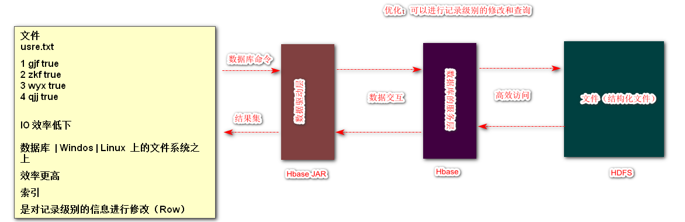
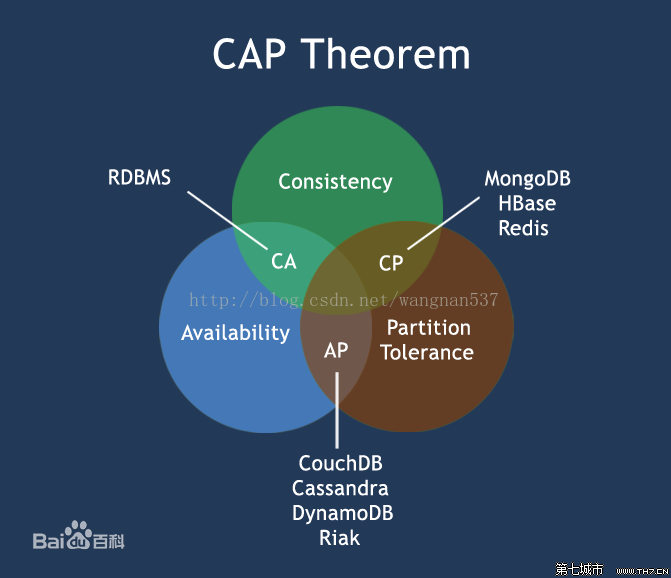
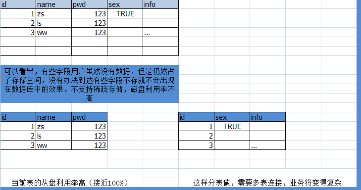
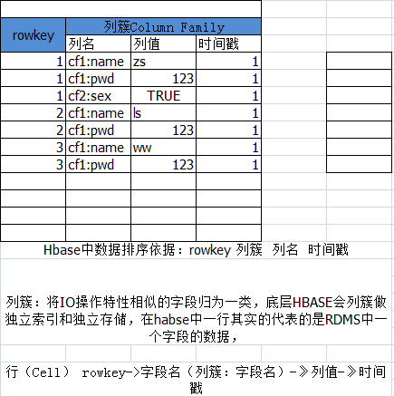
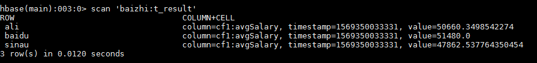
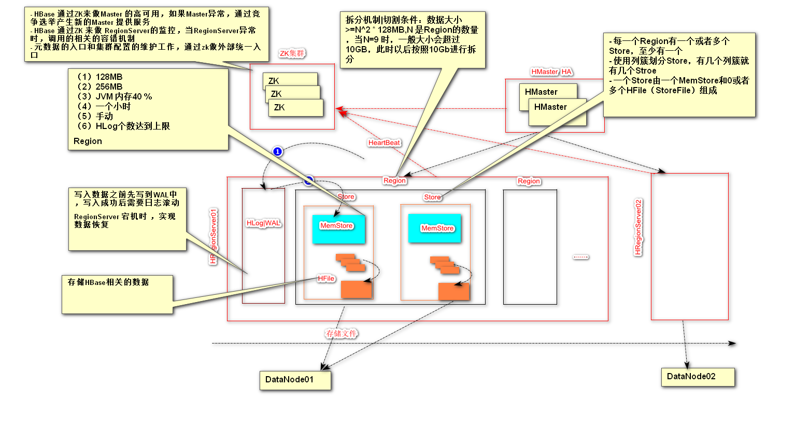
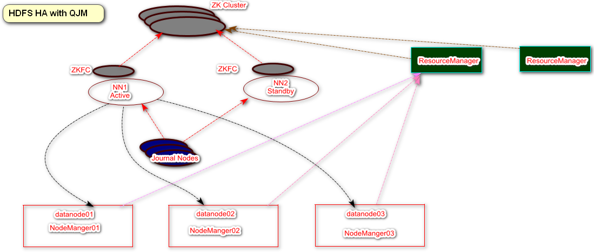
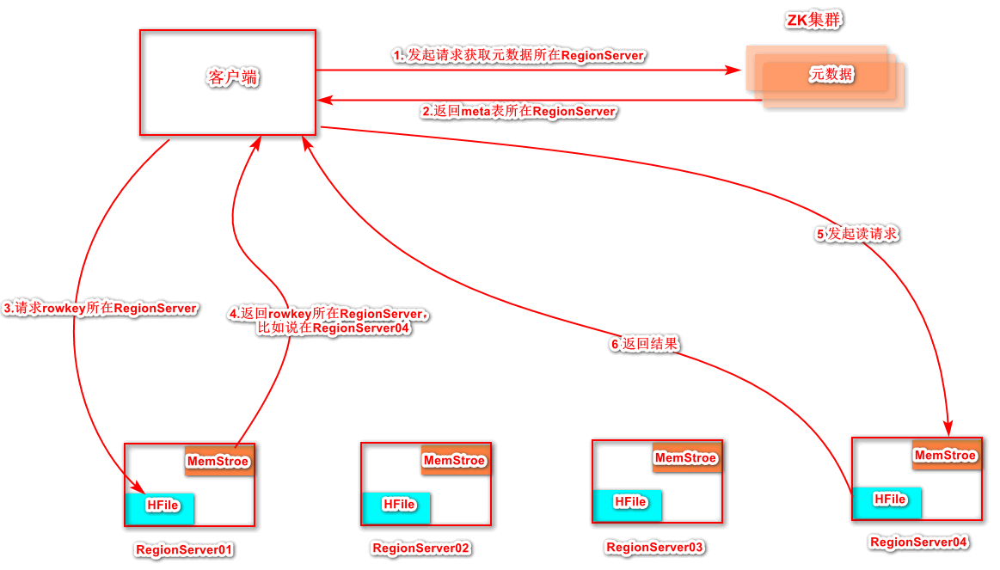
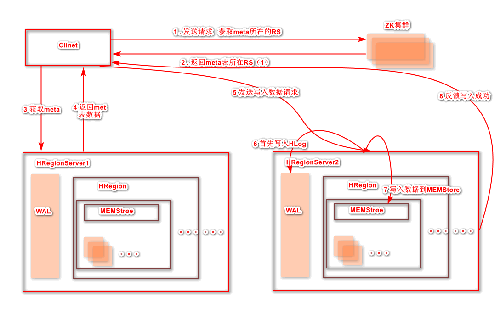

# 一、概述

Hbase全称为Hadoop Database（基于HDFS的数据库），设计来源Google 的bigtable，Hbase 仿照 bigtable设计基于HDFS上的一款数据库。

## 1.1 CAP原则

CAP原则又称之为CAP原理，指的是在分布式系统当中，一致性、可用性、分区容错性，三者不可兼得

HBase 是保证CP

## 1.2 什么是基于列式存储？

HBase 是基于列式存储的NoSql

这个概念和RDBMS作对比，传统的数据库对数据的操作单位是一行（若干字段）

~~~sql
select username ，pass from user where id = 1；
update  user set username ="gjf " where id =1; 
~~~

> 即使操纵的是某一行记录当中的字段，其实RDBMS是查询了整行的内容加载完后完成对数据的修改

### 行存储问题

## 列存储

## 1.3 HBase 

<https://hbase.apache.org/>

Hbase 是基于列式存储的分布式的、面向列、基于HDFS的数据库，在需要实时读写，需要访问超大规模数据时，可以使用HBASE。

### 1.3.1 特点：

+ 大 ： 一个表可以有上亿行，可有上百万列
+ 面向列：可以支持稀疏存储
+ 无模式：表的结构灵活，可以任意增加和减少字段
+ 数据多版本：每个cell中的数据可以用多个版本，在默认情况下，版本号自动分配，版本的个数可以自己设置
+ 数据类型单一：Hbase中的数据都是字符串，没有类型

### 1.3.2 名词解释

+ RowKey ：与NoSQL数据库一样，rowkey是用来检索记录的主键
+ 列簇：列的合计，列簇必须在使用前进行定义
+ 时间戳：主要为版本提供方便
+ Cell单元格：由{rowkey，列名，列簇，时间戳}

### 1.3.3 Hbase和关系型数据库的区别

+ 数据库类型：HBase中数据库类型都是字符串类型（String）
+ 数据操作：Hbase只有普通的增删查改等操作，没有表之间的关联查询
+ 存储模式：Hbase是基于列式存储的，而RDBMS是基于行式存储的
+ 应用场景：Hbase适合存储大容量数据，查询效率极高

# 二、Hbase 环境搭建-单机

## 2.1 环境

+ Hadoop
+ ZK

## 2.2 下载安装

~~~shell
[root@HadoopNode00 ~]# mkdir /home/hbase
[root@HadoopNode00 ~]# tar -zxvf hbase-1.2.4-bin.tar.gz -C /home/hbase/
[root@HadoopNode00 ~]# vi .bashrc
export HBASE_HOME=/home/hbase/hbase-1.2.4
export HBASE_MANAGES_ZK=false
export PATH=$PATH:$HBASE_HOME/bin

[root@HadoopNode00 ~]# vi /home/hbase/hbase-1.2.4/conf/hbase-site.xml

<property>
     <name>hbase.rootdir</name>
     <value>hdfs://HadoopNode00:9000/hbase</value>
</property>

<property>
	<name>hbase.zookeeper.quorum</name>
	<value>HadoopNode00</value>
</property>

<property>
	<name>hbase.zookeeper.property.clientPort</name>
	<value>2181</value>
</property>

<property>
        <name>hbase.cluster.distributed</name>
        <value>true</value>
</property>
[root@HadoopNode00 ~]# vi /home/hbase/hbase-1.2.4/conf/regionservers
HadoopNode00
~~~

## 2.3 启动

~~~shell
# 保证zk和hdfs启动成功
[root@HadoopNode00 zookeeper-3.4.6]# start-hbase.sh
starting master, logging to /home/hbase/hbase-1.2.4/logs/hbase-root-master-HadoopNode00.out
Java HotSpot(TM) 64-Bit Server VM warning: ignoring option PermSize=128m; support was removed in 8.0
Java HotSpot(TM) 64-Bit Server VM warning: ignoring option MaxPermSize=128m; support was removed in 8.0
HadoopNode00: starting regionserver, logging to /home/hbase/hbase-1.2.4/logs/hbase-root-regionserver-HadoopNode00.out
HadoopNode00: Java HotSpot(TM) 64-Bit Server VM warning: ignoring option PermSize=128m; support was removed in 8.0
HadoopNode00: Java HotSpot(TM) 64-Bit Server VM warning: ignoring option MaxPermSize=128m; support was removed in 8.0
[root@HadoopNode00 zookeeper-3.4.6]# jps
2257 QuorumPeerMain
2642 HRegionServer
1906 DataNode
1811 NameNode
2485 HMaster
2121 SecondaryNameNode
2938 Jps

~~~

> web界面 ：  <http://hadoopnode00:16010/master-status>

## 2.4 连接

~~~shell
[root@HadoopNode00 zookeeper-3.4.6]# hbase shell
~~~

# 三、Shell操作

## 3.1 常见命令

~~~
hbase(main):001:0> status
1 active master, 0 backup masters, 1 servers, 0 dead, 2.0000 average load

hbase(main):003:0> version
1.2.4, rUnknown, Wed Feb 15 18:58:00 CST 2017

hbase(main):004:0> whoami
root (auth:SIMPLE)
    groups: root
~~~

## 3.2 命名空间操作

> namespace 相当于MySQL中的数据库

~~~shell
# 创建一个普通的命名空间
hbase(main):006:0> create_namespace "baizhi"
0 row(s) in 0.0870 seconds

# 创建带属性的命名空间
hbase(main):007:0> create_namespace "shahe",{'subway'=>'shahezhan'}
0 row(s) in 0.0130 seconds

#删除命名空间
hbase(main):001:0> drop_namespace 'baizhi'
0 row(s) in 0.1440 seconds

# 描述命名空间
hbase(main):001:0> describe_namespace 'shahe'
DESCRIPTION
{NAME => 'shahe', subway => 'shahezhan'}
1 row(s) in 0.1300 seconds

# 修改命名空间
hbase(main):003:0> alter_namespace 'shahe',{METHOD => 'set', 'subway'=>'gonghuacheng'}
0 row(s) in 0.0240 seconds

hbase(main):004:0> describe_namespace 'shahe'
DESCRIPTION
{NAME => 'shahe', subway => 'gonghuacheng'}
1 row(s) in 0.0060 seconds

# 列出所有命名空间
hbase(main):005:0> list_namespace
NAMESPACE
default
hbase
shahe
3 row(s) in 0.0160 seconds

~~~

## 3.3 表操作（DDL 数据定义语言）

~~~shell
# 创建命名空间为baizhi
hbase(main):007:0> create_namespace 'baizhi'
0 row(s) in 0.0230 seconds

# 创建baizhi namespace的下的表叫做 t_user，有两个列簇叫做 cf1 cf2
hbase(main):008:0> create 'baizhi:t_user','cf1','cf2'
0 row(s) in 2.2930 seconds

=> Hbase::Table - baizhi:t_user

hbase(main):001:0> describe 'baizhi:t_user'
Table baizhi:t_user is ENABLED
baizhi:t_user
COLUMN FAMILIES DESCRIPTION
{NAME => 'cf1', BLOOMFILTER => 'ROW', VERSIONS => '1', IN_MEMORY => 'false', KEEP_DELETED_CELLS => 'FALSE', DATA_BL
CODING => 'NONE', TTL => 'FOREVER', COMPRESSION => 'NONE', MIN_VERSIONS => '0', BLOCKCACHE => 'true', BLOCKSIZE =>
', REPLICATION_SCOPE => '0'}
{NAME => 'cf2', BLOOMFILTER => 'ROW', VERSIONS => '1', IN_MEMORY => 'false', KEEP_DELETED_CELLS => 'FALSE', DATA_BL
CODING => 'NONE', TTL => 'FOREVER', COMPRESSION => 'NONE', MIN_VERSIONS => '0', BLOCKCACHE => 'true', BLOCKSIZE =>
', REPLICATION_SCOPE => '0'}
2 row(s) in 0.1930 seconds

# 直接删除无法删除，需要将其先disable掉
hbase(main):002:0> drop 'baizhi:t_user'

ERROR: Table baizhi:t_user is enabled. Disable it first.

Here is some help for this command:
Drop the named table. Table must first be disabled:
  hbase> drop 't1'
  hbase> drop 'ns1:t1'

# disable 表 （禁用表）
hbase(main):003:0> disable
disable                     disable_all                 disable_peer                disable_table_replication
hbase(main):003:0> disable 'baizhi:t_user'
0 row(s) in 2.2570 seconds

# 删除表
hbase(main):004:0> drop 'baizhi:t_user'
0 row(s) in 1.2370 seconds

hbase(main):001:0> create 'baizhi:t_user','cf1','cf2'
0 row(s) in 1.3470 seconds

=> Hbase::Table - baizhi:t_user

# 列出所有的表
hbase(main):002:0> list
TABLE
baizhi:t_user
1 row(s) in 0.0120 seconds

=> ["baizhi:t_user"]

# 列出某个命名空间下的表
hbase(main):003:0> list_namespace_tables 'baizhi'
TABLE
t_user
1 row(s) in 0.0130 seconds

~~~

## 3.4 数据操作（数据管理语言 DML）

### 3.4.1 put

~~~shell
# 最普通的插入语句的方式
hbase(main):005:0> put 'baizhi:t_user','1','cf1:name','zhangsan'
0 row(s) in 0.1010 seconds

# 将表对象复制给变量t
hbase(main):006:0> t = get_table 'baizhi:t_user'
0 row(s) in 0.0010 seconds

=> Hbase::Table - baizhi:t_user

# 使用复制对象t 对表进行操作
hbase(main):007:0> t.put '1','cf1:age',18
0 row(s) in 0.0110 seconds

# 覆盖操作和put插入相似 写入相同的条件  写入值就可覆盖
hbase(main):008:0> t.put '1','cf1:age',19
0 row(s) in 0.0070 seconds
# 扫描 当前的表
hbase(main):009:0> t.scan
ROW                           COLUMN+CELL
 1                            column=cf1:age, timestamp=1569278257582, value=19
 1                            column=cf1:name, timestamp=1569277976093, value=zhangsan
1 row(s) in 0.0180 seconds

~~~

### 3.4.2 get

~~~shell

# 获取baizhi：t_user 下的rowk为1 的所有的cell
hbase(main):013:0> get 'baizhi:t_user' ,'1'
COLUMN                        CELL
 cf1:age                      timestamp=1569278257582, value=19
 cf1:name                     timestamp=1569277976093, value=zhangsan
2 row(s) in 0.0120 seconds

hbase(main):014:0> t.get '1'
COLUMN                        CELL
 cf1:age                      timestamp=1569278257582, value=19
 cf1:name                     timestamp=1569277976093, value=zhangsan
2 row(s) in 0.0030 seconds
# 发现获取版本只有一个，是因为表目前不支持多版本
hbase(main):015:0> t.get '1',{COLUMN=>'cf1:name',VERSIONS=>3}

# 创建一个最多有三个版本的表
hbase(main):001:0> create 'baizhi:t_user',{NAME=>'cf1',VERSIONS=>3}
0 row(s) in 1.3510 seconds

=> Hbase::Table - baizhi:t_user

hbase(main):006:0> t.get '1',{COLUMN=>'cf1:name',VERSIONS=>3}
COLUMN                        CELL
 cf1:name                     timestamp=1569279103046, value=zs
 cf1:name                     timestamp=1569279081528, value=zhangsan
2 row(s) in 0.0090 seconds

~~~

### 3.4.3 delete /deleteall

~~~shell
hbase(main):009:0> t.delete '1','cf1:name'
0 row(s) in 0.0270 seconds
hbase(main):010:0> t.scan
ROW                           COLUMN+CELL
 1                            column=cf1:age, timestamp=1569279066158, value=18
1 row(s) in 0.0090 seconds

# 根据时间戳进行删除
hbase(main):012:0> t.get '1',{COLUMN=>'cf1:age',VERSIONS=>3}
COLUMN                        CELL
 cf1:age                      timestamp=1569279425168, value=19
 cf1:age                      timestamp=1569279066158, value=18
2 row(s) in 0.0080 seconds
hbase(main):013:0> t.delete '1','cf1:age',1569279066158
0 row(s) in 0.0060 seconds
hbase(main):014:0> t.get '1',{COLUMN=>'cf1:age',VERSIONS=>3}
COLUMN                        CELL
 cf1:age                      timestamp=1569279425168, value=19
1 row(s) in 0.0030 seconds

hbase(main):002:0> deleteall 'baizhi:t_user','1'
0 row(s) in 0.1600 seconds

hbase(main):003:0> scan 'baizhi:t_user'
ROW                           COLUMN+CELL
0 row(s) in 0.0120 seconds

~~~

### 3.4.4  scan

~~~shell
#  查询列簇为cf1 从第一行开始
hbase(main):019:0> scan 'baizhi:t_user',{COLUMNS=>['cf1'],STARTROW=>'1'}
ROW                           COLUMN+CELL
 1                            column=cf1:age, timestamp=1569279798830, value=20
 1                            column=cf1:name, timestamp=1569279748288, value=zhangsan
 2                            column=cf1:age, timestamp=1569279809118, value=22
 2                            column=cf1:name, timestamp=1569279779869, value=wangwubaizhi
2 row(s) in 0.0100 seconds

#  查询列簇为cf1 从第二行开始
hbase(main):020:0> scan 'baizhi:t_user',{COLUMNS=>['cf1'],STARTROW=>'2'}
ROW                           COLUMN+CELL
 2                            column=cf1:age, timestamp=1569279809118, value=22
 2                            column=cf1:name, timestamp=1569279779869, value=wangwubaizhi
1 row(s) in 0.0080 seconds

#  查询列簇为cf1 从第三行开始
hbase(main):021:0> scan 'baizhi:t_user',{COLUMNS=>['cf1'],STARTROW=>'3'}
ROW                           COLUMN+CELL
0 row(s) in 0.0040 seconds

#  查询列簇为cf1 从第一行开始 只显示一行
hbase(main):022:0> scan 'baizhi:t_user',{COLUMNS=>['cf1'],STARTROW=>'1',LIMIT=>1}
ROW                           COLUMN+CELL
 1                            column=cf1:age, timestamp=1569279798830, value=20
 1                            column=cf1:name, timestamp=1569279748288, value=zhangsan
1 row(s) in 0.0070 seconds
#  查询列簇为cf1 从第一行开始 只显示两行
hbase(main):023:0> scan 'baizhi:t_user',{COLUMNS=>['cf1'],STARTROW=>'1',LIMIT=>2}
ROW                           COLUMN+CELL
 1                            column=cf1:age, timestamp=1569279798830, value=20
 1                            column=cf1:name, timestamp=1569279748288, value=zhangsan
 2                            column=cf1:age, timestamp=1569279809118, value=22
 2                            column=cf1:name, timestamp=1569279779869, value=wangwubaizhi
2 row(s) in 0.0260 seconds

~~~

### 3.4.5 count 

~~~shell
hbase(main):025:0> count 'baizhi:t_user'
2 row(s) in 0.0130 seconds

=> 2

~~~

### 3.4.6 append

~~~shell
hbase(main):026:0> append 'baizhi:t_user','1','cf1:name','110'
0 row(s) in 0.0070 seconds

hbase(main):027:0> scan 'baizhi:t_user'
ROW                           COLUMN+CELL
 1                            column=cf1:age, timestamp=1569279798830, value=20
 1                            column=cf1:name, timestamp=1569280127798, value=zhangsan110
 2                            column=cf1:age, timestamp=1569279809118, value=22
 2                            column=cf1:name, timestamp=1569279779869, value=wangwubaizhi
2 row(s) in 0.0090 seconds

~~~

### 3.4.7 truncate

> 清空数据

~~~shell
hbase(main):028:0> truncate 'baizhi:t_user'
Truncating 'baizhi:t_user' table (it may take a while):
 - Disabling table...
 - Truncating table...
0 row(s) in 3.4400 seconds

hbase(main):001:0> scan 'baizhi:t_user'
ROW                           COLUMN+CELL
0 row(s) in 0.1550 seconds

~~~

# 四、Java API 

## 4.1 依赖

~~~xml
<!-- https://mvnrepository.com/artifact/org.apache.hbase/hbase-client -->
<dependency>
    <groupId>org.apache.hbase</groupId>
    <artifactId>hbase-client</artifactId>
    <version>1.2.4</version>
</dependency>

~~~

## 4.2 核心操作

> 获取客户端对象和连接对象

~~~java

    @Before
    public void getClient() throws Exception {
        configuration = new Configuration();

        configuration.set("hbase.zookeeper.quorum", "HadoopNode00");
        configuration.set("hbase.zookeeper.property.clientPort", "2181");
        conn = ConnectionFactory.createConnection(configuration);
        admin = conn.getAdmin();

    }
    

    @After
    public void close() throws Exception {
        admin.close();
        conn.close();

    }
~~~

## 4.3  namespace常规操作

~~~java
 @Test
    public void createNameSpace() throws Exception {
        NamespaceDescriptor namespaceDescriptor = NamespaceDescriptor.create("baizhi123").addConfiguration("admin", "gjf").build();
        admin.createNamespace(namespaceDescriptor);
    }

    @Test
    public void listNameSpace() throws Exception {

        NamespaceDescriptor[] listNamespaceDescriptors = admin.listNamespaceDescriptors();

        for (NamespaceDescriptor listNamespaceDescriptor : listNamespaceDescriptors) {
            System.out.println(listNamespaceDescriptor.getName());
        }

    }

    @Test
    public void modifyNameSpace() throws Exception {
        NamespaceDescriptor namespaceDescriptor = NamespaceDescriptor.create("baizhi123").addConfiguration("aa", "bb").removeConfiguration("admin").build();
        admin.modifyNamespace(namespaceDescriptor);

    }

    @Test
    public void deleteNameSpace() throws Exception{
        admin.deleteNamespace("baizhi123");

    }
~~~

## 4.4 表常规操作

> 参考 <http://hbase.apache.org/apidocs/org/apache/hadoop/hbase/>

~~~java
@Test
    public void createTables() throws Exception {

        /*
        创建表名的对象（封装表名字）
        * */
        TableName tableName = TableName.valueOf("baizhi:t_user1");

        /*
         * 封装  表 的相关信息
         * */

        HTableDescriptor hTableDescriptor = new HTableDescriptor(tableName);

        /*
         * 封装列簇的相关信息
         * */
        HColumnDescriptor cf1 = new HColumnDescriptor("cf1");
        cf1.setMaxVersions(3);

= 
        /*
         *
         * */
        HColumnDescriptor cf2 = new HColumnDescriptor("cf2");
        cf2.setMaxVersions(3);

        /*
         * 在hTableDescriptor 对象中添加列簇描述对象
         * */

        hTableDescriptor.addFamily(cf1);
        hTableDescriptor.addFamily(cf2);

        /*
         * 创建 table
         * */
        admin.createTable(hTableDescriptor);

    }

    @Test

    public void dropTable() throws Exception {

        TableName tableName = TableName.valueOf("baizhi:t_user1");
        admin.disableTable(tableName);
        admin.deleteTable(tableName);
    }

~~~

## 4.5  CURD 增删改查

### 4.5.1 put

插入单个记录

~~~java
@Test
    public void testPutOne() throws Exception {

        TableName tableName = TableName.valueOf("baizhi:t_user");
        /*
         * 通过conn对象获得table的操作对象
         * */
        Table table = conn.getTable(tableName);

        Put put1 = new Put("1".getBytes());
        put1.addColumn("cf1".getBytes(), "name".getBytes(), "zhangsan".getBytes());
        put1.addColumn("cf1".getBytes(), "age".getBytes(), "18".getBytes());
        put1.addColumn("cf1".getBytes(), "sex".getBytes(), "false".getBytes());

       
        table.put(put1);
        table.close();

    }
~~~

插入多个记录

~~~java
 @Test
    public void testPutList() throws Exception {

        TableName tableName = TableName.valueOf("baizhi:t_user");
        BufferedMutator bufferedMutator = conn.getBufferedMutator(tableName);

        Put put1 = new Put("4".getBytes());
        put1.addColumn("cf1".getBytes(), "name".getBytes(), "zhangsan".getBytes());
        put1.addColumn("cf1".getBytes(), "age".getBytes(), "18".getBytes());
        put1.addColumn("cf1".getBytes(), "sex".getBytes(), "false".getBytes());

        Put put2 = new Put("5".getBytes());
        put2.addColumn("cf1".getBytes(), "name".getBytes(), "zhangsan".getBytes());
        put2.addColumn("cf1".getBytes(), "age".getBytes(), "18".getBytes());
        put2.addColumn("cf1".getBytes(), "sex".getBytes(), "false".getBytes());

        Put put3 = new Put("6".getBytes());
        put3.addColumn("cf1".getBytes(), "name".getBytes(), "zhangsan".getBytes());
        put3.addColumn("cf1".getBytes(), "age".getBytes(), "18".getBytes());
        put3.addColumn("cf1".getBytes(), "sex".getBytes(), "false".getBytes());

        ArrayList<Put> puts = new ArrayList<Put>();
        puts.add(put1);
        puts.add(put2);
        puts.add(put3);

        bufferedMutator.mutate(puts);

        bufferedMutator.close();

    }

~~~

### 4.5.2 delete

单个删除

~~~java

    @Test
    public void tetsDelete() throws Exception {

        TableName tableName = TableName.valueOf("baizhi:t_user");
        Table table = conn.getTable(tableName);
        Delete delete = new Delete("6".getBytes());

        table.delete(delete);
        table.close();

    }

~~~

批量删除

~~~java

    @Test
    public void testDeleteList() throws Exception{

        TableName tableName = TableName.valueOf("baizhi:t_user");
        BufferedMutator bufferedMutator = conn.getBufferedMutator(tableName);

        Delete delete1 = new Delete("1".getBytes());
        Delete delete2 = new Delete("2".getBytes());
        Delete delete3 = new Delete("3".getBytes());

        ArrayList<Delete> deletes = new ArrayList<Delete>();

        deletes.add(delete1);
        deletes.add(delete2);
        deletes.add(delete3);

        bufferedMutator.mutate(deletes);

        bufferedMutator.close();

    }
~~~

### 4.5.3 get

~~~java

    @Test

    public void testGet() throws Exception {

        TableName tableName = TableName.valueOf("baizhi:t_user");
        Table table = conn.getTable(tableName);

        Get get = new Get("4".getBytes());

        Result result = table.get(get);

        byte[] name = result.getValue("cf1".getBytes(), "name".getBytes());
        byte[] age = result.getValue("cf1".getBytes(), "age".getBytes());
        byte[] sex = result.getValue("cf1".getBytes(), "sex".getBytes());

        System.out.println(new String(name) + "-" + new String(age) + "-" + new String(sex));

    }

    @Test
    public void testGet02() throws Exception {
        /*
        *
        * hbase(main):012:0>  t.get '4',{COLUMN=>'cf1:name',VERSIONS=>3}
            COLUMN                        CELL
            cf1:name                     timestamp=1569284691440, value=zs
            cf1:name                     timestamp=1569283965094, value=zhangsan

        * */

        TableName tableName = TableName.valueOf("baizhi:t_user");
        Table table = conn.getTable(tableName);

        Get get = new Get("4".getBytes());
        get.setMaxVersions(2);

        get.addColumn("cf1".getBytes(), "name".getBytes());

        Result result = table.get(get);

        List<Cell> cellList = result.getColumnCells("cf1".getBytes(), "name".getBytes());

        for (Cell cell : cellList) {
            /*
             * rowkey 列名  列值  时间戳
             * */

            byte[] rowkey = CellUtil.cloneRow(cell);
            byte[] cf = CellUtil.cloneFamily(cell);
            byte[] qualifier = CellUtil.cloneQualifier(cell);
            byte[] value = CellUtil.cloneValue(cell);
            long timestamp = cell.getTimestamp();

            System.out.println(new String(rowkey) + "--" + new String(cf) + "--" + new String(qualifier) + "--" + new String(value) +"--" +timestamp);

        }

~~~

### 4.5.4 scan

~~~java
 @Test
    public void testScan() throws Exception {

        TableName tableName = TableName.valueOf("baizhi:t_user");
        Table table = conn.getTable(tableName);

        Scan scan = new Scan();

        PrefixFilter prefixFilter1 = new PrefixFilter("4".getBytes());
        PrefixFilter prefixFilter2 = new PrefixFilter("5".getBytes());

        FilterList list = new FilterList(FilterList.Operator.MUST_PASS_ONE,prefixFilter1, prefixFilter2);
        scan.setFilter(list);

        ResultScanner results = table.getScanner(scan);

        for (Result result : results) {

            byte[] row = result.getRow();
            byte[] name = result.getValue("cf1".getBytes(), "name".getBytes());
            byte[] age = result.getValue("cf1".getBytes(), "age".getBytes());
            byte[] sex = result.getValue("cf1".getBytes(), "sex".getBytes());

            System.out.println(new String(row) + "--" + new String(name) + "-" + new String(age) + "-" + new String(sex));
        }

    }

~~~

# 五、MapReduce on Hbase

## 5.1  依赖

~~~xml
<dependency>
    <groupId>org.apache.hadoop</groupId>
    <artifactId>hadoop-hdfs</artifactId>
    <version>2.6.0</version>
</dependency>
<dependency>
    <groupId>org.apache.hadoop</groupId>
    <artifactId>hadoop-common</artifactId>
    <version>2.6.0</version>
</dependency>

<dependency>
    <groupId>org.apache.hadoop</groupId>
    <artifactId>hadoop-mapreduce-client-core</artifactId>
    <version>2.6.0</version>
</dependency>
<dependency>
    <groupId>org.apache.hadoop</groupId>
    <artifactId>hadoop-mapreduce-client-jobclient</artifactId>
    <version>2.6.0</version>
</dependency>

<dependency>
    <groupId>org.apache.hbase</groupId>
    <artifactId>hbase-client</artifactId>
    <version>1.2.4</version>
</dependency>
<dependency>
    <groupId>org.apache.hbase</groupId>
    <artifactId>hbase-server</artifactId>
    <version>1.2.4</version>
</dependency>

~~~

## 5.2 模拟问题

~~~
HBase中有相关的数据 
书写MR 程序
运行

baidu sina ali
rowkey  salary  name age 
~~~

~~~java
package com.baizhi.mr;

import org.apache.hadoop.conf.Configuration;
import org.apache.hadoop.hbase.client.Scan;
import org.apache.hadoop.hbase.mapreduce.TableInputFormat;
import org.apache.hadoop.hbase.mapreduce.TableMapReduceUtil;
import org.apache.hadoop.hbase.mapreduce.TableOutputFormat;
import org.apache.hadoop.io.DoubleWritable;
import org.apache.hadoop.io.Text;
import org.apache.hadoop.mapreduce.Job;
import org.apache.hadoop.mapreduce.MRJobConfig;

import javax.swing.*;

public class JobRunner {
    public static void main(String[] args) throws Exception {
        System.setProperty("HADOOP_USER_NAME", "root");

        Configuration configuration = new Configuration();

        configuration.set("hbase.zookeeper.quorum", "HadoopNode00");
        configuration.set("hbase.zookeeper.property.clientPort", "2181");

        configuration.addResource("conf2/core-site.xml");
        configuration.addResource("conf2/hdfs-site.xml");
        configuration.addResource("conf2/mapred-site.xml");
        configuration.addResource("conf2/yarn-site.xml");
        configuration.set(MRJobConfig.JAR, "G:\\IDEA_WorkSpace\\BigData\\HBase_Test\\target\\HBase_Test-1.0-SNAPSHOT.jar");
        configuration.set("mapreduce.app-submission.cross-platform", "true");

        Job job = Job.getInstance(configuration);
        job.setJarByClass(JobRunner.class);

        /*
         *
         * */
        job.setInputFormatClass(TableInputFormat.class);
        job.setOutputFormatClass(TableOutputFormat.class);

        /*
         *
         * 设置mapper 相关
         * */
        TableMapReduceUtil.initTableMapperJob(
                "baizhi:t_user1",
                new Scan(),
                UserMapper.class,
                Text.class,
                DoubleWritable.class,
                job
        );

        TableMapReduceUtil.initTableReducerJob(
                "baizhi:t_result",
                UserReducer.class,
                job);

        job.waitForCompletion(true);
    }
}

~~~

~~~java
package com.baizhi.mr;

import org.apache.hadoop.hbase.client.Result;
import org.apache.hadoop.hbase.io.ImmutableBytesWritable;
import org.apache.hadoop.hbase.mapreduce.TableMapper;
import org.apache.hadoop.hbase.util.Bytes;
import org.apache.hadoop.io.DoubleWritable;
import org.apache.hadoop.io.Text;

import java.io.IOException;

public class UserMapper extends TableMapper<Text, DoubleWritable> {
    @Override
    protected void map(ImmutableBytesWritable key, Result value, Context context) throws IOException, InterruptedException {

        byte[] bytes = key.get();
        String rowkey = Bytes.toString(bytes);

        String company = rowkey.split(":")[0];

        byte[] salaryByte = value.getValue("cf1".getBytes(), "salary".getBytes());

        double salary = Bytes.toDouble(salaryByte);

        context.write(new Text(company), new DoubleWritable(salary));

    }
}

~~~

~~~java
package com.baizhi.mr;

import org.apache.hadoop.hbase.client.Put;
import org.apache.hadoop.hbase.mapreduce.TableReducer;
import org.apache.hadoop.io.DoubleWritable;
import org.apache.hadoop.io.NullWritable;
import org.apache.hadoop.io.Text;

import java.io.IOException;

public class UserReducer extends TableReducer<Text, DoubleWritable, NullWritable> {

    @Override
    protected void reduce(Text key, Iterable<DoubleWritable> values, Context context) throws IOException, InterruptedException {
        double totalSalary = 0.0;

        int count = 0;

        for (DoubleWritable value : values) {
            totalSalary += value.get();
            count++;

        }

        Put put = new Put(key.getBytes());

        put.addColumn("cf1".getBytes(), "avgSalary".getBytes(), (totalSalary / count + "").getBytes());

        context.write(NullWritable.get(), put);

    }
}

~~~

## 5.3 最终结果

# 六、HBase 架构 （重点）

## 6.1 名词解释

### （1）ZooKeeper

+ HBase 通过ZK来做Master 的高可用，如果Master异常，通过竞争选举产生新的Master 提供服务
+ HBase 通过ZK 来做 RegionServer的监控，当RegionServer异常时，调用的相关的容错机制
+ 元数据的入口和集群配置的维护工作，通过zk做外部统一入口

### （2）HMaster

+ 为RegionServer分配Region
+ 维护整个集群的负载均衡
+ 维护集群的元数据信息
+ 发现失效的Region，将失效的Region分配给正常的RegionServer
+ 当RegionServer失效时，协调对应的HLog拆分

### （3）HRegionServer

+ HRegionServer直接对接用户的读写请求
+ 管理Master 为其分配的Region
+ 处理来自客户端的请求，负责与HDFS 做交互，存储到HDFS 
+ 负责对Region（变大）的拆分

#### 	1）Region

+ Regions代表着一个表所有的数据
+ Region往往会做拆分，因为一个Region是无法存储Hbase 表中所有的数据
  + 拆分机制|切割条件：数据大小>=N^2 * 128MB,N 是Region的数量，当N=9 时，一般大小会超过10GB，此时以后按照10Gb进行拆分
+ Region 由Store组成
+ Region会分配到集群中称之为"RegionServer"的节点

#### 	2）Store

+ 每一个Region有一个或者多个Store，至少有一个
+ 使用列簇划分Store，有几个列簇就有几个Stroe
+ 一个Store由一个MemStore和0或者多个HFile（StoreFile）组成

#### 3）MemStore

+ 写缓存，数据先写到MemStore中，在Flush到磁盘中
+ 以key value形式存储到磁盘中
+ MemStore flush 触发机制
  + MemStore级别限制：当Region中任意一个MemStore大小达到上限（hbase.region.master.flush.size 默认128MB）
  + Region级别限制：当Region中给所有的MemStore的大小总和达到了256MB（hbase.hregion.memstore.block.multiplier * hbase.hregion.memstore.flush.size，默认 2* 128M = 256M）
  + RegionServer 级别：当一个RegionServer中所有的MemStore大小总和上限到了（hbase.regionserver.global.memstore.upperLimit ＊ hbase_heapsize，默认 40%的JVM内存使用量）
  + 当一个RegionServer中HLog数量达到上限（可通过参数hbase.regionserver.maxlogs配置），系统会选取最早的一个 HLog对应的一个或多个Region进行flush
  + Hbase 定时刷新：默认一个小时，确保数据不会长时间停留在内存中
  + 手动Flush：用户可以通过shell命令 flush ‘tablename’或者flush ‘region name’分别对一个表或者一个Region进行flush。

#### 4）HLog|WAL

+ 一个文件

+ 0.94之前叫做HLog，0.94 之后叫做WAL

+ 记录RegionServer上所有的编辑信息（Put、Deletes操作属于那个Region），在数据写入MemStore之前

+ 默认为一个WAL 日志，操作为串行操作，可能造成性能瓶颈，可以配置多个WAL 实例，进行并行写入(但是并行化是通过对多个Region进行分区实现的，如果只有一个Region那么该方案无效)

  + ~~~xml
    hbase-site.xml
    
    <property>   
      <name>hbase.wal.provider</name>   
      <value>multiwal</value> 
    </property>
    ~~~

+ RegionServer 宕机时 ，实现数据恢复

#### 5）HFile| StoreFile

HFile（ StoreFile）用于存储HBase 的数据，在HBase中数据是按照Rowkey|ColumnFamily|Column 排序。对与相同的Cell按照时间戳进行排序

### （4）HDFS

HDFS 为HBase 存储提供服务，理论上Hbase 是可以无限扩容的，不用担心容量和容灾的问题，只需要保证其自身的高可用即可，不用去考虑存储系统的相关的问题

## 6.2 HBase 架构图

# 七、集群搭建

| HadoopNode01  | HadoopNode02  | HadoopNode03  |
| ------------- | ------------- | ------------- |
| nn1           | nn2           |               |
| journal node  | journal node  | journal node  |
| zkfc          | zkfc          |               |
| datanode      | datanode      | datanode      |
| zk01          | zk02          | zk03          |
|               | rm1           | rm2           |
| nodemanager   | nodemanager   | nodemanager   |
| hregionserver | hregionserver | hregionserver |
| hmaster       | hmaster       | hmaster       |

+ 必须安装Hadoop环境，并且配置`HADOOP_HOME`环境变量,因为HBase 会自动读取HDFS
+ 安装ZK集群（伪集群|单节点），保证其正常启动
+ 安装Hbase

~~~shell
# 首先在三台zk节点中保证ZK成功启动

[root@ZK01 ~]# /home/zk/zookeeper-3.4.6/bin/zkServer.sh start /home/zk/zookeeper-3.4.6/conf/zk.conf
JMX enabled by default
Using config: /home/zk/zookeeper-3.4.6/conf/zk.conf
Starting zookeeper ... STARTED
[root@ZK01 ~]# /home/zk/zookeeper-3.4.6/bin/zkServer.sh status /home/zk/zookeeper-3.4.6/conf/zk.conf
JMX enabled by default
Using config: /home/zk/zookeeper-3.4.6/conf/zk.conf
Mode: follower

# 配置安装Hbase 
[root@HadoopNodeX ~]# mkdir /home/hbase
[root@HadoopNodeX ~]# tar -zxvf hbase-1.2.4-bin.tar.gz -C /home/hbase/

# 配置环境变量

[root@HadoopNodeX ~]# vi .bashrc
export HBASE_HOME=/home/hbase/hbase-1.2.4
export HBASE_MANAGES_ZK=false
export PATH=$PATH:$HBASE_HOME/bin
# 环境变量生效
[root@HadoopNodeX ~]# source .bashrc

[root@HadoopNodeX ~]# vi /home/hbase/hbase-1.2.4/conf/hbase-site.xml

<property>
     <name>hbase.rootdir</name>
     <value>hdfs://mycluster/hbase</value>
</property>

<property>
	<name>hbase.zookeeper.quorum</name>
	<value>ZK01,ZK02,ZK03</value>
</property>

<property>
	<name>hbase.zookeeper.property.clientPort</name>
	<value>2181</value>
</property>

<property>
        <name>hbase.cluster.distributed</name>
        <value>true</value>
</property>
[root@HadoopNodeX ~]# vi /home/hbase/hbase-1.2.4/conf/regionservers
HadoopNode01
HadoopNode02
HadoopNode03

[root@HadoopNodeX ~]# hbase-daemon.sh start master
[root@HadoopNodeX ~]# hbase-daemon.sh start regionserver
~~~

# 八 、HBase 读写流程

## 8.1 读流程

~~~
HBase读数据流程
1 Client先访问zookeeper，从meta表读取region的位置，然后读取meta表中的数据。meta中又存储了用户表的region信息。
2 根据namespace、表名和rowkey在meta表中找到对应的region信息
3 找到这个region对应的regionserver
4 查找对应的region
5 先从MemStore找数据，如果没有，再到StoreFile上读(为了读取的效率)
~~~

## 8.2 写流程

~~~
（1）Client向HRedgionServer  发送请求
（2）HRegionServer将数据写到HLog（write ahead log）。为了数据的持久化和恢复；
（3）HRegionServer将数据写到内存（MEMStroe）
（4）反馈Client 写成功。
~~~

~~~
HBase写数据流程
1 Client首先访问zookeeper，从meta表获取相应region信息，然后找到meta表的数据
2 根据namespace、表名和rowkey根据meta表的数据找到写入数据对应的region信息
3 找到对应的regionserver
4 把数据分别写到HLog和MemStore上一份
4 MemStore达到一个阈值后则把数据刷成一个StoreFile文件。（若MemStore中的数据有丢失，则可以从HLog上恢复）
5 当多个StoreFile文件达到一定的大小后，会触发Compact合并操作，合并为一个StoreFile，（这里同时进行版本的合并和数据删除。）
6 当Storefile大小超过一定阈值后，会把当前的Region分割为两个（Split），并由Hmaster分配到相应的HRegionServer，实现负载均衡
~~~

