Apache Hive

# 一、概述

由Facebook开源用于解决海量结构化日志的数据统计工具。


Hive是建立在 Hadoop 上的数据仓库基础构架。它提供了一系列的工具，可以用来进行数据提取转化加载（ETL），这是一种可以存储、查询和分析存储在 Hadoop 中的大规模数据的机制。 Hive 查询操作过程严格遵守Hadoop MapReduce 的作业执行模型，Hive 将用户的HiveQL 语句通过解释器转换为提交到Hadoop 集群上，Hadoop 监控作业执行过程，然后返回作业执行结果给用户。 Hive 并非为联机事务处理而设计，Hive 并不提供实时的查询和基于行级的数据更新操作。Hive 的最佳使用场合是大数据集的批处理作业，例如，网络日志分析。 

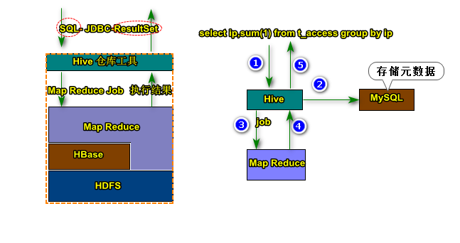


Hive是基于Hadoop的一个数据仓库工具，可以将结构化的数据文件映射为一张数据库表，并提供完整的SQL查询功能，可以将SQL语句转换为MapReduce任务进行运行。其优点是学习成本低，可以通过类SQL语句快速实现简单的MapReduce统计，不必开发专门的MapReduce应用，十分适合数据仓库的统计分析。同时，Hive也是建立在Hadoop上的数据仓库基础构架。它提供了一系列的工具，可以用来进行数据提取转化加载（ETL），并且提供了存储、查询和分析Hadoop中的大规模数据的机制。Hive定义了简单的类SQL查询语言，称为HQL，它允许熟悉SQL的用户查询数据。这个语言也允许熟悉MapReduce的开发者的设计自定义的Mapper和Reducer来处理内建的Mapper和Reducer无法完成的复杂的分析工作。

Hive的命令行接口和关系数据库的命令行接口类似，但是Hive和关系数据库还是有很大的不同，主要体现在以下几点：

1. Hive和关系数据库存储文件的系统不同，Hive使用的是Hadoop的HDFS，关系数据库则是服务器本地的文件系统。

2. Hive使用的计算模型是MapReduce，而关系数据库则是自己设计的计算模型。

3. 关系数据库都是为实时查询的业务进行设计的，而Hive则是为海量数据做数据挖掘设计的，实时性很差，实时性的区别导致Hive的应用场景和关系数据库有很大的不同。

4. Hive很容易扩展自己的存储能力和计算能力，这个是继承Hadoop的特性，而关系数据库在这个方面要比Hive差很多。

# 二 、Hive 安装

## 2.1  依赖环境

- HDFS和MapReduce就绪
- 需要安装MySQL数据库服务

```shell
[root@CentOS ~]# yum install -y mysql-server
[root@CentOS ~]# service mysqld start
[root@CentOS ~]# mysqladmin -u root password 'root'
[root@CentOS ~]# mysql -u root -proot

mysql> use mysql
Reading table information for completion of table and column names
You can turn off this feature to get a quicker startup with -A

Database changed
mysql> delete from user where password='';
Query OK, 4 rows affected (0.00 sec)

mysql> grant all privileges on *.* to 'root'@'%' identified by 'root' with grant option;
Query OK, 0 rows affected (0.00 sec)

mysql> flush privileges;
Query OK, 0 rows affected (0.00 sec)

mysql> create database hive;
Query OK, 1 row affected (0.00 sec)

```

## 2.2 安装配置Hive

```xml
[root@CentOS ~]# tar -zxf apache-hive-1.2.1-bin.tar.gz -C /home/hive
[root@CentOS ~]# vi /home/hive/apache-hive-1.2.1-bin/conf/hive-site.xml
<?xml-stylesheet type="text/xsl" href="configuration.xsl"?>
<configuration>
        <property>
                <name>javax.jdo.option.ConnectionURL</name>
                <value>jdbc:mysql://192.168.134.1:3306/hive</value>
        </property>
        <property>
                <name>javax.jdo.option.ConnectionDriverName</name>
                <value>com.mysql.jdbc.Driver</value>
        </property>
        <property>
                <name>javax.jdo.option.ConnectionUserName</name>
                <value>root</value>
        </property>
         <property>
                <name>javax.jdo.option.ConnectionPassword</name>
                <value>root</value>
         </property>
</configuration>
```

## 2.3 拷贝相关依赖

- 将连接MySQL驱动jar包拷贝到hive安装目录下的lib目录.

- 拷贝hive安装lib目录下jline-2.12.jar到hadoop的share/hadoop/yarn/lib目录下,将低版本jline-0.9.94.jar删除


## 2.4 配置环境变量

```properties
export HBASE_MANAGES_ZK=false
export HBASE_HOME=/usr/hbase-1.2.4
export HADOOP_HOME=/usr/hadoop-2.6.0
export HADOOP_CLASSPATH=/root/mysql-connector-java-5.1.44.jar
export JAVA_HOME=/usr/java/latest
export PATH=$PATH:$JAVA_HOME/bin:$HADOOP_HOME/bin:$HADOOP_HOME/sbin:$HBASE_HOME/bin
export CLASSPATH=.
```


## 2.5 启动hive

### 2.5.1 单机

```shell
[root@CentOS apache-hive-1.2.1-bin]# ./bin/hive
>select  current_database();
> show databases;
> show tables;
[root@CentOS apache-hive-1.2.1-bin]# ./bin/hive -e 'select * from t_user'
```

### 2.5.2 服务启动-JDBC

```shell
[root@CentOS apache-hive-1.2.1-bin]# ./bin/hiveserver2 #启动hive服务,挂起
[root@CentOS apache-hive-1.2.1-bin]# ./bin/beeline -u jdbc:hive2://$HOSTNAME:10000 -n root
Connecting to jdbc:hive2://CentOS:10000
Connected to: Apache Hive (version 1.2.1)
Driver: Hive JDBC (version 1.2.1)
Transaction isolation: TRANSACTION_REPEATABLE_READ
Beeline version 1.2.1 by Apache Hive
0: jdbc:hive2://CentOS:10000> show databases;
+----------------+--+
| database_name  |
+----------------+--+
| default        |
+----------------+--+
0: jdbc:hive2://CentOS:10000> select current_database();
+----------+--+
|   _c0    |
+----------+--+
| default  |
+----------+--+
0: jdbc:hive2://CentOS:10000> desc t_user;
+-----------+--------------+----------+--+
| col_name  |  data_type   | comment  |
+-----------+--------------+----------+--+
| id        | int          |          |
| name      | varchar(32)  |          |
+-----------+--------------+----------+--+
```

# 四、Hive表操作

## 4.1 Hive数据类型


 数据类型

```sql
数据类型（primitive，array，map，struct）
①primitive(原始类型)：
  整数：TINYINT、SMALLINT、INT、BIGINT
  布尔：BOOLEAN
  小数：FLOAT、DOUBLE
  字符：STRING、CHAR、VARCHAR
  二进制：BINARY
 时间类型：TIMESTAMP、DATE
②array（数组类型）：ARRAY < data_type >
③map（key-value类型）：MAP < primitive_type, data_type >
④struct（结构体类型）：STRUCT <col_name:data_type, ...>
```

## 4.2 创建表

```sql
create table t_user(
  id int,
  name string,
  sex boolean,
  birthDay date,
  salary double,
  hobbies array<string>,
  card map<string,string>,
  address struct<country:string,city:string> 
)
0: jdbc:hive2://CentOS:10000> desc formatted t_user;
```

## 4.3 默认分割符

| 分隔符     | 描述                                                         |
| ---------- | ------------------------------------------------------------ |
| \n         | 对于文本来说，每一行都是一条记录。因此\n可以分割记录。       |
| ^A(Ctrl+a) | 用于分割字段（列），在create table中可以使用\001表示。       |
| ^B(Ctrl+b) | 用于分割array或者是struct中 的元素或者用于map结构中的k-v对的分隔符，在create table中可以使用\002表示。 |
| ^C(Ctrl+c) | 用于Map中k-v的分隔符，在create table中可以使用\003表示。     |

- 准备数据

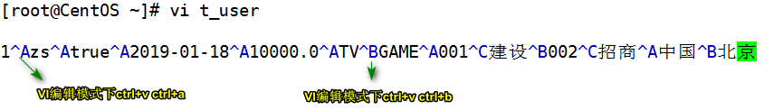

## 4.4  将数据导入到表中

```bash
//不常用
[root@centos ~]# hdfs dfs -put t_user /user/hive/warehouse/baizhi.db/t_user
0: jdbc:hive2://CentOS:10000> select id,name,salary,address.city,card['002'] bank  from t_user; 
+-----+-------+----------+-------+-------+--+
| id  | name  |  salary  | city  | bank  |
+-----+-------+----------+-------+-------+--+
| 1   | zs    | 10000.0  | 北京    | 招商    |
+-----+-------+----------+-------+-------+--+
0: jdbc:hive2://CentOS:10000> dfs -ls /;
+-------------------------------------------------------------------+--+
|                            DFS Output                             |
+-------------------------------------------------------------------+--+
| Found 2 items                                                     |
| drwx-wx-wx   - root supergroup          0 2019-01-18 18:59 /tmp   |
| drwxr-xr-x   - root supergroup          0 2019-01-18 22:19 /user  |
+-------------------------------------------------------------------+--+
//使用hive加载数据
0: jdbc:hive2://CentOS:10000> load data local inpath '/root/t_user_c' overwrite into table t_user_c;
```

> 'local'表示本地加载信息，‘overwrite’：表示数据覆盖。

## 4.5 JDBC访问Hive实现数据查询

```xml
<dependency>
    <groupId>org.apache.hadoop</groupId>
    <artifactId>hadoop-common</artifactId>
    <version>2.6.0</version>
</dependency>

<dependency>
    <groupId>org.apache.hive</groupId>
    <artifactId>hive-jdbc</artifactId>
    <version>1.2.1</version>
</dependency>
```

````java
package com.baizhi;

import org.junit.Test;

import java.sql.Connection;
import java.sql.DriverManager;
import java.sql.ResultSet;
import java.sql.Statement;


public class App {

    @Test
    public void testJdbs() throws Exception {


        //加载驱动
        Class.forName("org.apache.hive.jdbc.HiveDriver");
        //获取连接
        Connection conn = DriverManager.getConnection("jdbc:hive2://HadoopNode00:10000/baizhi"
                , "root",
                null);
        //创建stm
        Statement statement = conn.createStatement();
        //获取结果集
        ResultSet resultSet = statement.executeQuery("select sex, avg(salary) avgSalarry from t_user group by sex");

        //处理结果集合
        while (resultSet.next()) {
            boolean sex = resultSet.getBoolean("sex");
            double avgSalarry = resultSet.getDouble("avgSalarry");
            System.out.println("sex:" + sex + " ,avgSalary:" + avgSalarry);
        }
		//关闭结果集和stm、conn
        resultSet.close();
        statement.close();
        conn.close();
    }
}

````

## 4.6 自定义分隔符

```sql
1,zhangsan,true,18,15000,TV|Game,001>建设|002>招商,china|bj
2,lisi,true,28,15000,TV|Game,001>建设|002>招商,china|bj
3,wangwu,false,38,5000,TV|Game,001>建设|002>招商,china|sh
------
create table t_user_c(
  id int,
  name string,
  sex boolean,
  age int,
  salary double,
  hobbies array<string>,
  card map<string,string>,
  address struct<country:string,city:string> 
)
row format delimited 
fields terminated by ','
collection items terminated by '|'
map keys terminated by '>'
lines terminated by '\n';

```

## 4.7 正则提取

快速查询手册

| 元字符       | 描述                                                         |
| ------------ | ------------------------------------------------------------ |
| \            | 将下一个字符标记符、或一个向后引用、或一个八进制转义符。例如，“\\n”匹配\n。“\n”匹配换行符。序列“\\”匹配“\”而“\(”则匹配“(”。即相当于多种编程语言中都有的“转义字符”的概念。 |
| ^            | 匹配输入字行首。如果设置了RegExp对象的Multiline属性，^也匹配“\n”或“\r”之后的位置。 |
| $            | 匹配输入行尾。如果设置了RegExp对象的Multiline属性，$也匹配“\n”或“\r”之前的位置。 |
| *            | 匹配前面的子表达式任意次。例如，zo*能匹配“z”，也能匹配“zo”以及“zoo”。*等价于{0,}。 |
| +            | 匹配前面的子表达式一次或多次(大于等于1次）。例如，“zo+”能匹配“zo”以及“zoo”，但不能匹配“z”。+等价于{1,}。 |
| ?            | 匹配前面的子表达式零次或一次。例如，“do(es)?”可以匹配“do”或“does”。?等价于{0,1}。 |
| {*n*}        | *n*是一个非负整数。匹配确定的*n*次。例如，“o{2}”不能匹配“Bob”中的“o”，但是能匹配“food”中的两个o。 |
| {*n*,}       | *n*是一个非负整数。至少匹配*n*次。例如，“o{2,}”不能匹配“Bob”中的“o”，但能匹配“foooood”中的所有o。“o{1,}”等价于“o+”。“o{0,}”则等价于“o*”。 |
| {*n*,*m*}    | *m*和*n*均为非负整数，其中*n*<=*m*。最少匹配*n*次且最多匹配*m*次。例如，“o{1,3}”将匹配“fooooood”中的前三个o为一组，后三个o为一组。“o{0,1}”等价于“o?”。请注意在逗号和两个数之间不能有空格。 |
| ?            | 当该字符紧跟在任何一个其他限制符（*,+,?，{*n*}，{*n*,}，{*n*,*m*}）后面时，匹配模式是非贪婪的。非贪婪模式尽可能少地匹配所搜索的字符串，而默认的贪婪模式则尽可能多地匹配所搜索的字符串。例如，对于字符串“oooo”，“o+”将尽可能多地匹配“o”，得到结果[“oooo”]，而“o+?”将尽可能少地匹配“o”，得到结果 ['o', 'o', 'o', 'o'] |
| .            | 匹配除“\n”和"\r"之外的任何单个字符。要匹配包括“\n”和"\r"在内的任何字符，请使用像“[\s\S]”的模式。 |
| (pattern)    | 匹配pattern并获取这一匹配。所获取的匹配可以从产生的Matches集合得到，在VBScript中使用SubMatches集合，在JScript中则使用$0…$9属性。要匹配圆括号字符，请使用“\(”或“\)”。 |
| (?:pattern)  | 非获取匹配，匹配pattern但不获取匹配结果，不进行存储供以后使用。这在使用或字符“(\|)”来组合一个模式的各个部分时很有用。例如“industr(?:y\|ies)”就是一个比“industry\|industries”更简略的表达式。 |
| (?=pattern)  | 非获取匹配，正向肯定预查，在任何匹配pattern的字符串开始处匹配查找字符串，该匹配不需要获取供以后使用。例如，“Windows(?=95\|98\|NT\|2000)”能匹配“Windows2000”中的“Windows”，但不能匹配“Windows3.1”中的“Windows”。预查不消耗字符，也就是说，在一个匹配发生后，在最后一次匹配之后立即开始下一次匹配的搜索，而不是从包含预查的字符之后开始。 |
| (?!pattern)  | 非获取匹配，正向否定预查，在任何不匹配pattern的字符串开始处匹配查找字符串，该匹配不需要获取供以后使用。例如“Windows(?!95\|98\|NT\|2000)”能匹配“Windows3.1”中的“Windows”，但不能匹配“Windows2000”中的“Windows”。 |
| (?<=pattern) | 非获取匹配，反向肯定预查，与正向肯定预查类似，只是方向相反。例如，“(?<=95\|98\|NT\|2000)Windows”能匹配“2000Windows”中的“Windows”，但不能匹配“3.1Windows”中的“Windows”。*python的正则表达式没有完全按照正则表达式规范实现，所以一些高级特性建议使用其他语言如java、scala等 |
| (?<!patte_n) | 非获取匹配，反向否定预查，与正向否定预查类似，只是方向相反。例如“(?<!95\|98\|NT\|2000)Windows”能匹配“3.1Windows”中的“Windows”，但不能匹配“2000Windows”中的“Windows”。*python的正则表达式没有完全按照正则表达式规范实现，所以一些高级特性建议使用其他语言如java、scala等 |
| x\|y         | 匹配x或y。例如，“z\|food”能匹配“z”或“food”(此处请谨慎)。“[zf]ood”则匹配“zood”或“food”。 |
| [xyz]        | 字符集合。匹配所包含的任意一个字符。例如，“[abc]”可以匹配“plain”中的“a”。 |
| [^xyz]       | 负值字符集合。匹配未包含的任意字符。例如，“[^abc]”可以匹配“plain”中的“plin”任一字符。 |
| [a-z]        | 字符范围。匹配指定范围内的任意字符。例如，“[a-z]”可以匹配“a”到“z”范围内的任意小写字母字符。注意:只有连字符在字符组内部时,并且出现在两个字符之间时,才能表示字符的范围; 如果出字符组的开头,则只能表示连字符本身. |
| [^a-z]       | 负值字符范围。匹配任何不在指定范围内的任意字符。例如，“[^a-z]”可以匹配任何不在“a”到“z”范围内的任意字符。 |
| \b           | 匹配一个单词的边界，也就是指单词和空格间的位置（即正则表达式的“匹配”有两种概念，一种是匹配字符，一种是匹配位置，这里的\b就是匹配位置的）。例如，“er\b”可以匹配“never”中的“er”，但不能匹配“verb”中的“er”；“\b1_”可以匹配“1_23”中的“1_”，但不能匹配“21_3”中的“1_”。 |
| \B           | 匹配非单词边界。“er\B”能匹配“verb”中的“er”，但不能匹配“never”中的“er”。 |
| \cx          | 匹配由x指明的控制字符。例如，\cM匹配一个Control-M或回车符。x的值必须为A-Z或a-z之一。否则，将c视为一个原义的“c”字符。 |
| \d           | 匹配一个数字字符。等价于[0-9]。grep 要加上-P，perl正则支持   |
| \D           | 匹配一个非数字字符。等价于[^0-9]。grep要加上-P，perl正则支持 |
| \f           | 匹配一个换页符。等价于\x0c和\cL。                            |
| \n           | 匹配一个换行符。等价于\x0a和\cJ。                            |
| \r           | 匹配一个回车符。等价于\x0d和\cM。                            |
| \s           | 匹配任何不可见字符，包括空格、制表符、换页符等等。等价于[ \f\n\r\t\v]。 |
| \S           | 匹配任何可见字符。等价于[^ \f\n\r\t\v]。                     |
| \t           | 匹配一个制表符。等价于\x09和\cI。                            |
| \v           | 匹配一个垂直制表符。等价于\x0b和\cK。                        |
| \w           | 匹配包括下划线的任何单词字符。类似但不等价于“[A-Za-z0-9_]”，这里的"单词"字符使用Unicode字符集。 |
| \W           | 匹配任何非单词字符。等价于“[^A-Za-z0-9_]”。                  |
| \x*n*        | 匹配*n*，其中*n*为十六进制转义值。十六进制转义值必须为确定的两个数字长。例如，“\x41”匹配“A”。“\x041”则等价于“\x04&1”。正则表达式中可以使用ASCII编码。 |
| \*num*       | 匹配*num*，其中*num*是一个正整数。对所获取的匹配的引用。例如，“(.)\1”匹配两个连续的相同字符。 |
| \*n*         | 标识一个八进制转义值或一个向后引用。如果\*n*之前至少*n*个获取的子表达式，则*n*为向后引用。否则，如果*n*为八进制数字（0-7），则*n*为一个八进制转义值。 |
| \*nm*        | 标识一个八进制转义值或一个向后引用。如果\*nm*之前至少有*nm*个获得子表达式，则*nm*为向后引用。如果\*nm*之前至少有*n*个获取，则*n*为一个后跟文字*m*的向后引用。如果前面的条件都不满足，若*n*和*m*均为八进制数字（0-7），则\*nm*将匹配八进制转义值*nm*。 |
| \*nml*       | 如果*n*为八进制数字（0-7），且*m*和*l*均为八进制数字（0-7），则匹配八进制转义值*nml*。 |
| \u*n*        | 匹配*n*，其中*n*是一个用四个十六进制数字表示的Unicode字符。例如，\u00A9匹配版权符号（&copy;）。 |
| \p{P}        | 小写 p 是 property 的意思，表示 Unicode 属性，用于 Unicode 正表达式的前缀。中括号内的“P”表示Unicode 字符集七个字符属性之一：标点字符。其他六个属性：L：字母；M：标记符号（一般不会单独出现）；Z：分隔符（比如空格、换行等）；S：符号（比如数学符号、货币符号等）；N：数字（比如阿拉伯数字、罗马数字等）；C：其他字符。**注：此语法部分语言不支持，例：javascript。* |
| \<\>         | 匹配词（word）的开始（\<）和结束（\>）。例如正则表达式\<the\>能够匹配字符串"for the wise"中的"the"，但是不能匹配字符串"otherwise"中的"the"。注意：这个元字符不是所有的软件都支持的。 |
| ( )          | 将( 和 ) 之间的表达式定义为“组”（group），并且将匹配这个表达式的字符保存到一个临时区域（一个正则表达式中最多可以保存9个），它们可以用 \1 到\9 的符号来引用。 |
| \|           | 将两个匹配条件进行逻辑“或”（Or）运算。例如正则表达式(him\|her) 匹配"it belongs to him"和"it belongs to her"，但是不能匹配"it belongs to them."。注意：这个元字符不是所有的软件都支持的。 |

```reStructuredText
192.168.29.1 - - [27/Oct/2018:22:46:18 +0800] "GET /group1/M00/00/00/wKgdgFvUeiKATyEOAADEL9HvIj4293.png HTTP/1.1" 200 50223 "-" "Mozilla/5.0 (Windows NT 6.1; Win64; x64) AppleWebKit/537.36 (KHTML, like Gecko) Chrome/69.0.3497.100 Safari/537.36"

```

提取出请求IP、时间 、请求的URL、状态码、响应的字节数

```java
String log="日志信息";
//创建Pattern
String regex="^(\\d{1,3}\\.\\d{1,3}\\.\\d{1,3}\\.\\d{1,3})\\s-\\s-\\s\\[(.+)\\]\\s\"(GET|POST)\\s(.+)\\sHTTP/1.1\"\\s(\\d+)\\s(\\d+)\\s.*$";
Pattern pattern = Pattern.compile(regex);
Matcher matcher = pattern.matcher(log);
boolean matches = matcher.matches();
System.out.println(matches);
if(matches){
    String ip = matcher.group(1);
    String time = matcher.group(2);
    String url = matcher.group(4);
    String status = matcher.group(5);
    String bytes = matcher.group(6);
    System.out.println(ip+" -> "+time+" -> "+url+" -> "+status+"->"+bytes);
}
```

**正则匹配**

```sql
192.168.0.1 qq com.xx.xx.XxxService#xx 2018-10-10 10:10:00
192.168.2.1 qq com.xx.xx.XxxService#xx 2018-10-10 10:10:00
192.168.0.1 xx com.xx.xx.XxxService#xx 2018-10-10 10:10:00
192.168.202.1 qq com.xx.xx.XxxService#xx 2018-10-10 10:10:00
192.168.2.1 qq com.xx.xx.XxxService#xx 2018-10-10 10:10:00
192.168.0.2 xx com.xx.xx.XxxService#xx 2018-10-10 10:10:00
192.168.0.2 qq com.xx.xx.XxxService#xx 2018-10-10 10:10:00
192.168.2.4 qq com.xx.xx.XxxService#xx 2018-10-10 10:10:00
192.168.0.4 xx com.xx.xx.XxxService#xx 2018-10-10 10:10:00
---------------------
create table t_access(
     ip string,
     app varchar(32),
     service string,
     last_time string
)
ROW FORMAT SERDE 'org.apache.hadoop.hive.serde2.RegexSerDe'
WITH SERDEPROPERTIES (
  "input.regex"="^(.*)\\s(.*)\\s(.*)\\s(.*\\s.*)"
);
```

## 4.8 CSV格式文件

```sql
1,zhangsan,TRUE,20
2,zhangsan,TRUE,21
3,zhangsan,TRUE,22
4,zhangsan,TRUE,23
------------------

CREATE TABLE t_csv(
  id int,
  name string,
  sex boolean,
  age int
)
ROW FORMAT SERDE 'org.apache.hadoop.hive.serde2.OpenCSVSerde'
WITH SERDEPROPERTIES (
   "separatorChar" = ",",
   "escapeChar"    = "\\"
);
```

## 4.9 JSON格式数据

```json
{"id":1,"name":"zhangsan","sex":true,"birth":"1991-02-08"}
{"id":2,"name":"lisi","sex":true,"birth":"1991-02-08"}
---------------------
ADD|DELETE JAR /usr/apache-hive-1.2.1-bin/hcatalog/share/hcatalog/hive-hcatalog-core-1.2.1.jar ;
create table t_user_json(
	id int,
	name varchar(32),
	sex boolean,
	birth date
)ROW FORMAT SERDE 'org.apache.hive.hcatalog.data.JsonSerDe';

```

## 4.10 数据导入（管理员）

```bash
INSERT OVERWRITE  DIRECTORY '/logs'  ROW FORMAT delimited  fields terminated by ',' select * from t_user;

0: jdbc:hive2://CentOS:10000> create table t(id string ,name string);

0: jdbc:hive2://CentOS:10000> INSERT into t(id,name) values(1,'zs'),(2,'ww');

0: jdbc:hive2://CentOS:10000> insert into table t select ip,last_time from t_access;

0: jdbc:hive2://CentOS:10000> create table temp1 as select ip,last_time from t_access;
```

# 五、Hive表分类

## 5.1 管理表（内部表）

内部表与数据库中的Table在概念上是类似的，每一个内部Table在Hive中都有一个相应目录存储数据，所有的Table数据（不包括External Table）都保存在这个目录中。删除表时，元数据与数据都会被删除。


## 5.2 外部表

在创建表的时候可以指定external关键字创建外部表，外部表对应的文件存储在location指定的目录下，向该目录添加新文件的同时，该表也会读取到该文件（当然文件格式必须跟表定义的一致），删除外部表的同时并不会删除location指定目录下的文件。在删除内部表的时候，内部表的元数据和数据会被一起删除。

 删除表，保留表中的数据- 推荐  `external`

```sql
1,zhangsan,true,18,15000,TV|Game,001>建设|002>招商,china|bj
2,lisi,true,28,15000,TV|Game,001>建设|002>招商,china|bj
3,wangwu,false,38,5000,TV|Game,001>建设|002>招商,china|sh
------
create external table t_user_c(
  id int,
  name string,
  sex boolean,
  age int,
  salary double,
  hobbies array<string>,
  card map<string,string>,
  address struct<country:string,city:string> 
)
row format delimited 
fields terminated by ','
collection items terminated by '|'
map keys terminated by '>'
lines terminated by '\n';

-- 指定路径信息
create external table t_user_a(
  id int,
  name string,
  sex boolean,
  age int,
  salary double,
  hobbies array<string>,
  card map<string,string>,
  address struct<country:string,city:string> 
)
row format delimited 
fields terminated by ','
collection items terminated by '|'
map keys terminated by '>'
lines terminated by '\n'
location '/user/hive/warehouse/baizhi.db/t_user_c';
```

## 5.3 分区表

庞大的数据集可能需要耗费大量的时间去处理。在许多场景下，可以通过分区或切片的方法减少每一次扫描总数据量，这种做法可以显著地改善性能。数据会依照单个或多个列进行分区，通常按照时间、地域或者是商业维度进行分区。比如电影表，分区的依据可以是电影的种类和评级，另外，按照拍摄时间划分可能会得到更一致的结果。为了达到性能表现的一致性，对不同列的划分应该让数据尽可能均匀分布。最好的情况下，分区的划分条件总是能够对应where语句的部分查询条件。

为了对表进行合理的管理以及提高查询效率，Hive可以将表组织成“分区”。分区是表的部分列的集合，可以为频繁使用的数据建立分区，这样查找分区中的数据时就不需要扫描全表，这对于提高查找效率很有帮助。分区表是一种根据“分区列”（partition column）的值对表进行粗略划分的机制。Hive中的每个分区表对应数据库中相应分区列的一个索引，每个分区表对应着表下的一个目录，在HDFS上的表现形式与表在HDFS上的表现形式相同，都是以子目录的形式存在。但是由于HDFS并不支持大量的子目录，这也给分区的使用带来了限制。我们有必要对表中的分区数量进行预估，从而避免因为分区数量过大带来一系列问题。Hive查询通常使用分区的列作为查询条件。这样的做法可以指定MapReduce任务在HDFS中指定的子目录下完成扫描的工作。HDFS的文件目录结构可以像索引一样高效利用。


```sql
create external table t_user(
  id int,
  name string,
  sex boolean,
  age int,
  salary double,
  country string,
  city string
 )
 row format delimited 
fields terminated by ','
collection items terminated by '|'
map keys terminated by '>'
lines terminated by '\n'
--------------------
create external table t_user_p(
  id int,
  name string,
  sex boolean,
  age int,
  salary double
 )
 partitioned by(country string,city string)
 row format delimited 
 fields terminated by ','
 collection items terminated by '|'
 map keys terminated by '>'
 lines terminated by '\n'
 
 0: jdbc:hive2://CentOS:10000> load data local inpath '/root/t_user_sh' overwrite into table t_user_p partition(country='china',city='sh');
 0: jdbc:hive2://CentOS:10000> show partitions t_user_p;
+------------------------+--+
|       partition        |
+------------------------+--+
| country=china/city=bj  |
| country=china/city=sh  |
+------------------------+--+
0: jdbc:hive2://CentOS:10000> alter table t_user_p drop partition(country='china',city='bj');
INFO  : Dropped the partition country=china/city=bj
No rows affected (0.496 seconds)
0: jdbc:hive2://CentOS:10000> alter table t_user_p add  partition(country='china',city='bj');
0: jdbc:hive2://CentOS:10000> alter table t_user_p add  partition(country='china',city='sh') location '/logs';
```


# 六、Hive QL操作

## 6.1 SELECT...FROM 语句

SELECT是SQL中的射影算子，FROM子句标识了从哪个表、视图或嵌套查询中选择记录。对于一个给定的记录，SELECT指定了要保存的列以及输出函数需要调用的一个或多个列（例如，像count(*)这样的聚合函数）


### 6.1.1使用正则表达式指定列

~~~sql
create table 
logs
(
    uuid string,
    userid string ,
    fromUrl string ,
    dateString string,
    timeString string,
    ipAddress string,
    browserName string,
    pcSystemNameOrmobileBrandName string ,
    systemVersion string,
    language string, 
    cityName string
)
partitioned BY (day string)
row format delimited fields terminated 
by ' ';
~~~


logs表结构：

~~~sql
hive> desc logs;
OK
userid                  string
fromurl                 string
datestring              string
timestring              string
ipaddress               string
browsername             string
pcsystemnameormobilebrandname   string
systemversion           string
language                string
cityname                string
day                     string

# Partition Information
# col_name              data_type               comment

day                     string
Time taken: 0.152 seconds, Fetched: 16 row(s)

~~~

> 现在想要查询某些字段，比如说所有的时间，我们就可以使用正则表达式

~~~shell

需要设置如下属性才能使用  注意 在Hive编程指南中没有对此问题作出解答
set hive.support.quoted.identifiers=none；

select  userid, `.*string` from logs;

注意次引号为 反单引号 （ESC那个！）
~~~

**效果如下：**

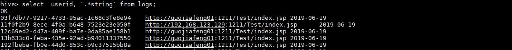


### 6.1.2 使用列值进行计算

> 这里就不得不提到在Hive中的算术运算符

| **运算符** | **类型** | **描述**                         |
| ---------- | -------- | -------------------------------- |
| A+B        | 数值     | A和B相加                         |
| A-B        | 数值     | A减去B                           |
| A*B        | 数值     | A和B相乘                         |
| A/B        | 数值     | A除以B。如果能整除，那么返回商数 |
| A%B        | 数值     | A除以B的余数                     |
| A&B        | 数值     | A和B按位取与                     |
| A\|B       | 数值     | A和B按位取或                     |
| A^B        | 数值     | A和B按位取亦或                   |
| ~A         | 数值     | A按位取反                        |


### 6.1.3 LIMIT语句

> 典型的查询会返回多行数据。LIMIT子句用于限制返回的行数

~~~shell
#只返回前两条数据
select * from testuser limit 2;
~~~


## 6.2 WHERE 语句

> 在之前的WEB学习中，大家肯定知晓WHERE就是条件查询，用于将不满足条件的行过滤掉

~~~shell
# 简单写一个条件查询语句
select * from testuser where id = '1' ;
~~~

**效果**


## 6.3 GROUP BY 分组

> GROUP BY语句通常会和聚合函数一起使用，按照一个或者多个列对结果进行分组，然后对每个组执行聚合操作。

~~~shell
# 根据性别进行分组查询每个性别的平均工资
select sex , avg(salary) as avgSalary   from testuser group by sex;
~~~


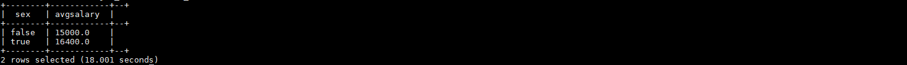


## 6.4 JOIN语句

### 6.4.1 内连接

~~~sql
#使用内连接，查询性别不同但是工资相同的人
select  a.sex, a.name, a.salary , b.sex , b.name,b.salary from testuser a join testuser b on a.salary = b.salary where a.sex = false and b.sex = true; 
~~~

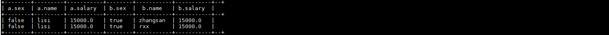


> 三表连接搞起来

~~~sql
 #使用内连接，查询来自三个不同城市的人且具有相同的第二种爱好
 select 
 a.address.city  , a.name as name , a.hobbies[1] as hobby , 
 b.address.city  , b.name as name ,b.hobbies[1] as hobby ,
 c.address.city  , c.name as name ,c.hobbies[1] as hobby 
 from testuser a  
 join testuser b on a.hobbies[1] = b.hobbies[1]  
 join testuser c on a.hobbies[1] = c.hobbies[1]   
 where a.address.city = 'bj' and b.address.city = 'sh' and c.address.city = 'ly'; 

~~~

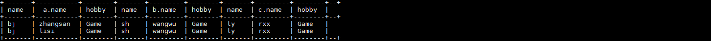


### 6.4.2 JOIN优化

> 这种优化其实是指手动指定那些数据最大，从而最后查询（和之前查过的，已经缓存上的数据进行对比），这样可以减少服务器的压力

在上述三表连接的操作中，其实就是一种“失误”的写法，为什么呢 ？因为通过比较我们可以发现，来自北京的人最多，也就是说当前a表最大。Hive同时假定查询中最后一个表是最大的那个表。在对每行记录进行连接操作时，它会尝试将其他表缓存起来，然后扫描最后那个表进行计算。因此，用户需要保证连续查询中的表的大小从左到右是依次增加的。

但是咱们将最大的表放在第一个，显然就违反这个逻辑，因为测试数据较小我们根本不会发现有任何差异，但是真正的在生产环境中，我们就需要将表依次从小到大进行排列，来达到效率的最大化。

但是假如我们在书写SQL语句的时候不能将最大的表放在最后，或者忘记放在最后，有什么办法去解决这个问题呢？

幸运的是，用户并非总是要将最大的表放置在查询语句的最后面的。这是因为Hive还提供了一个“标记”机制来显式地告之查询优化器哪张表是大表，来看具体的SQL语句：

~~~sql
 
 select 
 /*+STREAMTABLE(a)*/
 a.address.city  as name, a.name, a.hobbies[1] as hobby , 
 b.address.city  as name, b.name,b.hobbies[1] as hobby ,
 c.address.city  as name, c.name,c.hobbies[1] as hobby 
 from testuser a  
 join testuser b on a.hobbies[1] = b.hobbies[1]  
 join testuser c on a.hobbies[1] = c.hobbies[1]   
 where a.address.city = 'bj' and b.address.city = 'sh' and c.address.city = 'ly'; 
~~~

>  /*+STREAMTABLE(a)*/ 使用此关键字，括号写表的  |别名|


### 6.4.3 LEFT OUTER JOIN  左外连接

> 在这种JOIN连接操作中，JOIN操作符左边表中符合WHERE子句的所有记录将会被返回。JOIN操作符右边表中如果没有符合ON后面连接条件的记录时，那么从右边表指定选择的列的值将会是NULL。
>
> 左链接,显示关键词left左边表中的所有数据,右边表数据数据少了补NULL值,数据多了不显示;


~~~
# 连接部门表查询员工来自哪个部门
select a.name  ,b.depname from testemp a left join testdep  b on a.depid = b.id;
~~~

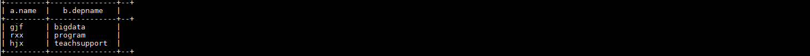


### 6.4.4 FULL OUTER JOIN 全连接|满外连接


### 6.4.5 RIGHT OUTER JOIN  右外连接

> 右外连接(RIGHT OUTER JOIN)会返回右边表所有符合WHERE语句的记录。左表中匹配不上的字段值用NULL代替。

~~~shell
# 右外连接
select a.name  ,b.depname from testemp a right  join testdep  b on a.depid = b.id;
~~~


### 6.4.6  笛卡尔积JOIN

> 笛卡尔积是一种连接，表示左边表的行数乘以右边表的行数等于笛卡尔结果集的大小。也就是说如果左边表有5行数据，而右边表有6行数据，那么产生的结果将是30行数据


#### 不带条件

~~~~
SELECT * FROM testemp , testdep;
~~~~

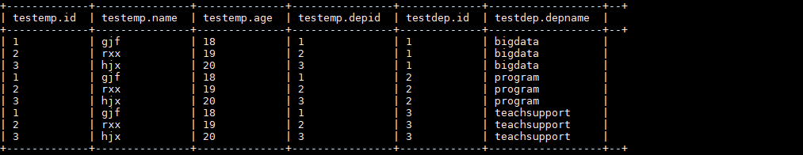

> 可以看到每个人的名字出现了三次，也就是3*6=18行数据


#### 带条件

~~~
SELECT   * FROM testemp a  ,testdep b where a.depid = b.id;
~~~


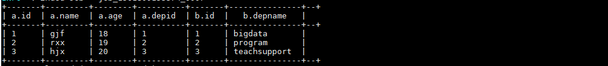


## 6.5 排序 ORDER BY | SORT BY|CLUSTER BY


### 6.5.1  ORDER BY 

> order by 在这里叫全局排序，也就是一个MR程序中，升序的关键字ASC，默认升序。DESC为降序。 ORDER BY 子句在SELECT语句的结尾。

~~~sql
#按照工资就行升序排序
select * from testuser order by salary;
~~~

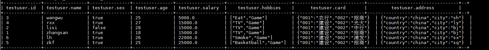


~~~sql
#按照工资就行降序排序
select * from testuser order by salary desc;
~~~

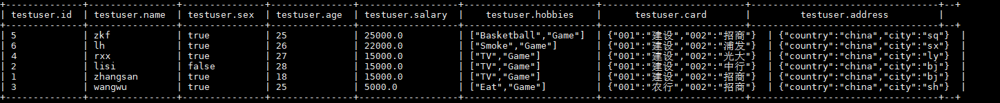


### 6.5.2  SORT  BY 

> 每个MapReduce内部进行排序，对全局结果集来说不是排序，但是对于Reduce=1的情况是无法体现和ORDER BY的区别

#### Reduce个数为1

~~~
select * from testuser sort  by salary;
~~~

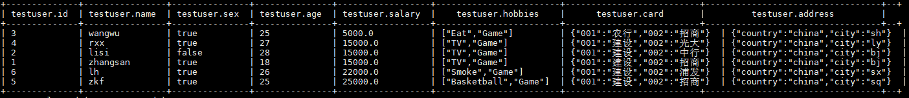


#### 设置Reduce个数

> 设置完成Reduce个数之后就能体现出来差别了

~~~
set mapreduce.job.reduces=2;
select * from testuser sort  by salary;
~~~

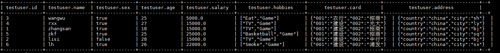

> 可以看到前4个是升序 后两个是升序


#### 查看Reduce个数

~~~
get mapreduce.job.reduces;
~~~


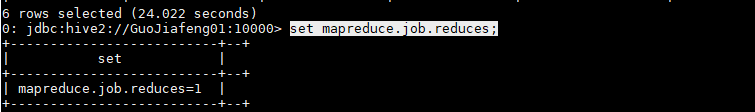


### 6.5.3 Distribute By

~~~
Distribute By：类似MR中partition，进行分区，结合sort by使用。
注意，Hive要求DISTRIBUTE BY语句要写在SORT BY语句之前。
~~~

实际操作：

~~~
hive (default)> insert overwrite local directory '/root/realclean.log' select * from logs distribute by dateString sort by  timeString;
~~~


### 6.5.4  Cluster By

~~~
当distribute by和sorts by字段相同时，可以使用cluster by方式。cluster by除了具有distribute by的功能外还兼具sort by的功能。但是排序只能是倒序排序，不能指定排序规则为ASC或者DESC。
~~~

~~~
select * from logs cluster by timeString;
select * from logs distribute by timeString sort by timeString;
上述两种写的方式是相同的
~~~


## 6.6 抽样|分桶

### 6.6.1 抽样

> Hive提供了另外一种按照百分比进行抽样的方式，这种事基于行数的，按照输入路径下的数据块百分比进行的抽样。

~~~
select * from testuser   tablesample(0.1 percent);
~~~

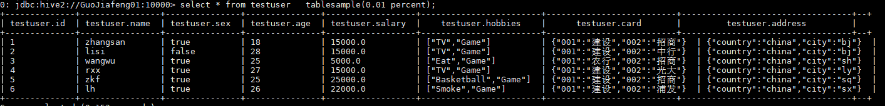

> 提示：这种抽样方式不一定适用于所有的文件格式。另外，这种抽样的最小抽样单元是一个HDFS数据块。因此，如果表的数据大小小于普通的块大小128M的话，那么将会返回所有行。


### 6.6.2 分桶

~~~
分区针对的是数据的存储路径；分桶针对的是数据文件。分区提供一个隔离数据和优化查询的便利方式。不过，并非所有的数据集都可形成合理的分区，特别是之前所提到过的要确定合适的划分大小这个疑虑。分桶是将数据集分解成更容易管理的若干部分的另一个技术。
~~~


创建表

~~~
create table student4(sno int,sname string,sex string,sage int, sdept string) clustered by(sno) into 3 buckets row format delimited fields terminated by ',';

create table 
logs_buck
(
    uuid string,
    userid string ,
    fromUrl string ,
    dateString string,
    timeString string,
    ipAddress string,
    browserName string,
    pcSystemNameOrmobileBrandName string ,
    systemVersion string,
    language string, 
    cityName string
)
clustered by(uuid)
into 3 buckets row format delimited fields terminated by ' ';

set hive.enforce.bucketing = true;

load data local inpath '/root/realclean.log' overwrite into table logs_buck;
~~~

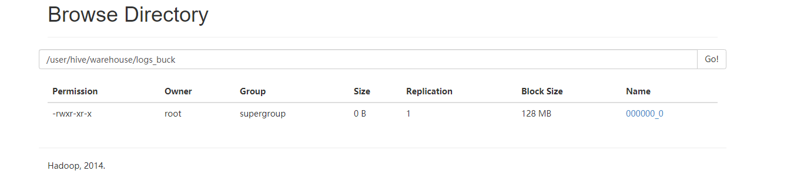


~~~
我们看到虽然设置了强制分桶，但实际student表下面只有一个logs一个文件。分桶也就是分区，分区数量等于文件数，所以上面方法并没有分桶。
~~~

~~~
创建一个新表
create table 
logs_buck1
(
    uuid string,
    userid string ,
    fromUrl string ,
    dateString string,
    timeString string,
    ipAddress string,
    browserName string,
    pcSystemNameOrmobileBrandName string ,
    systemVersion string,
    language string, 
    cityName string
)
clustered by(uuid)
into 3 buckets row format delimited fields terminated by ' ';

这是我们这是的是3个桶
所以设置一下reducetask的个数
set mapreduce.job.reduces=3;

insert into table logs_buck1 select *  from logs_buck distribute by(timeString) sort by(timeString asc);
~~~


# 七、Hive 自定义函数

> 在Hive当中又系统自带的函数，可以通过`show functions;`语句查询系统现在已经存在函数。`desc function upper;`显示自带函数用法，`desc function extended upper;`详细显示自带函数用法。其系统中已经存在很多函数，但是这些往往不能满足生产需求，所以Hive保留了相关接口，以便用户日后去自定义函数去拓展相关的功能。

在Hive中，用户可以自定义一些函数，用于扩展HiveQL的功能，而这类函数叫做UDF（用户自定义函数）。UDF分为两大类：UDAF（用户自定义聚合函数）和UDTF（用户自定义表生成函数）。在介绍UDAF和UDTF实现之前，我们先在本章介绍简单点的UDF实现：UDF和GenericUDF，然后以此为基础介绍UDAF和UDTF的实现。


## 7.1 UDF

Hive有两个不同的接口编写UDF程序。一个是基础的**UDF**接口，一个是复杂的**GenericUDF**接口。

**org.apache.hadoop.hive.ql. exec.UDF** 基础UDF的函数读取和返回基本类型，即Hadoop和Hive的基本类型。如Text、IntWritable、LongWritable、DoubleWritable等。

**org.apache.hadoop.hive.ql.udf.generic.GenericUDF** 复杂的GenericUDF可以处理Map、List、Set类型。

@Describtion注解是可选的，用于对函数进行说明，其中的_FUNC_字符串表示函数名，当使用DESCRIBE FUNCTION命令时，替换成函数名。@Describtion包含三个属性：

name：用于指定Hive中的函数名。

value：用于描述函数的参数。

extended：额外的说明，例如当使用DESCRIBE FUNCTION EXTENDED name的时候打印。

### 7.1.1 准备数据

#### 表结构

~~~sql
drop table logs；

create table 
logs
(
    userid string ,
    fromUrl string ,
    dateString string,
    timeString string,
    ipAddress string,
    browserName string,
    pcSystemNameOrmobileBrandName string ,
    systemVersion string,
    language string, 
    cityName string
)
partitioned BY (day string)
row format delimited fields terminated 
by ' ';
~~~

#### 导入数据

~~~
load data  inpath '/clean.log'   into table logs  partition(day='19-06-19');
~~~


#### 部分数据展示

~~~
a1b21e96-01d8-47ca-b343-2fb7a7172701    http://192.168.123.129:1211/Test/index.jsp      2019-06-19      23:19:26        223.71.30.3     Chrome  MI-8)   Android-9       zh-CN   CHINA   19-06-19

~~~


### 7.1.2 编写Java类

> 这里是真正的写自定义函数的逻辑，首先需要设计一下自定义函数的逻辑。
>
> 想要实现的效果（当然这个可以自行定义）：比如说查询userid（名字） 和城市，输出 你好 userid ，city 好玩吗？


#### 环境

~~~xml

        <dependency>
            <groupId>org.apache.hadoop</groupId>
            <artifactId>hadoop-common</artifactId>
            <version>2.6.0</version>
        </dependency>

        <dependency>
            <groupId>org.apache.hive</groupId>
            <artifactId>hive-exec</artifactId>
            <version>1.2.2</version>
        </dependency>

        <dependency>
            <groupId>junit</groupId>
            <artifactId>junit</artifactId>
            <version>4.12</version>
        </dependency>

~~~


#### 出现的问题

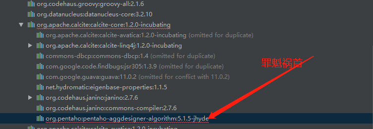


> 看上图，阿里云代理的中心仓库无法下载这个依赖，这也就意味着最经常使用的几大Maven仓库也无法下载，所有在几经周折后，找到了发布这个依赖的私服（私服中也有其他依赖，可以直接使用）


#### 解决办法

pentaho私服WEB地址 ：<https://public.nexus.pentaho.org/>

##### 办法1 

通过所有就可以下载到当前这个缺失依赖

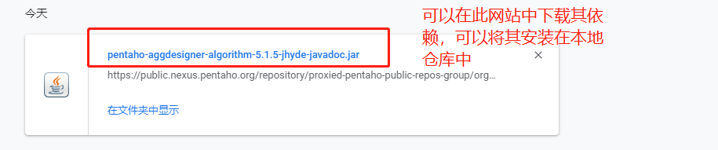

> 缺点：麻烦    优点：无需再去校验或者下载其他的Jar包

##### 办法2 

将阿里云的镜像替代为pentaho镜像，打开xml文件

但是地址怎么写？

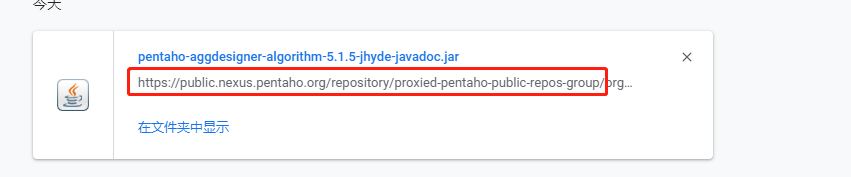

https://public.nexus.pentaho.org/repository/proxied-pentaho-public-repos-group/org/pentaho/pentaho-aggdesigner-algorithm/5.1.5-jhyde/pentaho-aggdesigner-algorithm-5.1.5-jhyde-javadoc.jar

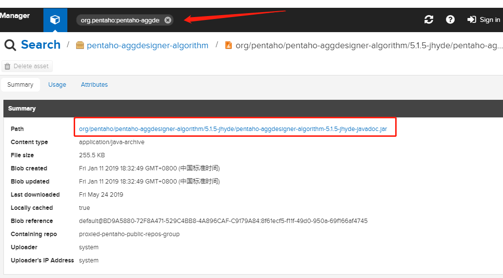

> 上述连接中是下载缺失依赖的jar，可以看到从org之前都是其公共仓库的连接了，所在在你的xml文件中去除阿里云的依赖，添加下方镜像即可


~~~xml
<mirror>
<id>nexus-pentaho</id>
<mirrorOf>*</mirrorOf>
<name>Nexus pentaho</name>
<url>https://public.nexus.pentaho.org/repository/proxied-pentaho-public-repos-group/</url>
</mirror>
~~~

> 但是，此种方法需要重新将你的其他依赖再进行一次校验或者下载 ，也有其局限性

#### 真正的代码

~~~java
package io.gjf.udf;

import org.apache.hadoop.hive.ql.exec.Description;
import org.apache.hadoop.hive.ql.exec.UDF;

/**
 * Create by GuoJF on 2019/6/19
 */
@Description(
        name = "hello",
        value = "_FUNC_(str1,str2) - from the input string"
                + "returns the value that is \"你好 $str1 ，$str2 好玩吗？ \" ",
        extended = "Example:\n"
                + " > SELECT _FUNC_(str1,str2) FROM src;"
)
public class HelloUDF extends UDF {
    public String evaluate(String str1,String str2){
        try {
            return "Hello " + str1+", "+str2 +" 好玩吗？";
        } catch (Exception e) {
            // TODO: handle exception
            e.printStackTrace();
            return "ERROR";
        }
    }
}
~~~

### 7.1.3添加功能

本地生成Jar包，并且上传至Linux服务器，进入Hive命令行

~~~sql
hive>ADD jar /root/hive-0.0.1-SNAPSHOT.jar;
hive> CREATE TEMPORARY FUNCTION hello AS "io.gjf.udf.HelloUDF";
~~~

### 7.1.4展示效果

~~~sql
select hello(userid,cityName) from logs；

部分效果如下：
Hello f8b13cf1-f601-4891-ab3b-ca06069a9f41, CHINA 好玩吗？
Hello f8b13cf1-f601-4891-ab3b-ca06069a9f41, CHINA 好玩吗？
~~~


## 7.2 GenericUDF（了解）

~~~
org.apache.hadoop.hive.ql.udf.generic.GenericUDF 复杂的GenericUDF可以处理Map、List、Set类型。
~~~

> Serde是什么：Serde实现数据序列化和反序列化以及提供一个辅助类ObjectInspector帮助使用者访问需要序列化或者反序列化的对象。


## 7.3  UDTF（了解）


~~~
用户自定义表生成函数（UDTF）。用户自定义表生成函数（UDTF）接受零个或多个输入，然后产生多列或多行的输出，如explode()。要实现UDTF，需要继org.apache.hadoop.hive.ql.udf.generic.GenericUDTF，同时实现三个方法：

//该方法指定输入输出参数：输入的Object Inspectors和输出的Struct。
1. abstract StructObjectInspector initialize(ObjectInspector[] args) throws UDFArgumentException; 
//该方法处理输入记录，然后通过forward()方法返回输出结果。
2. abstract void process(Object[] record) throws HiveException;
//该方法用于通知UDTF没有行可以处理，可以在该方法中清理代码或者附加其他处理输出。
3. abstract void close() throws HiveException;

~~~


## 7.4 UDAF （了解）

~~~
用户自定义聚合函数（UDAF）接收从零行到多行的零个到多个列，然后返回单一值，如sum()、count()。要实现UDAF，我们需要实现下面的类：
org.apache.0.hive.ql.udf.generic.AbstractGenericUDAFResolver
org.apache.hadoop.hive.ql.udf.generic.GenericUDAFEvaluator
AbstractGenericUDAFResolver检查输入参数，并且指定使用哪个resolver。在AbstractGenericUDAFResolver里，只需要实现一个方法：
Public GenericUDAFEvaluator getEvaluator(TypeInfo[] parameters) throws SemanticException;
但是，主要的逻辑处理还是在evaluator中。我们需要继承GenericUDAFEvaluator，并且实现下面几个方法：
//输入输出都是Object inspectors
public ObjectInspector init(Mode m, ObjectInspector[] parameters) throws HiveException;
//AggregationBuffer保存数据处理的临时结果
abstract AggregationBuffer getNewAggregationBuffer() throws HiveException;
//重新设置AggregationBuffer
public void reset(AggregationBuffer agg) throws HiveException;
//处理输入记录
public void iterate(AggregationBuffer agg, Object[] parameters) throws HiveException;
//处理全部输出数据中的部分数据
public Object terminatePartial(AggregationBuffer agg) throws HiveException;
//把两个部分数据聚合起来
public void merge(AggregationBuffer agg, Object partial) throws HiveException;
//输出最终结果
public Object terminate(AggregationBuffer agg) throws HiveException;
在给出示例之前，先看下UADF的Enum GenericUDAFEvaluator.Mode。Mode有4中情况：
1. PARTIAL1：Mapper阶段。从原始数据到部分聚合，会调用iterate()和terminatePartial()。
2. PARTIAL2：Combiner阶段，在Mapper端合并Mapper的结果数据。从部分聚合到部分聚合，会调用merge()和terminatePartial()。
3.  FINAL：Reducer阶段。从部分聚合数据到完全聚合，会调用merge()和terminate()。
4. COMPLETE：出现这个阶段，表示MapReduce中只用Mapper没有Reducer，所以Mapper端直接输出结果了。从原始数据到完全聚合，会调用iterate()和terminate()。

~~~


## 7.5 Hive函数综合案例

### 7.5.1 实现列自增长

#### Java代码

~~~java
package io.gjf.udf;

/**
 * Create by GuoJF on 2019/6/20
 */

import org.apache.hadoop.hive.ql.exec.Description;
import org.apache.hadoop.hive.ql.exec.UDF;
import org.apache.hadoop.hive.ql.udf.UDFType;
import org.apache.hadoop.io.LongWritable;

/**
 * UDFRowSequence.
 */
@Description(name = "row_sequence",
        value = "_FUNC_() - Returns a generated row sequence number starting from 1")
@UDFType(deterministic = false)
public class RowSequence extends UDF {

    private LongWritable result = new LongWritable();

    public RowSequence() {
        result.set(0);
    }

    public LongWritable evaluate() {
        result.set(result.get() + 1);
        return result;
    }
}

~~~

#### 导入函数

> 打Jar包上传至Linux服务器，并在Hive命令行中输出如下指令


~~~
hive> add jar /root/Hive-1.0-SNAPSHOT.jar
hive> create temporary function row_sequence as 'io.gjf.udf.RowSequence';
~~~


#### 查询数据

~~~
SELECT row_sequence(), userid  FROM logs;
~~~


#### 效果展示

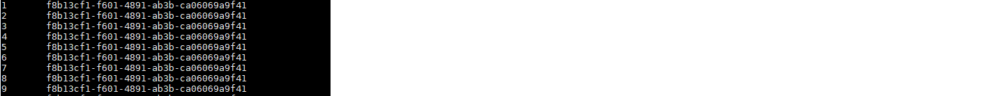


### 7.5.2 数据合并


#### 需求描述

~~~
假设我们在Hive中有两张表，其中一张表是存用户基本信息，另一张表是存用户的地址信息等
~~~

user_basic_info 表信息

| id   | name |
| ---- | ---- |
| 1    | a    |
| 2    | b    |
| 3    | c    |
| 4    | d    |

 user_address_info 表信息

| name | address |
| ---- | ------- |
| a    | add1    |
| a    | add2    |
| b    | add3    |
| c    | add4    |
| d    | add5    |


我们希望得到这样的结果：

| id   | name | address   |
| ---- | ---- | --------- |
| 1    | a    | add1,add2 |
| 2    | b    | add3      |
| 3    | c    | add4      |
| 4    | d    | add5      |


#### 建表

创建user_basic_info

~~~
user_basic_info

create table user_basic_info(id string,name string)
row format delimited fields terminated 
by ' ';


1 a
2 b
3 c
4 d

load data local  inpath '/root/user_basic_info' overwrite into table user_basic_info;


~~~

创建user_address_info

~~~sql
user_address_info

create table user_address_info(name string,address string)
row format delimited fields terminated 
by ' ';

a add1
a add2
b add3
c add4
d add5

load data local  inpath '/root/user_address_info' overwrite into table user_address_info;
~~~


~~~
select max(a.id), a.name, concat_ws('|', collect_set(b.address)) as address from user_basic_info a join user_address_info b 
on a.name=b.name group by a.name;

~~~

结果

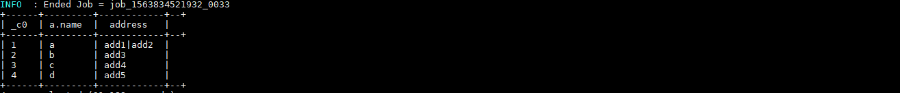

#### 数据合并

~~~
创建新表 user_all_info
create table user_all_info(id string,name string,address array<string>)
row format delimited fields terminated 
by ' ';
~~~

执行插入语句

~~~
insert into table user_all_info select max(a.id), a.name,  collect_set(b.address) as address  from user_basic_info a join user_address_info b 
on a.name=b.name group by a.name;
~~~

#### 最终结果

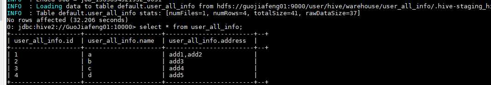


# 八、Hive On Hbase

~~~java
@Test
    public void testPut04() throws Exception {
        TableName tname = TableName.valueOf("baizhi:t_user");

        BufferedMutator mb = conn.getBufferedMutator(tname);


        String[] company = {"baidu", "ali", "sina"};
        List<Put> list = new ArrayList<>();
        for (int i = 1; i < 1000; i++) {

            String rowkeyP = company[new Random().nextInt(3)];


            String empid = "";
            if (i < 10) {


                empid = "00" + i;
            } else if (i < 100) {
                empid = "0" + i;
            } else {

                empid = "" + i;

            }

            String rowkey = rowkeyP + ":" + empid;

            Put put = new Put(rowkey.getBytes());
            put.addColumn("cf1".getBytes(), "name".getBytes(), "lisi1".getBytes());
            put.addColumn("cf1".getBytes(), "age".getBytes(), Bytes.toBytes(i + ""));

            put.addColumn("cf1".getBytes(), "salary".getBytes(), Bytes.toBytes(100.0 * i + ""));
            put.addColumn("cf1".getBytes(), "company".getBytes(), rowkeyP.getBytes());
            list.add(put);
        }


        mb.mutate(list);
        mb.close();
    }

~~~


```bash
CREATE EXTERNAL table t_user_hbase(
         id  string,
         name  string, 
         age  int,
         salary  double,
         company string
  )
 STORED BY 'org.apache.hadoop.hive.hbase.HBaseStorageHandler' 
 WITH SERDEPROPERTIES('hbase.columns.mapping' = ':key,cf1:name,cf1:age,cf1:salary,cf1:company')
 TBLPROPERTIES('hbase.table.name' = 'baizhi:t_user');
 
 0: jdbc:hive2://CentOS:10000> select avg(salary),max(salary),min(salary),sum(salary) ,company from t_user_hbase group by company;
 
 
 select avg(salary) as avgSalary ,max(salary) as maxSalary,min(salary) as minSalary,sum(salary) as totalSalary ,company  as companyName from t_user_hbase group by company;
```
> 有关Hive查询相关函数,可以参考:https://cwiki.apache.org/confluence/display/Hive/LanguageManual+UDF或者是hive编程指南.

