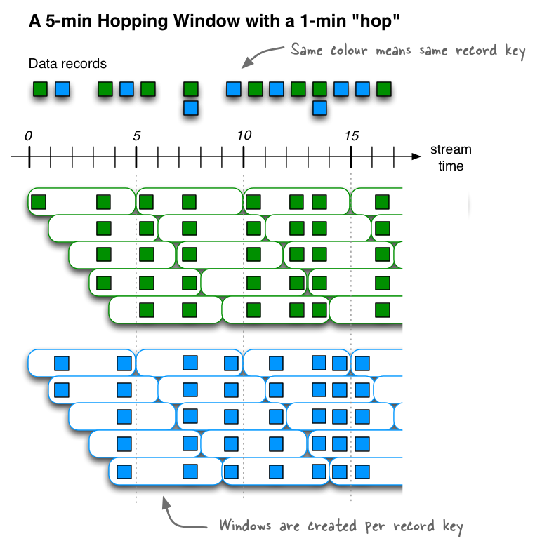

# Apache Kafka

## 一、概述

Apache Kafka是一个分布式的流数据平台，代表三层含义：

- **Publish/Subscribe**: 消息队列系统 MQ（Message Queue）

- **Process**: 流数据的实时处理（Stream Process）
- **Store**: 流数据会以一种安全、容错冗余存储机制存放到分布式集群中


### 架构


### 应用场景

- 构建实时的流数据管道，在系统和应用之间进行可靠的流数据传输
- 构建实时的流数据处理应用，对流数据进行转换和加工处理

### 核心概念

- `Cluster`： kafka支持一到多个服务构成的分布式集群，每一个服务实例成为`Broker`
- `Topic`:  某一个分类的消息的集合，如：订单的topic、商品的topic等
- `Partition`: 一个Topic有若干个分区（Partition）构成，分区的数量在创建Topic时手动指定
- `Replication`:  分区副本，是Partition的冗余备份分区，当Partition不可用时，ZooKeeper会自动将Replication（Follower）分区升级为Partition（Leader）分区
- `Offset`:  分区中的Record的位置标示，每一个消费者都会记录自己的消费位置（offset）

### Topic和Log

> Each partition is an ordered, immutable sequence of records that is continually appended to—a structured commit log
>
> Kafka的每一个分区（Partition），都是一个有序、不可变的持续追加的记录序列，Kafka会以一种结构化的提交日志保存分区中的数据。


> 注意：在分区中写入数据时，会在队列的末尾进行追加，每一个消费者都维护的有一个自己的消费位置（offset）


## 二、环境搭建

> 完全分布式的Kafka集群

### 准备工作

- 分布式集群中时钟同步

- JDK1.8以上

- ZooKeeper集群服务运行正常

  ```shell
  [root@HadoopNode0* zookeeper-3.4.6]# vi conf/zoo.cfg
  tickTime=2000
  initLimit=10
  syncLimit=5
  dataDir=/home/zk/data
  clientPort=2181
  server.1=hadoopnode01:2887:3887
  server.2=hadoopnode02:2888:3888
  server.3=hadoopnode03:2889:3889
  
  [root@HadoopNode0* zookeeper-3.4.6]# cd /home/zk
  [root@HadoopNode0* zk]# mkdir data
  [root@HadoopNode0* zk]# vi data/myid
  # Node01
  1
  # Node02
  2
  # Node03
  3
  [root@HadoopNode0* zookeeper-3.4.6]# bin/zkServer.sh start conf/zoo.cfg
  
  # 如何判断zookeeper集群服务正常
  [root@HadoopNode03 zookeeper-3.4.6]# bin/zkServer.sh status conf/zoo.cfg
  JMX enabled by default
  Using config: conf/zoo.cfg
  Mode: leader  (一主两从)
  ```

### 安装配置

- 将安装包上传并复制到其它节点

  ```shell
  # 上传到某一个服务器，并拷贝给其它服务器
  
  [root@HadoopNode01 ~]# scp kafka_2.11-2.2.0.tgz root@hadoopnode02:~
  kafka_2.11-2.2.0.tgz                                                                         100%   61MB  61.0MB/s   00:00
  [root@HadoopNode01 ~]# scp kafka_2.11-2.2.0.tgz root@hadoopnode03:~
  kafka_2.11-2.2.0.tgz   
  ```

- 安装Kafka

  ```shell
  [root@HadoopNode0* ~]# tar -zxf kafka_2.11-2.2.0.tgz -C /usr
  [root@HadoopNode01 kafka_2.11-2.2.0]# ll
  total 52
  drwxr-xr-x. 3 root root  4096 Mar 10  2019 bin  # 指令
  drwxr-xr-x. 2 root root  4096 Mar 10  2019 config  # 配置文件
  drwxr-xr-x. 2 root root  4096 Oct  9 08:56 libs  # 依赖jar包
  -rw-r--r--. 1 root root 32216 Mar 10  2019 LICENSE 
  -rw-r--r--. 1 root root   336 Mar 10  2019 NOTICE 
  drwxr-xr-x. 2 root root  4096 Mar 10  2019 site-docs  # 使用文档
  ```

### 环境配置

- 修改kafka核心配置文件`server.properties`

  ```shell
  [root@HadoopNode01 kafka_2.11-2.2.0]# vi config/server.properties
  broker.id=0 | 1 | 2
  listeners=PLAINTEXT://HadoopNode0[1 | 2 | 3]:9092
  log.dirs=/usr/kafka_2.11-2.2.0/data
  zookeeper.connect=HadoopNode01:2181,HadoopNode02:2181,HadoopNode03:2181
  ```

### 启动服务

- 启动

  ```properties
  [root@HadoopNode0* kafka_2.11-2.2.0]# bin/kafka-server-start.sh -daemon config/server.properties
  [root@HadoopNode0* kafka_2.11-2.2.0]# jps
  10386 Kafka
  10517 Jps
  3276 QuorumPeerMain
  ```

- 关闭

  ```shell
  [root@HadoopNode0* kafka_2.11-2.2.0]# bin/kafka-server-stop.sh config/server.properties
  ```

  

## 三、基础使用

### 命令行操作

#### Topic使用

- 新建Topic

  ```properties
  [root@HadoopNode01 kafka_2.11-2.2.0]# bin/kafka-topics.sh --bootstrap-server HadoopNode01:9092,HadoopNode02:9092,HadoopNode03:9092 --topic t1 --partitions 3 --replication-factor 3 --create
  ```

- 展示Topic列表

  ```shell
  [root@HadoopNode01 kafka_2.11-2.2.0]# bin/kafka-topics.sh --bootstrap-server HadoopNode01:9092,HadoopNode02:9092,HadoopNode03:9092  --list
  ```

- 删除Topic

  ```properties
  [root@HadoopNode02 kafka_2.11-2.2.0]# bin/kafka-topics.sh --bootstrap-server HadoopNode01:9092,HadoopNode02:9092,HadoopNode03:9092  --delete --topic t2
  ```

- 描述Topic

  ```shell
  [root@HadoopNode02 kafka_2.11-2.2.0]# bin/kafka-topics.sh --bootstrap-server HadoopNode01:9092,HadoopNode02:9092,HadoopNode03:9092  --describe --topic t1
  Topic:t1        PartitionCount:3        ReplicationFactor:3     Configs:segment.bytes=1073741824
          Topic: t1       Partition: 0    Leader: 0       Replicas: 0,2,1 Isr: 0,2,1
          Topic: t1       Partition: 1    Leader: 2       Replicas: 2,1,0 Isr: 2,1,0
          Topic: t1       Partition: 2    Leader: 1       Replicas: 1,0,2 Isr: 1,0,2
          
  # 测试：kill掉Node03上的kafka服务实例  也就是broker【2】
  [root@HadoopNode02 kafka_2.11-2.2.0]# bin/kafka-topics.sh --bootstrap-server HadoopNode01:9092,HadoopNode02:9092,HadoopNode03:9092  --describe --topic t1
  Topic:t1        PartitionCount:3        ReplicationFactor:3     Configs:segment.bytes=1073741824
          Topic: t1       Partition: 0    Leader: 0       Replicas: 0,2,1 Isr: 0,1
          Topic: t1       Partition: 1    Leader: 1       Replicas: 2,1,0 Isr: 1,0
          Topic: t1       Partition: 2    Leader: 1       Replicas: 1,0,2 Isr: 1,0
  
  # 测试：恢复运行Node03上的Kafka服务实例Broker[2]，第三列信息不改变的原因：（分区的Leader都存在，不会触发ZK的故障转移），第五列信息不变
  [root@HadoopNode02 kafka_2.11-2.2.0]# bin/kafka-topics.sh --bootstrap-server HadoopNode01:9092,HadoopNode02:9092,HadoopNode03:9092  --describe --topic t1
  Topic:t1        PartitionCount:3        ReplicationFactor:3     Configs:segment.bytes=1073741824
          Topic: t1       Partition: 0    Leader: 0       Replicas: 0,2,1 Isr: 0,1,2
          Topic: t1       Partition: 1    Leader: 1       Replicas: 2,1,0 Isr: 1,0,2
          Topic: t1       Partition: 2    Leader: 1       Replicas: 1,0,2 Isr: 1,0,2        
  ```

  

  

- 修改Topic

  ```properties
  [root@HadoopNode02 kafka_2.11-2.2.0]# bin/kafka-topics.sh --bootstrap-server HadoopNode01:9092,HadoopNode02:9092,HadoopNode03:9092  --alter --topic t1 --partitions 5
  ```

#### 发布和订阅

- 发布消息

  ```shell
  [root@HadoopNode01 kafka_2.11-2.2.0]# bin/kafka-console-producer.sh --broker-list HadoopNode01:9092,HadoopNode02:9092,HadoopNode03:9092 --topic t1
  >Hello World
  >Hello Kafka
  >Hello Hadoop
  ```

- 订阅消息

  ```shell
  [root@HadoopNode02 kafka_2.11-2.2.0]# bin/kafka-console-consumer.sh --topic t1 --bootstrap-server HadoopNode01:9092,HadoopNode02:9092,HadoopNode03:9092
  ```


### JAVA Driver

#### Maven依赖

```xml
<!-- https://mvnrepository.com/artifact/org.apache.kafka/kafka-clients -->
<dependency>
    <groupId>org.apache.kafka</groupId>
    <artifactId>kafka-clients</artifactId>
    <version>2.2.0</version>
</dependency>
```

#### 准备工作

- 配置Windows Hosts主机名和IP映射

  ```
  192.168.11.20 HadoopNode00
  192.168.11.21 HadoopNode01
  192.168.11.22 HadoopNode02
  192.168.11.23 HadoopNode03
  ```

#### 生产者

```java
import org.apache.kafka.clients.producer.KafkaProducer;
import org.apache.kafka.clients.producer.ProducerConfig;
import org.apache.kafka.clients.producer.ProducerRecord;
import org.apache.kafka.common.serialization.StringSerializer;

import java.util.Properties;
import java.util.UUID;

/**
 * kafka 生产者的测试类
 */
public class ProducerDemo {

    public static void main(String[] args) {
        //1. 准备Kafka生产者配置信息
        Properties properties = new Properties();
        properties.put(ProducerConfig.BOOTSTRAP_SERVERS_CONFIG,"HadoopNode01:9092,HadoopNode02:9092,HadoopNode03:9092");
        // string 序列化（Object ---> byte[]）器
        properties.put(ProducerConfig.KEY_SERIALIZER_CLASS_CONFIG, StringSerializer.class);
        properties.put(ProducerConfig.VALUE_SERIALIZER_CLASS_CONFIG,StringSerializer.class);

        //2. 创建kafka生产者对象
        KafkaProducer<String, String> producer = new KafkaProducer<String, String>(properties);

        //3. 生产记录并将其发布
        ProducerRecord<String, String> record = new ProducerRecord<String, String>("t2", UUID.randomUUID().toString(),"Hello Kafka");

        producer.send(record);

        //4. 释放资源
        producer.flush();
        producer.close();
    }
}
```

> 1） Kafka的消息生产者，负责生产数据（Record K\V\Timestamp），最终发布（Publish）保存到Kafka集群
>
> 2）数据的保存策略：
>
> - 如果Record的Key不为`Null`，采用哈希算法：` key.hashCode % numPartitions = 余数（分区序号）`
> - 如果Record的Key为`Null`, 采用轮询策略
> - 手动指定存放的分区
>
> 3） 数据会以一种分布式的方式保存在Kafka集群中，每一个分区都会维护一个队列的数据结构，新产生的数据会追加到队列的末尾，并且分配`offset`, 
>
> 4）数据在Kafka集群中默认最多保留7天（168Hours），不论是否消费，在保留周期到达后都会自动被删除。
>
> 5）数据在Kafka中可以进行重复消费，重置消费offset即可

#### 消费者

```java
import org.apache.kafka.clients.consumer.ConsumerConfig;
import org.apache.kafka.clients.consumer.ConsumerRecord;
import org.apache.kafka.clients.consumer.ConsumerRecords;
import org.apache.kafka.clients.consumer.KafkaConsumer;
import org.apache.kafka.common.serialization.StringDeserializer;

import java.time.Duration;
import java.util.Arrays;
import java.util.Properties;

/**
 * kafka消费者测试类
 * 1. 订阅 subscribe
 * 2. 拉取 pull
 */
public class ConsumerDemo {
    public static void main(String[] args) {
        //1. 指定kafka消费者的配置信息
        Properties properties = new Properties();
        properties.put(ConsumerConfig.BOOTSTRAP_SERVERS_CONFIG, "HadoopNode01:9092,HadoopNode02:9092,HadoopNode03:9092");
        // 反序列化器 byte[] ---> Object
        properties.put(ConsumerConfig.KEY_DESERIALIZER_CLASS_CONFIG, StringDeserializer.class);
        properties.put(ConsumerConfig.VALUE_DESERIALIZER_CLASS_CONFIG, StringDeserializer.class);
        // 消费组必须得指定
        properties.put(ConsumerConfig.GROUP_ID_CONFIG, "group1");

        //2. 创建kafka消费者对象
        KafkaConsumer<String, String> consumer = new KafkaConsumer<String, String>(properties);

        //3. 订阅主体topic
        consumer.subscribe(Arrays.asList("t2"));

        //4. 拉取新产生的记录
        while (true) {
            ConsumerRecords<String, String> records = consumer.poll(Duration.ofSeconds(10));
            for (ConsumerRecord<String, String> record : records) {
                System.out.println(record.key() + "\t" + record.value() + "\t"
                        + record.topic() + "\t" + record.offset()
                        + "\t" + record.timestamp() + "\t" + record.partition());
            }
        }
    }
}
```


> 1）消费者并不是独立存在，kafka中消费者会以消费组的方式进行组织和管理
>
> 2）**消费组符合特征： 组外广播、组内负载均衡**
>
> - 组外广播： 保证不同的消费组，能够独立消费新产生的数据
> - 组内负载均衡： 消息只会被消费组中的一个消费着进行处理，多个消费组提高了Kafka并行处理能力
>
> 3）消费者可以订阅一个到多个感兴趣的Topic，一旦这些Topic有新的数据产生，消费者会自动拉取新产生的数据，进行相应的业务处理
>
> 4）消费者在消费消息时，会维护一个消费的位置（offset），下一次消费时会自动从offset向后进行消费。
>
> ​      在kafka中数据会有一个默认的保留周期（7天），在保留期内数据是可以进行重复消费的，只需要重置消费者消费的offset即可。
>
> 5）`__consumer_offsets`是一个特殊topic，主要记录了Kafka消费组的消费位置。

## 四、高级部分

### 偏移量控制

Kafka消费者在订阅Topic时，会自动拉取Topic中新产生的数据。首次消费时使用默认的偏移量消费策略==lastest==

偏移量消费策略：

- ==lastest（默认）==：如果有已提交的offset，从已提交的offset之后消费消息。如果无提交的offset，从最后的offset之后消费数据

- ==earliest==：如果有已提交的offset，从已提交的offset之后消费消息。如果无提交的offset，从最早的offset消费消息

  ```java
  // 注意：此配置项 修改偏移量消费策略的默认行为 
  properties.put(ConsumerConfig.AUTO_OFFSET_RESET_CONFIG,"earliest");
  ```

Kafka消费者消费位置offset，默认采用自动提交的方式，将消费位置提交保存到特殊Topic`__consumer_offsets`中

自动提交策略：

```java
// 默认自动提交消费的位置offset
properties.put(ConsumerConfig.ENABLE_AUTO_COMMIT_CONFIG,true);
// 默认每隔5秒提交一次消费位置
properties.put(ConsumerConfig.AUTO_COMMIT_INTERVAL_MS_CONFIG,5000);
```

通常情况需要手动提交消费位置：

> 为什么需要手动提交消费位置（offset）的原因？
>
> 原因：如果自动提交消费位置，有可能在进行业务处理时出现错误，会造成数据没有被正确处理。
>
> ​            手动提交消费位置，可以保证数据一定能够被完整的正确处理。

```java
// 关闭消费位置offset的自动提交功能
properties.put(ConsumerConfig.ENABLE_AUTO_COMMIT_CONFIG,false);

// 手动提交消费位置
consumer.commitSync();
```

### 消费方式

#### 订阅（Subscribe）

> 消费者订阅1到N个感兴趣的Topic，一旦Topic中有新的数据产生，会自动拉取Topic分区内的所有数据

```java
// 订阅（消费）Topic所有的分区
consumer.subscribe(Arrays.asList("t3"));
```

#### 指定消费分区

> 消费者在消费数据时，可以只消费某个Topic特定分区内的数据

```java
// 指定消费Topic的特定分区
consumer.assign(Arrays.asList(new TopicPartition("t3",0)));
```

#### 重置消费位置

> 消费者在消费数据时，可以重置消费的offset，消费已消费的数据或者跳过不感兴趣的数据

```java
consumer.assign(Arrays.asList(new TopicPartition("t3",0)));
// 重置消费位置
consumer.seek(new TopicPartition("t3",0),1);
```

### 消费组

（略）


### 自定义对象类型的传输

#### 序列化接口

```java
public interface Serializer<T> extends Closeable {
    void configure(Map<String, ?> var1, boolean var2);
	// 序列化方法
    byte[] serialize(String var1, T var2);

    default byte[] serialize(String topic, Headers headers, T data) {
        return this.serialize(topic, data);
    }

    void close();
}
```

发序列化接口

```java
public interface Deserializer<T> extends Closeable {
    void configure(Map<String, ?> var1, boolean var2);
	
    // 反序列化方法
    T deserialize(String var1, byte[] var2);

    default T deserialize(String topic, Headers headers, byte[] data) {
        return this.deserialize(topic, data);
    }

    void close();
}
```

#### 自定义对象

```java
public class User implements Serializable {

    private Integer id;
    private String name;
    private Date birthday;
    // ...
}
```

#### 导入工具包的依赖jar包

```xml
<dependency>
    <groupId>commons-lang</groupId>
    <artifactId>commons-lang</artifactId>
    <version>2.4</version>
</dependency>
```

#### 自定义编解码器类

```java
package transfer;

import org.apache.commons.lang.SerializationUtils;
import org.apache.kafka.common.serialization.Deserializer;
import org.apache.kafka.common.serialization.Serializer;

import java.io.Serializable;
import java.util.Map;

/**
 * 自定义对象的编解码器类
 */
public class ObjectCodec implements Serializer, Deserializer {

    /**
     * bytes[] ---> Object
     * @param s
     * @param bytes
     * @return
     */
    @Override
    public Object deserialize(String s, byte[] bytes) {
        return SerializationUtils.deserialize(bytes);
    }

    @Override
    public void configure(Map map, boolean b) {

    }

    /**
     * Object ---> bytes[]
     * @param s
     * @param o
     * @return
     */
    @Override
    public byte[] serialize(String s, Object o) {
        return SerializationUtils.serialize((Serializable) o);
    }

    @Override
    public void close() {

    }
}
```

#### 测试

> 建议新创建Topic进行测试，避免旧的Topic中历史数据对我们产生干扰

##### 生产者API

```java
package transfer;

import org.apache.kafka.clients.producer.KafkaProducer;
import org.apache.kafka.clients.producer.ProducerConfig;
import org.apache.kafka.clients.producer.ProducerRecord;
import org.apache.kafka.common.serialization.StringSerializer;

import java.util.Date;
import java.util.Properties;
import java.util.UUID;

/**
 * kafka 生产者的测试类
 */
public class ProducerDemo {

    public static void main(String[] args) {
        //1. 准备Kafka生产者配置信息
        Properties properties = new Properties();
        properties.put(ProducerConfig.BOOTSTRAP_SERVERS_CONFIG,"HadoopNode01:9092,HadoopNode02:9092,HadoopNode03:9092");
        // string 序列化（Object ---> byte[]）器
        properties.put(ProducerConfig.KEY_SERIALIZER_CLASS_CONFIG, StringSerializer.class);
        properties.put(ProducerConfig.VALUE_SERIALIZER_CLASS_CONFIG,ObjectCodec.class);


        //2. 创建kafka生产者对象
        KafkaProducer<String, User> producer = new KafkaProducer<String, User>(properties);

        //3. 生产记录并将其发布

        for (int i = 1; i < 10; i++) {
            // key不为null  第一种策略
            ProducerRecord<String, User> record = new ProducerRecord<String, User>("t4", UUID.randomUUID().toString(),
                    new User(i,"zs:"+i,new Date()));
            // key为null 轮询策略
            producer.send(record);
        }

        //4. 释放资源
        producer.flush();
        producer.close();
    }
}
```

##### 消费者API

```java
package transfer;

import org.apache.kafka.clients.consumer.ConsumerConfig;
import org.apache.kafka.clients.consumer.ConsumerRecord;
import org.apache.kafka.clients.consumer.ConsumerRecords;
import org.apache.kafka.clients.consumer.KafkaConsumer;
import org.apache.kafka.common.serialization.StringDeserializer;

import java.time.Duration;
import java.util.Arrays;
import java.util.Properties;

/**
 * kafka消费者测试类
 * 1. 订阅 subscribe
 * 2. 拉取 pull
 */
public class ConsumerDemo {
    public static void main(String[] args) throws InterruptedException {
        //1. 指定kafka消费者的配置信息
        Properties properties = new Properties();
        properties.put(ConsumerConfig.BOOTSTRAP_SERVERS_CONFIG, "HadoopNode01:9092,HadoopNode02:9092,HadoopNode03:9092");
        // 反序列化器 byte[] ---> Object
        properties.put(ConsumerConfig.KEY_DESERIALIZER_CLASS_CONFIG, StringDeserializer.class);
        properties.put(ConsumerConfig.VALUE_DESERIALIZER_CLASS_CONFIG, ObjectCodec.class);
        // 注意：此配置项 修改偏移量消费策略的默认行为
        properties.put(ConsumerConfig.AUTO_OFFSET_RESET_CONFIG, "earliest");

        // 关闭消费位置offset的自动提交功能
        properties.put(ConsumerConfig.ENABLE_AUTO_COMMIT_CONFIG, false);
        //properties.put(ConsumerConfig.AUTO_COMMIT_INTERVAL_MS_CONFIG,5000);

        // 消费组必须得指定
        properties.put(ConsumerConfig.GROUP_ID_CONFIG, "group1");


        //2. 创建kafka消费者对象
        KafkaConsumer<String, User> consumer = new KafkaConsumer<String, User>(properties);

        //3. 订阅主体topic
        consumer.subscribe(Arrays.asList("t4"));

        //4. 拉取新产生的记录
        while (true) {
            ConsumerRecords<String, User> records = consumer.poll(Duration.ofSeconds(10));
            for (ConsumerRecord<String, User> record : records) {
                User user = record.value();
                System.out.println(user);
            }
            // 手动提交消费位置
            consumer.commitSync();
        }
    }
}
```

### 生产者的批量发送

> kafka生产者产生的多条数据共享同一个连接，发送保存到Kafka集群，这种操作方式称为：==Batch（批处理）==。
>
> 批处理相比于传统的发送方式，资源利用率更为高效，是一种比较常用的生产者**优化策略。**

#### 使用方法

```properties
# 生产者方 添加如下配置项即可
# 两个条件 满足其一即可
batch.size = 16384Bytes  16kb// 缓冲区大小
linger.ms = 毫秒值    // 缓冲区中数据的驻留时长 
```

#### 具体使用方法

```java
properties.put(ProducerConfig.BATCH_SIZE_CONFIG,16384);
properties.put(ProducerConfig.LINGER_MS_CONFIG,2000);
```

### Kafka和Spring Boot整合

#### 创建Spring Boot工程并选择Kakfa和SpirngBoot的整合依赖

```xml
 <dependencies>
     <dependency>
         <groupId>org.springframework.boot</groupId>
         <artifactId>spring-boot-starter-web</artifactId>
     </dependency>
     <dependency>
         <groupId>org.springframework.kafka</groupId>
         <artifactId>spring-kafka</artifactId>
     </dependency>

     <dependency>
         <groupId>org.springframework.boot</groupId>
         <artifactId>spring-boot-starter-test</artifactId>
         <scope>test</scope>
     </dependency>
     <dependency>
         <groupId>org.springframework.kafka</groupId>
         <artifactId>spring-kafka-test</artifactId>
         <scope>test</scope>
     </dependency>
</dependencies>
```

#### 修改配置文件

```properties
spring.kafka.bootstrap-servers= HadoopNode01:9092,HadoopNode02:9092,HadoopNode03:9092
spring.kafka.consumer.group-id=g1
spring.kafka.producer.key-serializer=org.apache.kafka.common.serialization.StringSerializer
spring.kafka.producer.value-serializer=org.apache.kafka.common.serialization.StringSerializer
spring.kafka.consumer.key-deserializer=org.apache.kafka.common.serialization.StringDeserializer
spring.kafka.consumer.value-deserializer=org.apache.kafka.common.serialization.StringDeserializer
```

#### 生产者API

```java
package com.baizhi.kafka;

import org.springframework.beans.factory.annotation.Autowired;
import org.springframework.kafka.core.KafkaTemplate;
import org.springframework.scheduling.annotation.Scheduled;
import org.springframework.stereotype.Component;

import java.util.Date;
import java.util.UUID;

@Component
public class KafkaProducerDemo {

    @Autowired
    private KafkaTemplate<String,String> template;

    // 计划任务，定时发送数据
    // cron 秒 分 时 日 月 周 年(省略)
    @Scheduled(cron = "0/10 * * * * ?")
    public void send(){
        template.send("t5", UUID.randomUUID().toString(),"Hello Kafka");
        //System.out.println(new Date());
    }
}
```

#### 消费者API

```java
package com.baizhi.kafka;

import org.apache.kafka.clients.consumer.ConsumerRecord;
import org.springframework.kafka.annotation.KafkaListener;
import org.springframework.stereotype.Component;

@Component
public class KafkaConsumerDemo {

    @KafkaListener(topics = "t5")
    public void receive(ConsumerRecord<String, String> record) {
        System.out.println(record.key() + "\t" + record.value());
    }
}
```


###   生产者幂等操作

> 幂等： 指的多次操作，影响结果是一致的，这种操作方式就被成为幂等操作
>
> ==结论：使用Kafka生产者幂等操作原因，kafka生产者在重试发送生产数据时，多次重试操作只会在Kafka的分区队列的末尾写入一条记录==


#### 使用方法

```java
properties.put(ProducerConfig.ENABLE_IDEMPOTENCE_CONFIG,true); // 开启幂等操作支持
properties.put(ProducerConfig.ACKS_CONFIG,"all");  // ack时机 -1或者all 所有  1 leader  0 立即应答
properties.put(ProducerConfig.RETRIES_CONFIG,5);   // 重复次数
properties.put(ProducerConfig.REQUEST_TIMEOUT_MS_CONFIG, 3000); // 请求超时时间
```


### Kafka事务

> 数据库事务： 一个连接中多个操作不可分割，是一个整体，要么同时成功，同时失败。

Kafka的事务类似于数据库事务，每一个事务操作都需要一个唯一的事务ID（`Transaction-ID`），并且事务默认的隔离级别为`READ_UNCOMMITTED`和`READ_COMMITTED`

#### 生产者事务

> 生产者事务： Kakfka生产者生产的多条数据是一个整体，不可分割，要么同时写入要么同时放弃

##### 要求

- kafka生产者提供唯一的事务ID
- 必须开启kafka的幂等性支持

##### 事务操作

- 初始化事务
- 开启事务
- 正确操作 提交事务
- 操作失败  回滚事务

##### 实战

###### 生产者API

```java
package transaction;

import org.apache.kafka.clients.producer.KafkaProducer;
import org.apache.kafka.clients.producer.ProducerConfig;
import org.apache.kafka.clients.producer.ProducerRecord;
import org.apache.kafka.common.serialization.StringSerializer;

import java.util.Properties;
import java.util.UUID;

/**
 * kafka 生产者的测试类
 */
public class ProducerDemo {

    public static void main(String[] args) {
        //1. 准备Kafka生产者配置信息
        Properties properties = new Properties();
        properties.put(ProducerConfig.BOOTSTRAP_SERVERS_CONFIG,"HadoopNode01:9092,HadoopNode02:9092,HadoopNode03:9092");
        // string 序列化（Object ---> byte[]）器
        properties.put(ProducerConfig.KEY_SERIALIZER_CLASS_CONFIG, StringSerializer.class);
        properties.put(ProducerConfig.VALUE_SERIALIZER_CLASS_CONFIG,StringSerializer.class);

        // 事务ID， 唯一不可重复
        properties.put(ProducerConfig.TRANSACTIONAL_ID_CONFIG,UUID.randomUUID().toString());
        // 开启幂等操作支持
        properties.put(ProducerConfig.ENABLE_IDEMPOTENCE_CONFIG,true);
        properties.put(ProducerConfig.ACKS_CONFIG,"all");  // ack时机 -1或者all 所有  1 leader  0 立即应答
        properties.put(ProducerConfig.RETRIES_CONFIG,5);   // 重复次数
        properties.put(ProducerConfig.REQUEST_TIMEOUT_MS_CONFIG, 3000); // 请求超时时间

        //2. 创建kafka生产者对象
        KafkaProducer<String, String> producer = new KafkaProducer<String, String>(properties);

        // 初始化事务
        producer.initTransactions();

        // 开启事务
        producer.beginTransaction();

        try {
            //3. 生产记录并将其发布
            for (int i = 50; i < 60; i++) {
                if(i == 56) {
                    int m = 1/0; //人为制造错误
                }
                // key不为null  第一种策略
                ProducerRecord<String, String> record = new ProducerRecord<String, String>("t3", UUID.randomUUID().toString(),"Hello Kafka"+i);
                // key为null 轮询策略
                producer.send(record);
            }
            // 提交事务
            producer.commitTransaction();
        } catch (Exception e) {
            e.printStackTrace();
            // 取消事务
            producer.abortTransaction();
        } finally {
            //4. 释放资源
            producer.flush();
            producer.close();
        }
    }
}
```

###### 消费者API

```java
// 其余代码 一致

// 修改消费者默认的事务隔离级别
properties.put(ConsumerConfig.ISOLATION_LEVEL_CONFIG,"read_committed");
```

#### 消费生产并存事务（consume-transform-produce）

> 指消费和生产处于同一个事务环境中，要么消费生产同时成功，要么同时失败

##### 要求

- kafka生产者提供唯一的事务ID
- 必须开启kafka的幂等性支持
- 关闭`offset`的自动提交功能
- 不能调用手动提交的方法，如: `consumer.commitSync();`

##### 实战

> 创建消费Topic，以及发布的Topic

```shell
[root@HadoopNode01 kafka_2.11-2.2.0]# bin/kafka-topics.sh --bootstrap-server HadoopNode01:9092,HadoopNode02:9092,HadoopNode03:9092 --topic t6 --partitions 3 --replication-factor 3 --create
[root@HadoopNode01 kafka_2.11-2.2.0]# bin/kafka-topics.sh --bootstrap-server HadoopNode01:9092,HadoopNode02:9092,HadoopNode03:9092 --topic t7 --partitions 3 --replication-factor 3 --create
[root@HadoopNode01 kafka_2.11-2.2.0]#
```

```java
package transaction.ctp;

import org.apache.kafka.clients.consumer.*;
import org.apache.kafka.clients.producer.KafkaProducer;
import org.apache.kafka.clients.producer.ProducerConfig;
import org.apache.kafka.clients.producer.ProducerRecord;
import org.apache.kafka.common.TopicPartition;
import org.apache.kafka.common.serialization.StringDeserializer;
import org.apache.kafka.common.serialization.StringSerializer;

import java.time.Duration;
import java.util.*;

/**
 * 消费生产并存事务
 */
public class ConsumeTransformProduceDemo {

    public static void main(String[] args) {
        //1. 初始化生产者和消费者的配置对象
        KafkaConsumer<String, String> consumer = new KafkaConsumer<String, String>(consumerConfig());
        KafkaProducer<String, String> producer = new KafkaProducer<>(producerConfig());

        //2. 消费者订阅topic
        consumer.subscribe(Arrays.asList("t6"));

        //3. 事务操作
        producer.initTransactions();

        while (true) {
            producer.beginTransaction();
            try {
                ConsumerRecords<String, String> records = consumer.poll(Duration.ofSeconds(5));
                Map<TopicPartition, OffsetAndMetadata> offsets = new HashMap<>();
                for (ConsumerRecord<String, String> record : records) {
                    // 需要业务处理的内容
                    System.out.println(record.key() + "--->" + record.value());
                    producer.send(new ProducerRecord<String,String>("t7","t7:"+record.value()));
                    // 模拟错误
                    // int m = 1/0;
                    // 将消费位置记录到map集合中
                    offsets.put(new TopicPartition("t6",record.partition()),new OffsetAndMetadata(record.offset()+1));
                }
                // 维护消费位置  将事务内的消费位置信息 提交到kafka中
                producer.sendOffsetsToTransaction(offsets,"g1");

                // 正确操作 提交事务
                producer.commitTransaction();
            } catch (Exception e) {
                e.printStackTrace();
                producer.abortTransaction();
            }
        }
    }

    public static Properties producerConfig() {
        Properties properties = new Properties();
        properties.put(ProducerConfig.BOOTSTRAP_SERVERS_CONFIG, "HadoopNode01:9092,HadoopNode02:9092,HadoopNode03:9092");
        properties.put(ProducerConfig.KEY_SERIALIZER_CLASS_CONFIG, StringSerializer.class);
        properties.put(ProducerConfig.VALUE_SERIALIZER_CLASS_CONFIG, StringSerializer.class);
        properties.put(ProducerConfig.TRANSACTIONAL_ID_CONFIG, UUID.randomUUID().toString());
        properties.put(ProducerConfig.ENABLE_IDEMPOTENCE_CONFIG, Boolean.TRUE);
        properties.put(ProducerConfig.RETRIES_CONFIG, 5);
        properties.put(ProducerConfig.ACKS_CONFIG, "all");
        properties.put(ProducerConfig.REQUEST_TIMEOUT_MS_CONFIG, 3000);
        properties.put(ProducerConfig.BATCH_SIZE_CONFIG, 16384);
        properties.put(ProducerConfig.LINGER_MS_CONFIG, 2000);
        return properties;
    }

    public static Properties consumerConfig() {
        Properties properties = new Properties();
        properties.put(ConsumerConfig.BOOTSTRAP_SERVERS_CONFIG, "HadoopNode01:9092,HadoopNode02:9092,HadoopNode03:9092");
        properties.put(ConsumerConfig.KEY_DESERIALIZER_CLASS_CONFIG, StringDeserializer.class);
        properties.put(ConsumerConfig.VALUE_DESERIALIZER_CLASS_CONFIG, StringDeserializer.class);
        properties.put(ConsumerConfig.GROUP_ID_CONFIG, "g1");
        properties.put(ConsumerConfig.AUTO_OFFSET_RESET_CONFIG, "earliest");
        properties.put(ConsumerConfig.ENABLE_AUTO_COMMIT_CONFIG, false);
        properties.put(ConsumerConfig.ISOLATION_LEVEL_CONFIG, "read_committed");
        return properties;
    }
}
```


作业：

1. 重构周六用户注册系统
2. 课堂练习
3. 上网查找总结MQ产品具体的应用场景 <https://www.cnblogs.com/leeego-123/p/10900256.html>


# Kafka Streaming

## 一、什么是批处理和流处理？

大数据进行处理时有两种处理方式： 批处理和流处理

### 批处理 Batch Processing

在批处理中，新到达的数据元素被收集到一个组中。整个组在未来的时间进行处理（作为批处理，因此称为“批处理”）。确切地说，何时处理每个组可以用多种方式来确定 - 例如，它可以基于预定的时间间隔（例如，每五分钟，处理任何新的数据已被收集）或在某些触发的条件下（例如，处理只要它包含五个数据元素或一旦它拥有超过1MB的数据）。


批处理模式中使用的数据集通常符合下列特征

- 有界：批处理数据集代表数据的有限集合
- 持久：数据通常始终存储在某种类型的持久存储位置中
- 大量：批处理操作通常是处理极为海量数据集的唯一方法
- 高延迟：大量数据的处理需要付出大量时间，因此批处理不适合对处理时间要求较高的场合


**批处理架构的应用场景：日志分析、计费应用程序、数据仓库等**，相关的开源项目（由Google MapReduce衍生）：Apache Hadoop、Apache Spark、Apache Flink等

### 流处理 Stream Processing

在流处理中，每一条新数据都会在到达时进行处理。与批处理不同，在下一批处理间隔之前不会等待，数据将作为单独的碎片进行处理，而不是一次处理批量。尽管每个新的数据都是单独处理的，但许多流处理系统也支持“窗口”操作，这些操作允许处理也引用在当前数据到达之前和/或之后在指定时间间隔内到达的数据。

 


流处理模式中使用的数据集通常符合下列特征

- 无界：流处理的输入数据基本上都是无边界数据，而流处理系统将依据具体的应用场景来关注数据的事件时间还是处理时间
- 高吞吐：大多数的流处理框架都支持分布式并行处理流数据
- 低延迟：流处理所需的响应时间应该以毫秒（或微秒）来进行计算


**流处理的应用场景：实时监控、风险评估、实时商业智能（如智能汽车）、实时分析等**，开源项目：Apache Kafka、Apache Flink、Apache Storm、Apache Samza等。

## 二、Kafka Straming概述

Kafka Streams是一个用于构建应用程序和微服务的**客户端库**，其中的**输入和输出**数据存储在Kafka集群中。它结合了在客户端编写和部署标准**Java和Scala**应用程序的简单性，以及Kafka**服务器端集群技术的优点**。

### 特点

1. 弹性、高可扩展、容错
2. 可以部署在容器、虚拟机、单独、云环境中
3. 同样适用于小型、中型和大型用例
4. 集成Kafka Security
5. 写标准的JAVA和Scala应用
6. 精确一次处理语义（exactly once）
7. 无需单独的处理群集
8. 支持多种开发平台

### 核心概念

- ==Topology(拓扑)==： 一个用来进行流数据处理的任务，类似于MapReduce的Job。对于MapReduce Job一定会运行结束，而拓扑Topology任务会持续运行，除非人为手动关闭
- ==Stream(流)==:  数据流，  源源不断，持续产生的数据集合
- ==Processor（处理器）==： 代表Topology一个计算单元（逻辑）
- ==State（状态）==： 流处理计算产生的中间结果，通常用于容错和故障恢复
- ==Time（时间）==： 数据产生时间 <=数据摄入时间<=数据处理时间

>  注意：**所谓的流处理就是通过Topology编织程序对Stream中Record元素的处理的逻辑/流程。**

### 架构篇

### 架构

Kafka Streams通过构建Kafka生产者和消费者库并利用Kafka的本机功能来提供数据并行性，分布式协调，容错和操作简便性，从而简化了应用程序开发。


Kafka的消息分区用于存储和传递消息， Kafka Streams对数据进行分区以进行处理。 Kafka Streams使用Partition和Task的概念作为基于Kafka Topic分区的并行模型的逻辑单元。在并行化的背景下，Kafka Streams和Kafka之间有着密切的联系：

1. 每个stream分区都是完全有序的数据记录序列，并映射到Kafka Topic分区。
2. Stream中的数据记录映射到该Topic的Kafka消息。
3. 数据记录的key决定了Kafka和Kafka Streams中数据的分区，即数据如何路由到Topic的特定分区。

#### 任务的并行度

Kafka Streams基于应用程序的输入流分区创建固定数量的Task，每个任务(Task)分配来自输入流的分区列表（即Kafka主题）。分区到任务的分配永远不会改变，因此每个任务都是应用程序的固定平行单元。然后，任务可以根据分配的分区实例化自己的处理器拓扑; 它们还为每个分配的分区维护一个缓冲区，并从这些记录缓冲区一次一个地处理消息。因此，流任务可以独立并行地处理，无需人工干预。


用户可以启动多个KafkaStream实例，这样等价启动了多个Stream Tread，每个Thread处理1~n个Task。一个Task对应一个分区，因此Kafka Stream流处理的并行度不会超越Topic的分区数。需要值得注意的是Kafka的每个Task都维护这自身的一些状态，线程之间不存在状态共享和通信。因此Kafka在实现流处理的过程中扩展是非常高效的。


#### 容错

Kafka Streams构建于Kafka本地集成的容错功能之上。 Kafka分区具有高可用性和复制性;因此当流数据持久保存到Kafka时，即使应用程序失败并需要重新处理它也可用。 Kafka Streams中的任务利用Kafka消费者客户端提供的容错功能来处理故障。如果任务运行的计算机故障了，Kafka Streams会自动在其余一个正在运行的应用程序实例中重新启动该任务。

此外，Kafka Streams还确保local state store也很有力处理故障容错。对于每个state store，Kafka Stream维护一个带有副本changelog的Topic，在该Topic中跟踪任何状态更新。这些changelog Topic也是分区的，该分区和Task是一一对应的。如果Task在运行失败并Kafka Stream会在另一台计算机上重新启动该任务，Kafka Streams会保证在重新启动对新启动的任务的处理之前，通过重播相应的更改日志主题，将其关联的状态存储恢复到故障之前的内容。


## 三、实战操作

### low-level

> 自定义Processor，编程较为复杂，需要手动编程Topology

#### maven依赖

```xml
<!-- https://mvnrepository.com/artifact/org.apache.kafka/kafka-streams -->
<dependency>
    <groupId>org.apache.kafka</groupId>
    <artifactId>kafka-streams</artifactId>
    <version>2.2.0</version>
</dependency>
```

#### 应用

```java
package streams.lowlevel.statefuless;

import org.apache.kafka.common.serialization.LongSerializer;
import org.apache.kafka.common.serialization.Serdes;
import org.apache.kafka.common.serialization.StringSerializer;
import org.apache.kafka.streams.KafkaStreams;
import org.apache.kafka.streams.StreamsConfig;
import org.apache.kafka.streams.Topology;
import org.apache.kafka.streams.processor.Processor;
import org.apache.kafka.streams.processor.ProcessorSupplier;

import java.util.Properties;

/**
 * 通过流处理 实现实时的WordCount
 */
public class WordCountApplication {
    public static void main(String[] args) {
        //1. 指定Kafka Streaming配置信息
        Properties properties = new Properties();
        properties.put(StreamsConfig.BOOTSTRAP_SERVERS_CONFIG, "HadoopNode01:9092,HadoopNode02:9092,HadoopNode03:9092");
        // 声明key和value的序列化和反序列化器
        properties.put(StreamsConfig.DEFAULT_KEY_SERDE_CLASS_CONFIG, Serdes.String().getClass());
        properties.put(StreamsConfig.DEFAULT_VALUE_SERDE_CLASS_CONFIG, Serdes.String().getClass());
        // 流处理应用程序的名称 默认会成为消费组的名称
        properties.put(StreamsConfig.APPLICATION_ID_CONFIG, "wordcount-application");
        properties.put(StreamsConfig.NUM_STREAM_THREADS_CONFIG, 3);

        //2. 手动编织拓扑任务
        Topology topology = new Topology();

        topology.addSource("s1", "t8");
        // 添加计算计算逻辑
        topology.addProcessor("p1", new ProcessorSupplier() {
            @Override
            public Processor get() {
                return new WordCountProcessor();
            }
        }, "s1");

        // s1 ---> p1 ---> k1
        // 注意：此时结果输出类型不匹配默认类型，需要手动指定输出类型
        topology.addSink("k1", "t9", new StringSerializer(),new LongSerializer(),"p1");

        //3. 初始化KafkaStreaming应用
        KafkaStreams kafkaStreams = new KafkaStreams(topology, properties);

        //4. 启动流处理应用
        kafkaStreams.start();
    }
}
```

#### 创建输入和输出Topic

>  <u>注意输入Topic分区数量必须为1个</u>

```shell
[root@HadoopNode01 kafka_2.11-2.2.0]# bin/kafka-topics.sh --bootstrap-server HadoopNode01:9092,HadoopNode02:9092,HadoopNode03:9092 --topic t9 --partitions 1 --replication-factor 1 --create
[root@HadoopNode01 kafka_2.11-2.2.0]# bin/kafka-topics.sh --bootstrap-server HadoopNode01:9092,HadoopNode02:9092,HadoopNode03:9092 --topic t8 --partitions 1 --replication-factor 1 --create
[root@HadoopNode01 kafka_2.11-2.2.0]#
```

#### 生产者

```shell
[root@HadoopNode01 kafka_2.11-2.2.0]# bin/kafka-console-producer.sh --topic t8  --broker-list HadoopNode01:9092,HadoopNode02:9092,HadoopNode03:9092
>
```

#### 消费者

```shell
 bin/kafka-console-consumer.sh --bootstrap-server HadoopNode01:9092,HadoopNode02:9092,HadoopNode03:9092 \
    --topic t9 \
    --from-beginning \
    --formatter kafka.tools.DefaultMessageFormatter \
    --property print.key=true \
    --property print.value=true \
    --property key.deserializer=org.apache.kafka.common.serialization.StringDeserializer \
    --property value.deserializer=org.apache.kafka.common.serialization.LongDeserializer
```

#### 分析原因


使用HashMap存放流处理计算的累积结果，存在如下问题：

- 应用重启，会操作Map集合中累积的数据丢失
- Map集合的容量是有上限的，并且不可能无限制的在集合中存放数据，这样做容易造成JVM的内存溢出，导致服务奔溃。

#### 状态管理

##### 流处理应用的代码（local state store）

```java
package streams.lowlevel.stateful;

import org.apache.kafka.common.serialization.LongSerializer;
import org.apache.kafka.common.serialization.Serdes;
import org.apache.kafka.common.serialization.StringSerializer;
import org.apache.kafka.streams.KafkaStreams;
import org.apache.kafka.streams.StreamsConfig;
import org.apache.kafka.streams.Topology;
import org.apache.kafka.streams.processor.Processor;
import org.apache.kafka.streams.processor.ProcessorSupplier;
import org.apache.kafka.streams.state.KeyValueStore;
import org.apache.kafka.streams.state.StoreBuilder;
import org.apache.kafka.streams.state.Stores;

import java.util.Properties;

/**
 * 通过流处理 实现实时的WordCount
 */
public class WordCountApplication {
    public static void main(String[] args) {
        //1. 指定Kafka Streaming配置信息
        Properties properties = new Properties();
        properties.put(StreamsConfig.BOOTSTRAP_SERVERS_CONFIG, "HadoopNode01:9092,HadoopNode02:9092,HadoopNode03:9092");
        // 声明key和value的序列化和反序列化器
        properties.put(StreamsConfig.DEFAULT_KEY_SERDE_CLASS_CONFIG, Serdes.String().getClass());
        properties.put(StreamsConfig.DEFAULT_VALUE_SERDE_CLASS_CONFIG, Serdes.String().getClass());
        // 流处理应用程序的名称 默认会成为消费组的名称
        properties.put(StreamsConfig.APPLICATION_ID_CONFIG, "wordcount-application");
        properties.put(StreamsConfig.NUM_STREAM_THREADS_CONFIG, 3);

        //2. 手动编织拓扑任务
        Topology topology = new Topology();

        topology.addSource("s1", "t8");
        // 添加计算计算逻辑
        topology.addProcessor("p1", new ProcessorSupplier() {
            @Override
            public Processor get() {
                return new WordCountProcessor();
            }
        }, "s1");

        // 状态管理的初始化代码
        StoreBuilder<KeyValueStore<String, Long>> countStoreSupplier = Stores.keyValueStoreBuilder(
                Stores.persistentKeyValueStore("Counts"), // 状态存储的类型
                Serdes.String(),  // 状态存储的key的序列化和反序列化器
                Serdes.Long())    // value的序列化和反序列化器
                .withLoggingDisabled(); // 关闭remote state store   disable backing up the store to a changelog topic

        // 将p1处理器计算产生的中间结果 状态存储
        topology.addStateStore(countStoreSupplier,"p1");


        // s1 ---> p1 ---> k1
        // 注意：此时结果输出类型不匹配默认类型，需要手动指定输出类型
        topology.addSink("k1", "t9", new StringSerializer(),new LongSerializer(),"p1");

        //3. 初始化KafkaStreaming应用
        KafkaStreams kafkaStreams = new KafkaStreams(topology, properties);

        //4. 启动流处理应用
        kafkaStreams.start();
    }
}
```

##### 自定义处理器代码

```java
package streams.lowlevel.stateful;

import org.apache.kafka.streams.KeyValue;
import org.apache.kafka.streams.processor.Processor;
import org.apache.kafka.streams.processor.ProcessorContext;
import org.apache.kafka.streams.processor.PunctuationType;
import org.apache.kafka.streams.processor.Punctuator;
import org.apache.kafka.streams.state.KeyValueIterator;
import org.apache.kafka.streams.state.KeyValueStore;

import java.time.Duration;
import java.util.HashMap;
import java.util.Map;

public class WordCountProcessor implements Processor<String, String> {

    private ProcessorContext processorContext;

    private KeyValueStore<String, Long> state;

    /**
     * 初始化方法
     *
     * @param processorContext 处理器的上下文对象
     */
    @Override
    public void init(ProcessorContext processorContext) {
        this.state = (KeyValueStore<String, Long>) processorContext.getStateStore("Counts");

        this.processorContext = processorContext;
        // 周期性将处理器的处理结果 发送给下游的处理器
        processorContext.schedule(Duration.ofSeconds(1), PunctuationType.STREAM_TIME, new Punctuator() {
            /**
             * 指定方法
             * @param timestamp
             */
            @Override
            public void punctuate(long timestamp) {
                KeyValueIterator<String, Long> iterator = state.all();
                while (iterator.hasNext()) {
                    KeyValue<String, Long> keyValue = iterator.next();
                    processorContext.forward(keyValue.key, keyValue.value);
                }
                iterator.close();
            }
        }); // 第三个参数：周期性执行的内容
        processorContext.commit();
    }

    /**
     * 处理方法
     *
     * @param key
     * @param value
     */
    @Override
    public void process(String key, String value) {
        String[] words = value.split(" ");
        for (String word : words) {
            Long num = state.get(word);
            System.out.println(word + "\t" + num);
            if (num == null) {
                state.put(word, 1L);
            } else {
                state.put(word, num + 1L);
            }
        }
    }

    /**
     * 关闭
     */
    @Override
    public void close() {

    }
}
```

> **问题：**
>
> `Exception in thread "wordcount-application-834c5456-d4fa-4077-bcb9-14ad824e0196-StreamThread-2" java.lang.UnsatisfiedLinkError: C:\Users\Administrator\AppData\Local\Temp\librocksdbjni6558818401015537035.dll: Can't find dependent libraries`
>
> **解决办法：**
>
> ​        从[https://www.microsoft.com/en-us/download/details.aspx?id=48145](https://link.jianshu.com/?t=https://www.microsoft.com/en-us/download/details.aspx?id=48145)下载*Microsoft Visual C++ 2015 Redistributable 并安装。*
>
> ​		 如果还未解决，请安装所有的VC++ 版本


##### Remote State Store

```java
Map<String,String> config = new HashMap<>();

// kafka topic的数据删除策略： delete(默认) 数据保留周期 7天
//                          compact(紧凑)  新值覆盖旧值
// Hello 2
// Hello 6
config.put("cleanup.policy","compact");

// 状态管理的初始化代码
StoreBuilder<KeyValueStore<String, Long>> countStoreSupplier = Stores.keyValueStoreBuilder(
    Stores.persistentKeyValueStore("Counts"), // 状态存储的类型
    Serdes.String(),  // 状态存储的key的序列化和反序列化器
    Serdes.Long())    // value的序列化和反序列化器
    .withLoggingEnabled(config); // 开启remote state store
```

> compact数据删除策略表示：数据写入Topic时，如果key存在则新值覆盖原有的历史值，key不存在则追加数据


### high-level

> 通过Kafka Streaming提供的DSL编程风格，编写流处理应用（各种操作算子会自动编织为Topology）

Kafka Streams DSL（Domain Specific Language）构建于Streams Processor API之上。它是大多数用户推荐的，特别是初学者。大多数数据处理操作只能用几行DSL代码表示。在 Kafka Streams DSL 中有这么几个概念`KTable`、`KStream`和`GlobalKTable`

KStream是一个数据流，可以认为所有记录都通过Insert only的方式插入进这个数据流里。而KTable代表一个完整的数据集，可以理解为数据库中的表。由于每条记录都是Key-Value对，这里可以将Key理解为数据库中的Primary Key，而Value可以理解为一行记录。可以认为KTable中的数据都是通过Update only的方式进入的。也就意味着，如果KTable对应的Topic中新进入的数据的Key已经存在，那么从KTable只会取出同一Key对应的最后一条数据，相当于新的数据更新了旧的数据。

以下图为例，假设有一个KStream和KTable，基于同一个Topic创建，并且该Topic中包含如下图所示5条数据。此时遍历KStream将得到与Topic内数据完全一样的所有5条数据，且顺序不变。而此时遍历KTable时，因为这5条记录中有3个不同的Key，所以将得到3条记录，每个Key对应最新的值，并且这三条数据之间的顺序与原来在Topic中的顺序保持一致。这一点与Kafka的日志compact相同。


此时如果对该KStream和KTable分别基于key做Group，对Value进行Sum，得到的结果将会不同。对KStream的计算结果是<Jack，4>，<Lily，7>，<Mike，4>。而对Ktable的计算结果是<Mike，4>，<Jack，3>，<Lily，5>。

> **GlobalKTable**:和KTable类似，不同点在于KTable只能表示一个分区的信息，但是GlobalKTable表示的是全局的状态信息。

#### Maven依赖

```xml
<dependency>
    <groupId>org.apache.kafka</groupId>
    <artifactId>kafka-streams</artifactId>
    <version>2.2.0</version>
</dependency>
```

#### 应用

```java
package streams.highlevel.statefulless;

import org.apache.kafka.common.serialization.Serdes;
import org.apache.kafka.streams.*;
import org.apache.kafka.streams.kstream.*;

import java.util.ArrayList;
import java.util.Arrays;
import java.util.Properties;

/**
 * kafka streaming dsl风格（高级API）版的WordCount
 */
public class WordCountApplication {

    public static void main(String[] args) {
        //1. 指定流处理应用的配置信息
        Properties properties = new Properties();
        properties.put(StreamsConfig.BOOTSTRAP_SERVERS_CONFIG, "HadoopNode01:9092,HadoopNode02:9092,HadoopNode03:9092");
        properties.put(StreamsConfig.DEFAULT_KEY_SERDE_CLASS_CONFIG, Serdes.String().getClass());
        properties.put(StreamsConfig.DEFAULT_VALUE_SERDE_CLASS_CONFIG, Serdes.String().getClass());
        properties.put(StreamsConfig.APPLICATION_ID_CONFIG, "wordcount-highlevel-application");
        properties.put(StreamsConfig.NUM_STREAM_THREADS_CONFIG, 3);

        //2. 编织拓扑任务
        StreamsBuilder sb = new StreamsBuilder();
        KStream<String, String> stream = sb.stream("t10");
        KTable<String, Long> kTable = stream
                // null hello
                // null world
                .flatMap((key, value) -> {
                    String[] words = value.toLowerCase().split(" ");
                    ArrayList<KeyValue<String, String>> list = new ArrayList<>();
                    for (String word : words) {
                        KeyValue<String, String> keyValue = new KeyValue<>(key, word);
                        list.add(keyValue);
                    }
                    return list;

                })
                // hello 1L
                // world 1L
                .map((k, v) -> new KeyValue<String, Long>(v, 1L))
                // hello [1,1...]
                // shuffle
                .groupByKey(Grouped.with(Serdes.String(), Serdes.Long()))
                // hello 2
                .count();

        kTable.toStream().to("t11", Produced.with(Serdes.String(), Serdes.Long()));

        Topology topology = sb.build();

        // 打印自动生产的Topology信息
        System.out.println(topology.describe().toString());

        //3. 初始化流处理应用
        KafkaStreams kafkaStreams = new KafkaStreams(topology, properties);
        //4. 启动流处理应用
        kafkaStreams.start();
    }
}
```

#### 分析拓扑运行过程

```
Topologies:
   Sub-topology: 0
    Source: KSTREAM-SOURCE-0000000000 (topics: [t10])
      --> KSTREAM-FLATMAP-0000000001
    Processor: KSTREAM-FLATMAP-0000000001 (stores: [])
      --> KSTREAM-MAP-0000000002
      <-- KSTREAM-SOURCE-0000000000
    Processor: KSTREAM-MAP-0000000002 (stores: [])
      --> KSTREAM-FILTER-0000000006
      <-- KSTREAM-FLATMAP-0000000001
    Processor: KSTREAM-FILTER-0000000006 (stores: [])
      --> KSTREAM-SINK-0000000005
      <-- KSTREAM-MAP-0000000002
    Sink: KSTREAM-SINK-0000000005 (topic: KSTREAM-AGGREGATE-STATE-STORE-0000000003-repartition)
      <-- KSTREAM-FILTER-0000000006

  Sub-topology: 1
    Source: KSTREAM-SOURCE-0000000007 (topics: [KSTREAM-AGGREGATE-STATE-STORE-0000000003-repartition])
      --> KSTREAM-AGGREGATE-0000000004
    Processor: KSTREAM-AGGREGATE-0000000004 (stores: [KSTREAM-AGGREGATE-STATE-STORE-0000000003])
      --> KTABLE-TOSTREAM-0000000008
      <-- KSTREAM-SOURCE-0000000007
    Processor: KTABLE-TOSTREAM-0000000008 (stores: [])
      --> KSTREAM-SINK-0000000009
      <-- KSTREAM-AGGREGATE-0000000004
    Sink: KSTREAM-SINK-0000000009 (topic: t11)
      <-- KTABLE-TOSTREAM-0000000008
```


> 剖析：
>
> 1. 在kafka streaming拓扑关系图中有两个子拓扑Sub-topology: 0和Sub-topology: 1
>
> 2. Sub-topology: 0的`KSTREAM-SOURCE-0000000000会`将topic 10中的record作为数据源，然后经过处理器（Processor）`KSTREAM-FLATMAP-0000000001`、`KSTREAM-MAP-0000000002`、`KSTREAM-FILTER-0000000006`（*过滤掉key为空的中间结果*）,最终将处理完成的结果存放到topic `KSTREAM-AGGREGATE-STATE-STORE-0000000003-repartition`中。
>
>    **为什么这里需要\*-repartition的topic呢？主要原因是保证在shuffle结束后key相同的record存放在\*-repartition相同的分区中，这样就为下一步的统计做好了准备**
>
> 3. Sub-topology: 1的`KSTREAM-SOURCE-0000000007`将`*-repartition`topic中的record作为数据源，然后经过Processor`KSTREAM-AGGREGATE-0000000004`进行聚合操作，并且将聚合的状态信息存放大topic`KSTREAM-AGGREGATE-STATE-STORE-0000000003`中，继续经过Processor`KTABLE-TOSTREAM-0000000008`，最终将处理完成的结果存放到`topic 11`中

#### 操作算子

##### 无状态的操作算子(stateless)

> 无状态的操作算子, 指进行数据转换操作时不会涉及到状态的管理

- **Branch**

  > KStream  ----> KStream[]

  ```java
  KStream<String, String>[] kStreams = stream.branch(
                  (k, v) -> v.startsWith("A"),   // stream: A开头
                  (k, v) -> true                 // 其它数据
          );
  kStreams[0].foreach((k,v) -> System.out.println(k + "\t"+v));
  ```

- **Filter**

  > KStream ---> KStream 
  >
  > 保留符合Boolean条件（true）的数据

  ```java
  stream
       .filter((k,v) -> v.startsWith("H"))
      .foreach((k,v) -> System.out.println(k+"\t"+v));
  ```

- **filterNot**

  > KStream → KStream
  >
  > KTable → KTable
  >
  > 保留不符合Boolean条件的数据

  ```java
  stream
      .filterNot((k,v) -> v.startsWith("H"))
      .foreach((k,v) -> System.out.println(k+"\t"+v));
  ```

- **FlatMap**

  > KStream → KStream
  >
  > 将一个Record展开为0-n个Record

  ```java
  stream
       .flatMap((k,v) -> Arrays.asList(
            new KeyValue<String,String>(k,v.toUpperCase()+"!"),
            new KeyValue<String,String>(k,v.toLowerCase()+"?")))
      .foreach((k,v) -> System.out.println(k +"\t" + v));
  ```

- **flatMapValues**

  > KStream → KStream
  >
  > 将一个Record的value展开为1到N个新的value（key不变）

  ```java
  stream
                  // null Hello World
                  //--------------------
                  // null Hello
                  // null World
      .flatMapValues((v) -> Arrays.asList(v.split(" ")))
      .foreach((k, v) -> System.out.println(k + "\t" + v));
  ```

- **Foreach**

  > KStream → void （终止操作）
  >
  > 对KStream中的数据进行迭代遍历，无返回值

  ```java
  stream
                  // null Hello World
                  //--------------------
                  // null Hello
                  // null World
      .flatMapValues((v) -> Arrays.asList(v.split(" ")))
      .foreach((k, v) -> System.out.println(k + "\t" + v));
  ```

- **GroupBy**

  > KStream → KGroupedStream
  >
  > 根据指定的信息 进行分区操作，注意分组时会进行Shuffle（洗牌）

  ```java
  //============================groupBy===================================
  stream
                  // null Hello World
                  //--------------------
                  // null Hello
                  // null World
       .flatMapValues((v) -> Arrays.asList(v.split(" ")))
      .groupBy((k,v) -> v)
      .count()
      .toStream()
      .foreach((k,v) -> System.out.println(k+"\t"+v));
  //======================================================================
  ```

- **GroupByKey**

  > KStream → KGroupedStream
  >
  > 根据已存在的key值进行分区操作（洗牌）

  ```java
  stream
                  // null Hello World
                  //--------------------
                  // null Hello
                  // null World
      .flatMapValues((v) -> Arrays.asList(v.split(" ")))
      .map((k,v) -> new KeyValue<String,Long>(v,1L))
      .groupByKey(Grouped.with(Serdes.String(),Serdes.Long()))
      .count()
      .toStream()
      .foreach((k,v) -> System.out.println(k+"\t"+v));
  ```

- **Map**

  > KStream → KStream
  >
  > 将一个流中的一条数据映射为另外一条数据

- **mapValues**

  > 类似于map操作，不同key不可变，V可变

  ```java
  stream
      // null Hello World
      //--------------------
      // null Hello
      // null World
      .flatMapValues((v) -> Arrays.asList(v.split(" ")))
      .map((k,v) -> new KeyValue<>(v,1L))
      .mapValues(v -> v = v+1)
      .foreach((k,v) -> System.out.println(k+"\t"+v));
  ```

- **Merge**

  > KStream → KStream
  >
  > 将两个流合并为一个大流

  ```java
  KStream<String, String>[] streams = stream
                  .branch(
                          (k, v) -> v.startsWith("A"),
                          (k, v) -> v.startsWith("B"),
                          (k, v) -> true
                  );
          streams[0].merge(streams[2])
                  .foreach((k,v) -> System.out.println(k+"\t"+v));
  ```

- **Peek**

  > KStream → KStream
  >
  > 探针（调试程序）： 不会改变数据流内容

  ```java
  stream.peek((k,v) -> System.out.println(k+"\t"+v));
  ```

- **Print**

  > 等价于`foreach((key, value) -> System.out.println(key + ", " + value))`

  ```java
  stream.print(Printed.toSysOut());
  ```

- **SelectKey**

  > KStream → KStream
  >
  > 给流中的数据，分配新的k值（k变，v不变）

  ```java
  stream.selectKey((k,v) -> "Hello:").print(Printed.toSysOut());
  ```

- **Table to Stream**

  > KTable → KStream

  ```java
  table.toStream();
  ```


##### 有状态的操作算子(stateful)

有状态转换值得是每一次的处理都需要操作关联StateStore实现有状态更新。例如，在aggregating 操作中，window state store用于收集每个window的最新聚合结果。在join操作中，窗口状态存储用于收集到目前为止在定义的window边界内接收的所有记录。状态存储是容错的。如果发生故障，Kafka Streams保证在恢复处理之前完全恢复所有状态存储。

DSL中可用的有状态转换包括:

- [Aggregating](http://kafka.apache.org/documentation/streams/developer-guide/dsl-api.html#streams-developer-guide-dsl-aggregating)
- [Joining](http://kafka.apache.org/documentation/streams/developer-guide/dsl-api.html#streams-developer-guide-dsl-joins)
- [Windowing](http://kafka.apache.org/documentation/streams/developer-guide/dsl-api.html#streams-developer-guide-dsl-windowing) (as part of aggregations and joins)
- [Applying custom processors and transformers](http://kafka.apache.org/documentation/streams/developer-guide/dsl-api.html#streams-developer-guide-dsl-process), which may be stateful, for Processor API integration

下图显示了它们之间的关系：


- aggregate（聚合）

  > KGroupedStream --> KTable
  >
  > 滚动聚合： 根据分组的key，聚合values

  ```java
  stream
                  // null Hello Hello
       .flatMapValues(v -> Arrays.asList(v.split(" ")))
      // null Hello
      // null Hello
      .groupBy((k,v) -> v,Grouped.with(Serdes.String(),Serdes.String()))
      // Hello [Hello,Hello].length
      // Hello 2+0
      // 参数一： 初始化器  参数二：聚合器(k: word, v: [])
      .aggregate(()->0L,(k,v,aggs) -> aggs + 1L,Materialized.with(Serdes.String(),Serdes.Long()))
      .toStream()
      .print(Printed.toSysOut());
  ```

- count（计数）

  > KGroupedStream → KTable
  >
  > 滚动聚合： 根据分组的key，统计value的数量

  ```java
  stream
                  // null Hello Hello
       .flatMapValues(v -> Arrays.asList(v.split(" ")))
      // null Hello
      // null Hello
      .groupBy((k,v) -> v,Grouped.with(Serdes.String(),Serdes.String()))
      .count()
      .toStream()
      .print(Printed.toSysOut());
  ```

- **Reduce**

  > KGroupedStream → KTable
  >
  > 滚动聚合：根据分组的key，合并value值列表

  ```java
   stream
                   // null Hello Hello
       .flatMapValues(v -> Arrays.asList(v.split(" ")))
       // null Hello
       // null Hello
       .map((k,v) -> new KeyValue<String,Long>(v,1L))
       .groupByKey(Grouped.with(Serdes.String(),Serdes.Long()))
       // Hello [1,1,1]
       // World [1,1,1,1]
       // 参数一： 初始化器  参数二：聚合器(k: word, v: [])
       .reduce((v1,v2) -> {
           System.out.println(v1 +"\t"+v2);
           Long result = v1+v2;
           return result;
       },Materialized.with(Serdes.String(),Serdes.Long()))
       .toStream()
       .print(Printed.toSysOut());
  ```


#### Window

- Tumbling（翻滚） 固定大小 无重叠

  翻滚窗口将流元素按照固定的时间间隔，拆分成指定的窗口，窗口和窗口间元素之间没有重叠。在下图不同颜色的record表示不同的key。可以看是在时间窗口内，每个key对应一个窗口。`前闭后开`

  

  

  

  ```java
  import org.apache.kafka.common.serialization.Serdes;
  import org.apache.kafka.common.utils.Bytes;
  import org.apache.kafka.streams.KafkaStreams;
  import org.apache.kafka.streams.KeyValue;
  import org.apache.kafka.streams.StreamsBuilder;
  import org.apache.kafka.streams.StreamsConfig;
  import org.apache.kafka.streams.kstream.*;
  import org.apache.kafka.streams.state.KeyValueStore;
  import org.apache.kafka.streams.state.WindowStore;
  
  import java.text.SimpleDateFormat;
  import java.time.Duration;
  import java.util.ArrayList;
  import java.util.Properties;
  
  public class KafkaStreamingWordCountWithWindow {
      public static void main(String[] args) {
          Properties properties = new Properties();
          properties.put(StreamsConfig.APPLICATION_ID_CONFIG, "wordcount22");
          properties.put(StreamsConfig.BOOTSTRAP_SERVERS_CONFIG, "gaozhy:9092");
          properties.put(StreamsConfig.DEFAULT_KEY_SERDE_CLASS_CONFIG, Serdes.String().getClass());
          properties.put(StreamsConfig.DEFAULT_VALUE_SERDE_CLASS_CONFIG, Serdes.String().getClass());
  
          StreamsBuilder builder = new StreamsBuilder();
          // 流处理 数据的来源
          KStream<String, String> kStream = builder.stream("input");
  
          kStream
                  .flatMap((k, v) -> {
                      ArrayList<KeyValue<String, String>> keyValues = new ArrayList<>();
                      String[] words = v.split(" ");
                      for (String word : words) {
                          keyValues.add(new KeyValue<String, String>(k, word));
                      }
                      return keyValues;
                  })
                  .map((k, v) -> new KeyValue<String, Long>(v, 1L))
                  .groupBy((k, v) -> k, Grouped.with(Serdes.String(), Serdes.Long()))
            			// 滚动窗口的大小
                  .windowedBy(TimeWindows.of(Duration.ofSeconds(10)))
                  .reduce((value1, value2) -> value1 + value2, Materialized.<String, Long, WindowStore<Bytes, byte[]>>as("counts").withKeySerde(Serdes.String()).withValueSerde(Serdes.Long()))
                  .toStream()
                  .peek(((Windowed<String> key, Long value) -> {
                      Window window = key.window();
                      SimpleDateFormat sdf = new SimpleDateFormat("HH:mm:ss");
                      long start = window.start();
                      long end = window.end();
                      System.out.println(sdf.format(start) + " ~ " + sdf.format(end) + "\t" + key.key() + "\t" + value);
                  }));
  
          // 构建kafka streaming 应用
          KafkaStreams kafkaStreams = new KafkaStreams(builder.build(), properties);
          kafkaStreams.start();
      }
  }
  ```

  

- Hopping （跳跃） 固定大小 有重叠

  Hopping time windows是基于时间间隔的窗口。他们模拟固定大小的（可能）重叠窗口。跳跃窗口由两个属性定义：窗口大小和其提前间隔（又名“hop”）。

  

  

  ```java
  import java.time.Duration;
  import org.apache.kafka.streams.kstream.TimeWindows;
  
  // A hopping time window with a size of 5 minutes and an advance interval of 1 minute.
  // The window's name -- the string parameter -- is used to e.g. name the backing state store.
  Duration windowSizeMs = Duration.ofMinutes(5);
  Duration advanceMs =    Duration.ofMinutes(1);
  TimeWindows.of(windowSizeMs).advanceBy(advanceMs);
  ```

  

- Sliding (滑动)  固定大小 有重合  每一个窗口至少有一个事件

  窗口只用于2个KStream进行Join计算时。该窗口的大小定义了Join两侧KStream的数据记录被认为在同一个窗口的最大时间差。假设该窗口的大小为5秒，则参与Join的2个KStream中，记录时间差小于5的记录被认为在同一个窗口中，可以进行Join计算。

  

- Session   动态 无重叠 数据驱动的窗口

  Session Window该窗口用于对Key做Group后的聚合操作中。它需要对Key做分组，然后对组内的数据根据业务需求定义一个窗口的起始点和结束点。一个典型的案例是，希望通过Session Window计算某个用户访问网站的时间。对于一个特定的用户（用Key表示）而言，当发生登录操作时，该用户（Key）的窗口即开始，当发生退出操作或者超时时，该用户（Key）的窗口即结束。窗口结束时，可计算该用户的访问时间或者点击次数等。

  Session Windows用于将基于key的事件聚合到所谓的会话中，其过程称为session化。会话表示由定义的不活动间隔（或“空闲”）分隔的活动时段。处理的任何事件都处于任何现有会话的不活动间隙内，并合并到现有会话中。如果事件超出会话间隙，则将创建新会话。会话窗口的主要应用领域是用户行为分析。基于会话的分析可以包括简单的指标.

  

  如果我们接收到另外三条记录（包括两条迟到的记录），那么绿色记录key的两个现有会话将合并为一个会话，从时间0开始到结束时间6，包括共有三条记录。蓝色记录key的现有会话将延长到时间5结束，共包含两个记录。最后，将在11时开始和结束蓝键的新会话。

  

  ```java
  import java.time.Duration;
  import org.apache.kafka.streams.kstream.SessionWindows;
  
  // A session window with an inactivity gap of 5 minutes.
  SessionWindows.with(Duration.ofMinutes(5));
  ```

  
