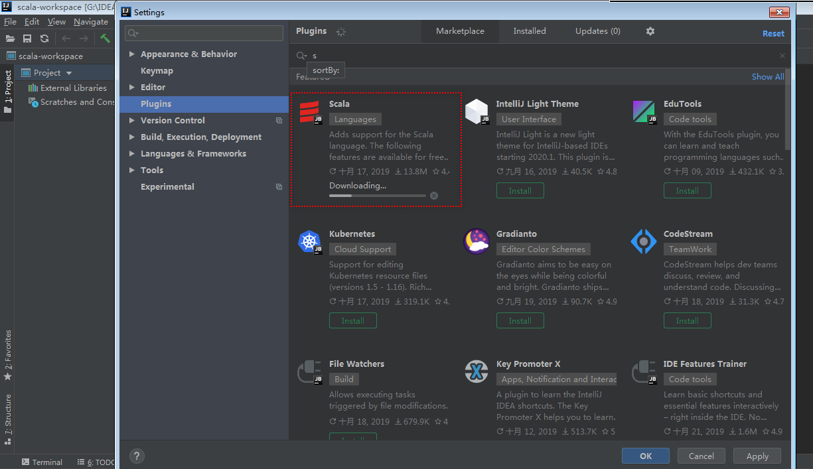
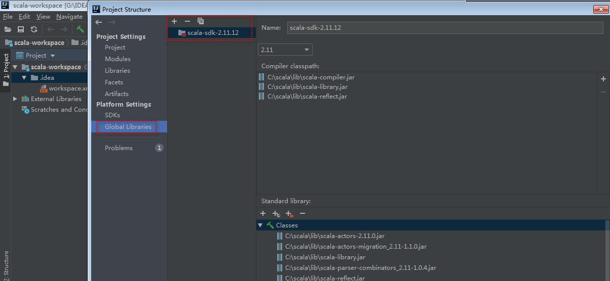
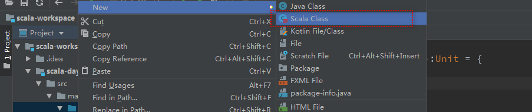
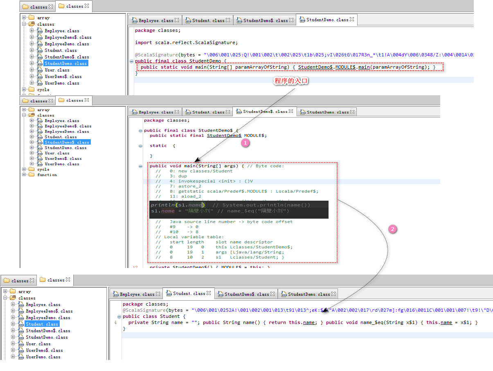
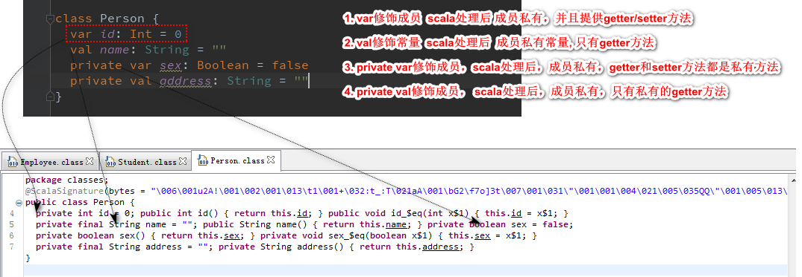
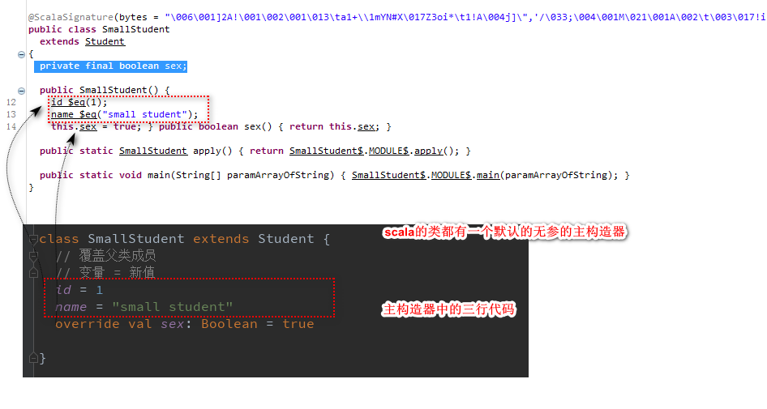
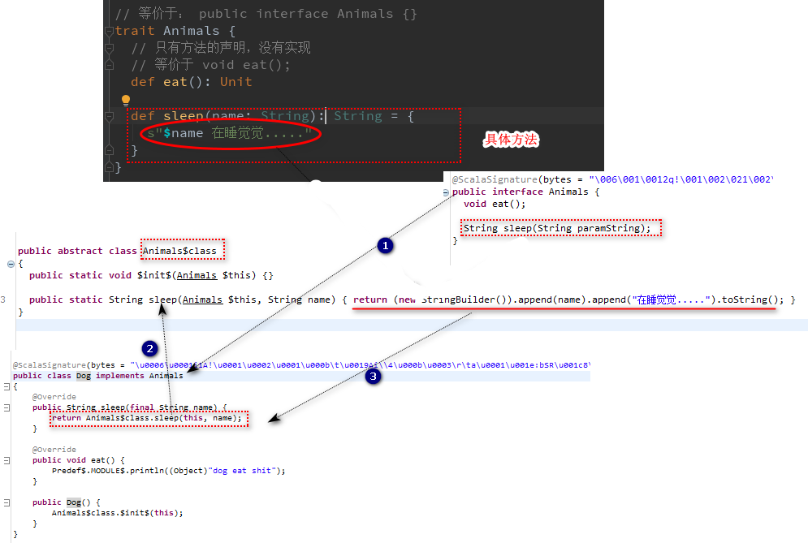
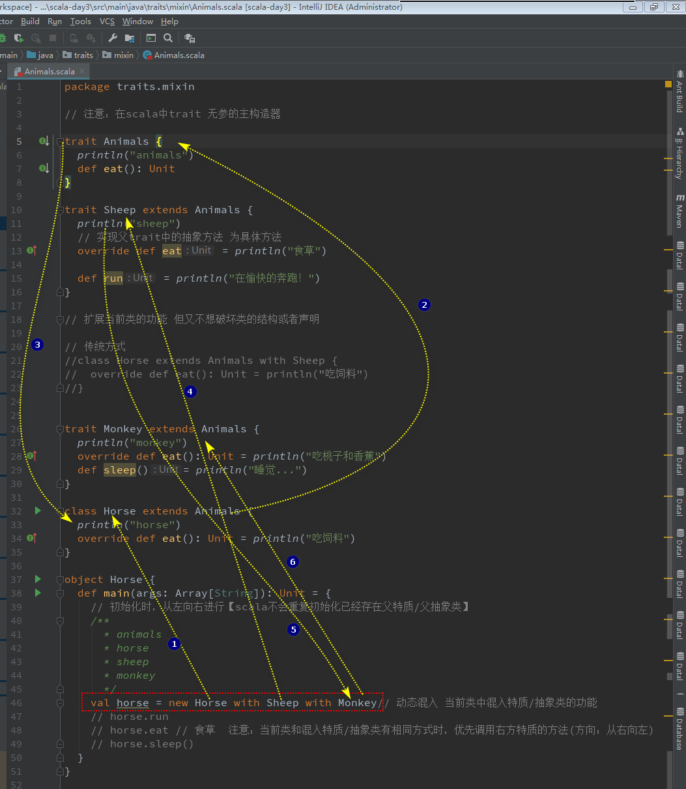
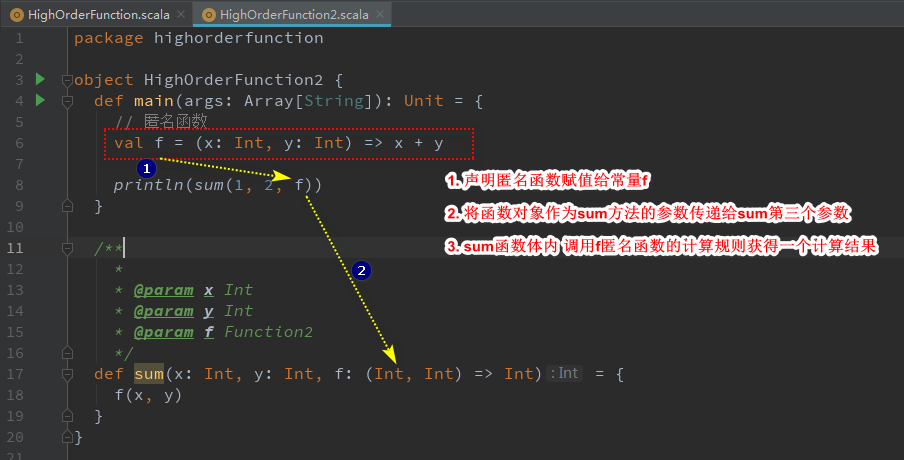

# Scala

https://www.scala-lang.org/

## 一、概述

Scala是一门多范式的编程语言，一种类似[java](https://baike.baidu.com/item/java/85979)的编程语言 [1]  ，设计初衷是实现可伸缩的语言 [2]  、并集成[面向对象编程](https://baike.baidu.com/item/面向对象编程)和[函数式编程](https://baike.baidu.com/item/函数式编程)的各种特性。

为什么要学习scala编程语言？

- 大数据开发工程师参与大数据领域中的多项开源项目都是scala编写，如：kafka、spark、flink等
- 下一代，可以替换JAVA编程语言
- 很多一线互联网公司，正在使用scala语言编写大数据处理应用

## 二、安装和使用

### 安装配置JDK（略）

```scala
C:\Users\Administrator>java -version
java version "1.8.0_161"
Java(TM) SE Runtime Environment (build 1.8.0_161-b12)
Java HotSpot(TM) 64-Bit Server VM (build 25.161-b12, mixed mode)
```

### 安装配置Scala

下载地址：https://downloads.lightbend.com/scala/2.13.1/scala-2.13.1.msi

本次课程使用的版本为：==scala-2.11.12.msi==

> 注意：安装目录最好不要出现空格和中文字符

配置环境变量

```
C:\Users\Administrator>scala -version
Scala code runner version 2.11.12 -- Copyright 2002-2017, LAMP/EPFL
```

### 使用

- 命令行（REPL模式)

  > Scala解释器读到一个表达式，对它进行求值，将它打印出来，接着再继续读下一个表达式。这个过程被称做读取（READ）--求值(Evaluation)--打印（Print）--循环（Loop），即：**REPL**。

  ```scala
  Welcome to Scala 2.12.8 (Java HotSpot(TM) 64-Bit Server VM, Java 1.8.0_161).
  Type in expressions for evaluation. Or try :help.
  
  scala> 8*5
  res0: Int = 40
  ```

  `8*5`执行计算后得到结果：40，结果被命名为`res0`，类型为`Int`

- 手动编译运行模式

  ```scala
  object HelloWorld{
  	def main(args:Array[String]):Unit = {
  		println("Hello World")
  	}
  }
  ```

  > 1. 创建scala的源文件==*.scala==
  > 2. 先编译`scalac *.scala`
  > 3. 解释执行`scala *`

- IDE工具

  > 以IntelliJ为例介绍，需要安装`scala plugin`
  
  
  
  ​	
  
  	

## 三、变量和类型

### 常用类型

和Java一样，Scala中也有7种数值类型：Byte、Short、Int、Long、Double、Float、Char，以及1个Boolean类型。跟Java不同的是，这些类型都是类，归属于`scala.*`包。还有一种常用类型为`java.lang.String`用以声明字符串

### 表达式

表达式是可计算的语句。如：

```scala
1 + 1
```

你可以使用`println`来输出表达式的结果。

```scala
// println 打印表达式的值 换行
// print 打印表达式的值 不换行
// 引用表达式的值打印
println(1) // 1
println(1 + 1) // 2
println("Hello!") // Hello!
println("Hello," + " world!") // Hello, world!
```

### 声明变量

除了可以重新赋值，变量和常量类似。你可以使用`var`关键字来定义一个变量。

```scala
var x = 1 + 1
x = 3 // This compiles because "x" is declared with the "var" keyword.
println(x * x) // 9
```

> 注意：scala类型可以被推断，或者你也可以显示地声明类型，语法`var x : Int = 10`

### 声明常量（推荐）

你可以使用`val`关键字来给表达式的结果命名。

```scala
val x = 1 + 1
println(x) // 2
x = 3 // This does not compile.
```

### 类型转换

值类型可以按照下面的方向进行转换：

 [](https://docs.scala-lang.org/resources/images/tour/type-casting-diagram.svg)

例如：

```scala
val x: Long = 987654321
val y: Float = x  // 9.8765434E8 (note that some precision is lost in this case)

val face: Char = '☺'
val number: Int = face  // 9786
```

转换是单向，下面这样写将不会通过编译。

```
val x: Long = 987654321
val y: Float = x  // 9.8765434E8
val z: Long = y  // Does not conform
```

你可以将一个类型转换为子类型

### 运算符

- 算术运算符:`+、-、*、/、%`

- 关系运算符:`==、!=、>、<、>=、<= `

- 逻辑运算符:`&&、||、!`

- 位运算符:`&(按位与)、|(按位或)、^(异或)、~(取反)、<<、>>、>>>(无符号)`

  ```scala
  2   00000010
  3   00000011
  
  2&3=2  00000010   & 同时为1 结果为1  不同为0
  2|3=3  00000011   | 有一个为1 结果为1 不同为0
  2^3=1  00000001	  ^ 相同为0,不同为1
  ~2=-3  11111101   
  2<<1=4   00000100   二进制 向左移动 n位
  2>>1=1
  >>>
  ```

- 赋值运算符:`=`

> 注意：在Scala中，运算符即是方法。
>
> `10 + 1`可以写成`10.+(1)`


### Scala类型层次结构【重点】

在Scala中，所有的值都有类型，包括数值和函数。下图阐述了类型层次结构的一个子集。


- [`Any`](https://www.scala-lang.org/api/2.12.1/scala/Any.html)是所有类型的超类型，也称为顶级类型。它定义了一些通用的方法如`equals`、`hashCode`和`toString`。`Any`有两个直接子类：`AnyVal`和`AnyRef`。
- `AnyVal`代表值类型。有9个预定义的非空的值类型分别是：`Double`、`Float`、`Long`、`Int`、`Short`、`Byte`、`Char`、`Unit`和`Boolean`。`Unit`(类似于java中的`void`)是不带任何意义的值类型，它仅有一个实例可以像这样声明：`()`。所有的函数必须有返回，所以说有时候`Unit`也是有用的返回类型。
- `AnyRef`代表引用类型。所有非值类型都被定义为引用类型。在Scala中，每个用户自定义的类型都是`AnyRef`的子类型。如果Scala被应用在Java的运行环境中，`AnyRef`相当于`java.lang.Object`。
- `Nothing`是所有类型的子类型，也称为底部类型。没有一个值是`Nothing`类型的。它的用途之一是给出非正常终止的信号，如抛出异常、程序退出或者一个无限循环（可以理解为它是一个不对值进行定义的表达式的类型，或者是一个不能正常返回的方法）。
- `Null`是所有引用类型的子类型（即`AnyRef`的任意子类型）。它有一个单例值由关键字`null`所定义。`Null`主要是使得Scala满足和其他JVM语言的互操作性，但是几乎不应该在Scala代码中使用。我们将在后面的章节中介绍`null`的替代方案。

这里有一个例子，说明了字符串、整型、布尔值和函数都是对象，这一点和其他对象一样：

```scala
val list: List[Any] = List(
  "a string",
  732,  // an integer
  'c',  // a character
  true, // a boolean value
  () => "an anonymous function returning a string"
)

list.foreach(element => println(element))
```

这里定义了一个类型`List<Any>`的变量`list`。这个列表里由多种类型进行初始化，但是它们都是`scala.Any`的实例，所以可以把它们加入到列表中。

下面是程序的输出：

```scala
a string
732
c
true
<function>
```

## 四、条件分支

```scala
if(布尔表达式 1){
  // 如果布尔表达式 1 为 true 则执行该语句块
}else if(布尔表达式 2){
  // 如果布尔表达式 2 为 true 则执行该语句块
}else if(布尔表达式 3){
  // 如果布尔表达式 3 为 true 则执行该语句块
}else {
  // 如果以上条件都为 false 执行该语句块
}
```

### if条件分支

如：

```scala
if ( n1 > 0) true
```

### if..else条件分支

如：

```scala
val result = if ( n1 > 0) true else false
```

### if..else if ... else条件分支

```scala
val result = if (n1 > 0) 1
             else if(n1 == 0) 0
             else -1
```

> 注意：
>
> - 代码块中只有一行内容，可以省略`{}`，如有多行代码需用`{}`
> - 代码块的最后一个表达式的值就是块的值
> - scala中没有switch语句，不过它有一个强大很多的模式匹配，后续介绍

## 五、循环

> Scala的循环类似于Java的循环

### while循环

```scala
while(boolean条件){
  // 循环体
}

如：求1到100数值之和
// 控制台输入求和值
val input : String = readLine("请输入：")
var num = input.toInt
var sum = 0
while(num > 0){
  sum = sum + num
  num = num - 1
}
print(sum)
```

> Note :   scala中没有`++` 和`--`，可以使用`+=1` 或`-=1`替换

### do ... while...循环

```scala
do{
  //循环体
}while(boolean条件)

如：求1到100数值之和
do {
  sum = sum.+(num)
  num = num - 1
} while (num > 0)
print(sum)
```


### for循环

Scala没有与Java for循环直接对应的结构，语法如下：

```scala
//  m to n ,返回m到n（包含m）的Range
for (n <- 1 to 100) {
  sum = sum + n
}
print(sum)

//  m until n ,返回m到n（不包含m）的Range
for (n <- 1 until 100) {
  sum = sum + n
}
print(sum)
```


### 嵌套for循环

如：九九乘法表

```scala
// 传统方式
for (m <- 1 to 9) {
  for (n <- 1 to m) {
    print(s"$m*$n=" + m * n + "\t")
    if (m == n) println
  }
}

// 推荐方式：多层循环用”;“分隔
for (m <- 1 to 9; n <- 1 to m) {
  print(s"$m*$n=" + m * n + "\t")
  if (m == n) println
}
```

### for遍历集合

```scala
val list = List[String]("Hello World", "Hello Hadoop")
for (str <- list) {
  println(str)
}
```


### for循环过滤（if守卫）

if作为for守卫语句能实现过滤的效果，显著地降低循环次数，并且更易读，如下：

```scala
for (n <- 1 to 10 if n % 2 == 0 if n > 5) {
  println(s"$n")
}
// 6 8 10
```


### yield

for 循环中的 yield 会把当前的元素记下来，保存在集合中，循环结束后将返回该集合

- 针对每一次 for 循环的迭代, yield 会产生一个值，被循环记录下来 (内部实现上，像是一个缓冲区).
- 当循环结束后, 会返回所有 yield 的值组成的集合.
- 返回集合的类型与被遍历的集合类型是一致的.

```scala
val result = for (n <- 1 to 10 if n % 2 == 1 if n != 5) yield n * 2
println(result)

//Vector(2, 6, 14, 18)

// 如果您愿意：也可以将生成器、守卫和定义包含在花括号中，并以换行的方式分隔
val result = for {n <- 1 to 10 
                  if n % 2 == 1 
                  if n != 5}yield n * 2
println(result)
```

### Break

Scala中没有提供==break==和==continue==关键词来退出循环，可以使用Breaks对象中的break方法终止循环

```scala
import scala.util.control.Breaks._
breakable {
  for (n <- 1 to 10) {
    if (n == 5) break
    println(n)
  }
}
```


## 六、函数

函数三要素：函数名、参数、函数体

### 声明函数语法

```scala
def functionName ([参数列表]) : [return type] = { 函数体}
```

#### 示例

```scala
// 无返回值
def sayHi(str: String): Unit = {
  println("Hello:" + str)
}

// 可省略返回值类型，支持自动推导
def sum(x: Int, y: Int) = x + y

def multi(x: Double, y: Double): Double = x * y
```

> 总结：
>
> - 有返回值的函数， `: 返回值类型 = {函数代码块}` 或者 `= {函数代码块}`
> - 无返回值的函数， `：Unit = {函数代码块} `或者 `{}`

### 变长参数

```scala
package function

object Function02 {
  // 主函数声明
  def main(args: Array[String]) {
    println(sum(1, 2, 3, 4, 5))
    println(sum(1))
    println(sum())
  }


  // 变长参数列表 n1 n2... nn
  // 语法：变量名:类型*
  def sum(nn: Int*): Int = {
    var sum = 0
    for (n <- nn) {
      sum += n
    }
    sum
  }

  // 注意: 如果有多个参数，可变长参数需要写在所有参数之后
  def sum2(default: Int,nn: Int*): Int = {
    var sum = 0
    for (n <- nn) {
      sum += n
    }
    sum
  }
}
```


### 参数默认值

```scala
package function

object Function03 {
  def main(args: Array[String]): Unit = {
    println(m1("Welcome"))
    // 无给定值，使用默认值
    println(m2())
    // 给定值，使用给定值
    println(m2("welcome", 20, 100.0))

    // 部分参数使用给定值，另一部分参数使用默认值
    println(m2("welcome"))

    // 给特定的参数赋予给定值，其余使用默认值
    println(m2(arg2 = 100))
  }

  // 默认值函数
  def m1(arg1: String = "Hello"): String = {
    arg1
  }

  // 默认值函数
  // 注意：函数不支持重载，只有方法支持重载
  def m2(arg1: String = "Hello", arg2: Int = 10, arg3: Double = 10.0): String = {
    arg1 + "\t" + arg2 + "\t" + arg3
  }
}
```


### 带名参数

```scala
m1(arg2 = 100, arg1 = "new value")

def m1(arg1: String = "default value1", arg2: Int = 10): Unit ={
  println (arg1 + "\t" + arg2)
}
//new value	<---> 100

```


### Lazy值

> **懒加载**，当val被声明为lazy时，它的初始化将被推迟，直到我们首次对它取值。

```scala
import scala.io.Source._

/**
  * lazy值 使用时初始化 节省资源
  */
object function03 {
  def main(args: Array[String]): Unit = {
    val file1 = fromFile("").mkString
    println(file1)

//    lazy val file2 = fromFile("").mkString
//    println(file2)
  }
}
```

### 递归函数

递归求1到n之和

```scala
def sum(n: Int): Int = {
  var total = 0
  if (n >= 1) {
    total = n + sum(n - 1)
  }
  total
}
```

递归求1到n的阶乘

```scala
def factorial(n: Int): Int = {
  if (n > 1) {
    n * factorial(n - 1)
  } else {
    1
  }
}
```


### 匿名函数

Scala 中定义匿名函数的语法很简单，箭头左边是参数列表，右边是函数体。使用匿名函数后，我们的代码变得更简洁了。

```scala
package function

/**
  * 递归使用
  */
object Function05 {
  def main(args: Array[String]): Unit = {

    // 匿名函数： 没有函数名
    val f1: Function2[Int, Int, Int] = (x: Int, y: Int) => x + y
    println(f1)

    val f2 = () => "Hello:"
    println(f2)


    val f3 = (x: Int, y: Int, z: Int) => x * y * z
    println(f3)


    List("a", "b").foreach(n => println(n))

    /*
    <function2>
    <function0>
    <function3>
    a
    b
    */

    println(f1(1,2))
    println(f2())
    println(f2) // 打印对象，注意：没有参数的匿名函数需要加()调用
    println(f3(2,2,2))
  }
}
```

> 注意：
>
> - 匿名函数返回的是一个函数对象（Function，scala提供了23个函数对象，分别对应0到22个参数）

### 柯里化(Currying)

柯里化(Currying)指的是将原来接受两个参数的函数变成新的接收一个参数的函数的过程。新的函数返回一个以原有第二个参数为参数的函数。

```scala
package function

/**
  * 柯里化函数(curring)
  * 将多个参数的函数 转换为接收一个参数函数的过程，就称为柯里化，并返回以第二个参数为参数的函数
  */
object Function06 {
  def main(args: Array[String]): Unit = {
    println(sum2(1)(6))
    println(sum3(1)(6))
    println(sum4(1)(6)(2))
    println(sum4 _)
  }

  // 普通函数
  def sum1(x: Int, y: Int): Int = {
    x + y
  }

  // 柯里化函数
  def sum2(x: Int) = (y: Int) => x + y

  // 柯里化函数 简化写法
  def sum3(x: Int)(y: Int) = x + y

  def sum4(x: Int)(y: Int)(z: Int) = x + y + z
}
```


## 七、数组操作

- 概念上类似于Java中的数组，一个特定类型的元素集合

### 数组的初始化

```scala
package array

object Array01 {
  def main(args: Array[String]): Unit = {
    // 数组声明
    // a1数组的长度为10 泛型为Int
    val a1 = new Array[Int](10)
    val a2 = new Array[String](5)

    // 指定数组 元素并初始化
    val a3 = Array[Long](10,20,30)

    val a4 = Array(1.0,2.0,3.0)

    // 使用：长度 length  下标index【0 ~ length-1】
    // 访问数组元素使用 变量名(下标)
    // 数组默认值：整数为 0  小数为0.0  boolean false null
    println(a1(0))
    println(a2(4))
    println(a3(1))
    println(a4(2))
      
    // 遍历 传统方式
    for (n <- 0 until (a4.length)) {
      println(a4(n))
    }

    for (n <- a4) {
      println(n)
    }

    for( n <- a4.indices){ // Range(0,1,2)
      println(a4(n))
    }
  }
}
```

### 数组的使用

- 长度 **length**
- 下标 **index**

```scala
val a1 = Array(1, 2, 3, 4, 5)
// 传统方式
for (n <- 0 until (a1.length)) {
  println(a1(n))
}
// 推荐方式
for (n <- a1.indices) {
  println(a1(n))
}

// 跳跃遍历(步长2)
for (n <- a1.indices by 2) {
  print(a1(n) +"\t")
}
```


### 排序

```scala
/**
  * 冒泡排序
  * 2 1 5 0 3
  * 第一轮：
  *   1 2 5 0 3
  *   1 2 5 0 3
  *   0 2 2 1 3
  *
  *
  */
package array

/**
  * 冒泡排序
  */
object Array02 {
  def main(args: Array[String]): Unit = {
    val a1 = Array(3, 1, 5, 4, 10, 0)
    //    for (m <- 0 until (a1.length)) {
    //      for (n <- 0 until (a1.length - m - 1)) {
    //        if (a1(n) > a1(n + 1)) {
    //          var tmp = a1(n)
    //          a1(n) = a1(n + 1)
    //          a1(n + 1) = tmp
    //        }
    //      }
    //    }

    // 多重循环  + if守卫  
    for (m <- 0 until (a1.length); n <- 0 until (a1.length - m - 1) if a1(n) > a1(n + 1)) {
      val tmp = a1(n)
      a1(n) = a1(n + 1)
      a1(n + 1) = tmp
    }

    for (n <- a1) {
      println(n)
    }
  }
}
```

### ArrayBuffer

> 可变数组，数组支持自动扩容

- 类似于**ArrayList**集合

```scala
import scala.collection.mutable.ArrayBuffer

object ArrayBuffer01 {
  def main(args: Array[String]): Unit = {
    val a1 = new ArrayBuffer[Byte]()
    // 注意： += 语法是给ArrayBuffer添加元素
    a1 += 1
    a1 += 2
    // 一次性添加多个元素
    a1 += (3,4,5)
    // 注意： ++= 将数组中的所有元素添加到ArrayBuffer中
    a1 ++= Array[Byte](6,7,8)
    // 从末尾截断指定个数的元素
    a1.trimEnd(3)

    // 从下标5 添加元素 6，7，8
    a1.insert(5,6,7,8)

    // 跳跃遍历
    for ( i <- 0 until(a3.length,2) ) {
      print(a3(i) +"\t")
    }
  }
}
```


### Array和ArrayBuffer相互转换

```scala
val a1 = new ArrayBuffer[Byte]()
// 转为数组
val a2 = a1.toArray
a2(2) = 0

// 转为ArrayBuffer
val a3 = a2.toBuffer

println(a1)
println(a3)
```

### 其它操作

```scala
import scala.util.Sorting

object Array04 {
  def main(args: Array[String]): Unit = {
    val a1 = Array(5,4,3,2,1)
    println(a1.sum) //15
    println(a1.max) //5
    println(a1.min) //1

    println(a1.mkString) //54321
    println(a1.mkString(",")) //5,4,3,2,1
    println(a1.mkString("<",",",">")) //<5,4,3,2,1>

    //println(a1.sorted.mkString) // 排序
    Sorting.quickSort(a1) //快速排序
    println(a1.mkString)
  }
}
```

### 多维数组

#### 定义

```scala
// 二维数组 有三个一维数组，每个一维中包含四个元素
val arr = Array.ofDim(3,4)
```

#### 使用

```scala
package com.baizhi.array

/**
  * 多维数组
  */
object MultiplyBuffer01 {
  def main(args: Array[String]): Unit = {
    val arr = Array.ofDim[Int](3, 4)
    for (m <- arr) {
      print(m.mkString(","))
      println()
    }

    // 二维数组赋值
    arr(2)(1) = 100
    for (m <- arr) {
      print(m.mkString(","))
      println()
    }
  }
}
```

### 算法案列：移除第一个负数后的所有数

- 测试数据`val a1=Array(1,2,3,4,5,-5,-4,-3)`
- 预期结果`val a2=Array(1,2,3,4,5,-5)`

```scala
package array

object Array05 {
  def main(args: Array[String]): Unit = {
    // val a1=Array(1,2,3,4,5,-5,-4,-3)
    // val a2=Array(1,2,3,4,5,-5)

    val a1 = Array(1, 2, 3, 4, 5, -5, -4, -3)
    var first = true
    var position = 0
    for (n <- a1.indices) {
      if (first || a1(n) >= 0) {
        if(a1(n) <0 ){
          first = false
          position = n
        }
      }
    }

    println(position)

    val ab = a1.toBuffer
    ab.trimEnd(a1.length - position-1)
    println(ab)
  }
}
```


## 八、类

类是对象的模板， 属性（有什么）和方法（做什么）

### 类定义

```scala
package classes

// 简化写法
// class User

// 标准写法
class User {

}

object UserDemo {
  def main(args: Array[String]): Unit = {
    // 创建对象 "new" 关键字
    val user1 = new User()  // 调用类提供的默认无参构造

    val user2 = new User
  }
}
```

> 关键字`new` 被用于创建类的实例，类默认提供一个无参的构造器

### 简单类

Scala中的类，类似于java，由属性和方法构成

```scala
package classes

class Student {
  var name: String = "" // 必须初始化
  var age: Int = 0

  def sayHello(): String = {
    "Hello:" + name + ",I am " + age + "years old"
  }

  // override def toString: String = this.name + "\t" + this.age
}

object StudentDemo {
  def main(args: Array[String]): Unit = {
    val s1 = new Student()
    s1.name = "小红"
    s1.age = 18
    val s2 = new Student
    s2.name = "小青"
    s2.age = 20
    println(s1) // 小红	18
    println(s2) //小青	20
  }
}
```




### getter/setter



#### 自动生成

```scala
class Person {
  var name: String = null
  val age : Int = 0
  private var sex: Boolean = false 
}
```

> 注意：
>
> - 在scala类中，声明的属性都是私有成员
> - 用`var`定义的属性，自动提供getter/setter方法
> - 用`val`定义的属性，自动提供getter方法
> - scala中的getter/setter，命名不同于java，语法是 name 和 name_
> - 在scala中属性一旦设置为`private`, 它的getter/setter方法均为私有，仅限本类使用。

#### 手动生成

getter方法 ----> `def 区分成员名() = 成员值`

setter方法 ----> `def 区分成员名_(形参) {成员值 = 形参值}`

```scala
package classes

class Dog {

  private var privateColor: String = "black"

  // 属性名和方法名不能相同
  // def color(): String = privateColor

  // 手动生成getter/setter方法
  def color = privateColor

  def color_(color: String): Unit = {
    privateColor = color
  }
}

object DogDemo {
  def main(args: Array[String]): Unit = {
    val dog = new Dog
    dog.color_("red")
    println(dog.color)
  }
}
```

#### @BeanProperty

```scala
import scala.beans.BeanProperty

class Fish {
  // 自动生成scala和java风格的getter和setter
  @BeanProperty var kind:String = ""
}

object Fish{
  def main(args: Array[String]): Unit = {
    val fish = new Fish
    fish.kind = "金鱼"
    println(fish.kind)

    val fish2 = new Fish
    fish2.setKind("鲫鱼")
    println(fish2.getKind)
  }
}
```

> 注意：scala的字段被标注为@BeanProperty时，会自动生成Java和Scala的getter/setter
>
> 反编译后的结果如下：
>
> ```java
> public class Person3
> {
> private String name = null; 
> public String name() { return this.name; } 
> public void name_$eq(String x$1) { this.name = x$1; } 
> public String getName() { return name(); } 
> public void setName(String x$1) { name_$eq(x$1); }
> }
> ```


### 辅助构造器

类似于Java中重载的构造方法，Scala的类有一个主构造器（Primary Constructor）和任意多个辅助构造器（Auxiliary Constructor）

- 辅助构造器的名称为this
- **每一个辅助构造器必须以一个对先前已定义的其它辅助构造器或主构造器的调用开始**

如：

```scala
package classes

class Fish {
  var kind: String = ""
  var name: String = ""

  def this(name: String) {
    this() // 调用主构造
    this.name = name
  }

  def this(name: String, kind: String) {
    this(name)   // 调用前一个辅助构造器
    this.kind = kind
  }
}

object FishDemo{
  def main(args: Array[String]): Unit = {
    val f1 = new Fish("鲫鱼")
    val f2 = new Fish("金鱼","xdd")
    val f3 = new Fish()
  }
}
```


### 主构造器

在scala中，每个类都有主构造器。主构造器并不以this方法定义，而是与类定义交织在一起

```scala
// 主构造器的参数写在类名之后  方法体为整个类
class Tiger(val color: String){

}

```

主构造的参数被编译成字段，其值被初始化成构造传入的参数。注意：主构造函数看上去和类的定义已经完全融合在了一起！它的参数列表放到了类名的后面（我们也可以直接叫它类参数列表），它的方法体就是整个类体，实例化一个类时，类体（主构造函数）中所有可行的部分都会被执行，不管是函数调用还是表达式等等，只是对于类的字段和方法声明而言是没有什么可执行的，它们只是声明而已。

```scala
// 主构造器的参数写在类名之后 color
class Tiger(val color: String) {
  println("构造开始")

  def sayHi(name: String): String = {
    "Hello:" + name
  }

  println("构造结束")
}

object TigerDemo {
  def main(args: Array[String]): Unit = {
    val t1 = new Tiger("红色")
    println("-------------------------------")
    val t2 = new Tiger("白色")
  }
}
/*
构造开始
构造结束
-------------------------------
构造开始
构造结束
*/
```

#### 主构造的其它变化

```scala
// 对于var修饰的参数：外部可读/可改写 （实际上是：编译器为该类参数（字段）自动生成了getter和setter）
class Tiger2(var name: String, var age: Int) {
  var sex: String = ""
}
// 同上
class Tiger2(var name: String, var age: Int) {
  var sex: String = ""
}

// 对于val修饰的参数：外部可读/不可改写（实际上是：编译器为该类参数（字段）只生成了getter没有生成setter）
class Tiger3(var name: String, var age: Int, val sex: Boolean) {
}

// 对于private var修饰的参数：内部可读/可改写 （编译器不会为私有类参数（字段）自动生成getter和setter）
// 对于private val修饰的参数：内部可读/不可改写 （编译器不会为该类参数（字段）自动生成getter和setter）
class Tiger4(private var name: String) {
  
}

// 不带val或者var的参数，不会作为类的成员，只有被一个方法所使用，它将被升格为字段
class Tiger5(name: String, age: Int) {
  def sayHi() = "Hello:" + name
}
```


## 八、对象

### 单例对象

Scala中没有静态方法或者静态属性，可以使用`object`这样的语法达到相同目的。

```scala
package objects

object IdFactory {
  private var id: Int = 0

  def getId(): Int = {
    id += 1
    id
  }
}

object TestIdFactory {
  def main(args: Array[String]): Unit = {
    println(IdFactory.getId()) // 1
    println(IdFactory.getId()) // 2
   
    println(IdFactory == IdFactory) // true
  }
}
```


### 伴生对象

当类名和单例类名字一样的时候，我们把单例类称为伴生对象

```scala
package objects

// 伴生对象
object Person {
  private var id: Int = 0

  def getPersonNum(): Int = {
    id += 1
    id
  }

  def main(args: Array[String]): Unit = {
    val p1 = new Person()
    val p2 = new Person()
    val p3 = Person
    val p4 = Person
    println(p1 == p2) // false
    println(p3 == p4) // true
    println(p1.id) // 1
    println(p2.id) // 2
  }
}

// 伴生类
class Person {
  private var id: Int = Person.getPersonNum() // 伴生类中 可以调用伴生对象的私有方法
  private var address: String = ""
}
```

> 注意：
>
> - object声明的为==伴生对象==，class声明的为==伴生类==
> - 伴生类可以访问伴生对象中的私有成员，前提是在同一源文件中，语法：==伴生对象.私有成员|方法==

### apply & unapply

apply 方法用在object中一般作为工厂方法用于产生Class对象

```scala
class Tiger(var kind: String) {}

object Tiger {
  def apply(kind: String): Tiger = new Tiger( kind)

  def main(args: Array[String]): Unit = {
    val t1=  Tiger.apply("东北虎")
    val t2 = Tiger("东北虎")
  }
}
```

> apply方法的最佳实践方式之一就是用来做工厂。比如在Scala的标准库中，许多集合类给我们提供了apply方法来创建集合：
>
> ```scala
> val a1 = Array(1,2,3)
> val b1 = List("Hello Hadoop","Hello Scala")
> ```

可以认为unapply方法是apply方法的反向操作，apply方法接受构造参数变成对象，而unapply方法接受一个对象，从中提取值

```scala
class Tiger(var kind: String) {}

object Tiger {
  def apply(kind: String): Tiger = new Tiger(kind)

  def unapply(arg: Tiger): Option[String] = {
    if (arg == null) None
    else Some(arg.kind)
  }

  def main(args: Array[String]): Unit = {
    val t1 = Tiger.apply("东北虎")
    val t2 = Tiger("东北虎")

    val Tiger(kind) = t2
    println(kind) // 东北虎
  }
}
```


## 九、继承

scala继承使用==extends==关键字

```scala
package classes

class Animals {
  var name: String = ""
}

class Bear extends Animals {
  def run = name + "在愉快的奔跑！"
}

object AnimalsDemo {
  def main(args: Array[String]): Unit = {
    val bear = new Bear
    bear.name = "北极熊"
    println(bear.run) // 北极熊在愉快的奔跑！
  }
}
```


### 方法覆盖

覆盖父类中的方法，使用==override==关键字

如：

```scala
class Animals {
  var name: String = ""
}

class Bear extends Animals {
  def run = name + "在愉快的奔跑！"
	// 覆盖toString方法
  override def toString: String = name+"愉快的玩耍！"
}

object AnimalsDemo {
  def main(args: Array[String]): Unit = {
    val bear = new Bear
    bear.name = "北极熊"
    println(bear.run)

    println(bear)
  }
}
```

> 注意：
>
> - final修饰的方法不能覆盖，类不能继承
> - 调用父类中的方法，使用==super.方法名==


### 类型检查和转换

判断类型是否兼容，可以使用==isInstanceOf==

类型强转，可以使用==asInstanceOf==

```scala
val bear = new Bear
bear.name = "北极熊"
// println(bear.run)
// println(bear)
println(bear.isInstanceOf[Animals]) //true  // 判断类型是否兼容
println(bear.asInstanceOf[Animals]) //classes.Bear@7d417077  // 类型转换
println(bear.getClass == classOf[Bear])  //true // 判断真实类型是否匹配
```


### 调用父类有参构造

类有一个主构器和任意数量的辅助构造器，而每个辅助构造器都必须以对先前定义的辅助构造器或主构造器的调用开始。子类的辅助构造器最终都会调用主构造器，只有主构造器可以调用超类的构造器。辅助构造器永远都不可能直接调用超类的构造器。在Scala的构造器中，`你不能调用super(params)`

```scala
import java.util.Date

class Person(var name: String)


// 表示：在创建子类对象时，首先调用父类的有参的主构造器
class Man(name: String, val birthday: Date) extends Person(name: String)


class Color

class Green extends Color()
```


### 重写字段



```scala
package classes.constructor

class Animals3 {
  var name: String = ""
  var count: Int = 0
  val sex: Boolean = false
}

class Dog3 extends Animals3 {
  name = "xh"
  count = 1
  override val sex: Boolean = true
}

object Animals3Demo {
  def main(args: Array[String]): Unit = {
    val a1: Animals3 = new Dog3()
    println(a1.name)  // "xh"
    println(a1.count) // "1"
    println(a1.sex)   // "true"
  }
}
```

覆写具体val 字段时，override 关键字是必不可少的，不过对于count 这个var 字段而言，则不然。这是因为修改val 字段意味着我们正在修改某一常量（val 字段）的初始化过程，这类“特殊”操作需要使用override 关键字。


### 抽象类

和Java一样，使用==abstract==关键字来标记不能被实例化的类

```scala
package classes.constructor

abstract class Student {
  var name: String // 抽象字段,没有初始化

  var sex: Boolean = false // 普通字段

  def playGame(): String // 抽象方法 只有方法的声明，没有实现
}

class SmallStudent extends Student {
  var name: String = "小王"

  def playGame(): String = s"$name play 王者荣耀"
}

object StudentDemo {
  def main(args: Array[String]): Unit = {
    val s:Student = new SmallStudent
    s.name="小刘"
    println(s.playGame())
  }
}
```

> 注意：
>
> - 子类重写超类的抽象方法或者抽象字段时，可以省略==override==关键字
> - 抽象类中的抽象字段被标记为==var==，生成的JAVA类并不带字段，自动产生抽象的getter和setter方法
> - 抽象类中的抽象字段被标记为==val==，生成的JAVA类并不带字段，自动产生抽象的getter

------

### 匿名子类

类似Java的匿名内部类，可以通过包含带有定义或者重写代码块的方式创建一个匿名的子类

```scala
val s2 = new Student {
  override def playGame(): String = s"$name play LOL"
  override var name: String = "小张"
}
println(s2.playGame())  // 小张 play LOL
```


### 包可见性（访问修饰符）


> 在Scala里面就出现下面这几种类型：这里的省缺修饰符default，就是public。
>
> - Class：类
> - Companion：(伴生对象（相当于一个java里面的静态类），必须与所要陪伴的类放在同一个文件中)
> - Subclass：子类
> - Package：包
> - World：同一文件

```scala
class Student {
  // 缺省为public
  var name: String = ""
  val sex: Boolean = false
  private var age: Int = 0
  protected var birthday = new Date()
}
```

private限定 private修饰的属性只能对本类可以使用，对于伴生对象可见

```scala
object Student {
  def apply(): Student = new Student()

  def main(args: Array[String]): Unit = {
    val s1 = Student()
    // 伴生对象访问伴生类中的公开成员 ok
    println(s1.sex)
    // 伴生对象访问伴生类中的私有成员 ok
    println(s1.age)
    // 伴生对象访问伴生类中的受保护成员 ok
    println(s1.birthday)
  }
}
```

protected限定 protect修饰的属性对本类/伴生对象以及子类/子类的伴生对象可见

```scala
class SmallStudent extends Student {

}

object SmallStudent {
  def apply: SmallStudent = new SmallStudent()

  def main(args: Array[String]): Unit = {
    val s1 = Student()
    println(s1.birthday) //ok
    println(s1.sex) //ok
    println(s1.age) //error
  }
}
```

==private[this]==限定  如果严格限定属性可以操作范围仅仅限制在本类，去除伴生对象的可见性，可以添加this限定

```scala
class Student {
  private[this] var id: Int = 1
}

object Student {
  def apply(): Student = new Student()

  def main(args: Array[String]): Unit = {
    val s1 = Student()
    // private[this] 修饰符仅限在伴生类中使用
    println(s1.id) //error
  }
}

```

==protected[this]==限定如果严格限定属性可以操作范围仅仅限制在本类及其子类，去除伴生对象的可见性，可以添加protected限定

```scala
class SmallStudent extends Student {
  override def toString: String = super.address // ok
}

object SmallStudent {
  def apply: SmallStudent = new SmallStudent()

  def main(args: Array[String]): Unit = {
    val s1 = Student()
    println(s1.birthday) //ok
    println(s1.sex) //ok
    println(s1.age) //error
    println(s1) //error
  }
}
```

## 十、特质trait

类似于Java中的接口


### 语法

- 特质关键词`trait`

- 特质可以同时用于抽象方法和具体方法

- 无父类 实现特质`extends trait1 with trait2 with trait3 ...`

- 有父类 实现特质`extends 父类 with 特质1 with 特质2 ...`

  

### 当做接口的特质

1. Scala可以完全像Java接口一样工作, 你不需要将抽象方法声明为 abstract, 特质中未被实现的方法默认就是抽象方法;
2. 类可以通过 extends 关键字继承特质, 如果需要的特质不止一个, 通过 with 关键字添加额外特质
3. 重写特质的抽象方法时, 不需要 override 关键字
4. 所有 Java 接口都可以当做 Scala 特质使用 `trait Animals extends Serializable with Cloneable`

```scala
package traits

// 注意： java的接口可以当做scala的trait使用
// trait Animals extends Serializable with Cloneable

// 等价于： public interface Animals {}
trait Animals {
  // 只有方法的声明，没有实现
  // 等价于 void eat();
  def eat(): Unit
}

// 如果当前类Dog没有父类  extends 特质
class Dog extends Animals {
  // 等价于 实现接口中的 public void eat()
  override def eat(): Unit = println("dog eat shit")
}

object AnimalsDemo {
  def main(args: Array[String]): Unit = {
    val dog = new Dog
    dog.eat()
  }
}
```


### 带有具体实现的特质

```scala
trait Animals {
  def eat(food: String): String
  def sleep():Unit = println("animals sleep~~~") // 特质带有方法实现的方法
}

```



> 注意：让特质混有具体行为有一个弊端. 当特质改变时, 所有混入该特质的类都必须重新编译


### 带有特质的对象 动态混入(mixin) [ 重点]

在构造单个对象时, 你可以为它添加特质

- 特质可以将对象原本没有的方法与字段加入对象中， 功能扩展
- 无需修改类声明定义，扩展类的功能，灵活简便
- 如果特质和对象改写了同一超类的方法, 则排在右边的先被执行

```scala
package traits.test1.mixin

trait Animals {
  def eat(): Unit
}

trait Sheep extends Animals {
  // 实现特质声明的方法
  override def eat() = {
    println("吃草")
  }

  def run = println("在跑...")

  def sleep
}

class Person extends Animals {
  override def eat(): Unit = {
    println("吃食物")
  }
}

object Person {
  def main(args: Array[String]): Unit = {
    val person = new Person with Sheep {
      override def sleep: Unit = println("睡觉觉！！！")
    } // 动态混入
    person.eat // Person 和 Sheep都有eat方法，调用时从右往左调用  输出 吃草
    person.run // Person 中没有run方法，Sheep特质将自己的方法混入Person
    person.sleep  // 睡觉觉！！！
  }
}
```



### this别名

看scala的源码的话很发现很多源码开头都有一句：`self =>` 这句相当于给`this`起了一个别名为`self`。`self`不是关键字，可以用除了`this`外的任何名字命名(除关键字)。就下面的代码，在Student内部，可以用`this`指代当前对象，也可以用`self`指代，两者是等价的。

```scala
class Student {
  self => // this起别名
  val x = 2

  def foo = self.x + this.x
}

object Student {
  def main(args: Array[String]): Unit = {
    val s1 = new Student
    println(s1.foo) //4
  }
}
```

它的一个场景是用在有内部类的情况下：

```scala
class Outer {
  outer =>
  val v1 = "here"
  class Inner {
    inner =>
    val v1 = "-------------"
    println(outer.v1) // 用outer表示外部类，相当于Outer.this
    println(inner.v1)
  }
}
```

### self-type

>  强制混入

自类型用于声明一个特质**必须**混入其他特质，尽管该特质没有直接扩展其他特质。 这使得所依赖的成员可以在没有导入的情况下使用。

自类型是一种细化 `this` 或 `this` 别名之类型的方法。 语法看起来像普通函数语法，但是意义完全不一样。

要在特质中使用自类型，写一个标识符，跟上要混入的另一个特质，以及 `=>`（例如 `someIdentifier: SomeOtherTrait =>`）

```scala
package traits

trait A {
  val name: String
}

trait B {
  this: A => // this:混入类型 => [self type] 在特质中混入特质，所依赖的成员可以再没有导入的情况下使用
  def sayHi = s"Hello:$name"
}

class C(val name: String) extends B with A {

}

object C {
  def main(args: Array[String]): Unit = {
    val c = new C("zs")
    println(c.sayHi)
  }
}
```


## 十一、高阶函数

scala的函数对象是一种特殊的class，即可担当函数计算职责又可以作为变量传递

### 作为值的函数

```scala
object Function04 {
  def main(args: Array[String]): Unit = {
    val result = sum _ // _ 匹配函数参数列表
    println(result)
  }

  def sum(x: Int, y: Int): Int = x + y
}

```

> 作用：
>
> - 调用
> - 作为参数传递

### 匿名函数（略）

> 参考之前

### 柯里化函数（略）

### 带函数参数的函数



```scala
object Function05 {
  def main(args: Array[String]): Unit = {
    val f1 = (x: Int, y: Int) => x + y  // 声明匿名函数
    val result = sum(1, 2, f1)
    println(result)  // 3
  }

  def sum(x: Int, y: Int, f: (Int, Int) => Int) = {  // 带函数参数的函数 函数作为值传递
    f(x, y)
  }
}
```


### 参数（类型）推断

```scala
// 方式1 
val a1 = Array(1, 2, 3, 4)
val f2 = (x: Int) =>  println(x)
// foreach 遍历方法 参数需要一个函数对象
a1.foreach(f2)

// 方式2
a1.foreach((x) => println(x))  // 函数参数的类型自动推导

// 方式3
a1.foreach(x => println(x)) // 对于只有一个参数的函数，省略参数外围的（）

// 方式4
a1.foreach(println(_)) // 参数在 => 右侧出现一次，可以用 _ 替换掉

// 方式5
a1.foreach(println)  // 更为简化的写法
```

### 一些有用的高阶函数

- map  映射方法

  ```scala
  Array(1, 2, 3, 4, 5).map("*" * _).foreach(println _)
  ```

- filter 过滤方法

  ```scala
  (1 to 10).filter(_ % 2 == 0).foreach(println)
  ```

- reduceLeft  从左计算

  ```scala
  (1 to 10).filter(_ % 2 == 0).reduceLeft((x,y) => x+y) // 30
  ```

- WordCount(单词计数）

  ```scala
  val a1 = Array("Hello Scala", "Hello Hadoop", "Hello Hello Hello")
  a1.flatMap(_.split(" ")).map((_, 1)).groupBy(_._1).map(x => (x._1, x._2.length)).foreach(println)
  ```

### 函数闭包

闭包指在函数体内，可以访问相应作用域内的任何变量，因为它引用到函数外面定义的变量，定义这个函数的过程是将这个自由变量捕获而构成一个封闭的函数。 

语法:`函数 + 外部变量 = 闭包`

如：

```scala
var num = 1  // 外部变量
val result = (x: Int) => num + x // 匿名函数引用外部变量,闭包后 多次调用 共享相同的外部变量
println(result(1)) // 1
num += 10
println(result(1)) // 12
```

```
// f1 按道理来说 函数对象不能够使用当前类的声明变量
// 函数闭包：可以将当前外部变量 闭包到函数对象中  语法： 函数对象 + 外部变量 = 闭包
// 外部变量是一个共享变量，一旦外部变量值发生变化  会影响到函数对象中的内容
```


## 十二、异常处理

### 异常

- Scala 的异常处理和其它语言比如 Java 类似。
- Scala 的方法可以通过抛出异常的方法的方式来终止相关代码的运行，不必通过返回值。

```scala
package exception

import java.io.IOException


/**
  * scala异常分类和java一样的
  * Throwable
  *    |- Error
  *    |- Exception
  *    |- 未检查异常
  *    |- 已检查异常
  *
  * 异常处理的方式：
  *    - 消极处理： throw 异常类 没有throws
  *    - 积极处理： try{...}catch(){...}finally{...}
  */
object ExceptionDemo {
  def main(args: Array[String]): Unit = {
    try {
      println("start")
      // throw new RuntimeException("程序终止！！") // Exception in thread "main" java.lang.RuntimeException: 程序终止！！
      throw new IOException
      println("end")
    } catch {
      // 模式匹配
      case e1: RuntimeException => println("runtime exception")
      case e2: Exception => println("exception")
      case _ => println("xxxx") // 如果以上声明的两种异常不匹配，则进入最后一个
    } finally {
      println("释放资源")
    }
  }
}
```

## 十三、隐式转换

隐式转换函数(implicit conversion function)指的是以==implicit==关键字声明的带有<u>单个参数</u>的函数。这样的函数将被自动应用，将值从**一种类型转换为另一种类型**。隐式转换函数叫什么名字是无所谓的，因为通常不会由用户手动调用，而是由Scala进行调用。但是如果要使用隐式转换，则需要对隐式转换函数进行导入（`import`）。因此通常建议将隐式转换函数的名称命名为“one2one”的形式。

常用使用方式：

- 隐式值
- 隐式参数
- 参数的隐式转换
- 隐式类

Scala会考虑如下位置的隐式转换函数：

- 位于源或目标类型的伴生对象中的隐式函数
- 位于当前作用域可以以单个标识符指代的隐式函数

隐式转换在如下三种不同情况下会被考虑：

- 当表达式类型与预期类型不同时
- 当对象访问一个不存在成员时
- 当对象调用某个方法，而这个方法的参数声明与传入参数不匹配时

有三种情况编译器不会尝试使用隐式转换

- 如果代码能够在不使用隐式转换的前提下通过编译，则不会使用隐式转换
- 编译器不会尝试同时执行多个转换
- 存在二义性的转换是错误


### 隐式值

```scala
/**
  * implicit 隐式值
  */
object ImplicitValue {

  // 隐式值声明 对象内部或者作用域
  implicit val name: String = "Hello"

  // implicit val address:String = "bj"  // error

  implicit val sex: Boolean = false // ok


  def main(args: Array[String]): Unit = {
    // 使用隐式值
    val newValue = implicitly[String]
    val newValue2 = implicitly[Boolean]
    println(newValue)
    println(newValue2)
  }
}
```

### 隐式参数（传值）

方法或者函数的参数，在声明时有implicit。要求参数之中只能有一个implicit类型匹配。

```scala
package implicits

/**
  * 隐式参数
  *
  */
object ImplicitParams {
  // 声明隐式值 缺省值
  implicit var num: Int = 10

  def main(args: Array[String]): Unit = {
    println(sum(10))
    println(sum(10)(20))
  }

  def sum(x: Int)(implicit y: Int): Int = { // y是隐式参数 适用于柯里化函数
    x + y
  }

  //  def sum2(x: Int,implicit y: Int): Int = { // 不可以 普通函数是无法使用隐式参数
  //    x + y
  //  }

  implicit val str: String = "Hello"

  //  def sum3(x: Int)(implicit y: Int)(implicit z: String): Int = { // 不可以 隐式参数只能在柯里化函数中出现一次
  //
  //  }
}
```


### 参数隐式转换

```scala
class Student(var name: String)

object Implicit1 {
  def main(args: Array[String]): Unit = {
    sayHi("zs")  // 传入的类型和方法的参数类型 不匹配,触发隐式转换 str--->student
  }

  implicit def strToStudent(str: String): Student = {  
    new Student(str)
  }

  def sayHi(student: Student): Unit = {
    println("Hello:" + student.name)
  }
}
```

### 隐式转换增强现有类型

```scala
object Implicit2 {
  implicit def manToSuperMan(man: Man): SuperMan = new SuperMan(man.name)
  
  def main(args: Array[String]): Unit = {
    val man = new Man("小张")
    man.fly()
  }
}

class Man(val name: String)

class SuperMan(val name: String) {

  def fly(): Unit = {
    println("超人会飞...")
  }
}
```

#### 隐式类

在上面的例子中为了让人也能够飞，需要在SuperMan中定义fly方法，再写一个隐式转换函数，将Man隐式转换为SuperMan。这种写法过于啰嗦，可以使用隐式类实现等价功能

```scala
class Man2(val name: String)

object Implicit5 {
  def main(args: Array[String]): Unit = {
    implicit class SuperMan2(man: Man2) {
      var name: String = _
      def fly = {
        this.name = man.name
        println(s"$name ---> 超人会飞")
      }
    }
    val man = new Man2("zs")
    man.fly
  }
}
```

隐式类就是在类定义前加一个`implicit`关键字，这表示它的构造函数是一个隐式转换函数，能够将参数的类型转换成自己的类型，在这里就是构造函数`SuperMan2(man: Man2)`定义了`Man2`到`SuperMan2`的隐式转换。

> 注意：使用隐式类时需要注意以下限制条件
>
> - 只能在别的trait/类/对象内部定义
> - 构造函数只能携带一个非隐式参数
> - implict关键字不能用于case类

### 引入隐式转换

#### 隐式值

- 定义在伴生对象或者作用域
- 引用其它对象的 `import 对象._`

```scala
package implicits

object Implicit3 {
  // 伴生类的类体
  implicit var x: Int = 0

  def main(args: Array[String]): Unit = {
    // 伴生类的函数体
    implicit var str: String = "Hi"

    import AA._ // 类似于java的静态导入

    var ll: Long = implicitly[Long]
    println(ll)
  }
}

object AA {
  // 其它对象中定义了一个隐式值
  implicit var l: Long = 1000L
}
```

隐式参数

- 定义在伴生对象或者作用域或`import`

```scala
package implicits
object Implicit4 {

  def main(args: Array[String]): Unit = {
    implicit var x: Int = 10

    //    def sum(x: Int)(implicit y: Int): Int = {
    //      x + y
    //    }
    import BB._
    println(sum(10))
  }

  // 类体
  //  def sum(x: Int)(implicit y: Int): Int = {
  //    x + y
  //  }
}

object BB {
  def sum(x: Int)(implicit y: Int): Int = {
    x + y
  }
}
```

#### 参数隐式转换

- 定义在伴生对象或者作用域
- 其它类，需要`import`

```scala
package implicits

import CC._

object Implicit5 {
  def main(args: Array[String]): Unit = {
    sayHi("ls")

    //    implicit def str2Student(str: String): Student2 = {
    //      new Student2(str)
    //    }
  }

  def sayHi(student: Student2): Unit = {
    println(student.name)
  }

  //  implicit def str2Student(str: String): Student2 = {
  //    new Student2(str)
  //  }
}

class Student2(var name: String)

object CC {
  implicit def str2Student(str: String): Student2 = {
    new Student2(str)
  }
}
```

#### 隐式类

```scala
package implicits

import DD._

/**
  *
  * 隐式类
  */
object Implicit2 {
  def main(args: Array[String]): Unit = {
    val man2 = new Man2("zs")
    man2.fly
    println(man2.name)

    // 隐式类 接受Man2对象  构建SuperMan2独享
    //    implicit class SuperMan2(man2: Man2) {
    //      var name: String = _
    //
    //      def fly = {
    //        // this.name = man2.name
    //        println("飞翔...")
    //      }
    //    }
  }
}

class Man2(var name: String)

//implicit class SuperMan2(man2: Man2) {  //error
//  var name: String = _
//
//  def fly = {
//    // this.name = man2.name
//    println("飞翔...")
//  }
//}

object DD {

  implicit class SuperMan2(man2: Man2) { //error
    var name: String = _
    def fly = {
      // this.name = man2.name
      println("飞翔...")
    }
  }
}
```


## 十四、泛型

### 泛型类

类似于Java，类和特质可以携带类型参数

```scala
class Student[T, S](var name: T, var age: S) {   // T S K 
												 // <> ---> [T,S,K]
}

object Student {
  def main(args: Array[String]): Unit = {
    // 创建类时，手动指定泛型类型
    val stu = new Student[String, Int]("zs", 18)
    println(stu.name + "\t" + stu.age)

    // 采用自动推断
    val stu2= new Student("zs", 18)
    println(stu2.name + "\t" + stu2.age)
  }
}
```


### 泛型方法和函数

函数和方法也可以带类型参数

```scala
def format[T](x: Array[T]) = {  //类型参数放在方法名之后
  println(x.mkString(","))
}

def format2[T](x: Array[T]): Array[String] = {
  x.map(_ + "")
}

// 调用时，手动指定泛型类型
format[Int](Array(1, 2, 3, 4))
// 或
format(Array(1, 2, 3, 4))

println(format2(Array[Int](1,2,3,4)).mkString("|"))
```

> ```
> 返回值泛型需要根据传入参数动态改变
> ```


### 上边界

语法：`[T <: S]`, 限定T类型必须是S的子类型 ，包含S类型本身

```scala
trait Animals

class Dog extends Animals

class Keeper[U <: Animals] {  // 表示Keeper的实现类只能饲养Animal以及Animal的子类
  def keep(a: U): Unit = {
    println("饲养动物："+a.getClass)
  }
}
object Keeper {
  def main(args: Array[String]): Unit = {
    val dog = new Dog
    new Keeper[Dog]().keep(dog)
  }
}
```


### 下边界

语法：`[T >: s]` ,限定T类型必须S的父类型

```scala
class Animals

class Dog extends Animals

class Car

class Keeper2[T >: Dog] {   // 表示Keeper的实现类只能饲养Dog或者Dog的父类
  def keeper(d: T) {
    println("饲养狗的同类..." + d.getClass)
  }
}

object Keeper2 {
  def main(args: Array[String]): Unit = {
    new Keeper2[Dog].keeper(new Dog)
    new Keeper2[Animals].keeper(new Animals)
    new Keeper2[Car]  //error
  }
}
```

> 下边界范围：包含父类 间接父类和本身

### 视图限定

语法：`[T <%  S]`, 运行时尝试将T类型隐式转换为S类型

```scala
package generic.viewlimit

import java.text.SimpleDateFormat
import java.util.Date

/**
  * 视图限定  尝试通过隐式转换将T 类型转换Date类型
  *
  * @param  first 传进来的是字符串
  *
  */
class Convert[T <% Date](val first: T) {
  def print() = {
    println(first.toLocaleString)
  }
}

object Convert {
  // 定义隐式转换函数
  implicit def str2Date(str:String):Date = {
    new SimpleDateFormat("yyyy-MM-dd").parse(str)
  }

  def main(args: Array[String]): Unit = {
    val c1 = new Convert[String]("2018-10-10")
    c1.print()
  }
}
```


### 上下文限定

上下文界定的形式为T:M，其中M是另一个泛型类，它要求必须存在一个类型为M[T]的隐式值。

```scala
package generic

/**
  * 1) 要求：使用上下文界定+隐式值的方式，比较两个Person对象的年龄大小
  * 2) 要求：使用Ordering实现比较
  */
class Person(var name: String, var age: Int)

object Person {
  //1. 声明一个隐式值
  implicit val ordering: Ordering[Person] = new Ordering[Person]() {
    /**
      * 比较大小的方法
      *
      * @param x
      * @param y
      * @return 1  大于  -1 小于
      */
    override def compare(x: Person, y: Person): Int = {
      if (x.age > y.age) 1
      else -1
    }
  }

  def main(args: Array[String]): Unit = {
    val p1 = new Person("zs", 10)
    val p2 = new Person("ls", 100)

    val tools = new CompareUtils[Person](p1, p2)

    if (tools.comparable() == 1) {
      println("大于")
    } else {
      println("小于")
    }
  }
}

// 上下文限定 T:M  M必须是一个泛型类  M[S]泛型类必须得有个隐式值
class CompareUtils[T: Ordering](p1: T, p2: T) {

  def comparable() = {
    // 获取隐式值
    val tools = implicitly[Ordering[T]]

    tools.compare(p1, p2)
  }
}
```

### 多重限定

#### A和B为T上界 

```scala
class A

class B extends A

class C extends B

/*
trait A

trait B

class C extends B with A // 动态混入
*/

// 多重 上边界  T类型必须同时是A和B类型的子类型【并且】
class E[T <: A with B](t:T)

object E{
  def main(args: Array[String]): Unit = {
    val e1 = new E[C](new C)
  }
}
```

#### A和B为T下界

```scala
class A

class B extends A

class C

class D extends C

class E[T >: B with D](t: T) // T 类性是B类性或C类型父类型

object E {
  def main(args: Array[String]): Unit = {

    val e1 = new E[A](new A) // ok

    val e2 = new E[B](new B) // ok
    val e3 = new E[C](new C) // ok

    val e4 = new E[D](new D) //OK
  }
}
```

#### 同时拥有上界和下界，并且A为下界，B为上界，A为B的子类，顺序不能颠倒

```scala
class A

class B extends A

class C extends B


class D[T >: C <: A](t: T)

object D {
  def main(args: Array[String]): Unit = {
    val d = new D[B](new B)
  }
}
```

#### 视图界定，即同时能够满足隐式转换的A和隐式转换的B  （略）

```scala
def say[T <% A <% B](v:T):Unit={
  println(v)
}
trait A{}
trait B{}
```


#### +A 协变 [+T]

> C[T1]是 C[T]的子类 

```scala
// dog[T1] 是 animals [T]子类
// Convariant[T1] ---> Convariant[T] 的子类

class Animals

class Dog extends Animals

class A[+T]

object Dog {
  def main(args: Array[String]): Unit = {
    // 协变
    val a = new A[Dog]()

    val a2: A[Animals] = a  // 父子关系 A[Dog] extends A[Animals]
  }
}

// java
// Dog ---> Animals
// List<Dog> ---> List<Animals>
```

#### -A 逆变 [-T]

> C[T] 是 C[T1]的子类  

```scala
class Covariant[-T](t:T){}
val cov = new Covariant[Animal](new Animal("动物"))
val cov2:Covariant[Dog] = cov
```

#### A 不变 [T]

> C[T] 与 C[T1]不相关  

```scala
class Animals2

class Dog2 extends Animals2

class A2[-T]

object Dog2 {
  def main(args: Array[String]): Unit = {
    // 逆变
    val a = new A2[Animals2]()

    val a2: A2[Dog2] = a // 父子关系  A[Animals]  extends A[Dog]
  }
}
```


## 十五、集合

Scala提供了一套很好的集合实现，提供了一些集合类型的抽象。

Scala 集合分为**可变**的和**不可变**的集合：

- 可变集合可以在适当的地方被更新或扩展。这意味着你可以修改，添加，移除一个集合的元素。
- 不可变集合（默认）类永远不会改变。不过，你仍然可以模拟添加，移除或更新操作。但是这些操作将在每一种情况下都返回一个新的集合，同时使原来的集合不发生改变。

集合中基本结构：


### 序列

下图显示了最重要的不可变序列


#### Vector（向量）

> Vector是ArrayBuffer的不可变版本：有下标，支持快速的随机访问，树形结构实现

```scala
scala> var vector=Vector(1,2,3)
vector: scala.collection.immutable.Vector[Int] = Vector(1, 2, 3)

scala> var vector=for(i<- 0 to 10 by 2) yield i
vector: scala.collection.immutable.IndexedSeq[Int] = Vector(0, 2, 4, 6, 8, 10)
```

#### Ranage（区间）

> 一个整数序列

```scala
scala> var range=new Range(1,10,2) // 类似与until
range: scala.collection.immutable.Range = inexact Range 1 until 10 by 2
scala> var range=Range(1,10 ,2)  // 类似与until
range: scala.collection.immutable.Range = inexact Range 1 until 10 by 2
scala> var range=0 to 10 by 2
range: scala.collection.immutable.Range = Range 0 to 10 by 2
scala> var range=0 until 10 by 2
range: scala.collection.immutable.Range = Range 0 until 10 by 2
```


### List （不可变列表）

`scala.collection.inmutable.List`

Scala 列表类似于数组，它们所有元素的类型都相同，但是它们也有所不同：列表是不可变的，值一旦被定义了就不能改变，其次列表 具有递归的结构（也就是链接表结构）而数组不是。

#### 创建

```scala
val list = List(1, 2, 3, 4, 5) 
```

#### 使用

```scala
println(list(0))
```

#### List与Array的区别

```scala
//list(2) = 10 // error: List一旦创建，已有元素的值不能改变，可以使用添加元素或删除元素生成一个新的集合返回                                                                                                                       
```

#### 空列表（Nil）

```scala
val list2 = Nil // Nil 返回一个空集合  List()
```

#### 元素的追加

> Note：向列表中增加元素，会返回新的列表/集合对象

```scala
val list5 = List(4,5,6)
val list6 = list5:+7 // 在列表的末尾加入元素7 并返回一个新的列表
val list7 = 3+:list5 // 在列表的开头加入元素3 并返回一个新的列表
println(list5.mkString(",")) //4,5,6
println(list6.mkString(",")) //4,5,6,7
println(list7.mkString(",")) //3,4,5,6
```

#### ::和:::操作符介绍

`::` 表示从给定的头和尾新建集合，添加元素整体

`:::` 表示新建集合，添加集合中的一个个的元素内容

```scala
val list3 = List(1, 2, 3)
val list4 = List("a", "b") :: list3  // 将List("a","b") 作为整体添加到list3的集合头部
val list8 = List("a", "b") ::: list3  // 将List("a","b")内容展开，添加到list3集合的头部
println(list4.mkString(",")) // List(a, b),1,2,3
println(list8.mkString(",")) // a,b,1,2,3
```


### ListBuffer （可变列表）

`scala.collection.mutable.ListBuffer`是一个可变的列表集合

#### 创建

```scala
# 注意，需要导入可变集合的类
import scala.collection.mutable._

val list01 = ListBuffer(4, 5, 6)
```

#### 使用

```scala
list01.append(7) // 追加
println(list01.mkString(","))
list01 += 8 // 另外一种追加
println(list01.mkString(","))
list01 ++= List(9, 10)  // 将集合中的元素追加到ListBuffer中
println(list01.mkString(","))
3 +=: list01 // 将3置于ListBuffer的头部
println(list01.mkString(","))
list01.remove(1) // 删除下标为1的元素
println(list01.mkString(","))  //3,5,6,7,8,9,10
list01 -= 5 // 删除元素为5
println(list01.mkString(",")) //3,6,7,8,9,10
// 删除元素为6
println((list01 - 6).mkString(",")) // 3,7,8,9,10
```

> 注意：
>
> ​	集合中的操作符中有 `=`，表示对集合中元素的操作，不会产生新的集合
>
> ​	集合中的操作符中没有 `=`，表示操作结束后，会产生返回一个新的结合

### Set（不可变）

```scala
scala> val s=scala.collection.immutable.Set(1,2,3)
s: scala.collection.immutable.Set[Int] = Set(1, 2, 3)
scala> for(i <- s) print(i+",") 1,2,3,
```

### Set (可变)

```scala
val s=scala.collection.mutable.Set(1,2,3) 
s-=1
s+=(4,5,6)
s.remove(5)
for(i <- s) print(i+",") 
```

### Map

#### 创建

```scala
# 创建不可变的map集合
scala> val map = Map("bj" -> "北京", "tj" -> "天津", "sh" -> "上海")
map: scala.collection.immutable.Map[String,String] = Map(bj -> 北京, tj -> 天津, sh -> 上海)

# 创建可变的map集合
scala> val map = scala.collection.mutable.Map[String,String]("bj" -> "北京", "tj" -> "天津", "sh" -> "上海")
map: scala.collection.mutable.Map[String,String] = Map(tj -> 天津, bj -> 北京, sh -> 上海)

scala> map("bj")="aa"

scala> map
res9: scala.collection.mutable.Map[String,String] = Map(tj -> 天津, bj -> aa, sh -> 上海)

# 另外一种创建map集合的方式
scala> val map = scala.collection.mutable.Map(("bj","北京"),("tj","天津"))
map: scala.collection.mutable.Map[String,String] = Map(tj -> 天津, bj -> 北京)
```

#### 使用

```scala
# 新增kv
scala> map+=(("zz","郑州"))
res8: map.type = Map(tj -> 天津, zz -> 郑州, bj -> aa, sh -> 上海)

# 新增另一种方法  mp.put(k,v)

# 移除kv
scala> map-=(("zz"))
res10: map.type = Map(tj -> 天津, bj -> aa, sh -> 上海)

// 根据k获取v
scala> map("tj")
res12: String = 天津

# 可排序的map集合
scala> val map = scala.collection.mutable.SortedMap[String,String]("bj" -> "北京", "tj" -> "天津", "sh" -> "上海","aq"->"安庆")
map: scala.collection.mutable.SortedMap[String,String] = TreeMap(aq -> 安庆, bj -> 北京, sh -> 上海, tj -> 天津)
```

#### 遍历

```scala
scala>  for((k,v) <- map) println(k + " " + v)
aq 安庆
bj 北京
sh 上海
tj 天津
```

### Tuple（元组）

在 Scala 中，元组是一个可以容纳不同类型元素的类。 元组是不可变的。

#### 创建

```scala
// 创建
val t1 = (1, "zs", false, 10.0)
println(t1.getClass)  //Tuple4
```

#### 使用

使用下划线语法来访问元组中的元素。 ‘tuple._n’ 取出了第 n 个元素（假设有足够多元素）

```scala
// 使用
println(t1._1)
println(t1._2)
println(t1._3)
println(t1._4)

// 或使用
// 通过productElement获取元组内容 
println(t1.productElement(0)) // 下标
```

#### 元组的遍历

```scala
// 元组的遍历
for(item <- t1.productIterator){
    println("item:"+item)
}
```

> scala的解释器窗口，要写入多行代码时，可以使用 `:paste` , 结束后使用`ctrl+d`


#### Java和Scala集合的转换

https://docs.scala-lang.org/zh-cn/overviews/collections/conversions-between-java-and-scala-collections.html

```scala
package com.baizhi.array

import scala.collection.mutable._
import scala.collection.JavaConverters._


object ArrayToListDemo01 {
  def main(args: Array[String]): Unit = {
    // scala集合转为java.util.List
    val arr = ArrayBuffer[Integer](1, 2, 3, 4, 5).asJava
    //A.m1(arr)
    //println(arr.getClass)

    // java.util.List转为scala集合
    val arr2 = arr.asScala
    println(arr2.getClass)
  }
}
```


## 十六、模式匹配和样例类

模式匹配是Scala中非常有特色，非常强大的一种功能。模式匹配，其实类似于Java中的swich case语法，即对一个值进行条件判断，然后针对不同的条件，进行不同的处理。

但是Scala的模式匹配的功能比Java的swich case语法的功能要强大地多，Java的swich case语法只能对值进行匹配。但是Scala的模式匹配除了可以对值进行匹配之外，还可以对类型进行匹配、对Array和List的元素情况进行匹配、对case class进行匹配、甚至对有值或没值（Option）进行匹配。


### Scala Switch语句

```scala
val city = readLine("city：")
city match {
  case "bj" => println("北京")
  case "sh" => println("上海")
  case _ => println("其它城市")  // 等价于default
}
```


### 守卫

> 守卫可以是任何Boolean条件，注意模式总是从上向下进行匹配

```scala
val age = readLine("age:").toInt
age match {
  case _ if age > 60 => println("老年")
  case _ if age > 40 => println("中年")
  case _ if age > 20 => println("青年")
  case _ => println("未成年")
}
```


### 模式中的变量

> 如果case关键字后面跟着一个变量名，那么匹配的表达式会被赋值给那个变量

```scala
val age = readLine("age:").toInt
age match {
  case c1 if c1 > 60 => println("老年人：" + c1) // 模式匹配 匹配的表达式赋值给变量
  case c2 if c2 > 40 => println("中年:"+c2)
  case c3 if c3 > 20 => println("青年:"+c3)
  case _c4=> println("未成年："+_c4)
}
```


### 类型匹配

> 对表达式的类型进行匹配，Scala推荐使用这样的方式进行类型匹配，而不是使用`isInstanceOf`操作符

```scala
obj match {
  case x: Int => x // 匹配类型Int
  case y: String => y
  case z: Double => z
  case _ => println("其它类型")
}

// 对象类型匹配
val p = new Person
// val p = new Student
// val p = new Dog
p match {
  case p: Person => println(p)
  case s: Student => println(s)
  case _ => println("others types")
}
```

注意：类型匹配不能适用于泛型


### 集合元素匹配

> ```
> 对Array进行模式匹配，分别可以匹配带有指定元素的数组、带有指定个数元素的数组、以某元素打头的数组
> 对List进行模式匹配，与Array类似，但是需要使用List特有的::操作符
> ```

```scala
// 匹配Array元素数量
val arr = Array(1,2,3,4)
arr match {
  case Array(e1) => println("匹配1个元素")
  case Array(e1,e2) => println("匹配2个元素")
  case Array(e1,e2,e3) => println("匹配3个元素")
  case Array(_*) => println("匹配任意多个元素")
}

// 匹配Array的内容
val arr2 = Array("a", "b", "c", "d")
arr2 match {
  case Array("a") => println("匹配a")
  case Array("a", "b") => println("匹配a、b")
  case Array("a", "b", "c") => println("匹配a、b、c")
  case Array("a", _*) => println("匹配a开头")
  case Array(_) => println("匹配任意多个元素")
}

// 元组的模式匹配可以匹配内容、内容数量、内容+类型
val t3: Any = (1, "zs", false, 10.0)
t3 match {
  // case (n1, n2, n3) => println(n1, n2, n3)   // 匹配元组内容数量
  // case t: Tuple3[Int, String, Boolean] => println(t)  // 匹配元组类型
  // case t2: (Int, String, Boolean, Double) => println(t2)  //  匹配元组类型
  // case (1, _x: String, _y: Boolean, _z: Double) => println(_x +"\t"+_y+"\t"+_z) //  匹配元组值和类型
}
```


### Case Class(样例类)

- Scala中提供了一种特殊的类，用case class进行声明，中文也可以称作样例类。case class其实有点类似于Java中的JavaBean的概念。即只定义field，并且由Scala编译时自动提供getter方法，但是没有method。
- case class的主构造函数接收的参数通常不需要使用var或val修饰，Scala自动就会使用val修饰（但是如果你自己使用var修饰，那么还是会按照var来）
- Scala自动为case class定义了伴生对象，也就是object，并且定义了apply()和unapply()方法，该方法接收主构造函数中相同的参数，并返回case class对象
- case class常用于模式匹配

```scala
object CaseClasses {
  def main(args: Array[String]): Unit = {
    // sayHello(Student2("zs", 18, "A123")) //学生：zs 年龄：18 学号：A123
    // sayHello(Teacher2("zs", 18, "A123")) //老师：zs 年龄：18 学号：A123
    // sayHello(NoBody2("zs")) //其它人：zs
  }

  def sayHello(p: Person): Unit = {
    p match {
      case Student2(name, age, stuNo) => println(s"学生：$name 年龄：$age 学号：$stuNo")
      case Teacher2(name, age, stuNo) => println(s"老师：$name 年龄：$age 学号：$stuNo")
      case NoBody2(name) => println(s"其它人：$name")
      case _o=> println(s"信息不合法：$_o")
    }
  }
}

abstract class Person

case class Student2(name: String, age: Int, stuNo: String) extends Person

case class Teacher2(name: String, age: Int, teaNo: String) extends Person

case class NoBody2(name: String) extends Person
```


### 密封类（sealed）

密封类的所有子类都必须在与该密封类相同的文件中定义，主要作用：

- 防止滥用继承：sealed关键字**可以修饰**类和特质（特质）**。**密封类**提供了一种约束：**不能在类定义的文件之外定义任何新的子类。如：scala的List的实现使用了sealed关键字
- 语法校验

```scala
sealed trait A // 子类需要在系统的源文件中

class B extends A
```

