# Apache Spark

## 一、概述

官方地址：<http://spark.apache.org/>

> *Lightning-fast unified analytics engine* :   **快如闪电的统一分析引擎**

快如闪电：

- Spark基于内存式计算，分布式并行计算框架。不同于MapReduce框架，基于磁盘式计算，将Job粗粒度的分为MapTask、ReduceTask，并且必须通过网络进行数据交互。
- Spark任务执行时，实际上会将一个复杂的科学计算划分一个个的Stage（阶段），每一个Stage都支持分布式的并行计算
- Spark计算时，每一个Stage计算结果都可以进行缓存，可以非常容易的进行故障恢复和结果重用

统一： 集结了大数据处理的主流方案

- 批处理（RDD：代替MapReduce）
- 流处理（Streaming：代替Storm、Kafka Streaming）
- 机器学习（Machine Learing: 代替Mahout）
- 交互式查询（SQL：代替Hive）
- 图形计算（GraphX）

分析引擎：代替MapReduce


### 特点

- 速度： 相对于MapReduce的计算，效率极高。Spark将复杂的Job分解为若个Stage，每一个Stage都可以进行分布式并行计算，称为DAG（Directed Acyclic Graph）有向无环图，类似于Kafka Streaming Topology。Spark底层的物理引擎，内存管理，故障监控恢复做了大量优化，优异传统的分布式并行计算框架。
- 支持多种编程语言： spark基于scala语言开发的一款框架，通常使用scala语言编写应用。spark同时支持python、R、SQL等。spark内置大量的操作算子，极大简化复杂应用的开发。
- 通用性：Spark项目包含多个子项目，分别可以解决批处理、流处理、SQL、机器学习、图形计算等大数据处理问题
- 支持多种运行环境： Spark应用可以运行在Hadoop Yarn、Mesos、K8S、Cloud或者Standalone环境


## 二、环境搭建

### Standalone（独立模式）

> 注意：伪分布式集群环境搭建

#### 准备工作

- 准备物理虚拟机一台

  > 版本：CentOS7

- 配置网络

  ```shell
  # 如果需要配置双网卡，需要添加网卡硬件支持
  vi /etc/sysconfig/network-scripts/ifcfg-ens33
  
  1. 将ip的分配方式改为static
  2. 添加 IPADDR=静态IP地址
  3. 添加 NETMASK=255.255.255.0
  4. 网卡开机自启动 ONBOOT=yes
  ```

- 关闭防火墙

  ```shell
  [root@bogon ~]# systemctl stop firewalld
  [root@bogon ~]# systemctl disable  firewalld
  Removed symlink /etc/systemd/system/multi-user.target.wants/firewalld.service.
  Removed symlink /etc/systemd/system/dbus-org.fedoraproject.FirewallD1.service.
  ```

- 修改主机名

  ```shell
  [root@bogon ~]# vi /etc/hostname
  Spark
  ```

- 配置hosts映射

  ```shell
  [root@Spark ~]# vi /etc/hosts
  127.0.0.1   localhost localhost.localdomain localhost4 localhost4.localdomain4
  ::1         localhost localhost.localdomain localhost6 localhost6.localdomain6
  192.168.11.100  Spark
  [root@Spark ~]# ping Spark
  ```

- 安装vim编辑器

  ```shell
  [root@Spark ~]# yum install -y vim
  ```

#### 安装Hadoop

- 配置SSH免密登陆

  ```shell
  [root@Spark ~]# ssh-keygen -t rsa
  Generating public/private rsa key pair.
  Enter file in which to save the key (/root/.ssh/id_rsa):
  Created directory '/root/.ssh'.
  Enter passphrase (empty for no passphrase):
  Enter same passphrase again:
  Your identification has been saved in /root/.ssh/id_rsa.
  Your public key has been saved in /root/.ssh/id_rsa.pub.
  The key fingerprint is:
  SHA256:KSQFcIduz5Fp5gS+C8FGJMq6v6GS+3ouvjcu4yT0qM4 root@Spark
  The key's randomart image is:
  +---[RSA 2048]----+
  |..o.ooo          |
  |o...oo           |
  |.+ o...o         |
  |. + +oB  .       |
  |.o o O..S        |
  |..+ . +.         |
  |o+.o .           |
  |O=.+.            |
  |XE@o.            |
  +----[SHA256]-----+
  
  [root@Spark ~]# ssh-copy-id Spark
  /usr/bin/ssh-copy-id: INFO: Source of key(s) to be installed: "/root/.ssh/id_rsa.pub"
  The authenticity of host 'spark (192.168.11.100)' can't be established.
  ECDSA key fingerprint is SHA256:nLUImdu8ZPpknaVGhMQLRROdZ8ZfJCRC+lhqCv6QuF0.
  ECDSA key fingerprint is MD5:7e:a3:1f:b0:e3:c7:51:7c:24:70:e3:24:b9:ac:45:27.
  Are you sure you want to continue connecting (yes/no)? yes
  /usr/bin/ssh-copy-id: INFO: attempting to log in with the new key(s), to filter out any that are already installed
  /usr/bin/ssh-copy-id: INFO: 1 key(s) remain to be installed -- if you are prompted now it is to install the new keys
  root@spark's password:
  
  Number of key(s) added: 1
  
  Now try logging into the machine, with:   "ssh 'Spark'"
  and check to make sure that only the key(s) you wanted were added.
  
  
  [root@Spark ~]# ssh Spark
  Last login: Tue Oct 29 11:32:59 2019 from 192.168.11.1
  [root@Spark ~]# exit
  登出
  Connection to spark closed.
  ```

- 安装JDK

  ```shell
  [root@Spark ~]# rpm -ivh jdk-8u171-linux-x64.rpm
  准备中...                          ################################# [100%]
  正在升级/安装...
     1:jdk1.8-2000:1.8.0_171-fcs        ################################# [100%]
  Unpacking JAR files...
          tools.jar...
          plugin.jar...
          javaws.jar...
          deploy.jar...
          rt.jar...
          jsse.jar...
          charsets.jar...
          localedata.jar...
  ```

- 安装Hadoop

  ```shell
  [root@Spark ~]# tar -zxf hadoop-2.9.2.tar.gz -C /usr
  [root@Spark ~]# cd /usr/hadoop-2.9.2/
  [root@Spark hadoop-2.9.2]# ll
  总用量 128
  drwxr-xr-x. 2 501 dialout    194 11月 13 2018 bin
  drwxr-xr-x. 3 501 dialout     20 11月 13 2018 etc
  drwxr-xr-x. 2 501 dialout    106 11月 13 2018 include
  drwxr-xr-x. 3 501 dialout     20 11月 13 2018 lib
  drwxr-xr-x. 2 501 dialout    239 11月 13 2018 libexec
  -rw-r--r--. 1 501 dialout 106210 11月 13 2018 LICENSE.txt
  -rw-r--r--. 1 501 dialout  15917 11月 13 2018 NOTICE.txt
  -rw-r--r--. 1 501 dialout   1366 11月 13 2018 README.txt
  drwxr-xr-x. 3 501 dialout   4096 11月 13 2018 sbin
  drwxr-xr-x. 4 501 dialout     31 11月 13 2018 share
  ```

- 修改HDFS的配置文件

  ```xml
  [root@Spark hadoop-2.9.2]# vim /usr/hadoop-2.9.2/etc/hadoop/core-site.xml
  <!--nn访问入口-->
  <property>
      <name>fs.defaultFS</name>
      <value>hdfs://Spark:9000</value>
  </property>
  <!--hdfs工作基础目录-->
  <property>
      <name>hadoop.tmp.dir</name>
      <value>/usr/hadoop-2.9.2/hadoop-${user.name}</value>
  </property>
  
  
  [root@Spark hadoop-2.9.2]# vim /usr/hadoop-2.9.2/etc/hadoop/hdfs-site.xml
  
  <!--block副本因子-->
  <property>
      <name>dfs.replication</name>
      <value>1</value>
  </property>
  <!--配置Sencondary namenode所在物理主机-->
  <property>
      <name>dfs.namenode.secondary.http-address</name>
      <value>Spark:50090</value>
  </property>
  <!--设置datanode最大文件操作数-->
  <property>
          <name>dfs.datanode.max.xcievers</name>
          <value>4096</value>
  </property>
  <!--设置datanode并行处理能力-->
  <property>
          <name>dfs.datanode.handler.count</name>
          <value>6</value>
  </property>
  
  [root@Spark hadoop-2.9.2]# vim /usr/hadoop-2.9.2/etc/hadoop/slaves
  Spark
  ```

- 配置JDK和Hadoop的环境变量

  ```shell
  [root@Spark hadoop-2.9.2]# vim /root/.bashrc
  
  JAVA_HOME=/usr/java/latest
  PATH=$PATH:$JAVA_HOME/bin:$HADOOP_HOME/bin:$HADOOP_HOME/sbin
  CLASSPATH=.
  export HADOOP_HOME
  export JAVA_HOME
  export PATH
  export CLASSPATH
  [root@Spark hadoop-2.9.2]# source /root/.bashrc
  ```

- 启动HDFS分布式文件系统，Yarn暂时不用配置

  ```shell
  [root@Spark hadoop-2.9.2]# hdfs namenode -format
  
  [root@Spark hadoop-2.9.2]# start-dfs.sh
  Starting namenodes on [Spark]
  Spark: starting namenode, logging to /usr/hadoop-2.9.2/logs/hadoop-root-namenode-Spark.out
  Spark: starting datanode, logging to /usr/hadoop-2.9.2/logs/hadoop-root-datanode-Spark.out
  Starting secondary namenodes [Spark]
  Spark: starting secondarynamenode, logging to /usr/hadoop-2.9.2/logs/hadoop-root-secondarynamenode-Spark.out
  [root@Spark hadoop-2.9.2]# jps
  10400 Jps
  9874 NameNode
  10197 SecondaryNameNode
  10029 DataNode
  ```

- 访问HDFS WebUI：[http://192.168.11.100:50070](http://192.168.11.100:50070/)

#### 安装Spark

- #### 安装

  ```shell
  [root@Spark ~]# tar -zxf spark-2.4.4-bin-without-hadoop.tgz -C /usr
  [root@Spark ~]# mv /usr/spark-2.4.4-bin-without-hadoop/ /usr/spark-2.4.4
  [root@Spark ~]# cd /usr/spark-2.4.4/
  [root@Spark spark-2.4.4]# ll
  总用量 100
  drwxr-xr-x. 2 1000 1000  4096 8月  28 05:52 bin  # spark操作指令目录
  drwxr-xr-x. 2 1000 1000   230 8月  28 05:52 conf  # 配置文件
  drwxr-xr-x. 5 1000 1000    50 8月  28 05:52 data  # 测试样例数据
  drwxr-xr-x. 4 1000 1000    29 8月  28 05:52 examples  # 示例Demo
  drwxr-xr-x. 2 1000 1000  8192 8月  28 05:52 jars  # 运行依赖类库
  drwxr-xr-x. 4 1000 1000    38 8月  28 05:52 kubernetes  # spark 容器支持
  -rw-r--r--. 1 1000 1000 21316 8月  28 05:52 LICENSE
  drwxr-xr-x. 2 1000 1000  4096 8月  28 05:52 licenses
  -rw-r--r--. 1 1000 1000 42919 8月  28 05:52 NOTICE
  drwxr-xr-x. 7 1000 1000   275 8月  28 05:52 python
  drwxr-xr-x. 3 1000 1000    17 8月  28 05:52 R
  -rw-r--r--. 1 1000 1000  3952 8月  28 05:52 README.md
  -rw-r--r--. 1 1000 1000   142 8月  28 05:52 RELEASE
  drwxr-xr-x. 2 1000 1000  4096 8月  28 05:52 sbin  # spark系统服务相关指令
  drwxr-xr-x. 2 1000 1000    42 8月  28 05:52 yarn  # spark yarn集群支持
  ```

- Spark简单配置

  ```shell
  [root@Spark spark-2.4.4]# cp conf/spark-env.sh.template  conf/spark-env.sh
  [root@Spark spark-2.4.4]# cp conf/slaves.template conf/slaves
  [root@Spark spark-2.4.4]# vim conf/spark-env.sh
  SPARK_WORKER_INSTANCES=2
  SPARK_MASTER_HOST=Spark
  SPARK_MASTER_PORT=7077
  SPARK_WORKER_CORES=4
  SPARK_WORKER_MEMORY=2g
  LD_LIBRARY_PATH=/usr/hadoop-2.9.2/lib/native
  SPARK_DIST_CLASSPATH=$(hadoop classpath)
  export SPARK_MASTER_HOST
  export SPARK_MASTER_PORT
  export SPARK_WORKER_CORES
  export SPARK_WORKER_MEMORY
  export LD_LIBRARY_PATH
  export SPARK_DIST_CLASSPATH
  export SPARK_WORKER_INSTANCES
  
  [root@Spark spark-2.4.4]# vim conf/slaves
  Spark
  ```

- 启动Spark Standalone集群

  ```shell
  [root@Spark spark-2.4.4]# sbin/start-all.sh
  starting org.apache.spark.deploy.master.Master, logging to /usr/spark-2.4.4/logs/spark-root-org.apache.spark.deploy.master.Master-1-Spark.out
  Spark: starting org.apache.spark.deploy.worker.Worker, logging to /usr/spark-2.4.4/logs/spark-root-org.apache.spark.deploy.worker.Worker-1-Spark.out
  Spark: starting org.apache.spark.deploy.worker.Worker, logging to /usr/spark-2.4.4/logs/spark-root-org.apache.spark.deploy.worker.Worker-2-Spark.out
  [root@Spark spark-2.4.4]#
  [root@Spark spark-2.4.4]#
  [root@Spark spark-2.4.4]# jps
  16433 Jps
  9874 NameNode
  16258 Worker
  10197 SecondaryNameNode
  16136 Master
  16328 Worker
  10029 DataNode
  ```

- 访问Spark WebUI：<http://192.168.11.100:8080/>

  


- Spark shell  命令窗口

  > --master 远程连接的spark应用的运行环境       spark://host:port, mesos://host:port, yarn,   k8s://https://host:port, or local (Default: local[*]).
  >
  > --total-executor-cores NUM    Executor 计算JVM进程   cores： 线程

  ```shell
  [root@Spark spark-2.4.4]# bin/spark-shell --master spark://Spark:7077   --total-executor-cores 2
  Setting default log level to "WARN".
  To adjust logging level use sc.setLogLevel(newLevel). For SparkR, use setLogLevel(newLevel).
  Spark context Web UI available at http://Spark:4040
  Spark context available as 'sc' (master = spark://Spark:7077, app id = app-20191029144958-0000).
  Spark session available as 'spark'.
  Welcome to
        ____              __
       / __/__  ___ _____/ /__
      _\ \/ _ \/ _ `/ __/  '_/
     /___/ .__/\_,_/_/ /_/\_\   version 2.4.4
        /_/
  
  Using Scala version 2.11.12 (Java HotSpot(TM) 64-Bit Server VM, Java 1.8.0_171)
  Type in expressions to have them evaluated.
  Type :help for more information.
  ```

- Spark 版的WordCount

  ```
  # 1. 准备测试数据 并上传到HDFS中
  root@Spark ~]# vim test.txt
  [root@Spark ~]# hdfs dfs -put test.txt /
  
  # 2. 开发Spark 批处理应用
  scala> sc.textFile("hdfs://Spark:9000/test.txt").flatMap(_.split(" ")).map((_,1)).groupBy(_._1).map(t=>(t._1,t._2.size)).saveAsTextFile("hdfs://Spark:9000/result")
  
  # 3. 计算的结果需要保存到HDFS
  [root@Spark ~]# more test.txt
  Hello World
  Hello Spark
  Hello Scala
  Hello Kafka
  Kafka Good
  [root@Spark ~]# hdfs dfs -cat /result/*
  (Kafka,2)
  (Hello,4)
  (World,1)
  (Scala,1)
  (Spark,1)
  (Good,1)
  ```

  

### Spark On Yarn

> 将spark应用发布运行在Hadoop Yarn集群中
>
> YARN：分布式资源管理和调度系统

#### 准备工作

- 克隆机
- 修改ens33网卡的ip地址： 192.168.11.101
- 修改hostname： SparkOnYarn
- 修改hosts文件： 192.168.11.101 SparkOnYarn

- 配置SSH免密登陆

  ```shell
  [root@SparkOnYarn ~]# ssh-keygen -t rsa
  Generating public/private rsa key pair.
  Enter file in which to save the key (/root/.ssh/id_rsa):
  Created directory '/root/.ssh'.
  Enter passphrase (empty for no passphrase):
  Enter same passphrase again:
  Your identification has been saved in /root/.ssh/id_rsa.
  Your public key has been saved in /root/.ssh/id_rsa.pub.
  The key fingerprint is:
  SHA256:YfN4vpOtE5dk3+cGQ1LsnnmfPH8zRb7HXnFt+xcruKE root@SparkOnYarn
  The key's randomart image is:
  +---[RSA 2048]----+
  |             .   |
  |              o  |
  |        +    o   |
  |       . =  + o o|
  |        S oo * B+|
  |         o. o BoX|
  |          .*. .BX|
  |          =oo. O@|
  |         Eo=. .o%|
  +----[SHA256]-----+
  [root@SparkOnYarn ~]# ssh-copy-id SparkOnYarn
  /usr/bin/ssh-copy-id: INFO: Source of key(s) to be installed: "/root/.ssh/id_rsa.pub"
  /usr/bin/ssh-copy-id: INFO: attempting to log in with the new key(s), to filter out any that are already installed
  /usr/bin/ssh-copy-id: INFO: 1 key(s) remain to be installed -- if you are prompted now it is to install the new keys
  root@sparkonyarn's password:
  
  Number of key(s) added: 1
  
  Now try logging into the machine, with:   "ssh 'SparkOnYarn'"
  and check to make sure that only the key(s) you wanted were added.
  ```

- 安装JDK

  ```shell
  [root@SparkOnYarn ~]# rpm -ivh jdk-8u171-linux-x64.rpm
  准备中...                          ################################# [100%]
  正在升级/安装...
     1:jdk1.8-2000:1.8.0_171-fcs        ################################# [100%]
  Unpacking JAR files...
          tools.jar...
          plugin.jar...
          javaws.jar...
          deploy.jar...
          rt.jar...
          jsse.jar...
          charsets.jar...
          localedata.jar...
  ```

- 安装Hadoop（HDFS&YARN）

  ```shell
  [root@SparkOnYarn ~]# tar -zxf hadoop-2.9.2.tar.gz -C /usr
  [root@SparkOnYarn ~]# cd /usr/hadoop-2.9.2/
  ```

- 修改HDFS配置文件

  ```shell
  [root@SparkOnYarn ~]# vi /usr/hadoop-2.9.2/etc/hadoop/core-site.xml
  
  <!--nn访问入口-->
  <property>
      <name>fs.defaultFS</name>
      <value>hdfs://SparkOnYarn:9000</value>
  </property>
  <!--hdfs工作基础目录-->
  <property>
      <name>hadoop.tmp.dir</name>
      <value>/usr/hadoop-2.9.2/hadoop-${user.name}</value>
  </property>
  
  [root@SparkOnYarn ~]# vi /usr/hadoop-2.9.2/etc/hadoop/hdfs-site.xml
  <!--block副本因子-->
  <property>
      <name>dfs.replication</name>
      <value>1</value>
  </property>
  <!--配置Sencondary namenode所在物理主机-->
  <property>
      <name>dfs.namenode.secondary.http-address</name>
      <value>SparkOnYarn:50090</value>
  </property>
  <!--设置datanode最大文件操作数-->
  <property>
          <name>dfs.datanode.max.xcievers</name>
          <value>4096</value>
  </property>
  <!--设置datanode并行处理能力-->
  <property>
          <name>dfs.datanode.handler.count</name>
          <value>6</value>
  </property>
  
  [root@SparkOnYarn ~]# vi /usr/hadoop-2.9.2/etc/hadoop/slaves
  SparkOnYarn
  
  #-----------------------------------------------------------------------
  
  [root@SparkOnYarn ~]# vi /usr/hadoop-2.9.2/etc/hadoop/yarn-site.xml
  <!-- Site specific YARN configuration properties -->
  
  <!--配置MapReduce计算框架的核心实现Shuffle-洗牌-->
  <property>
      <name>yarn.nodemanager.aux-services</name>
      <value>mapreduce_shuffle</value>
  </property>
  <!--配置资源管理器所在的目标主机-->
  <property>
      <name>yarn.resourcemanager.hostname</name>
      <value>SparkOnYarn</value>
  </property>
  <!--关闭物理内存检查-->
  <property>
          <name>yarn.nodemanager.pmem-check-enabled</name>
          <value>false</value>
  </property>
  <!--关闭虚拟内存检查-->
  <property>
          <name>yarn.nodemanager.vmem-check-enabled</name>
          <value>false</value>
  </property>
  
  [root@SparkOnYarn ~]# cp /usr/hadoop-2.9.2/etc/hadoop/mapred-site.xml.template /usr/hadoop-2.9.2/etc/hadoop/mapred-site.xml
  <property>
      <name>mapreduce.framework.name</name>
      <value>yarn</value>
  </property>
  
  [root@SparkOnYarn ~]# vim .bashrc
  HADOOP_HOME=/usr/hadoop-2.9.2
  JAVA_HOME=/usr/java/latest
  CLASSPATH=.
  PATH=$PATH:$JAVA_HOME/bin:$HADOOP_HOME/bin:$HADOOP_HOME/sbin
  export JAVA_HOME
  export CLASSPATH
  export PATH
  export HADOOP_HOME
  [root@SparkOnYarn ~]# source .bashrc
  ```

- 启动Hadoop相关服务

  ```shell
  [root@SparkOnYarn ~]# hdfs namenode -format
  [root@SparkOnYarn ~]# start-dfs.sh
  Starting namenodes on [SparkOnYarn]
  SparkOnYarn: starting namenode, logging to /usr/hadoop-2.9.2/logs/hadoop-root-namenode-SparkOnYarn.out
  SparkOnYarn: starting datanode, logging to /usr/hadoop-2.9.2/logs/hadoop-root-datanode-SparkOnYarn.out
  Starting secondary namenodes [SparkOnYarn]
  SparkOnYarn: starting secondarynamenode, logging to /usr/hadoop-2.9.2/logs/hadoop-root-secondarynamenode-SparkOnYarn.out
  [root@SparkOnYarn ~]# jps
  9634 Jps
  9270 DataNode
  9115 NameNode
  9469 SecondaryNameNode
  [root@SparkOnYarn ~]#
  [root@SparkOnYarn ~]# start-yarn.sh
  starting yarn daemons
  starting resourcemanager, logging to /usr/hadoop-2.9.2/logs/yarn-root-resourcemanager-SparkOnYarn.out
  SparkOnYarn: starting nodemanager, logging to /usr/hadoop-2.9.2/logs/yarn-root-nodemanager-SparkOnYarn.out
  [root@SparkOnYarn ~]# jps
  9844 NodeManager
  9270 DataNode
  9115 NameNode
  9723 ResourceManager
  10156 Jps
  9469 SecondaryNameNode
  ```

- 配置安装Spark

  ```shell
  [root@SparkOnYarn ~]# tar -zxf spark-2.4.4-bin-without-hadoop.tgz -C /usr
  [root@SparkOnYarn ~]# mv /usr/spark-2.4.4-bin-without-hadoop/ /usr/spark-2.4.4
  [root@SparkOnYarn ~]# cd /usr/spark-2.4.4/
  [root@SparkOnYarn spark-2.4.4]# cp conf/spark-env.sh.template conf/spark-env.sh
  [root@SparkOnYarn spark-2.4.4]# cp conf/slaves.template conf/slaves
  [root@SparkOnYarn spark-2.4.4]# vim conf/spark-env.sh
  
  HADOOP_CONF_DIR=/usr/hadoop-2.9.2/etc/hadoop
  YARN_CONF_DIR=/usr/hadoop-2.9.2/etc/hadoop
  SPARK_EXECUTOR_CORES=4
  SPARK_EXECUTOR_MEMORY=1g
  SPARK_DRIVER_MEMORY=1g
  LD_LIBRARY_PATH=/usr/hadoop-2.9.2/lib/native
  SPARK_DIST_CLASSPATH=$(hadoop classpath)
  SPARK_HISTORY_OPTS="-Dspark.history.fs.logDirectory=hdfs:///spark-logs"
  export HADOOP_CONF_DIR
  export YARN_CONF_DIR
  export SPARK_EXECUTOR_CORES
  export SPARK_DRIVER_MEMORY
  export SPARK_EXECUTOR_MEMORY
  export LD_LIBRARY_PATH
  export SPARK_DIST_CLASSPATH
  # 开启historyserver optional
  export SPARK_HISTORY_OPTS
  
  [root@SparkOnYarn spark-2.4.4]# vim conf/spark-defaults.conf
  # 开启spark history server日志记录功能
  spark.eventLog.enabled=true
  spark.eventLog.dir=hdfs:///spark-logs
  
  [root@SparkOnYarn spark-2.4.4]# hdfs dfs -mkdir /spark-logs
  [root@SparkOnYarn spark-2.4.4]# sbin/start-history-server.sh
  starting org.apache.spark.deploy.history.HistoryServer, logging to /usr/spark-2.4.4/logs/spark-root-org.apache.spark.deploy.history.HistoryServer-1-SparkOnYarn.out
  [root@SparkOnYarn spark-2.4.4]# jps
  13968 Jps
  9844 NodeManager
  9270 DataNode
  13880 HistoryServer
  9115 NameNode
  9723 ResourceManager
  9469 SecondaryNameNode
  ```

- 测试SparkOnYarn

  Spark Shell

  > --executor-cores   每一个Executors JVM进程中的核心（线程）数量
  >
  > --num-executors  总共 有多少个Executors JVM,进程
  >
  > -- master yarn

  ```shell
  [root@SparkOnYarn spark-2.4.4]# bin/spark-shell --master yarn --executor-cores 2 --num-executors 2
  Setting default log level to "WARN".
  To adjust logging level use sc.setLogLevel(newLevel). For SparkR, use setLogLevel(newLevel).
  19/10/29 16:41:31 WARN yarn.Client: Neither spark.yarn.jars nor spark.yarn.archive is set, falling back to uploading libraries under SPARK_HOME.
  Spark context Web UI available at http://SparkOnYarn:4040
  Spark context available as 'sc' (master = yarn, app id = application_1572337552150_0001).
  Spark session available as 'spark'.
  Welcome to
        ____              __
       / __/__  ___ _____/ /__
      _\ \/ _ \/ _ `/ __/  '_/
     /___/ .__/\_,_/_/ /_/\_\   version 2.4.4
        /_/
  
  Using Scala version 2.11.12 (Java HotSpot(TM) 64-Bit Server VM, Java 1.8.0_171)
  Type in expressions to have them evaluated.
  Type :help for more information.
  
  scala> sc.textFile("hdfs://SparkOnYarn:9000/test.txt").flatMap(_.split(" ")).map((_,1)).groupBy(_._1).map(t=>(t._1,t._2.size)).saveAsTextFile("hdfs://SparkOnYarn:9000/result")
  
  ```

  Spark Submit

  ```shell
  [root@SparkOnYarn spark-2.4.4]# bin/spark-submit --master yarn --class com.baizhi.WordCountApplication3 --executor-cores 2 --num-executors 1 /root/spark-day1-1.0-SNAPSHOT.jar
  [root@SparkOnYarn hadoop-2.9.2]# hdfs dfs -cat /result2/*
  (are,4)
  (you,4)
  (how,2)
  (bj,1)
  (welcome,1)
  (from,1)
  (ok,1)
  (old,1)
  (to,1)
  (where,1)
  ```

  


## 三、开发第一个Spark应用

### Maven依赖

```xml
<dependencies>
    <dependency>
        <groupId>org.apache.spark</groupId>
        <artifactId>spark-core_2.11</artifactId>
        <version>2.4.4</version>
    </dependency>
</dependencies>

<build>
    <plugins>
        <plugin>
            <!--scala项目的打包插件 spark application jar包 运行standalone集群-->
            <groupId>net.alchim31.maven</groupId>
            <artifactId>scala-maven-plugin</artifactId>
            <version>4.0.1</version>
            <executions>
                <execution>
                    <id>scala-compile-first</id>
                    <phase>process-resources</phase>
                    <goals>
                        <goal>add-source</goal>
                        <goal>compile</goal>
                    </goals>
                </execution>
            </executions>
        </plugin>
    </plugins>
</build>
```

### 编写WordCount应用

```scala
package com.baizhi

import org.apache.spark.{SparkConf, SparkContext}

/**
  * 开发Spark应用
  */
object WordCountApplication {
  def main(args: Array[String]): Unit = {
    //1. 初始化SparkConf和SparkContext
    val conf = new SparkConf().setAppName("wordCount").setMaster("spark://Spark:7077")
    val sc = new SparkContext(conf)

    //2. 进行大数据集的批处理
    sc
      .textFile("hdfs://Spark:9000/test.txt")
      .flatMap(_.split(" ")) // word
      .map((_,1))
      .groupBy(_._1)
      .map(t => (t._1,t._2.size))
      .sortBy(_._2,false,1) // 根据单词出现的次数 进行降序排列
      .saveAsTextFile("hdfs://Spark:9000/result2")

    //3. 释放资源
    sc.stop()
  }
}
```

### 项目打包

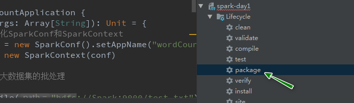

### 上传Jar包Linux操作系统

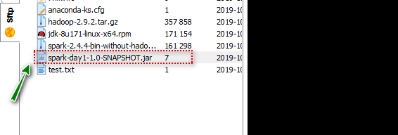

### 提交Jar包Standalone集群中运行

```shell
[root@Spark spark-2.4.4]# bin/spark-submit --master spark://Spark:7077 --class com.baizhi.WordCountApplication --total-executor-cores 4 /root/spark-day1-1.0-SNAPSHOT.jar
[root@Spark spark-2.4.4]# hdfs dfs -cat /result2/*
(Hello,4)
(Kafka,2)
(World,1)
(Scala,1)
(Spark,1)
(Good,1)
```


### 本地模拟测试开发

```scala
package com.baizhi

import org.apache.spark.{SparkConf, SparkContext}

/**
  * 开发Spark应用（开发测试）
  */
object WordCountApplication2 {
  def main(args: Array[String]): Unit = {
    //1. 初始化SparkConf和SparkContext
    val conf = new SparkConf().setAppName("wordCount").setMaster("local[*]") // 本地模拟环境 * 匹配当前CPU的核
    val sc = new SparkContext(conf)

    //2. 进行大数据集的批处理
    sc
      .textFile("hdfs://Spark:9000/test.txt")
      .flatMap(_.split(" ")) // word
      .map((_, 1))
      .groupBy(_._1)
      .map(t => (t._1, t._2.size))
      .sortBy(_._2, false, 1) // 根据单词出现的次数 进行降序排列
      .saveAsTextFile("hdfs://Spark:9000/result3")

    //3. 释放资源
    sc.stop()
  }
}
```

> 注意：
>
> 1. 在Windows Hosts文件中配置Spark的IP映射
> 2. 解决HDFS写入权限的问题： 添加虚拟机参数`-DHADOOP_USER_NAME=root`


## 四、Spark架构

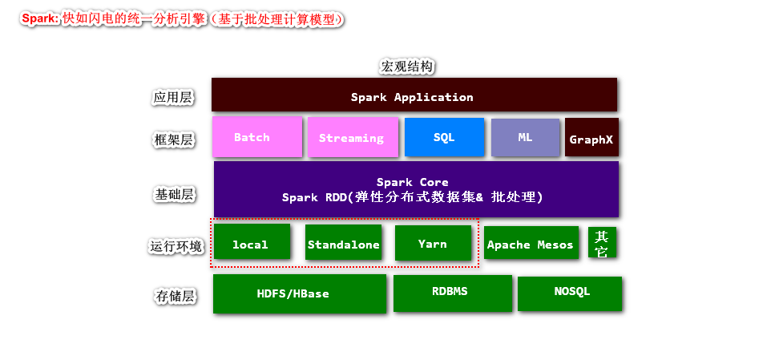


### MapReduce On Yarn工作原理

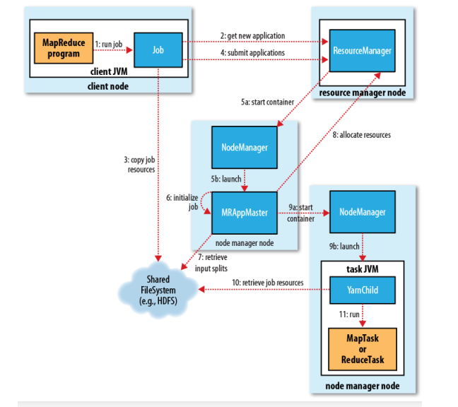

- 第一步： 运行MapReduce任务，启动JVM进程RunJar，实例化MapReduce Job任务实例
- 第二步： Job任务实例，请求Yarn集群ResourceManger注册应用信息，并且返回一个应用标示JobId
- 第三步： Job任务实例，将任务资源（jar包、配置文件、计算数据切片信息）等拷贝到共享的HDFS文件系统中【移步计算而不是数据】
- 第四步： 提交Job，交个ResourceManger进行调度处理【之后，所有操作发生在Yarn集群中】
- 第五步： Yarn集群的ResourceManager【负责统筹管理分布式集群资源和任务调度】会在一台空间的NodeManger启动一个容器MRAppMaster【负责当前Job监控管理、故障恢复】
- 第六步： MRAppMaster 进一步初始化Job【计算ReduceTask任务数量 默认1 或者手动设定】
- 第七步： MRAppMaster从共享的文件系统HDFS中获取数据切片的信息【计算MapTask任务数量】
- 第八步： MRAppMaster请求Yarn集群的资源管理器分配相应单位（MapTask + ReduceTask = 申请的计算容器的数量）的计算资源
- 第九步： MRAppMaster会在ResourceManager分配的NodeManager上启动对应数量计算容器JVM进程（YARNChild：Contaniner 运行MapTask或者ReduceTask）
- 第十步： YarnChild会接受负责计算数据以及获取执行的jar包
- 第十一步： 在YarnChild JVM进程中运行在MapTask或者ReduceTask
- 第十二步： 将计算结果存放到存储系统，并且释放所占用的计算资源

> 缺点：
>
> 1. MapReduce On Yarn运行时，Job分为粗粒度MapTask和ReduceTask两个阶段，无法满足复杂计算需求
> 2. MapTask和ReduceTask运行在JVM进程中，没有更为细粒度的处理模型（针对于进程的）
> 3. Shuffle极大浪费磁盘IO和网络IO，中间计算结果没有缓存（内存）、
> 4. 其它 ...

### Spark On Standalone架构

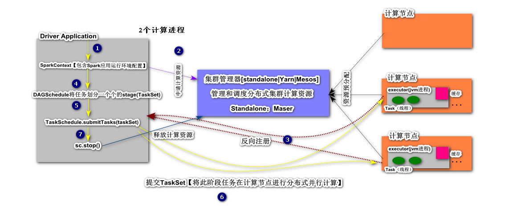

- Driver： 类似于之前学习过的MRAppMaster，任务执行监控和管理，负责任务的划分和任务分配。需要SparkContext上下文环境，主要提供Spark程序运行环境信息
- ClusterManager： 分布式集群资源的管理和调度，接受来自于Driver请求并分配相应单位的计算资源
- Compute Node（Slaves）: 提供计算资源资源（硬件指标：内存、CPU、网络、IO、其它） 
- Executor： Worker，代表的是一个JVM进程，实际上在一个计算节点可以同时运行多个Executor
- Task:  以线程方式在Executor中分布式并行运行
- Cache： 缓存区主要对任务计算结果进行存储，用以结果复用和故障恢复

> Spark优点：
>
> 1. Spark支持更为细粒度的任务拆分，首先是将一个复杂的任务分解为若个阶段（stage），每一个stage都支持分布式并行计算
> 2. Spark计算是细粒度，以线程为单位，而MapReduce On Yarn粗粒度的进程
> 3. Spark计算 集群中支持结果缓存，可以极大提高计算效率


## 五、Spark RDD

> 弹性分布式数据集，对不同数据源数据的一种抽象表示

The main abstraction Spark provides is a *resilient distributed dataset* (RDD), which is a collection of elements partitioned across the nodes of the cluster that can be operated on in parallel. 

RDD（==Resilient Distributed Dataset==）叫做**弹性分布式数据集**，**是Spark中最基本的数据抽象**，它代表一个不可变、可分区、里面的元素可并行计算的集合。RDD具有数据流模型的特点：自动容错、位置感知性调度和可伸缩性。RDD允许用户在执行多个查询时显式地将工作集缓存在内存中，后续的查询能够重用工作集，这极大地提升了查询速度。

### 创建

#### 通过scala集合

~~~scala
package com.baizhi

import org.apache.spark.rdd.RDD
import org.apache.spark.{SparkConf, SparkContext}

object RDDDataSourceWithCollection {
  def main(args: Array[String]): Unit = {
    val conf = new SparkConf().setMaster("local[*]").setAppName("rdd create")
    val sc = new SparkContext(conf)

    // 1. 通过scala的集合创建RDD
    // 使用默认的分区数：cpu cores

    // 方式一
    // val rdd: RDD[Int] = sc.makeRDD(List(1, 2, 3, 4, 5))
    // val rdd: RDD[Int] = sc.makeRDD(List(1, 2, 3, 4, 5),2)

    // 方式二
    val rdd: RDD[Int] = sc.parallelize(List(1, 2, 3, 4, 5))

    val sum = rdd.reduce((e1,e2) => e1+e2)

    println(s"$sum")

    println(rdd.getNumPartitions)

    sc.stop()
  }
}
~~~

#### 通过文件系统创建

> 文件系统分类：
>
> - local
> - hdfs

```scala
package com.baizhi

import org.apache.spark.rdd.RDD
import org.apache.spark.{SparkConf, SparkContext}

object RDDDataSourceWithFileSystem {
  def main(args: Array[String]): Unit = {
    val conf = new SparkConf().setMaster("local[*]").setAppName("rdd create")
    val sc = new SparkContext(conf)

    //1. 通过本地文件系统创建RDD
    // 方式1
    // val rdd: RDD[String] = sc.textFile("file:///d:\\data\\*.txt")
    // val rdd: RDD[String] = sc.textFile("hdfs://Spark:9000/test.txt")
    // rdd.flatMap(_.split(" ")).map((_, 1)).groupBy(_._1).map(t => (t._1, t._2.size)).sortBy(_._2, false, 1).foreach(println)

    // 方式2 Tuple2(文件的path,文件的内容)
    val rdd: RDD[(String, String)] = sc.wholeTextFiles("file:///d:\\data\\*.txt")
    // rdd.foreach(println)
    rdd
      .flatMap(_._2.split("\r\n"))  //windws换行符\r\n  unix \n
      .flatMap(_.split(" "))
      .map(word => (word, 1))
      .groupBy(_._1)
      .map(t => (t._1, t._2.size))
      .sortBy(_._2, false, 1)
      .foreach(println)

    // println(rdd.getNumPartitions)

    sc.stop()
  }
}
```

> 注意事项：
>
> 1. 如果通过本地文件系统创建Spark RDD对象时，在Spark集群运行，必须在集群的各个节点提供计算用到的数据文件
> 2. 注意平台差异，Spark应用最终需要运行Spark集群

#### 通过RDBMS创建

> 以MySQL数据库为例

```scala
package com.baizhi

import java.sql.{DriverManager, PreparedStatement, ResultSet}

import org.apache.hadoop.conf.Configuration
import org.apache.hadoop.io.LongWritable
import org.apache.hadoop.mapred.lib.db.{DBConfiguration, DBInputFormat, DBWritable}
import org.apache.spark.rdd.{JdbcRDD, RDD}
import org.apache.spark.{SparkConf, SparkContext}

object RDDDataSourceWithRDBMS {
  def main(args: Array[String]): Unit = {

    val conf = new SparkConf().setAppName("rdd with rdbms").setMaster("local[*]")

    val sc = new SparkContext(conf)

    // 通过RDBMS创建Spark RDD对象
    // 方式1
    // method1(sc)

    // 方式2
    method2(sc)

    sc.stop()
  }

  /**
    * 通过jdbcRdd对象构建  在定义SQL语句时候必须指定查询范围区间
    *
    * @param sc
    */
  def method1(sc: SparkContext) = {
    val rdd = new JdbcRDD[(Int, String)](
      sc,
      () => {
        Class.forName("com.mysql.jdbc.Driver")
        DriverManager.getConnection("jdbc:mysql://hadoopnode00:3306/test", "root", "1234")
      },
      "select * from t_user where id >= ? and id <=?",
      1, // 第一个?值
      3,
      1, // 分区数
      rs => (rs.getInt("id"), rs.getString("name")) // 元组 保存查询的结果
    )
    rdd.foreach(println)
  }


  /**
    * 传统方式 DBInputFormat
    *
    * @param sc
    */
  def method2(sc: SparkContext): Unit = {
    val conf = new Configuration()
    // 数据源的连接参数
    conf.set(DBConfiguration.DRIVER_CLASS_PROPERTY, "com.mysql.jdbc.Driver")
    conf.set(DBConfiguration.URL_PROPERTY, "jdbc:mysql://hadoopnode00:3306/test")
    conf.set(DBConfiguration.USERNAME_PROPERTY, "root")
    conf.set(DBConfiguration.PASSWORD_PROPERTY, "1234")
    // 配置查询SQL语句
    conf.set(DBConfiguration.INPUT_QUERY, "select * from t_user")
    conf.set(DBConfiguration.INPUT_COUNT_QUERY, "select count(*) from t_user")
    // 必须配置实体类的全限定名
    conf.set(DBConfiguration.INPUT_CLASS_PROPERTY,"com.baizhi.UserWritable")

    val rdd= sc.newAPIHadoopRDD(conf, classOf[DBInputFormat[UserWritable]], classOf[LongWritable], classOf[UserWritable])

    rdd.foreach(t => println(t._2.id +"\t"+t._2.name))
    // rdd.foreach(println)
  }
}

/**
  * 自定义对象序列化类型
  */
class UserWritable extends DBWritable {

  var id: Int = _
  var name: String = _

  override def write(preparedStatement: PreparedStatement): Unit = {
    preparedStatement.setInt(1, this.id)
    preparedStatement.setString(2, this.name)
  }

  override def readFields(resultSet: ResultSet): Unit = {
    this.id = resultSet.getInt("id")
    this.name = resultSet.getString("name")
  }
}
```

> 注意事项：
>
> ​	远程提交应用时，缺失依赖问题：	` java.lang.ClassNotFoundException: com.mysql.jdbc.Driver`
>
> ​    解决方案：
>
> - spark应用打包时，就将第三方依赖添加到应用Jar包
> - 将应用第三方依赖jar，添加到Spark集群的计算节点中
>
> ​    解决步骤：
>
> - 第一步：在所有的计算节点保存第三方的依赖jar包 `[root@Spark spark-2.4.4]# mkdir thirdJars`
>
> - 第二步：添加第三方扩展jar包
>
>   ```shell
>   [root@Spark spark-2.4.4]# vim conf/spark-defaults.conf
>   spark.executor.extraClassPath=/usr/spark-2.4.4/thirdJars/*
>   spark.driver.extraClassPath=/usr/spark-2.4.4/thirdJars/*
>   ```
>
> - 第三步：可能需要修改hosts映射

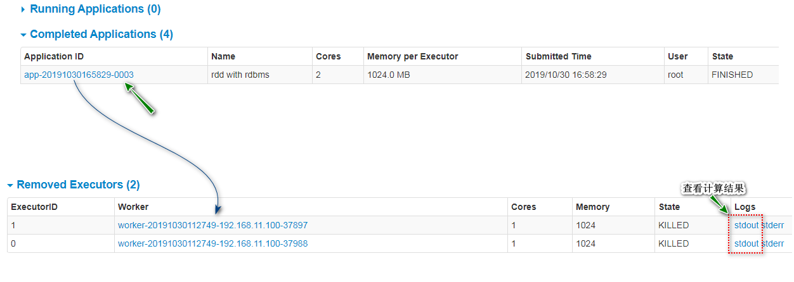


#### 通过HBase创建

> 通过HBase创建Spark RDD弹性分布式数据集对象

##### 准备工作

- HDFS服务正常

- ZooKeeper服务正常

- HBase服务正常

  ```shell
  [root@HadoopNode00 zookeeper-3.4.6]# jps
  4080 DataNode
  8553 QuorumPeerMain
  8842 HMaster
  9387 Jps
  3964 NameNode
  9005 HRegionServer
  4303 SecondaryNameNode
  ```

- 准备测试HBase表

##### 编码

- 导入依赖

  ```xml
  <dependency>
      <groupId>org.apache.hbase</groupId>
      <artifactId>hbase-server</artifactId>
      <version>1.4.10</version>
  </dependency>
  
  <dependency>
      <groupId>org.apache.hbase</groupId>
      <artifactId>hbase-client</artifactId>
      <version>1.4.10</version>
  </dependency>
  
  <dependency>
      <groupId>com.google.protobuf</groupId>
      <artifactId>protobuf-java</artifactId>
      <version>2.5.0</version>
  </dependency>
  ```

- 编码


```scala
  package com.baizhi
  import org.apache.hadoop.hbase.client.Result
  import org.apache.hadoop.hbase.io.ImmutableBytesWritable
  import org.apache.hadoop.hbase.mapreduce.TableInputFormat
  import org.apache.hadoop.hbase.util.Bytes
  import org.apache.hadoop.hbase.{HBaseConfiguration, HConstants}
  import org.apache.spark.{SparkConf, SparkContext}

  /**
    * hbase创建spark rdd对象
    */
  object RDDDataSourceWithHBase {
    def main(args: Array[String]): Unit = {
      val conf = new SparkConf().setMaster("local[*]").setAppName("rdd create")
      val sc = new SparkContext(conf)
  //1. 准备HBase配置对象
  val hbaseConfig = HBaseConfiguration.create()
  
  hbaseConfig.set(HConstants.ZOOKEEPER_QUORUM, "hadoopnode00")
  hbaseConfig.set(HConstants.ZOOKEEPER_CLIENT_PORT, "2181")
  
  hbaseConfig.set(TableInputFormat.INPUT_TABLE, "baizhi:t_user") // 操作表名
  hbaseConfig.set(TableInputFormat.SCAN_COLUMNS, "cf1:name cf1:age cf1:sex")
  
  //2. 通过sc操作hadoop方法构建RDD对象
  val rdd = sc.newAPIHadoopRDD(hbaseConfig, classOf[TableInputFormat], classOf[ImmutableBytesWritable], classOf[Result])
  
  rdd.foreach(t => {
    val rowKey = Bytes.toString(t._1.get())
    val name = Bytes.toString(t._2.getValue(Bytes.toBytes("cf1"), Bytes.toBytes("name")))
    val age = Bytes.toString(t._2.getValue(Bytes.toBytes("cf1"), Bytes.toBytes("age")))
    val sex = Bytes.toString(t._2.getValue(Bytes.toBytes("cf1"), Bytes.toBytes("sex")))
    println(s"$rowKey  $name   $age  $sex")
  })
  
  sc.stop()
	}
 }
```

  ```xml
  
- Spark集群运行时的运行依赖问题解决方案

  > 运行时，使用包含第三方依赖的spark应用jar包  `spark-day2-1.0-SNAPSHOT-jar-with-dependencies.jar`

  ```xml
  <!-- maven 打包插件 打原始jar包 第三方依赖打入jar包中-->
  <artifactId>maven-assembly-plugin</artifactId>
  <configuration>
      <archive>
          <manifest>
              <!--这里要替换成jar包main方法所在类 -->
              <mainClass>com.baizhi.RDDDataSourceWithHBase</mainClass>
          </manifest>
          <manifestEntries>
              <Class-Path>.</Class-Path>
          </manifestEntries>
      </archive>
      <descriptorRefs>
          <descriptorRef>jar-with-dependencies</descriptorRef>
      </descriptorRefs>
  </configuration>
  <executions>
      <execution>
          <id>make-assembly</id> <!-- this is used for inheritance merges -->
          <phase>package</phase> <!-- 指定在打包节点执行jar包合并操作 -->
          <goals>
              <goal>single</goal>
          </goals>
      </execution>
  </executions>
  </plugin>
  ```


### RDD实现原理

#### RDD的Lineage（血统）

RDD依赖关系也称为RDD的血统，描述了RDD间的转换关系。

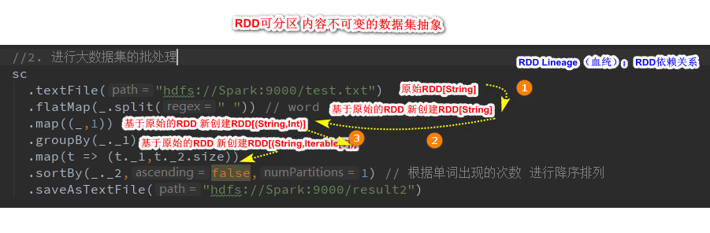

Spark将RDD间依赖关系分为了`宽依赖|ShuffleDependency`、`窄依赖|NarrowDependency`，Spark在提交任务的时候会根据转换算子逆向推导出所有的Stage。然后计算推导的stage的分区用于表示该Stage执行的`并行度`。一个Stage中实现的本地计算。这样可以尽最大的可能减少网络传输（大数据计算特点是数据传输成本太高）。


#### RDD的宽窄依赖

RDD在Lineage依赖方面分为两种Narrow Dependencies与Wide Dependencies用来解决数据容错的高效性。

- Narrow Dependencies是指父RDD的每一个分区最多被一个子RDD的分区所用，具体表现形式为：一对一或者多对一
- Wide Dependencies父RDD的一个分区对应一个子RDD的多个分区，具体的表现形式为： 一对多

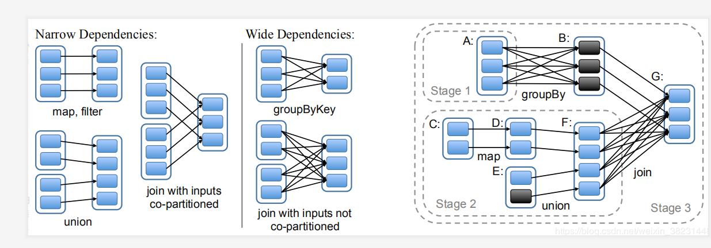


#### RDD原理

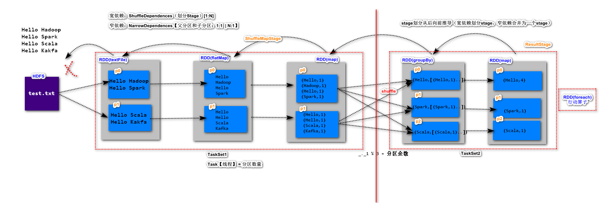

RDD在Spark是一个可分区、不可变的弹性数据集，是对不同数据源数据的一种抽象。Spark应用在运行时分为4个过程：划分阶段（Stage）、提交阶段、划分任务（Task）、提交任务。

- 划分阶段： Spark应用触发计算通过Action算子，首先找到Spark应用的最后一个RDD，根据血缘（血统）关系从后向前推导，找到ShuffleDependences（宽依赖），划分Stage。宽依赖之后称为ResultStage，之前称为ShuffleMapStage，继续向前推导，一旦遇到宽依赖划分阶段，产生新的ShuffleMapStage。 通俗理解：`ShuffleMapStage--->Shuffle--->ResultStage`
- 提交阶段&任务划分：每一个阶段的多个分区都支持分布式并行计算，并且都是在相同的节点中完成，不会涉及到网络通信。根据RDD的分区数量计算Task数量（1:1），然后将当前的阶段任务包装为一个TaskSet
- 提交任务：Driver端以一种负载均衡的方式将本阶段的TaskSet分配到预申请的计算节点，进行并行计算

#### RDD的容错机制

Spark支持的容错策略`根据lineage重新计算（默认）`、`可以尝试对RDD做cache`、`对RDD做持久化Checkpoint`

- 根据血统（RDD的依赖关系）重新计算： 没有进行Shuffle，重新计算所在分区；若果进行Shuffle，必须重新计算Shuffle之前所有计算

- 对RDD做cache

  ```scala
  package com.baizhi
  
  import org.apache.spark.{SparkConf, SparkContext}
  
  object RDDCache {
    def main(args: Array[String]): Unit = {
      val conf = new SparkConf().setMaster("local[*]").setAppName("rdd cache demo")
      val sc = new SparkContext(conf)
  
      val rdd = sc.textFile("file:///d://data/*.txt")
  
      // 尝试对RDD进行cache
      rdd.cache() // 内存中
  
      rdd.count()
  
      val start = System.currentTimeMillis()
      rdd.count()
      val end = System.currentTimeMillis() 
      println("使用缓存cache,计算耗时ms：" + (end - start)) //32ms
  
      // 清空Cache
      rdd.unpersist()
      val start2 = System.currentTimeMillis()
      rdd.count()
      val end2 = System.currentTimeMillis()
      println("不使用缓存cache,计算耗时ms：" + (end2 - start2)) // 40ms
  
      sc.stop()
    }
  }
  ```

  除了调用cache之外，Spark提供了更细粒度的RDD缓存方案，用户可以更具集群的内存状态选择合适的缓存策略。用户可以使用persist方法指定缓存级别。

  ```java
  RDD#persist(StorageLevel.MEMORY_ONLY)//设置缓存级别
  ```

  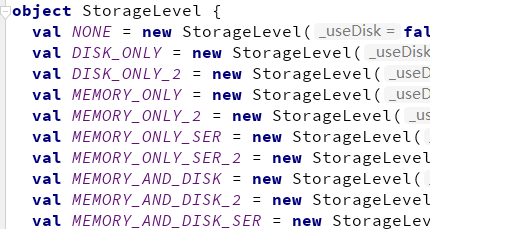

  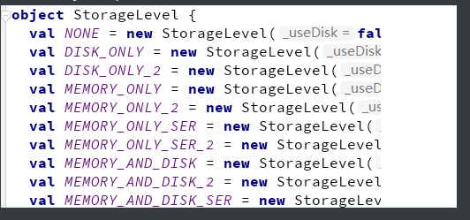

  **那如何选择呢？**

  内存充足，有要求性能：建议使用` MEMORY_ONLY > MEMORY_ONLY_SER`

  内存不太充足，又想提升性能和容错：`MEMORY_AND_DISK > MEMORY_AND_DISK _SER` (常用方式)

  其中`_2`系统会备份缓存数据。

- RDD的Checkpoint（检查点）

  除了使用缓存机制可以有效的保证RDD的故障恢复，但是如果缓存失效还是会在导致系统重新计算RDD的结果，所以对于一些RDD的lineage较长的场景，计算比较耗时，用户可以尝试使用checkpoint机制存储RDD的计算结果，该种机制和缓存最大的不同在于，使用checkpoint之后被checkpoint的RDD数据直接持久化在共享文件系统中，一般推荐将结果写在`hdfs`中，这种checpoint并不会自动清空。注意checkpoint在计算的过程中先是对RDD做mark，在任务执行结束后，再对mark的RDD实行checkpoint，也就是要重新计算被Mark之后的rdd的依赖和结果，因此为了避免Mark RDD重复计算，推荐使用策略。

  ```scala
  package com.baizhi
  
  import org.apache.spark.{SparkConf, SparkContext}
  
  object RDDCheckpoint {
    def main(args: Array[String]): Unit = {
      val conf = new SparkConf().setMaster("local[*]").setAppName("rdd cache demo")
      val sc = new SparkContext(conf)
  
      val rdd = sc.textFile("file:///d://data/*.txt")
  
      // 设置检查点的存放path
      sc.setCheckpointDir("hdfs://Spark:9000/checkpoint")
  
      rdd.checkpoint()
  
      rdd.count()
  
      val start = System.currentTimeMillis()
      rdd.count()
      val end = System.currentTimeMillis()
      println("使用checkpoint,计算耗时ms：" + (end - start)) // 使用checkpoint,计算耗时ms：127
  
      // 清空Cache
      rdd.unpersist()
      val start2 = System.currentTimeMillis()
      rdd.count()
      val end2 = System.currentTimeMillis()
      println("不使用使用checkpoint,计算耗时ms：" + (end2 - start2)) //不使用使用checkpoint,计算耗时ms：45
  
      sc.stop()
    }
  }
  ```

  > 注意：检查点机制成本较高，建议设置在宽依赖的RDD之后，避免shuffle之前的计算重新出现

  <https://blog.csdn.net/qq_31871785/article/details/93597043>


## 六、Spark源码追踪

#### RDD任务提交的源码追踪

回顾SparkOnStandalone架构

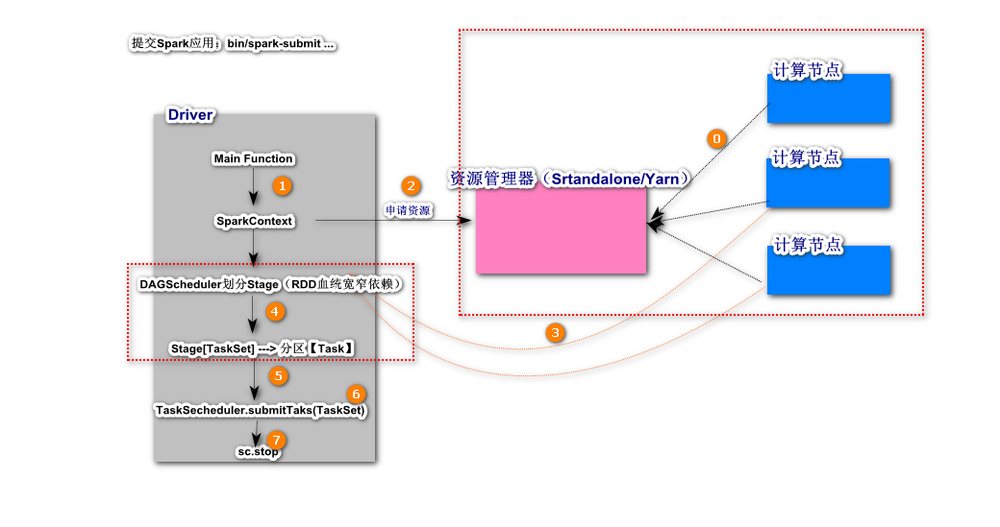


#### Spark源码追踪

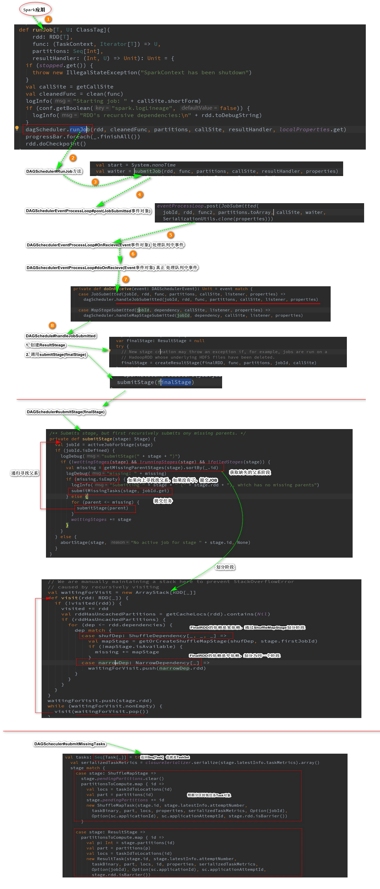


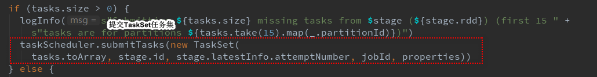

## 七、RDD编程API

Spark支持两个类型（算子）操作：`Transformation`和`Action`

### Transformation

主要做的是就是将一个已有的RDD生成另外一个RDD。Transformation具有**lazy特性(延迟加载)**。Transformation算子的代码不会真正被执行。只有当我们的程序里面遇到一个action算子的时候，代码才会真正的被执行。这种设计让Spark更加有效率地运行。

**常用的Transformation:**

| **转换**                                                 | **含义**                                                     |
| -------------------------------------------------------- | ------------------------------------------------------------ |
| **map**(func)    √                                       | 返回一个新的RDD，该RDD由每一个输入元素经过func函数转换后组成 |
| **filter**(func)   √                                     | 返回一个新的RDD，该RDD由经过func函数计算后返回值为true的输入元素组成 |
| **flatMap**(func)   √                                    | 类似于map，但是每一个输入元素可以被映射为0或多个输出元素（所以func应该返回一个序列，而不是单一元素） |
| **mapPartitions**(func)   √                              | 类似于map，但独立地在RDD的每一个分片上运行，因此在类型为T的RDD上运行时，func的函数类型必须是Iterator[T] => Iterator[U] |
| **mapPartitionsWithIndex**(func)                         | 类似于mapPartitions，但func带有一个整数参数表示分片的索引值，因此在类型为T的RDD上运行时，func的函数类型必须是(Int, Interator[T]) => Iterator[U] |
| **sample**(withReplacement, fraction, seed)  √           | 根据fraction指定的比例对数据进行采样，可以选择是否使用随机数进行替换，seed用于指定随机数生成器种子 |
| **union**(otherDataset)                                  | 对源RDD和参数RDD求并集后返回一个新的RDD                      |
| **intersection**(otherDataset)                           | 对源RDD和参数RDD求交集后返回一个新的RDD                      |
| **distinct**([numTasks]))                                | 对源RDD进行去重后返回一个新的RDD                             |
| **groupByKey**([numTasks])  √                            | 在一个(K,V)的RDD上调用，返回一个(K, Iterator[V])的RDD        |
| **reduceByKey**(func, [numTasks])  √                     | 在一个(K,V)的RDD上调用，返回一个(K,V)的RDD，使用指定的reduce函数，将相同key的值聚合到一起，与groupByKey类似，reduce任务的个数可以通过第二个可选的参数来设置 |
| **aggregateByKey**(zeroValue)(seqOp, combOp, [numTasks]) | 先按分区聚合 再总的聚合   每次要跟初始值交流 例如：aggregateByKey(0)(_+_,_+_) 对k/y的RDD进行操作 |
| **sortByKey**([ascending], [numTasks])                   | 在一个(K,V)的RDD上调用，K必须实现Ordered接口，返回一个按照key进行排序的(K,V)的RDD |
| **sortBy**(func,[ascending], [numTasks])   √             | 与sortByKey类似，但是更灵活 第一个参数是根据什么排序  第二个是怎么排序 false倒序   第三个排序后分区数  默认与原RDD一样 |
| **join**(otherDataset, [numTasks])   √                   | 在类型为(K,V)和(K,W)的RDD上调用，返回一个相同key对应的所有元素对在一起的(K,(V,W))的RDD  相当于内连接（求交集） |
| **cogroup**(otherDataset, [numTasks])                    | 在类型为(K,V)和(K,W)的RDD上调用，返回一个(K,(Iterable<V>,Iterable<W>))类型的RDD |
| **cartesian**(otherDataset)                              | 两个RDD的笛卡尔积  的成很多个K/V                             |
| **pipe**(command, [envVars])                             | 调用外部程序                                                 |
| **coalesce**(numPartitions**)**                          | 重新分区 第一个参数是要分多少区，第二个参数是否shuffle 默认false  少分区变多分区 true   多分区变少分区 false |
| **repartition**(numPartitions)    √                      | 重新分区 必须shuffle  参数是要分多少区  少变多               |
| **repartitionAndSortWithinPartitions**(partitioner)      | 重新分区+排序  比先分区再排序效率高  对K/V的RDD进行操作      |
| **foldByKey**(zeroValue)(seqOp)                          | 该函数用于K/V做折叠，合并处理 ，与aggregate类似   第一个括号的参数应用于每个V值  第二括号函数是聚合例如：_+_ |
| **combineByKey**                                         | 合并相同的key的值 rdd1.combineByKey(x => x, (a: Int, b: Int) => a + b, (m: Int, n: Int) => m + n) |
| **partitionBy**（partitioner）                           | 对RDD进行分区  partitioner是分区器 例如new HashPartition(2   |
| **cache **  √                                            | RDD缓存，可以避免重复计算从而减少时间，区别：cache内部调用了persist算子，cache默认就一个缓存级别MEMORY-ONLY ，而persist则可以选择缓存级别 |
| **persist**  √                                           |                                                              |
| **Subtract**                                             | 返回前rdd元素不在后rdd的rdd                                  |
| **leftOuterJoin**   √                                    | leftOuterJoin类似于SQL中的左外关联left outer join，返回结果以前面的RDD为主，关联不上的记录为空。只能用于两个RDD之间的关联，如果要多个RDD关联，多关联几次即可。 |
| **rightOuterJoin ** √                                    | rightOuterJoin类似于SQL中的有外关联right outer join，返回结果以参数中的RDD为主，关联不上的记录为空。只能用于两个RDD之间的关联，如果要多个RDD关联，多关联几次即可 |
| subtractByKey                                            | substractByKey和基本转换操作中的subtract类似只不过这里是针对K的，返回在主RDD中出现，并且不在otherRDD中出现的元素 |

#### **map**(*func*) √   

Return a new distributed dataset formed by passing each element of the source through a function *func*.`RDD[T] -> RDD[U]`

```scala
scala> sc.makeRDD(List(1,2,3,4,5)).map(item=>item*item).collect
res0: Array[Int] = Array(1, 4, 9, 16, 25)
```

#### **filter**(*func*) √

Return a new dataset formed by selecting those elements of the source on which *func*returns true.

```scala
scala> sc.makeRDD(List(1,2,3,4,5)).filter(item=>item%2==0).collect
res2: Array[Int] = Array(2, 4)
```

#### **flatMap**(*func*) √

Similar to map, but each input item can be mapped to 0 or more output items (so *func* should return a Seq rather than a single item).

```scala
scala> sc.makeRDD(List("hello world","hello spark")).flatMap(line=>line.split(" ")).collect
res3: Array[String] = Array(hello, world, hello, spark)
```

#### **mapPartitions**(*func*) √

Similar to map, but runs separately on each partition (block) of the RDD, so *func* must be of type Iterator<T> => Iterator<U> when running on an RDD of type T.

```scala
scala> sc.makeRDD(List("a","b","c","d","e"),3).mapPartitions(vs=> vs.map(v=>(v,1))).collect
res5: Array[(String, Int)] = Array((a,1), (b,1), (c,1), (d,1), (e,1))

scala> sc.makeRDD(List("a","b","c","d","e"),3).map(v=>(v,1)).collect
res6: Array[(String, Int)] = Array((a,1), (b,1), (c,1), (d,1), (e,1))
```

#### **mapPartitionsWithIndex**(*func*) √

Similar to mapPartitions, but also provides *func* with an integer value representing the index of the partition, so *func* must be of type (Int, Iterator<T>) => Iterator<U> when running on an RDD of type T.

```scala
scala> sc.makeRDD(List("a","b","c","d","e"),4).mapPartitionsWithIndex((index,vs)=> vs.map(t=>(t,index))).collect
res9: Array[(String, Int)] = Array((a,0), (b,1), (c,2), (d,3), (e,3))
```

#### **sample**(*withReplacement*, *fraction*, *seed*)

Sample a fraction *fraction* of the data, with or without replacement, using a given random number generator seed.

```scala
scala> sc.makeRDD(List("a","b","c","d","e"),4).sample(false,0.8,5L).collect
res15: Array[String] = Array(a, b, c, d)
```

**union**(*otherDataset*)

Return a new dataset that contains the union of the elements in the source dataset and the argument.

```scala
scala> var rdd1=sc.makeRDD(List("a","b","c","d","e"),4)
rdd1: org.apache.spark.rdd.RDD[String] = ParallelCollectionRDD[33] at makeRDD at <console>:24

scala> var rdd2=sc.makeRDD(List("a","b","c","d","e"),4)
rdd2: org.apache.spark.rdd.RDD[String] = ParallelCollectionRDD[34] at makeRDD at <console>:24

scala> rdd1.union(rdd2).collect
res17: Array[String] = Array(a, b, c, d, e, a, b, c, d, e)

```

#### **intersection**(*otherDataset*)

Return a new RDD that contains the intersection of elements in the source dataset and the argument.

```scala
scala> var rdd1=sc.makeRDD(List("a","b","c","d","e"),4)
rdd1: org.apache.spark.rdd.RDD[String] = ParallelCollectionRDD[36] at makeRDD at <console>:24

scala> var rdd2=sc.makeRDD(List("a","g","e"))
rdd2: org.apache.spark.rdd.RDD[String] = ParallelCollectionRDD[37] at makeRDD at <console>:24

scala> rdd1.intersection(rdd2).collect()
res18: Array[String] = Array(e, a)
```

#### **distinct**([*numPartitions*])) √

Return a new dataset that contains the distinct elements of the source dataset.

```scala
scala> var rdd1=sc.makeRDD(List("a","b","c","d","e","a"),4)
rdd1: org.apache.spark.rdd.RDD[String] = ParallelCollectionRDD[44] at makeRDD at <console>:24

scala> rdd1.distinct.collect
res20: Array[String] = Array(d, e, a, b, c)
```

**cartesian**(*otherDataset*)-了解

When called on datasets of types T and U, returns a dataset of (T, U) pairs (all pairs of elements).

```scala
scala> var rdd1=sc.makeRDD(List("a","b","c"),4)
rdd1: org.apache.spark.rdd.RDD[String] = ParallelCollectionRDD[54] at makeRDD at <console>:24

scala> var rdd2=sc.makeRDD(List(1,2,3))
rdd2: org.apache.spark.rdd.RDD[Int] = ParallelCollectionRDD[55] at makeRDD at <console>:24

scala> rdd1.cartesian(rdd2).collect
res22: Array[(String, Int)] = Array((a,1), (a,2), (a,3), (b,1), (b,2), (b,3), (c,1), (c,2), (c,3))
```

#### **coalesce**(*numPartitions*) √

Decrease the number of partitions in the RDD to numPartitions. Useful for running operations more efficiently after filtering down a large dataset.

```scala
scala> var rdd1=sc.makeRDD(List("a","b","c"),4).getNumPartitions
rdd1: Int = 4

scala> var rdd1=sc.makeRDD(List("a","b","c"),4).coalesce(2).getNumPartitions
rdd1: Int = 2
```

> 只能缩小，不能放大分区。

#### **repartition**(*numPartitions*) √

Reshuffle the data in the RDD randomly to create either more or fewer partitions and balance it across them. This always shuffles all data over the network.

```scala
scala> var rdd1=sc.makeRDD(List("a","b","c","e","f"),4).mapPartitionsWithIndex((i,vs)=> vs.map(v=>(v,i))).collect
rdd1: Array[(String, Int)] = Array((a,0), (b,1), (c,2), (e,3), (f,3))

scala> var rdd1=sc.makeRDD(List("a","b","c","e","f"),4).repartition(5).mapPartitionsWithIndex((i,vs)=> vs.map(v=>(v,i))).collect
rdd1: Array[(String, Int)] = Array((a,1), (c,2), (e,2), (b,3), (f,3))

```

> 既可以放大也可以缩小分区。

#### **groupByKey**([*numPartitions*])

When called on a dataset of (K, V) pairs, returns a dataset of (K, Iterable<V>) pairs. 
**Note:** If you are grouping in order to perform an aggregation (such as a sum or average) over each key, using `reduceByKey` or `aggregateByKey` will yield much better performance. 
**Note:** By default, the level of parallelism in the output depends on the number of partitions of the parent RDD. You can pass an optional `numPartitions` argument to set a different number of tasks.

```scala
scala> var linesRDD=sc.textFile("hdfs:///demo/words")
linesRDD: org.apache.spark.rdd.RDD[String] = hdfs:///demo/words MapPartitionsRDD[2] at textFile at <console>:24
scala> linesRDD.flatMap(_.split("\\s+")).map((_,1)).groupByKey(3)
res3: org.apache.spark.rdd.RDD[(String, Iterable[Int])] = ShuffledRDD[9] at groupByKey at <console>:26

scala> linesRDD.flatMap(_.split("\\s+")).map((_,1)).groupByKey(3).map(t=>(t._1,t._2.sum)).collect
res6: Array[(String, Int)] = Array((day,2), (come,1), (baby,1), (up,1), (is,1), (a,1), (demo,1), (this,1), (on,1), (good,2), (study,1))
```

#### **reduceByKey**(*func*, [*numPartitions*])

When called on a dataset of (K, V) pairs, returns a dataset of (K, V) pairs where the values for each key are aggregated using the given reduce function *func*, which must be of type (V,V) => V. Like in `groupByKey`, the number of reduce tasks is configurable through an optional second argument.

```scala
scala> var linesRDD=sc.textFile("hdfs:///demo/words")
linesRDD: org.apache.spark.rdd.RDD[String] = hdfs:///demo/words MapPartitionsRDD[2] at textFile at <console>:24
scala> linesRDD.flatMap(_.split("\\s+")).map((_,1)).reduceByKey(_+_).collect
res7: Array[(String, Int)] = Array((up,1), (this,1), (is,1), (a,1), (on,1), (day,2), (demo,1), (come,1), (good,2), (study,1), (baby,1))
```

#### **aggregateByKey**(*zeroValue*)(*seqOp*, *combOp*, [*numPartitions*])

```scala
scala> var linesRDD=sc.textFile("hdfs:///demo/words")
linesRDD: org.apache.spark.rdd.RDD[String] = hdfs:///demo/words MapPartitionsRDD[2] at textFile at <console>:24
scala> linesRDD.flatMap(_.split("\\s+")).map((_,1)).aggregateByKey(0)((z,v)=>z+v,(c1,c2)=>c1+c2).collect
res9: Array[(String, Int)] = Array((up,1), (this,1), (is,1), (a,1), (on,1), (day,2), (demo,1), (come,1), (good,2), (study,1), (baby,1))
```

**sortByKey**

When called on a dataset of (K, V) pairs where K implements Ordered, returns a dataset of (K, V) pairs sorted by keys in ascending or descending order, as specified in the boolean `ascending` argument.

```scala
scala> var linesRDD=sc.textFile("hdfs:///demo/words")
linesRDD: org.apache.spark.rdd.RDD[String] = hdfs:///demo/words MapPartitionsRDD[2] at textFile at <console>:24
scala> linesRDD.flatMap(_.split("\\s+")).map((_,1)).aggregateByKey(0)((z,v)=>z+v,(c1,c2)=>c1+c2).sortByKey(true,4).collect
res10: Array[(String, Int)] = Array((a,1), (baby,1), (come,1), (day,2), (demo,1), (good,2), (is,1), (on,1), (study,1), (this,1), (up,1))

```

相比较而言`sortBy`算子因为使用比sortByKey更加灵活，因此`sortBy`使用更多

```scala
scala> var linesRDD=sc.textFile("hdfs:///demo/words")
linesRDD: org.apache.spark.rdd.RDD[String] = hdfs:///demo/words MapPartitionsRDD[2] at textFile at <console>:24

scala> linesRDD.flatMap(_.split("\\s+")).map((_,1)).aggregateByKey(0)((z,v)=>z+v,(c1,c2)=>c1+c2).sortBy(_._2,false,4).collect
res12: Array[(String, Int)] = Array((day,2), (good,2), (up,1), (this,1), (is,1), (a,1), (on,1), (demo,1), (come,1), (study,1), (baby,1))
```

#### **join**(*otherDataset*, [*numPartitions*])

When called on datasets of type (K, V) and (K, W), returns a dataset of (K, (V, W)) pairs with all pairs of elements for each key. Outer joins are supported through `leftOuterJoin`, `rightOuterJoin`, and `fullOuterJoin`.

```scala
scala> var rdd1=sc.parallelize(Array(("001","张三"),("002","李四"),("003","王五")))
rdd1: org.apache.spark.rdd.RDD[(String, String)] = ParallelCollectionRDD[47] at parallelize at <console>:24

scala>  var rdd2=sc.parallelize(Array(("001",("apple",18.0)),("001",("orange",18.0))))
rdd2: org.apache.spark.rdd.RDD[(String, (String, Double))] = ParallelCollectionRDD[48] at parallelize at <console>:24

scala> rdd1.join(rdd2).collect
res13: Array[(String, (String, (String, Double)))] = Array((001,(张三,(apple,18.0))), (001,(张三,(orange,18.0))))

scala> rdd1.join(rdd2).map(t=>(t._1,t._2._1,t._2._2._1,t._2._2._2)).collect
res15: Array[(String, String, String, Double)] = Array((001,张三,apple,18.0), (001,张三,orange,18.0))

```

#### **cogroup**(*otherDataset*, [*numPartitions*]) - 了解

When called on datasets of type (K, V) and (K, W), returns a dataset of (K, (Iterable<V>, Iterable<W>)) tuples. This operation is also called `groupWith`.

```scala
scala> var rdd1=sc.parallelize(Array(("001","张三"),("002","李四"),("003","王五")))
rdd1: org.apache.spark.rdd.RDD[(String, String)] = ParallelCollectionRDD[47] at parallelize at <console>:24

scala>  var rdd2=sc.parallelize(Array(("001",("apple",18.0)),("001",("orange",18.0))))
rdd2: org.apache.spark.rdd.RDD[(String, (String, Double))] = ParallelCollectionRDD[48] at parallelize at <console>:24

scala> rdd1.cogroup(rdd2).collect
res33: Array[(String, (Iterable[String], Iterable[(String, Double)]))] = Array((003,(CompactBuffer(王五),CompactBuffer())), (002,(CompactBuffer(李四),CompactBuffer())), (001,(CompactBuffer(张三),CompactBuffer((apple,18.0), (orange,18.0)))))

scala> rdd1.groupWith(rdd2).collect
res34: Array[(String, (Iterable[String], Iterable[(String, Double)]))] = Array((003,(CompactBuffer(王五),CompactBuffer())), (002,(CompactBuffer(李四),CompactBuffer())), (001,(CompactBuffer(张三),CompactBuffer((apple,18.0), (orange,18.0)))))
```

> 和join的区别在于cogroup并不会做连接操作


### Action

触发代码的运行，我们一段spark代码里面至少需要有一个action操作。

**常用的Action**:

| **动作**                                          | **含义**                                                     |
| ------------------------------------------------- | ------------------------------------------------------------ |
| **reduce**(*func*)                                | 通过func函数聚集RDD中的所有元素，这个功能必须是可交换且可并联的 |
| **collect**()                                     | 在驱动程序中，以数组的形式返回数据集的所有元素               |
| **count**()                                       | 返回RDD的元素个数                                            |
| **first**()                                       | 返回RDD的第一个元素（类似于take(1)）                         |
| **take**(*n*)                                     | 返回一个由数据集的前n个元素组成的数组                        |
| **takeSample**(*withReplacement*,*num*, [*seed*]) | 返回一个数组，该数组由从数据集中随机采样的num个元素组成，可以选择是否用随机数替换不足的部分，seed用于指定随机数生成器种子 |
| **takeOrdered**(*n*, *[ordering]*)                |                                                              |
| **saveAsTextFile**(*path*)                        | 将数据集的元素以textfile的形式保存到HDFS文件系统或者其他支持的文件系统，对于每个元素，Spark将会调用toString方法，将它装换为文件中的文本 |
| **saveAsSequenceFile**(*path*)                    | 将数据集中的元素以Hadoop sequencefile的格式保存到指定的目录下，可以使HDFS或者其他Hadoop支持的文件系统。 |
| **saveAsObjectFile**(*path*)                      |                                                              |
| **countByKey**()                                  | 针对(K,V)类型的RDD，返回一个(K,Int)的map，表示每一个key对应的元素个数。 |
| **foreach**(*func*)                               | 在数据集的每一个元素上，运行函数func进行更新。               |

#### **reduce**(*func*)

Aggregate the elements of the dataset using a function *func* (which takes two arguments and returns one). The function should be commutative and associative so that it can be computed correctly in parallel.

```scala
scala> var rdd=sc.parallelize(List(1,2,3,4,5,6))
rdd: org.apache.spark.rdd.RDD[Int] = ParallelCollectionRDD[0] at parallelize at <console>:24

scala> rdd.reduce((v1,v2)=>v1+v2)
res0: Int = 21
```

#### **collect**() - 结果拿到Driver

Return all the elements of the dataset as an array at the driver program. This is usually useful after a filter or other operation that returns a sufficiently small subset of the data.

```scala
scala> var rdd=sc.parallelize(List(1,2,3,4,5,6))
rdd: org.apache.spark.rdd.RDD[Int] = ParallelCollectionRDD[1] at parallelize at <console>:24

scala> rdd.collect
res1: Array[Int] = Array(1, 2, 3, 4, 5, 6)
```

#### **count**()

Return the number of elements in the dataset.

```scala
scala> var rdd=sc.parallelize(List(1,2,3,4,5,6))
rdd: org.apache.spark.rdd.RDD[Int] = ParallelCollectionRDD[2] at parallelize at <console>:24

scala> rdd.count
res2: Long = 6

```

#### **first**()

Return the first element of the dataset (similar to take(1)).

```scala
scala> var rdd=sc.parallelize(List(1,2,3,4,5,6))
rdd: org.apache.spark.rdd.RDD[Int] = ParallelCollectionRDD[3] at parallelize at <console>:24

scala> rdd.first
res3: Int = 1

scala> rdd.take(1)
res4: Array[Int] = Array(1)

scala> rdd.take(2)
res5: Array[Int] = Array(1, 2)
```

#### **take**(*n*)

Return an array with the first *n* elements of the dataset.

```scala
scala> var rdd=sc.parallelize(List(1,2,3,4,5,6))
rdd: org.apache.spark.rdd.RDD[Int] = ParallelCollectionRDD[3] at parallelize at <console>:24

scala> rdd.take(1)
res4: Array[Int] = Array(1)

scala> rdd.take(2)
res5: Array[Int] = Array(1, 2)

```

#### **takeSample**(*withReplacement*, *num*, [*seed*])

Return an array with a random sample of *num* elements of the dataset, with or without replacement, optionally pre-specifying a random number generator seed.

```scala
scala> var rdd=sc.parallelize(List(1,2,3,4,5,6))
rdd: org.apache.spark.rdd.RDD[Int] = ParallelCollectionRDD[4] at parallelize at <console>:24

scala> rdd.takeSample(true,3)
res6: Array[Int] = Array(6, 4, 2)
```

#### **takeOrdered**(*n*, *[ordering]*)

Return the first *n* elements of the RDD using either their natural order or a custom comparator.

```scala
scala> var rdd=sc.parallelize(List(1,4,2,5,3,6))
rdd: org.apache.spark.rdd.RDD[Int] = ParallelCollectionRDD[6] at parallelize at <console>:24

scala> rdd.takeOrdered(4)
res7: Array[Int] = Array(1, 2, 3, 4)

scala> rdd.takeOrdered(4)(new Ordering[Int]{ //降序
          override def compare(x: Int, y: Int): Int = {
           -1*(x-y)
          }
   	 })
```

#### **saveAsTextFile**(*path*)

Write the elements of the dataset as a text file (or set of text files) in a given directory in the local filesystem, HDFS or any other Hadoop-supported file system. Spark will call toString on each element to convert it to a line of text in the file.

```scala
scala> sc.textFile("hdfs:///demo/words").flatMap(_.split("\\s+")).map((_,1)).reduceByKey(_+_).sortByKey(true,3).saveAsTextFile("hdfs:///demo/results001")
```

#### **saveAsSequenceFile**(*path*) 

Write the elements of the dataset as a Hadoop SequenceFile in a given path in the local filesystem, HDFS or any other Hadoop-supported file system. This is available on RDDs of key-value pairs that implement Hadoop's Writable interface. In Scala, it is also available on types that are implicitly convertible to Writable (Spark includes conversions for basic types like Int, Double, String, etc).

```scala
scala> import org.apache.hadoop.io.{IntWritable, Text}
import org.apache.hadoop.io.{IntWritable, Text}

scala> sc.sequenceFile[Text,IntWritable]("hdfs://CentOS:9000/demo/results002/",classOf[Text],classOf[IntWritable]).map(t=>(t._1.ttring,t._2.get)).collect
res1: Array[(String, Int)] = Array((a,1), (baby,1), (come,1), (day,2), (demo,1), (good,2), (is,1), (on,1), (study,1), (this,1), (,1))

```

#### **countByKey**()

Only available on RDDs of type (K, V). Returns a hashmap of (K, Int) pairs with the count of each key.

```scala
scala> sc.parallelize(List(("a",2),("b",1),("a",3))).countByKey
res0: scala.collection.Map[String,Long] = Map(a -> 2, b -> 1)
```

#### **foreach**(*func*) - 远程执行。

Run a function func on each element of the dataset. This is usually done for side effects such as updating an `Accumulator` or interacting with external storage systems. 

```scala
[root@CentOS spark-2.4.3]# ./bin/spark-shell --master local[6]
Setting default log level to "WARN".
To adjust logging level use sc.setLogLevel(newLevel). For SparkR, use setLogLevel(newLevel).
Spark context Web UI available at http://CentOS:4040
Spark context available as 'sc' (master = spark://CentOS:7077, app id = app-20190815184546-0000).
Spark session available as 'spark'.
Welcome to
      ____              __
     / __/__  ___ _____/ /__
    _\ \/ _ \/ _ `/ __/  '_/
   /___/ .__/\_,_/_/ /_/\_\   version 2.4.3
      /_/

Using Scala version 2.11.12 (Java HotSpot(TM) 64-Bit Server VM, Java 1.8.0_191)
Type in expressions to have them evaluated.
Type :help for more information.
scala> sc.sequenceFile[Text,IntWritable]("hdfs://CentOS:9000/demo/results002/",classOf[Text],classOf[IntWritable]).map(t=>(t._1.toString,t._2.get)).foreach(println) //本地测试，所有有输出
(a,1)
(baby,1)
(come,1)
(day,2)
(demo,1)
(good,2)
(is,1)
(on,1)
(study,1)
(this,1)
(up,1)
```

> 注意foreach该Action动作并行执行的，输出结果是在远程。如果是远程

```scala
[root@CentOS spark-2.4.3]# ./bin/spark-shell --master spark://CentOS:7077 --total-executor-cores 6
Setting default log level to "WARN".
To adjust logging level use sc.setLogLevel(newLevel). For SparkR, use setLogLevel(newLevel).
Spark context Web UI available at http://CentOS:4040
Spark context available as 'sc' (master = spark://CentOS:7077, app id = app-20190815184546-0000).
Spark session available as 'spark'.
Welcome to
      ____              __
     / __/__  ___ _____/ /__
    _\ \/ _ \/ _ `/ __/  '_/
   /___/ .__/\_,_/_/ /_/\_\   version 2.4.3
      /_/

Using Scala version 2.11.12 (Java HotSpot(TM) 64-Bit Server VM, Java 1.8.0_191)
Type in expressions to have them evaluated.
Type :help for more information.
scala>  sc.sequenceFile[Text,IntWritable]("hdfs://CentOS:9000/demo/results002/",classOf[Text],classOf[IntWritable]).map(t=>(t._1.toString,t._2.get)).foreach(println)
                                 
scala>

```

#### foreach写入外围系统

- 不可以在Driver端定义连接参数，因为如果在Driver定义的变量被算子所引起，Spark在任务执行的时候会将定义在Driver端的变量分发给下游的Task（需要做变量序列化）。由于连接的特殊性（不可复制性）导致无法再Driver定义连接参数。


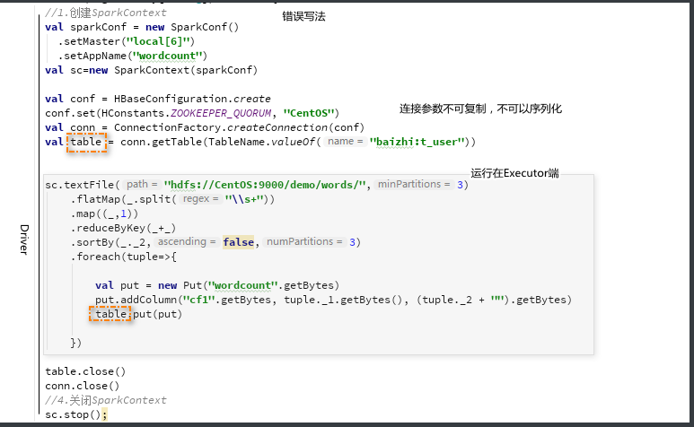

> 既然不能再Drive端定义，我可将变量定义在算子内部。

- 改进方案2（频繁创建连接降低程序执行效率-不考虑）
- 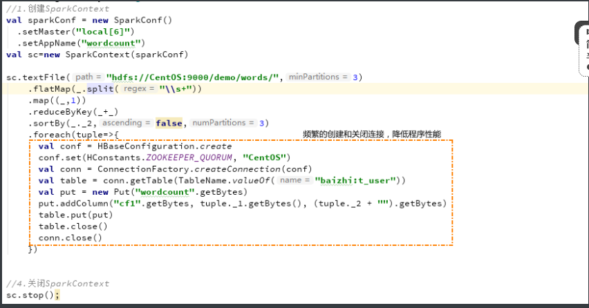


- 改进方案3-（每个分区创建一个连接|连接池）

  

  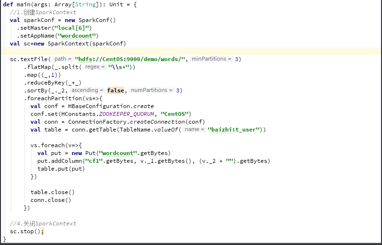

> 如果一个JVM中有多个分区，系统可能重复创建冗余连接参数。建议将连接参数作为静态。

- 方案4（静态-类加载）
- 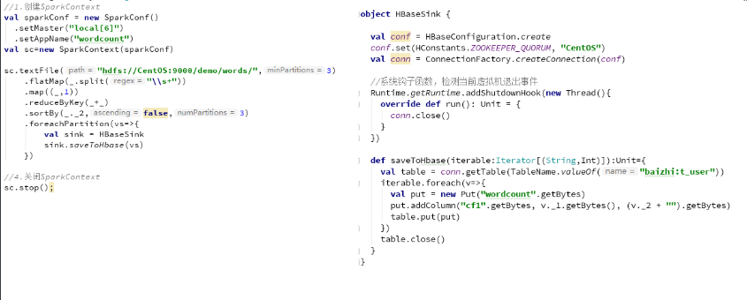


> 可以保证一个Executor进程只实例化一个连接对象。


## 八、共享变量（Shard Variable）

在Spark中，如果一个算子函数使用了外部的一个变量，这个变量会进行序列化并拷贝到任务节点，每一个任务使用自己拷贝的变量副本


### 广播变量（Broadcast Variable）[重点]

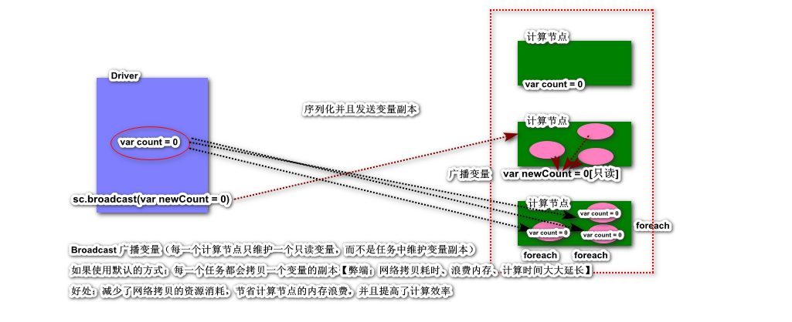

```scala
package shardvariable

import org.apache.spark.{SparkConf, SparkContext}

/**
  * 每一个用户名的花费总额
  */
object OrderApplication {
  def main(args: Array[String]): Unit = {
    val conf = new SparkConf().setMaster("local[*]").setAppName("shard variable")
    val sc = new SparkContext(conf)

    // 用户信息的变量
    val userInfo = Map("001" -> "zs", "002" -> "ls", "003" -> "ww")

    // 订单的RDD
    val orderItems = List(
      ("001", OrderItem("iphone11", 4999, 2)),
      ("002", OrderItem("Dior", 129, 1)),
      ("001", OrderItem("刮胡刀", 15, 1)),
      ("003", OrderItem("收音机", 85, 1))
    )

    val rdd = sc.makeRDD(orderItems, 2)

    // 目前来说 没有使用广播变量  算子函数中使用到UserInfo的外部变量，每一个任务都会拷贝一个变量副本
    //    rdd
    //      .map(t2 => (t2._1, t2._2.price * t2._2.num))
    //      .reduceByKey(_ + _)
    //      .foreach(t2 => {
    //        println(t2._1 + "\t" + userInfo(t2._1) + "\t"+t2._2)
    //      })
    val broadcastVar = sc.broadcast(userInfo)
    rdd
      .map(t2 => (t2._1, t2._2.price * t2._2.num))
      .reduceByKey(_ + _)
      .foreach(t2 => {
        // 广播变量
        println(t2._1 + "\t" + broadcastVar.value(t2._1) + "\t" + t2._2)

        /*

        003	ww	85.0
        002	ls	129.0
        001	zs	10013.0

          */
      })
  }
}

case class OrderItem(var productName: String, var price: Double, var num: Int)
```


### 累加器(Accumulator)

通俗理解累加器的主要作用为：在多个计算节点对一个变量进行共享性操作（累加）

```scala
package shardvariable

import org.apache.spark.{SparkConf, SparkContext}

object SumApplication {
  def main(args: Array[String]): Unit = {
    val conf = new SparkConf().setMaster("local[*]").setAppName("shard variable")
    val sc = new SparkContext(conf)

    val rdd = sc.makeRDD(Array(1, 2, 3, 4, 5), 3)

    // 声明了一个名为Counters累加器  0
    val counters = sc.longAccumulator("Counters")

    rdd.foreach(n => {
      // 将遍历产生的元素 累加
      counters.add(n)
    })

    // 累加器的结果可以返回给Driver进行输出打印
    println("数组累积之和为: "+counters.value)

    sc.stop()
  }
}
```


