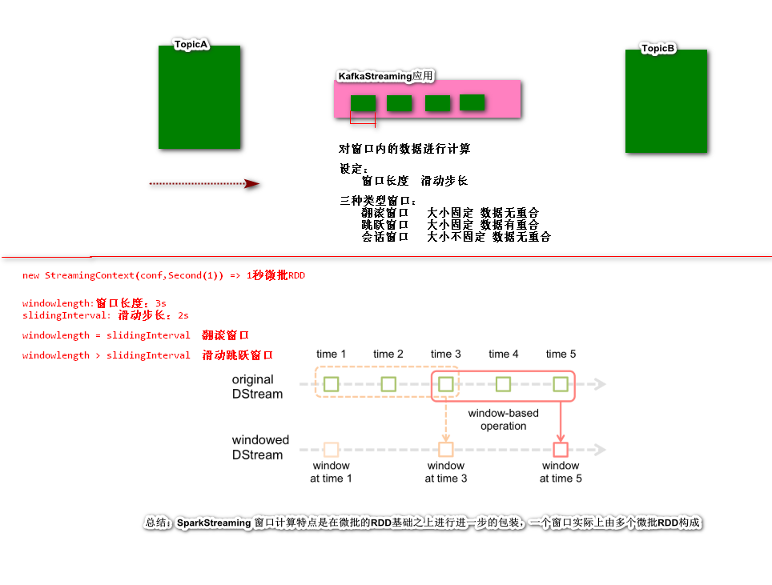
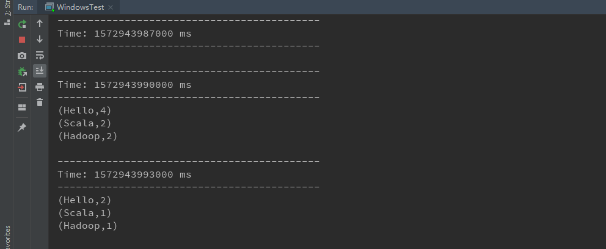
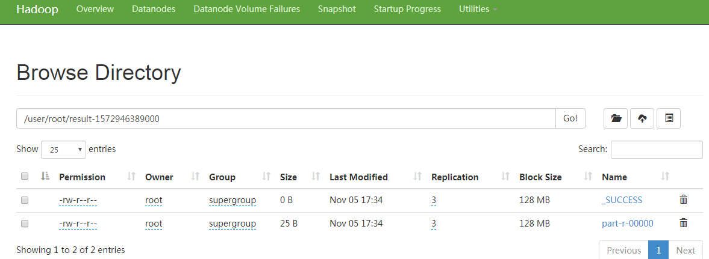

## Spark Streaming

http://spark.apache.org/docs/latest/streaming-programming-guide.html#overview

*Spark Streaming*是Spark Core的进一步扩展，可以实现数据流的可扩展、高吞吐、容错处理。Spark Streaming处理的数据可以来源于多种方式，比如Kafka、Flume、Kinesis或者TCP传输等，这些流数据经过Spark Streaming进行复杂的处理加工。最终，将处理的结果保存到文件系统、数据库或者实时的展示界面。


### Spark Streaming的工作原理

*Spark Streaming接受实时的数据流并将数据流拆分为一个一个的批次（micro batch），通过Spark引擎处理（rdd），产生最终的结果流*

> 实际上：流处理转批处理的过程


Spark提供了高等级的抽象，称为离散流或者`DStream`(*DStream表现为连续的数据流*)。DStream一般是通过输入的数据流进行构建（如:kafka、Flume、Kinesis）或者其它的DStream。**实际上在内部，一个`DStream`表现为一组RDD的序列**

> 什么是流数据？什么事批数据？
>
> ​	流数据：类似于水流，没有范围和界限。表现为有起始，但没有终止。
>
> ​	批数据：有范围的数据，范围可以是一个小时、一天、一个月等，也就是数据有起始，有终止


### 第一个Spark Streaming例子

> 单词计数（TCP数据服务器的访问数据）

#### 导入Spark Streaming依赖

```xml
<dependency>
    <groupId>org.apache.spark</groupId>
    <artifactId>spark-streaming_2.11</artifactId>
    <version>2.4.4</version>
    <scope>provided</scope>
</dependency>
```

> 注意：数据源如果是kafka、flume、kinesis等类型，需要额外引入`spark-streaming-xyz_2.12`依赖

#### 测试代码

```scala
package example1

import org.apache.spark.SparkConf
import org.apache.spark.streaming.{Seconds, StreamingContext}

object QuickExample {
  def main(args: Array[String]): Unit = {
    // StreamingContext是所有Spark Streaming应用的入口
    val conf = new SparkConf().setMaster("local[2]").setAppName("quick example")
    val ssc = new StreamingContext(conf, Seconds(5))
    // 通过TCP Source创建DStream对象
    val lines = ssc.socketTextStream("spark", 9999)
    // 将此DStream中生成的每个RDD的前十个元素打印到控制台
    lines.flatMap(_.split(" ")).map((_, 1)).reduceByKey(_ + _).print()

    // 启动计算
    ssc.start()
    // 等待计算终止
    ssc.awaitTermination()
  }
}
```

#### 安装Netcat，获取绑定端口的访问数据

```shell
[root@Spark spark-2.4.4]# yum install -y nc
```

#### 运行Spark Streaming应用，并通过Netcat发送测试数据

```shell
[root@Spark spark-2.4.4]# nc -lk 4444
Hello Scala
Hello Hadoop
Hello Hadoop
Hello Hadoop
Hello Hadoop
Hello Hadoop

```

#### 测试结果

```
-------------------------------------------
Time: 1562123560000 ms
-------------------------------------------
(Hello,1)
(Wolrd,1)

-------------------------------------------
Time: 1562123595000 ms
-------------------------------------------
(Hello,1)
(Spark,1)

Time: 1562123600000 ms
-------------------------------------------
(Hello,1)
(Scala,1)
```


### DStream（离散数据流）

*DStream*是Spark Streaming中的一个基本抽象。表现为一段连续的数据流（本质上是一组连续RDD的集合）。一个DStream中的一个RDD含有固定间隔的数据集。


**应用于DStream的任何操作都转换为底层RDD上的操作。**如：第一个Spark Streaming案列


### Input DStream And Receivers

**Input DStream表示从数据源接受的数据构建的DStream对象。**

构建Input DStream通常有两种方式

- `Basic Source`（直接可以通过StreamingContext进行构建，如：FS、Socket）

- `Advanced Source`（引入SparkStreaming和第三方系统集成依赖  Kafka、Flume、etc等）

> 注意：
>
> ​	如果使用local模式运行Spark Streaming应用，不要使用`local`或者`local[1]`作为master的URL。
>
> ​	如果这样做的话，就意味着只有一个线程运行任务，会造成唯一的线程被用来接受流数据，而没有可供进行数据处理的线程。
>
> ​    local模式运行，建议使用`local[n]`，并且n应该大于任务接受线程的数量。

#### Basic Source

##### File Streams

使用HDFS API从任意的文件系统读取文件数据，作为数据来源。如：

```scala
val lines = ssc.textFileStream("hdfs://gaozhy:9000/baizhi")
```

> 如果获取不到HDFS中数据，可以使用如下解决方案：<https://blog.csdn.net/qq_40493738/article/details/89788603>
>
> 修改时钟：`date -s '2019-11-04 17:34:00'`再执行`clock -w`       
>
> 注意：
>
> 1. 参数为数据目录，不能指向具体的文件。
> 2. 数据目录支持通配符，如: `hdfs://gaozhy:9000/baizhi/2019-*`
> 3. 所有的文件数据格式需要一致

##### RDD Queue

```scala
val ssc = new StreamingContext(sc, Seconds(5))
// 通过rdd queue创建DStream对象
val rdd1 = sc.textFile("/Users/gaozhy/data/wc.txt",2)
val rdd2 = sc.textFile("/Users/gaozhy/data/wc2.txt",2)
val rddQueue = mutable.Queue(rdd1,rdd2)
val lines = ssc.queueStream(rddQueue)
```

#### Advanced Sources

##### kafka【重点】

> 启动kafka集群
>
> - 启动zookeeper
> - 启动kafka集群
> - 创建topci  spark
> - 进入生产消息模式

```xml
<dependency>
    <groupId>org.apache.spark</groupId>
    <artifactId>spark-streaming-kafka-0-10_2.11</artifactId>
    <version>2.4.4</version>
</dependency>
```

```scala
package example2

import org.apache.kafka.clients.consumer.ConsumerConfig
import org.apache.kafka.common.serialization.StringDeserializer
import org.apache.spark.SparkConf
import org.apache.spark.streaming.kafka010.{ConsumerStrategies, KafkaUtils, LocationStrategies}
import org.apache.spark.streaming.{Seconds, StreamingContext}

object AdvancedSourceWithKafka {
  def main(args: Array[String]): Unit = {
    // StreamingContext是所有Spark Streaming应用的入口
    val conf = new SparkConf().setMaster("local[2]").setAppName("DirectKafkaWordCount")
    val ssc = new StreamingContext(conf, Seconds(5))
    // 通过kafka创建DStream对象
    val kafkaParams = Map[String, Object](
      ConsumerConfig.BOOTSTRAP_SERVERS_CONFIG -> "gaozhy:9092",
      ConsumerConfig.GROUP_ID_CONFIG -> "g1",
      ConsumerConfig.KEY_DESERIALIZER_CLASS_CONFIG -> classOf[StringDeserializer],
      ConsumerConfig.VALUE_DESERIALIZER_CLASS_CONFIG -> classOf[StringDeserializer])
    val messages = KafkaUtils.createDirectStream[String, String](
      ssc,
      LocationStrategies.PreferConsistent,
      ConsumerStrategies.Subscribe[String, String](List("baizhi"),kafkaParams ))

    // 将此DStream中生成的每个RDD的前十个元素打印到控制台
    messages.flatMap(_.value.split(" ")).map((_,1L)).reduceByKey(_+_).print()

    // 启动计算
    ssc.start()
    // 等待计算终止
    ssc.awaitTermination()
  }
}
```

##### Flume 

> 参考资料：<http://spark.apache.org/docs/latest/streaming-flume-integration.html>

### DStream转换算子

DStream的转换算子类似于RDD，一些常用的算子如下：

|                                                      |                                                              |
| :--------------------------------------------------- | :----------------------------------------------------------- |
| Transformation                                       | Meaning                                                      |
| **map**(*func*)                                      | Return a new DStream by passing each element of the source DStream through a function *func*. |
| **flatMap**(*func*)                                  | Similar to map, but each input item can be mapped to 0 or more output items. |
| **filter**(*func*)                                   | Return a new DStream by selecting only the records of the source DStream on which *func* returns true. |
| **repartition**(*numPartitions*)                     | Changes the level of parallelism in this DStream by creating more or fewer partitions. |
| **union**(*otherStream*)                             | Return a new DStream that contains the union of the elements in the source DStream and *otherDStream*. |
| **count**()                                          | Return a new DStream of single-element RDDs by counting the number of elements in each RDD of the source DStream. |
| **reduce**(*func*)                                   | Return a new DStream of single-element RDDs by aggregating the elements in each RDD of the source DStream using a function *func* (which takes two arguments and returns one). The function should be associative and commutative so that it can be computed in parallel. |
| **countByValue**()                                   | When called on a DStream of elements of type K, return a new DStream of (K, Long) pairs where the value of each key is its frequency in each RDD of the source DStream. |
| **reduceByKey**(*func*, [*numTasks*])                | When called on a DStream of (K, V) pairs, return a new DStream of (K, V) pairs where the values for each key are aggregated using the given reduce function. **Note:** By default, this uses Spark's default number of parallel tasks (2 for local mode, and in cluster mode the number is determined by the config property `spark.default.parallelism`) to do the grouping. You can pass an optional `numTasks` argument to set a different number of tasks. |
| **join**(*otherStream*, [*numTasks*])     [了解]     | When called on two DStreams of (K, V) and (K, W) pairs, return a new DStream of (K, (V, W)) pairs with all pairs of elements for each key. |
| **cogroup**(*otherStream*, [*numTasks*])      [了解] | When called on a DStream of (K, V) and (K, W) pairs, return a new DStream of (K, Seq[V], Seq[W]) tuples. |
| **transform**(*func*)   【贼重要】                   | Return a new DStream by applying a RDD-to-RDD function to every RDD of the source DStream. This can be used to do arbitrary RDD operations on the DStream. |
| **updateStateByKey**(*func*)                         | Return a new "state" DStream where the state for each key is updated by applying the given function on the previous state of the key and the new values for the key. This can be used to maintain arbitrary state data for each key. |

#### UpdateStateByKey Operation

updateStateByKey操作允许您在使用新信息不断更新时维护状态（`状态维护`）。

```scala
package example3

import org.apache.spark.SparkConf
import org.apache.spark.streaming.{Seconds, StreamingContext}

object QuickExampleForUpdateStateByKey {
  def main(args: Array[String]): Unit = {
    // StreamingContext是所有Spark Streaming应用的入口
    val conf = new SparkConf().setMaster("local[2]").setAppName("quick example")
    val ssc = new StreamingContext(conf, Seconds(5))
    ssc.checkpoint("hdfs://gaozhy:9000/checkpoint")
    // 通过TCP Source创建DStream对象
    val lines = ssc.socketTextStream("spark", 9999)
    lines.flatMap(_.split(" ")).map((_, 1)).updateStateByKey(updateFunction).print()
    // 启动计算
    ssc.sparkContext.setLogLevel("FATAL")
    ssc.start()
    // 等待计算终止
    ssc.awaitTermination()
  }

  /**
    *
    * @param values       当前batch中的状态
    * @param runningCount 累积的状态信息
    * @return
    */
  def updateFunction(values: Seq[Int], runningCount: Option[Int]): Option[Int] = {
    println(s"${values.mkString(",")} | $runningCount")
    Some(values.length + runningCount.getOrElse(0))
  }
}
```

> 注意：
>
> ​	spark streaming中所有的有状态计算，必须设置检查点目录

#### Transform Operation

Transform操作允许任意的RDD-to-RDD转换算子应用在DStream上

~~~scala
package com.baizhi.streaming

import org.apache.spark.SparkConf
import org.apache.spark.streaming.{Seconds, State, StateSpec, StreamingContext}

/**
  * 测试Spark Streaming的操作算子
  */
object TransformationsTest {
  def main(args: Array[String]): Unit = {
    val conf = new SparkConf().setAppName("transformations test").setMaster("local[*]")
    val ssc = new StreamingContext(conf, Seconds(5))

    // 构建DStream（离散数据流）
    // val dStream = ssc.socketTextStream("spark", 6666)

    ssc.sparkContext.setLogLevel("ERROR")

    // 操作算子

    //    dStream
    //      .flatMap(str => str.split(" ")) // 将1个数据展开为0到多个数据
    //      .repartition(5)  // 动态调整分区数量
    //      .map(word => (word, 1)) // 将一种类型转换另外的一种类型
    //      .filter(t => !t._1.equals("Hello")) // 保留符合条件的结果
    //      .reduceByKey((v1, v2) => v1 + v2) // 将key相同的两个相邻的value进行相加计算
    //      .print()  // 输出 将DStream处理结果中的前10条记录输出到Console


    //---------------------------------------------------------
    // union 联合结合 将两个DStream内的元素合并为一个DStream
    //    val dStream1 = ssc.socketTextStream("spark", 7777)
    //    val dStream2 = ssc.socketTextStream("spark", 8888)
    //    dStream1.union(dStream2).print()

    //---------------------------------------------------------
    //    val dStream3 = ssc.socketTextStream("spark", 7777)
    //    dStream3.count() // 返回微批的RDD中元素个数
    //      .print()

    // ---------------------------------------------------------
    // 数值数据：1 2 3 4 5 求和
    //    val dStream4 = ssc.socketTextStream("spark", 7777)
    //    dStream4
    //      .map(strNum => strNum.toInt)
    //      // ERROR (Hello,[1,1,1]) ("Hadoop",[1,1,1])  => (String,Iterable[])
    //      .reduce((v1, v2) => v1 + v2) // reduce在使用时：相邻的两个元素得能支持数学计算
    //      .print() //数值之和


    // ---------------------------------------------------------
    // countByValue
    //    val dStream5 = ssc.socketTextStream("spark", 7777)
    //
    //    dStream5
    //      .flatMap(_.split(" "))
    //      .countByValue() // 统计mico batch中相同元素出现的个数(Word,Long)
    //      .print()


    // ---------------------------------------------------------
    // join 两个DStream连接的 返回一个(k,(v,w))
    //    val dStream6 = ssc.socketTextStream("spark", 7777).flatMap(_.split(" ")).map((_,1))
    //    val dStream7 = ssc.socketTextStream("spark", 8888).flatMap(_.split(" ")).map((_,1))
    //
    //    dStream6.join(dStream7).print()


    // ---------------------------------------------------------
    // cogroup 两个DStream连接的 返回一个(k,Seq[v],Seq[w])
    //    val dStream8 = ssc.socketTextStream("spark", 7777).flatMap(_.split(" ")).map((_, 1))
    //    val dStream9 = ssc.socketTextStream("spark", 8888).flatMap(_.split(" ")).map((_, 1))
    //
    //    dStream8.cogroup(dStream9).print()

    // ---------------------------------------------------------
    // transform 将DStream转换为RDD处理 处理完成后返回一个DStream
    // 如下需求：
    // 某系统 需求开发一个抽奖系统，要求黑名单的用户不允许抽奖
    // 首先：不断产生抽奖请求（白名单  + 黑名单）  Stream
    // 其次：黑名单用户(batch)
    // Stream +　Batch
    // 最后：只保留白名单用户抽奖请求

    // userid requestURL[抽奖请求的资源地址]
    //    val requestStream = ssc.socketTextStream("spark", 9999)
    //
    //    val blackList = List(("001", "ls"), ("002", "zs"), ("003", "zy"))
    //    val blackListRDD = ssc.sparkContext.makeRDD(blackList)
    //
    //    requestStream
    //      .map(line => {
    //        val arr = line.split(" ")
    //        val userId = arr(0)
    //        val requestUrl = arr(1)
    //        (userId, requestUrl)
    //      }) // DStream --->  mapTransformRDD:RDD
    //      .transform(mapTransformRDD => {
    //        mapTransformRDD
    //          .leftOuterJoin(blackListRDD)  // 对转换后的RDD和黑名单的RDD 左外连接
    //          .filter(t=> t._2._2.isEmpty)  // 判断连接后 是否有值  None
    //      })
    //      .print()


    //---------------------------------------------------------
    // updateStateByKey  带状态的操作算子
    //    ssc.checkpoint("hdfs://spark:9000/checkpoint2")
    //    val dStream10 = ssc.socketTextStream("spark", 9999)
    //    dStream10
    //      .flatMap(_.split(" "))
    //      .map((_, 1))
    //      // 状态数据 k v
    //      // values: 代表微批RDD 中 key相同的value的集合
    //      // state: 累积的状态数据
    //      .updateStateByKey((values: Seq[Int], state: Option[Int]) => {  // 如果需要进行带状态计算 必须设置检查点目录
    //          Some(values.size + state.getOrElse(0))  // None  没有值
    //      }) // 返回一个带状态的DStream 通俗理解：状态全量输出【状态数据】
    //      .print()


    //---------------------------------------------------------
    // mapWithState  带状态的操作算子
    ssc.checkpoint("hdfs://spark:9000/checkpoint3")
    val dStream11 = ssc.socketTextStream("spark", 9999)
    dStream11
      .flatMap(_.split(" "))
      .map((_, 1))
      .mapWithState(StateSpec.function((k: String, v: Option[Int], state: State[Int]) => {
        var count = 0
        // 首先判断状态数据是否存在
        if (state.exists()) {
          // 在历史的状态基础之上 + 1
          count = state.get() + v.get
        } else {
          // 不存在 赋予初始值
          count = v.getOrElse(1)
        }
        // 将最新的计算结果 更新到状态中
        state.update(count)
        (k, count)
      })) // 增量更新  将状态更新后的DStream传递到下游处理
      .print()

    // 总结：updateStateByKey 状态数据的全量更新  mapWithState对原始DStream增量输出
    // 有状态计算： 通常容错和故障恢复 【貌似没有生效】 解决方案：下回分解
    // 原因：只设定了状态数据的存放位置 并没有通过状态数据恢复程序

    // 启动流处理的应用
    ssc.start()

    ssc.awaitTermination()
  }
}
~~~

#### MapWithState

`状态维护`的另一种方式，相比于`updateStateByKey`性能有10倍提升

```scala
package example3

import org.apache.spark.SparkConf
import org.apache.spark.streaming.{Seconds, State, StateSpec, StreamingContext}

object QuickExampleForMapWithState {
  def main(args: Array[String]): Unit = {
    // StreamingContext是所有Spark Streaming应用的入口
    val conf = new SparkConf().setMaster("local[2]").setAppName("quick example")
    val ssc = new StreamingContext(conf, Seconds(5))
    ssc.checkpoint("hdfs://gaozhy:9000/checkpoint")
    // 通过TCP Source创建DStream对象
    val lines = ssc.socketTextStream("spark", 9999)
    lines.flatMap(_.split(" ")).map((_, 1)).mapWithState(StateSpec.function((k: String, v: Option[Int], s: State[Int]) => {
      var sum = 0
      if (s.exists()) {
        sum = s.get() + v.getOrElse(0)
      } else {
        sum = v.getOrElse(0)
      }
      s.update(sum)
      (k, sum)
    })).print()
    // 启动计算
    ssc.sparkContext.setLogLevel("FATAL")
    ssc.start()
    // 等待计算终止
    ssc.awaitTermination()
  }
}
```

由于状态的存储都是在内存中，所以要借助spark的checkpoint特性，实现对spark计算上下文环境的备份，确保维护的state在服务器宕机或者服务升级、重启后，能够恢复之前的state，继续进行运算。

**注：从checkpoint恢复的**

```scala
package example3

import org.apache.spark.SparkConf
import org.apache.spark.streaming.{Seconds, State, StateSpec, StreamingContext}

object RecoveryCheckPoint {
  def main(args: Array[String]): Unit = {
    val conf = new SparkConf().setMaster("local[2]").setAppName("quick example")
    // 使用checkpoint进行状态恢复
    val ssc = StreamingContext.getOrCreate("hdfs://gaozhy:9000/checkpoint", () => {
      val conf = new SparkConf().setMaster("local[2]").setAppName("quick example")
      val ssc = new StreamingContext(conf, Seconds(5))
      ssc.checkpoint("hdfs://gaozhy:9000/checkpoint")
      // 通过TCP Source创建DStream对象
      val lines = ssc.socketTextStream("spark", 9999)
      // 将此DStream中生成的每个RDD的前十个元素打印到控制台
      lines.flatMap(_.split(" ")).map((_, 1)).mapWithState(StateSpec.function((k: String, v: Option[Int], s: State[Int]) => {
        var sum = 0
        if (s.exists()) {
          sum = s.get() + v.getOrElse(0)
        } else {
          sum = v.getOrElse(0)
        }
        s.update(sum)
        (k, sum)
      })).checkpoint(Seconds(5)).print()
      ssc
    })
    ssc.sparkContext.setLogLevel("FATAL")
    ssc.start()
    ssc.awaitTermination()
  }
}
```


### Window Operations

Spark Streaming同样提供了窗口操作，允许在滑动数据窗口上应用转换算子。如图所示


使用窗口操作需要指定两个参数：

- `window length`: 窗口的长度（图中为3s）
- `sliding interval`: 滑动的间距（图中为2s）



案例：每隔5秒统计前10秒单词出现的数量

```scala
package example4

import org.apache.spark.SparkConf
import org.apache.spark.streaming.{Seconds, StreamingContext}

object WindowWordCount {
  def main(args: Array[String]): Unit = {
    val conf = new SparkConf().setMaster("local[2]").setAppName("window basic example")
    val ssc = new StreamingContext(conf, Seconds(1))
    val lines = ssc.socketTextStream("gaozhy", 9999)
    ssc.checkpoint("hdfs://gaozhy:9000/checkpoint")
    lines
      .flatMap(_.split(" "))
      .map((_, 1))
      .reduceByKeyAndWindow((v1: Int, v2: Int) => v1 + v2, Seconds(10), Seconds(5))
      //.reduceByKeyAndWindow((v1: Int, v2: Int) => v1 + v2, (v1: Int, v2: Int) => v1 - v2, Seconds(10), Seconds(1), 2)
      .print()
    ssc.start()
    ssc.sparkContext.setLogLevel("FATAL")
    ssc.awaitTermination()
  }
}
```

一些常用的窗口操作算子如下表：

`DStream操作算子+窗口`

| Transformation                                               | Meaning                                                      |
| :----------------------------------------------------------- | :----------------------------------------------------------- |
| **window**(*windowLength*, *slideInterval*)                  | Return a new DStream which is computed based on windowed batches of the source DStream. |
| **countByWindow**(*windowLength*, *slideInterval*)           | Return a sliding window count of elements in the stream.     |
| **reduceByWindow**(*func*, *windowLength*, *slideInterval*)  | Return a new single-element stream, created by aggregating elements in the stream over a sliding interval using *func*. The function should be associative and commutative so that it can be computed correctly in parallel. |
| **reduceByKeyAndWindow**(*func*, *windowLength*, *slideInterval*, [*numTasks*]) | When called on a DStream of (K, V) pairs, returns a new DStream of (K, V) pairs where the values for each key are aggregated using the given reduce function *func* over batches in a sliding window. **Note:** By default, this uses Spark's default number of parallel tasks (2 for local mode, and in cluster mode the number is determined by the config property `spark.default.parallelism`) to do the grouping. You can pass an optional `numTasks` argument to set a different number of tasks. |
| **reduceByKeyAndWindow**(*func*, *invFunc*, *windowLength*, *slideInterval*, [*numTasks*]) | A more efficient version of the above `reduceByKeyAndWindow()` where the reduce value of each window is calculated incrementally using the reduce values of the previous window. This is done by reducing the new data that enters the sliding window, and “inverse reducing” the old data that leaves the window. An example would be that of “adding” and “subtracting” counts of keys as the window slides. However, it is applicable only to “invertible reduce functions”, that is, those reduce functions which have a corresponding “inverse reduce” function (taken as parameter *invFunc*). Like in `reduceByKeyAndWindow`, the number of reduce tasks is configurable through an optional argument. Note that [checkpointing](http://spark.apache.org/docs/latest/streaming-programming-guide.html#checkpointing) must be enabled for using this operation. |
| **countByValueAndWindow**(*windowLength*,*slideInterval*, [*numTasks*]) | 官方文档描述有误：应该是对窗口内元素进行统计，统计Key相同的value出现次数。 Like in `reduceByKeyAndWindow`, the number of reduce tasks is configurable through an optional argument. |

> 注意：
>
> ```scala
> reduceByKeyAndWindow(func, windowLength, slideInterval, [numTasks])
> reduceByKeyAndWindow(func, invFunc, windowLength, slideInterval, [numTasks])
> ```
>
> ​	**这两个方法都是根据Key进行聚合操作，两个方法的操作结果都是一样的，只是效率不同，后面的方法方式效率更高。**
>
> - 方式一：累积计算 (计算规则：窗口values累积)
> - 方式二：增量计算 (计算规则：上一个窗口的计算结果+当前窗口的新入内容-上一个窗口的移除元素)  需配置`chenkpoint`




### Join Operations

Streams流数据和Other Streams的join操作。join操作还可以是leftOuterJoin、rightOuterJoin、fullOuterJoin

#### Stream和Stream的Join

```scala
package example5

import org.apache.spark.SparkConf
import org.apache.spark.streaming.{Seconds, StreamingContext}

object StreamToStreamJoin {
  def main(args: Array[String]): Unit = {
    val conf = new SparkConf().setMaster("local[*]").setAppName("join basic example")
    val ssc = new StreamingContext(conf, Seconds(5))
    val lines1 = ssc.socketTextStream("gaozhy", 9999)
    val lines2 = ssc.socketTextStream("gaozhy", 7777)
    val stream1 = lines1.flatMap(_.split(" ")).map((_, 1))
    val stream2 = lines2.flatMap(_.split(" ")).map((_, 1))
    stream1.leftOuterJoin(stream2).foreachRDD(_.foreach(println))
    ssc.sparkContext.setLogLevel("FATAL")
    ssc.start()
    ssc.awaitTermination()
  }
}
```

#### Stream和RDD的join

```scala
val dataset: RDD[String, String] = ...
val windowedStream = stream.window(Seconds(20))...
val joinedStream = windowedStream.transform { rdd => rdd.join(dataset) }
```

### Output Operations on DStreams

输出操作可以将DStream中的数据写入到外部的存储系统，如：数据库或者文件系统

|                                             |                                                              |
| :------------------------------------------ | :----------------------------------------------------------- |
| Output Operation                            | Meaning                                                      |
| **print**()                                 | Prints the first ten elements of every batch of data in a DStream on the driver node running the streaming application. This is useful for development and debugging.  **Python API** This is called **pprint()** in the Python API. |
| **saveAsTextFiles**(*prefix*, [*suffix*])   | Save this DStream's contents as text files. The file name at each batch interval is generated based on *prefix* and *suffix*: *"prefix-TIME_IN_MS[.suffix]"*. |
| **saveAsObjectFiles**(*prefix*, [*suffix*]) | Save this DStream's contents as `SequenceFiles` of serialized Java objects. The file name at each batch interval is generated based on *prefix* and *suffix*: *"prefix-TIME_IN_MS[.suffix]"*.  **Python API** This is not available in the Python API. |
| **saveAsHadoopFiles**(*prefix*, [*suffix*]) | Save this DStream's contents as Hadoop files. The file name at each batch interval is generated based on *prefix* and *suffix*: *"prefix-TIME_IN_MS[.suffix]"*.  **Python API** This is not available in the Python API. |
| **foreachRDD**(*func*)                      | The most generic output operator that applies a function, *func*, to each RDD generated from the stream. This function should push the data in each RDD to an external system, such as saving the RDD to files, or writing it over the network to a database. Note that the function *func* is executed in the driver process running the streaming application, and will usually have RDD actions in it that will force the computation of the streaming RDDs. |

#### print()  

> 打印DStream每个批次中前10个元素

```scala
package example1
import org.apache.spark.SparkConf
import org.apache.spark.streaming.{Seconds, StreamingContext}

object QuickExample {
  def main(args: Array[String]): Unit = {
    // StreamingContext是所有Spark Streaming应用的入口
    val conf = new SparkConf().setMaster("local[2]").setAppName("quick example")
    val ssc = new StreamingContext(conf, Seconds(5))
    // 通过TCP Source创建DStream对象
    val lines = ssc.socketTextStream("spark", 9999)
    // 将此DStream中生成的每个RDD的前十个元素打印到控制台
    lines.flatMap(_.split(" ")).map((_, 1)).reduceByKey(_ + _).print()
    // 启动计算
    ssc.start()
    // 等待计算终止
    ssc.awaitTermination()
  }
}
```

#### saveAsTextFiles(*prefix*, [*suffix*])  

> 将DStream的内容保存到文本文件中

```scala
// 保存到文本文件中
lines.flatMap(_.split(" ")).map((_, 1)).reduceByKey(_ + _).saveAsTextFiles("result", "txt")
```


#### saveAsHadoopFiles(*prefix*, [*suffix*])

```xml
<dependency>
    <groupId>org.apache.hadoop</groupId>
    <artifactId>hadoop-common</artifactId>
    <version>2.9.2</version>
</dependency>

<!-- https://mvnrepository.com/artifact/org.apache.hadoop/hadoop-hdfs -->
<dependency>
    <groupId>org.apache.hadoop</groupId>
    <artifactId>hadoop-hdfs</artifactId>
    <version>2.9.2</version>
</dependency>
```

> 将DStream的内容保存到Hadoop文件系统中 

```scala
// --------------------------------------------------------------------------
// 保存到hadoop文件中
val configuration = new Configuration()
configuration.set("fs.defaultFS", "hdfs://gaozhy:9000")
val jobConf = new JobConf(configuration)
lines.flatMap(_.split(" ")).map((_, 1)).reduceByKey(_ + _)
   .saveAsNewAPIHadoopFiles("result", "log", classOf[Text], classOf[IntWritable], classOf[TextOutputFormat[Text, IntWritable]], jobConf)
```




#### foreachRDD(*func*)   

> 遍历处理DStream中的批次对应的RDD，可以将每个RDD的数据写入到外部的存储系统，如数据库、Redis等

如：将Stream的计算结果存储到MySQL中

```scala
// --------------------------------------------------------------------------
// 保存到数据库中
lines.flatMap(_.split(" ")).map((_, 1)).reduceByKey(_ + _).foreachRDD(rdd => {
      rdd.foreachPartition(partitionOfRecords => {
        classOf[Driver]
        val connection = DriverManager.getConnection("jdbc:mysql://localhost:3306/test", "root", "root")
        val selectSql: String = "select *  from t_word where word = ?"
        val updateSql = "update t_word set count = ? where word = ?"
        val insertSql = "insert t_word(word,count) values(?,1)"
        partitionOfRecords.foreach(record => {
          val pstm = connection.prepareStatement(selectSql)
          pstm.setString(1, record._1)
          val rs = pstm.executeQuery()
          // word存在
          if (rs.next()) {
            val count = rs.getInt("count")
            val updateStatement = connection.prepareStatement(updateSql)
            updateStatement.setInt(1, count + record._2)
            updateStatement.setString(2, record._1)
            updateStatement.executeUpdate()
          } else {
            val insertStatement = connection.prepareStatement(insertSql)
            insertStatement.setString(1, record._1)
            insertStatement.executeUpdate()
          }
        })
        connection.close()
      })
    })
```

如：Redis

```shell
[root@Spark hadoop-2.9.2]# yum install gcc-c++ perl-devel pcre-devel openssl-devel zlib-devel wget

[root@Spark ~]# tar -zxf redis-3.0.7.tar.gz
[root@Spark redis-3.0.7]# cd redis-3.0.7
[root@Spark redis-3.0.7]# make && make install
[root@Spark redis-3.0.7]# cd /usr/local/bin/
# 拷贝配置文件
[root@Spark bin]# cp /root/redis-3.0.7/redis.conf /usr/local/bin/
[root@Spark bin]# vim redis.conf

bind 0.0.0.0
[root@Spark bin]# ./redis-server redis.conf

```

```xml
<dependency>
    <groupId>redis.clients</groupId>
    <artifactId>jedis</artifactId>
    <version>2.9.0</version>
</dependency>
```

```scala
.foreachRDD(rdd => {
    rdd.foreachPartition(iter => {
        // 创建连接对象  一个分区共享同一个连接对象
        val jedisPool = new JedisPool("Spark", 6379)
        iter.foreach(t => {
            val word = t._1
            val count = t._2
            val jedis = jedisPool.getResource
            jedis.set(word, count.toString)
            jedisPool.returnResource(jedis)
        })
    })
})
```


### Checkpointing

一个流处理应用必须能够全天候工作，因此必须能够适应与应用逻辑无关的错误（如：系统错误、JVM崩溃、etc）。为了解决这个问题，Spark Streaming需要将足够的信息检查（checkpoint）到容错存储系统，以便它可以从故障中恢复。检查点有两种类型的数据:

- 元数据检查点（*Metadata checkpointing*）：将流应用的信息保存到容错的存储系统HDFS中，元数据包含：
  - *Configuration*： 流应用的配置信息
  - *DStream operations*：DStream操作算子
  - *Incomplete batches*：未完成的批操作
- 数据检查点（*Data checkpointing*）：将生成的RDD保存到可靠的存储系统中并切断依赖链。

#### 如何开启Checkpointing

- 使用有状态的转换算子：如  `updateStateByKey` or `reduceByKeyAndWindow` ，必须得设置检查点
- 应用的故障恢复：元数据检查点用于使用进度信息进行恢复。

#### 如何配置Checkpointing

- 程序第一次运行

  ```scala
  val ssc = new StreamingContext(...)   // new context
  val lines = ssc.socketTextStream(...) // create DStreams
  ...
  ssc.checkpoint(checkpointDirectory)   // set checkpoint directory
  ```

- 失败重新启动

  ```scala
  // Get StreamingContext from checkpoint data or create a new one
  val context = StreamingContext.getOrCreate(checkpointDirectory, functionToCreateContext _)
  ```


#### Accumulators, Broadcast Variables, and Checkpoints

首先需要注意的是，累加器（Accumulators）和广播变量（Broadcast variables）是无法从Spark Streaming的检查点中恢复回来的。所以如果你开启了检查点功能，并同时在使用累加器和广播变量，那么你最好是使用懒惰实例化的单例模式，因为这样累加器和广播变量才能在驱动器（driver）故障恢复后重新实例化。

